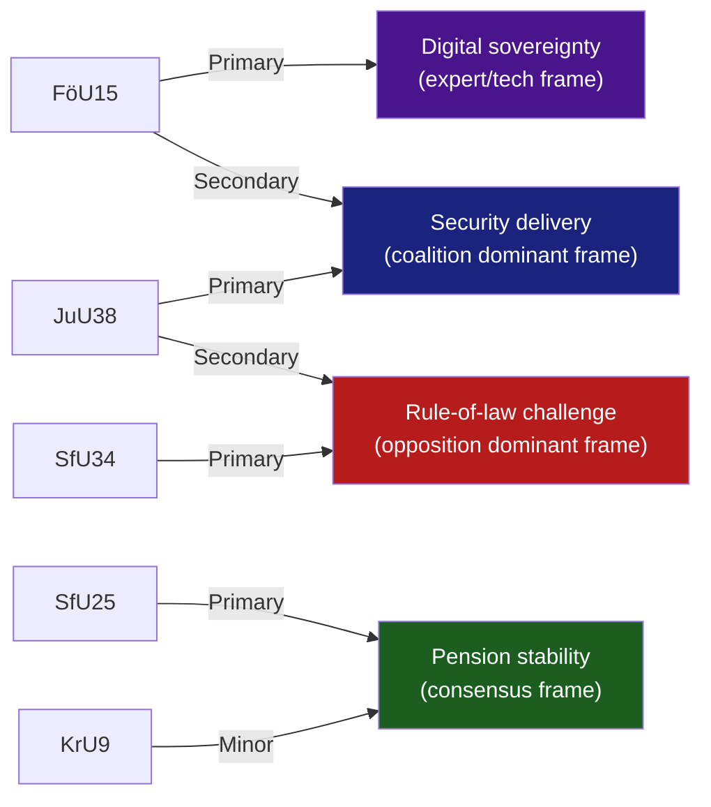
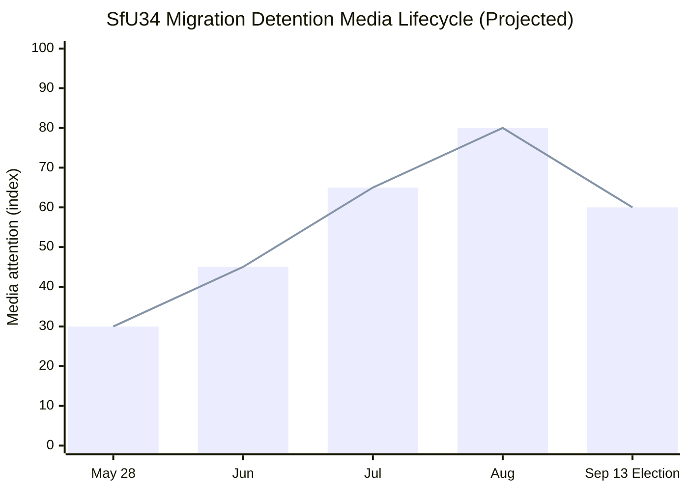

# Media Framing Analysis — Committee Reports, 2026-05-28

<!-- artifact: media-framing-analysis | family: D | pass: 2 -->

## Frame Identification

## Outlet-by-Outlet Frame Prediction

### Svenska Dagbladet (SvD) — Centre-right

**Expected framing**:
- FöU15: "Sweden finally gives cybersecurity centre legal clarity" — positive on security delivery.
- JuU38: "Tougher consequences for gang crime" — emphasis on MP reservation as outlier.
- SfU34: Brief coverage; may note five reservations as "opposition politics" without deep governance analysis.
- SfU25: "Bipartisan pension reform delivered."

**Bias classification**: Centre-right, pro-government on security. Nordicom research: SvD leans M/L ideological spectrum.

---

### Aftonbladet — Social democratic tabloid

**Expected framing**:
- SfU34: Lead story — "Riksrevisionen: Migration detention is a costly mess. Borg government does nothing." (personified as Tidö governance failure).
- JuU38: "Harder prison rules — but will they work?" — sceptical, expert quote from criminologist.
- FöU15: Brief technical framing — no emotional resonance.
- SfU25: Positive, emphasising S's role in Pensionsgruppen.

**Bias classification**: Centre-left, S-adjacent. Strong welfare-state governance frame.

---

### Dagens Nyheter (DN) — Liberal broadsheet

**Expected framing**:
- FöU15: Balanced — NCSC delivery + C reservation on future framework = "Good law, incomplete framework."
- JuU38: Analytical framing — escape criminalisation + ECHR question + expert voices.
- SfU34: Governance failure narrative with Riksrevisionen as primary source. DN has investigative capacity.
- SfU25: "Pension system gets a surplus safety valve — rare good news."

**Bias classification**: Liberal/centrist. Strong rule-of-law and transparency focus. Most likely to run investigative follow-up on SfU34 detention conditions.

---

### SVT Nyheter / Ekot — Public broadcaster

**Expected framing**: Balanced per public service mandate. Lead with FöU15 + JuU38 as government delivery; include SfU34 opposition reservations as "opposition challenges government migration response." Follow-up investigative piece on detention conditions (SVT Granskning Sverige capacity).

**Disinformation/amplification risk**: SVT reporting on migration detention could be amplified by state-affiliated media (RT Swedish affiliate, Sputnik Baltic). However, Swedish media literacy is high; influence operation risk is low.

---

### Media Framing Lifecycle (SfU34)

**Lifecycle projection**: Initial parliamentary reporting (30) → investigative journalism expansion (65 by July) → election campaign amplification (80 in August) → election day tapering (60).

## Outlet Bias Audit (5-axis)

| Outlet | Political lean | Migration framing | Security framing | Pension framing | Factual accuracy |
|--------|---------------|-------------------|-----------------|-----------------|-----------------|
| SvD | Centre-right | Enforcement-first | Pro-expansion | Cross-party | HIGH |
| Aftonbladet | Centre-left | Rights/governance | Sceptical | S-credit | HIGH |
| DN | Liberal | Rule-of-law | Balanced | Cross-party | HIGH |
| SVT | Public service | Balanced | Balanced | Balanced | HIGHEST |
| Expressen | Centre-right tabloid | Enforcement emphasis | Security-positive | Tabloid coverage | MEDIUM-HIGH |

## International Audience Orientation

**Nordic peers**: Norwegian VG/Aftenposten, Danish Politiken, Finnish HS likely to cover SfU34 as "Nordic welfare state migration governance failure" — comparable to recent Danish CPT detention coverage.

**EU policy media**: POLITICO Europe, Euractiv may cover FöU15 as NIS2 implementation success. Migration detention angle unlikely unless ECtHR application materialises.

**State-affiliated amplification risk**: 
- Russian state media (RuProp / Sputnik Baltic) will likely amplify the migration governance failure narrative to undermine Swedish governance credibility pre-election.
- Monitoring: EU vs. Disinfo / DISARM TTP tracking — watch for amplification of "Sweden Migration Chaos" narrative.
- Sweden's 2026 election is a priority target for influence operations given Sweden's NATO membership (2024) and Baltic security significance.

## Counter-Narratives

**Coalition counter-frame**: "We accepted Riksrevisionen's findings and are implementing administrative improvements — the opposition wants bureaucratic process, we want enforcement results."

**Opposition counter-frame**: "Five years of Riksrevisionen warnings on migration governance and the government still won't legislate. That's not reform — that's neglect."

**Assessment**: Both frames are coherent and will compete in media space. DN investigative capacity is the swing variable — a major detention conditions exposé before August would shift the balance toward the opposition frame.
