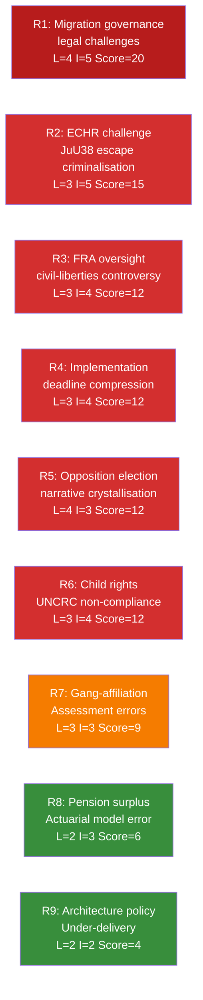

# Risk Assessment — Committee Reports, 2026-05-28

<!-- artifact: risk-assessment | family: A | pass: 2 -->

## Risk Register

Scale: Likelihood (L) 1–5, Impact (I) 1–5, Risk Score = L × I.

## Detailed Risk Entries

### R1 — Migration Governance Legal Challenges (Score 20 — CRITICAL)

**Source**: HD01SfU34 (RiR 2025:32); five reservations from S, V, C, MP

**Description**: Riksrevisionen found that Sweden's migration detention operates without adequate legal structure, oversight, or proportionality assessment. The government's response (administrative guidelines only) was rejected by five opposition reservations. Risk: migration court rulings, ECtHR applications, and UNHCR public criticism could undermine the government's migration governance credibility before the election.

**Likelihood 4/5**: Multiple detention legal challenges already in migration courts. ECtHR has prior Sweden migration cases. Opposition parties explicitly cited rule-of-law deficiencies (res.1, V+MP; res.2–5, S+V+C+MP).

**Impact 5/5**: Election-year exposure at highest sensitivity point. Adverse court ruling or ECtHR judgment before 13 September 2026 would directly validate the opposition's campaign narrative.

**Mitigation**: Government should issue binding administrative guidelines under FL (förvaltningslagen) within 60 days; consider interim statutory provision for proportionality assessment (though rejected by committee majority). Monitoring: Migrationsöverdomstolen (MiÖD) case list; ECtHR pending applications on Sweden.

---

### R2 — ECHR Challenge: Escape Criminalisation (Score 15 — HIGH)

**Source**: HD01JuU38; MP reservation mot 2025/26:4062

**Description**: Criminalising escape from migration detention for asylum seekers may conflict with ECHR Art. 5 (right to liberty) and UNHCR guidance that asylum seekers should not be penalised for illegal entry/presence. Swedish law previously did not criminalise escape — this is a novel legal territory.

**Likelihood 3/5**: MP reservation raises the issue explicitly. Council of Europe Commissioner for Human Rights routinely monitors such changes. UNHCR presence in Sweden.

**Impact 5/5**: If ECtHR finds violation, Sweden faces reputational damage and possible mandatory legislative amendment.

**Mitigation**: Lagrådet assessment (if sought) should have addressed ECHR compatibility; Riksdag's EU-nämnden should request compatibility analysis. Monitor: Swedish Migration Law Association commentary.

---

### R3 — FRA/NCSC Civil-Liberties Controversy (Score 12 — HIGH)

**Source**: HD01FöU15; C reservation mot 2025/26:4093

**Description**: FöU15 gives FRA new personal-data processing authority within NCSC without a comprehensive overarching privacy framework. The Lex FRA controversy (2008–2012) demonstrated that Swedish public opinion is sensitive to signals intelligence expansion.

**Likelihood 3/5**: Civil-society NGOs (Amnesty Sweden, Svenska Journalistförbundet) typically react to FRA authority extensions. C reservation signals parliamentary concern.

**Impact 4/5**: Media controversy could undercut the security message and force a supplementary legislative process (C's reservation implicitly demands this).

**Mitigation**: Government should commission Säkerhets- och integritetsskyddsnämnden (SIUN) to publish a transparency report on NCSC personal-data processing within 6 months of entry into force (15 July 2026).

---

### R4 — Implementation Deadline Compression (Score 12 — HIGH)

**Source**: FöU15 (15 July), JuU38 (2 July), SfU25 (1 August)

**Description**: Three major legislative packages enter force within 6 weeks. FRA/MSB/SÄPO/MUST must operationalise NCSC protocols; Kriminalvården/Polismyndigheten must implement JuU38 changes; Pensionsmyndigheten must update computational models. Simultaneous implementation by multiple agencies creates sequencing risk.

**Likelihood 3/5**: Agencies have lead times, but the electoral calendar creates pressure to not request delay. Summer 2026 is reduced-capacity for government departments.

**Impact 4/5**: Failed or delayed implementation would undermine the coalition's "delivered before election" narrative.

**Mitigation**: Government should publish implementation roadmaps for FöU15 and JuU38 within 30 days. Kriminalvården should provide written readiness assessment for JuU38 vistelseföreskrifter system.

---

### R5 — Opposition Election Narrative Crystallisation (Score 12 — HIGH)

**Source**: HD01SfU34 (5 reservations); HD01JuU38 (MP reservation)

**Description**: The SfU34 migration-detention reservations provide S, V, C, and MP with a Riksrevisionen-validated governance failure narrative for the election campaign. The breadth (5 reservation topics) and depth (including C, which normally votes with Tidö) makes this a credible cross-opposition campaign anchor.

**Likelihood 4/5**: Opposition parties always use Riksrevisionen reports in election campaigns when they favour their narrative. RiR 2025:32 is unusually specific and damaging.

**Impact 3/5**: While the narrative risk is real, the Tidö coalition has a counter-argument: they accepted the Riksrevisionen's analysis and committed to administrative action. The election outcome depends on whether voters prioritise rule-of-law critique or effective migration enforcement.

**Mitigation**: Government communications should emphasise the concrete actions committed to (guidelines, coordination review, monitoring strengthening) and timeline for delivery.

---

### R6 — Child Rights / UNCRC Non-Compliance (Score 12 — HIGH)

**Source**: HD01SfU34, res.5 (S motion 2025/26:3968 yr.3–4)

**Description**: Reservation 5 (S, V, C, MP) specifically targets the government's failure to embed statutory child-rights and child perspective requirements in migration detention. UNCRC Committee has previously flagged Sweden's migration detention of children.

**Likelihood 3/5**: The UNCRC Concluding Observations cycle (last: 2023) creates ongoing monitoring pressure. Swedish Barnombudsmannen and UNICEF Sweden are active monitors.

**Impact 4/5**: UNCRC criticism of a Nordic welfare state is high-visibility internationally and domestically.

**Mitigation**: Barnombudsmannen should be invited to present assessment on HD01SfU34 implementation within 90 days.

---

### R7 — Gang-Affiliation Assessment Errors (Score 9 — MEDIUM)

**Source**: HD01JuU38, vistelseföreskrifter provisions

**Description**: Movement restrictions under the new JuU38 framework depend on court assessment of gang connection. If police gang-registries are over-inclusive (documented concern in prior Riksdag scrutiny), wrongful restrictions could be imposed.

**Likelihood 3/5**: Rikspolisstyrelsen's Misstankeregistret and Polismyndigheten's internal registers have been subject to PO complaints and JO scrutiny previously.

**Impact 3/5**: Individual rights violation; potential JO complaint wave post-implementation.

**Mitigation**: IVO and JO should issue proactive monitoring guidelines for the new vistelseföreskrifter system.

---

### R8 — Pension Surplus Actuarial Error (Score 6 — LOW)

**Source**: HD01SfU25

**Description**: The "gas" mechanism is designed to auto-distribute surplus. If the actuarial surplus definition in the new balance-index formula has design errors, premature distributions could destabilise the fund.

**Likelihood 2/5**: Pension Group parties include multiple actuarially informed participants; Pensionsmyndigheten has model review obligations.

**Impact 3/5**: Moderate — would require corrective legislation but no immediate crisis.

---

### R9 — Architecture Policy Under-Delivery (Score 4 — LOW)

**Source**: HD01KrU9

**Description**: The architecture/design communication lacks binding obligations. V+MP reservation notes insufficient ambition. Risk of policy intent not translating to practice.

**Likelihood 2/5**: Non-binding communications routinely fade without implementation.

**Impact 2/5**: Quality-of-life trajectory risk, not acute governance risk.
