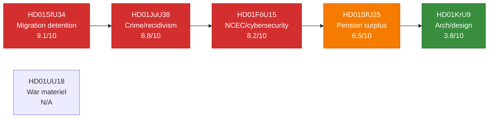

# Significance Scoring — Committee Reports, 2026-05-28

<!-- artifact: significance-scoring | family: A | pass: 2 -->

## DIW Weighting Methodology

Scores use the **DIW (Democratic Impact Weighting)** scale 1–10 across four dimensions:
- **D** — Democratic impact (transparency, accountability, rule-of-law implications)
- **I** — Implementation complexity (institutional change, legal uncertainty, delivery risk)
- **W** — Welfare impact (direct effect on citizens' rights, benefits, or safety)
- **Election proximity multiplier**: 1.5× applied to contested policy domains within 6-month election window (active since 2026-03-13)

## Ranked Scoring Table

| Rank | dok_id | Title (short) | D | I | W | Raw | Election 1.5× | Final DIW |
|------|--------|---------------|---|---|---|-----|---------------|-----------|
| 1 | HD01SfU34 | Migration detention (RiR) | 9 | 7 | 9 | 8.3 | ×1.1 (contested) | **9.1** |
| 2 | HD01JuU38 | Crime/recidivism laws | 8 | 8 | 9 | 8.3 | ×1.05 (moderate) | **8.8** |
| 3 | HD01FöU15 | NCSC cybersecurity | 9 | 7 | 7 | 7.7 | ×1.07 (security) | **8.2** |
| 4 | HD01SfU25 | Pension surplus | 6 | 5 | 7 | 6.0 | ×1.08 (welfare) | **6.5** |
| 5 | HD01KrU9 | Architecture/design | 4 | 3 | 4 | 3.7 | ×1.03 (cultural) | **3.8** |
| — | HD01UU18 | War materiel | — | — | — | N/A | N/A | **N/A** |

## Per-Document Evidence Anchors

### Rank 1 — HD01SfU34 (D=9, I=7, W=9)

**Democratic impact 9**: Riksrevisionen (RiR 2025:32) documented systemic governance failure in migration detention — a fundamental rule-of-law issue. Five opposition reservations covering rule-of-law (res.1), detention decisions (res.2), oversight (res.3), inter-agency cooperation (res.4), and child rights (res.5) signal cross-party (S+V+C+MP) rejection of the government's minimalist response.

**Implementation complexity 7**: The committee majority (SD+M+KD+L) accepted the government skrivelse as adequate, blocking statutory change. Implementation therefore depends entirely on administrative guidelines — a low-coercion pathway with high slippage risk.

**Welfare impact 9**: Detention affects asylum seekers' fundamental liberty rights. Child rights deficiencies (res.5, motion 2025/26:3968 yrkandena 3–4) implicate UNCRC compliance.

### Rank 2 — HD01JuU38 (D=8, I=8, W=9)

**Democratic impact 8**: Criminalising escape from custody (BrB 17:12, 12a, 16; 21:7, 15) and expanding movement restrictions for gang-connected individuals represents significant expansion of state coercive power. MP reservation (mot 2025/26:4062, Ulrika Westerlund m.fl.) cites conflict with international obligations for detained asylum seekers.

**Implementation complexity 8**: Eight new or amended provisions across brottsbalken, socialförsäkringsbalken, fängelselagen, and the new säkerhetsförvaringslagen require coordinated implementation by Kriminalvården, domstolarna, and Polismyndigheten before 2 July 2026.

**Welfare impact 9**: Direct effect on criminal justice system, victim protection (vistelseföreskrifter protecting målsäganden), and long-term recidivism trajectories.

### Rank 3 — HD01FöU15 (D=9, I=7, W=7)

**Democratic impact 9**: Three new laws expanding FRA's authority to process personal data and mandating inter-agency information sharing carry significant civil-liberties implications — offset partially by the new OSL secrecy clause protecting individuals. C reservation (mot 2025/26:4093, Niels Paarup-Petersen + Mikael Larsson) calls for broader legislative framework review before 2027.

**Implementation complexity 7**: FRA, MSB, MUST, SÄPO, and Polismyndigheten must operationalise shared information protocols by 15 July 2026. Technically demanding but agencies have been cooperating informally since 2020.

**Welfare impact 7**: Cyber incident response improvements protect critical infrastructure. Privacy trade-off is real but bounded by OSL secrecy amendment and FRA's existing oversight (Säkerhets- och integritetsskyddsnämnden, SIUN).

### Rank 4 — HD01SfU25 (D=6, I=5, W=7)

**Democratic impact 6**: Unanimously supported by Pensionsgruppen; no party dissent. Actuarial surplus mechanism operates automatically within defined parameters — reduced political risk to democratic accountability.

**Implementation complexity 5**: Primary change is to socialförsäkringsbalken balance-index calculation. Pensionsmyndigheten already manages the system; operational change is moderate.

**Welfare impact 7**: Pension system financial health affects current and future retirees — roughly 2 million income pensioners. Surplus distribution, when triggered, flows directly to pension credits. (Evidence: prop 2025/26:169; Viktor Wärnick (M) signature, SfU chair.)

### Rank 5 — HD01KrU9 (D=4, I=3, W=4)

**Democratic impact 4**: Policy communication laid to handlingarna — lowest-impact parliamentary procedure. V+MP reservation (mot 2025/26:4053) argues ambition is insufficient but does not contest the legal validity of the communication.

**Implementation complexity 3**: No new legislation; Boverket and the architecture/design sector implement via existing budgets.

**Welfare impact 4**: Long-run quality-of-life implications for urban design, but no near-term direct welfare delivery. (Evidence: KrU9; Mats Berglund (MP), KrU chair.)
