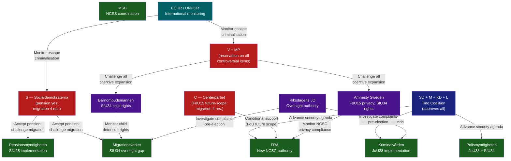

# Stakeholder Perspectives — Committee Reports, 2026-05-28

<!-- artifact: stakeholder-perspectives | family: A | pass: 2 -->

## Stakeholder Map

## Party Positions

### Moderaterna (M) — Prime Minister's party
- **FöU15**: Full support (Peter Hultqvist S chairs FöU, but M co-sponsors). Security narrative priority.
- **JuU38**: Full support. Crime and recidivism reform is core M electoral pitch. Entry-into-force before election is key.
- **SfU25**: Full support. Bipartisan pension success.
- **SfU34**: Accept government response. Reject statutory reform. Election-year insulation from "soft on migration" accusation.
- **Net position**: All five betänkanden advance M's security-economy narrative. No reservations filed.

### Sverigedemokraterna (SD) — Coalition anchor
- **JuU38**: Committee chair Henrik Vinge (SD). Strongest ideological alignment with recidivism severity increases. Vistelseföreskrifter for gang-connected defendants directly targets SD's organised crime narrative.
- **FöU15**: Support — national security primacy.
- **SfU34**: Accept government response. SD prefers stronger enforcement but accepts migration governance review as adequate.
- **Net position**: JuU38 is SD's signature delivery.

### Kristdemokraterna (KD) — Coalition partner
- **JuU38**: Support (Torsten Elofsson KD, JuU). Aligns with KD's crime-victims focus.
- **FöU15**: Support.
- **SfU25**: Support — KD has historically backed Pension Group outcomes.
- **Net position**: No reservations across all five.

### Liberalerna (L) — Coalition partner
- **FöU15**: Support (Gulan Avci L, FöU). L has historically supported civil-liberties-lite security expansion.
- **JuU38**: Support (Martin Melin L, JuU).
- **SfU25**: Support.
- **Net position**: No reservations. L's civil-liberties wing quiet — notable given FöU15 FRA expansion.

### Socialdemokraterna (S) — Largest opposition
- **SfU25**: Full support (all Pension Group parties). Viktor Wärnick (M) chairs SfU; Ida Karkiainen (S), Sanne Lennström (S), others support.
- **SfU34 — key position**: Filed motions 2025/26:3968 yrkandena 1–4 covering oversight, coordination, competence, and child rights. All four reservations where S is a party express that statutory reform — not administrative guidelines — is required. This is the clearest opposition signal in today's betänkanden.
- **FöU15, JuU38, KrU9**: No reservations filed — S chose strategic silence on security.
- **Net position**: S is picking its election-year battles. Migration governance is the chosen terrain.

### Vänsterpartiet (V) — Left opposition
- **SfU34**: Co-reservation on all 5 items including the most expansive res.1 (rättssäkerhet/rule-of-law, joint with MP). Most aggressive reservation posture.
- **KrU9**: Co-reservation with MP on architecture policy ambition.
- **Net position**: V is consistent in opposing coercive state expansion (migration + design ambition deficit).

### Miljöpartiet (MP) — Green opposition
- **JuU38**: Sole reservation (pt 1 — escape criminalisation, mot 2025/26:4062, Ulrika Westerlund m.fl.). MP is the only party challenging this on international humanitarian law grounds.
- **SfU34**: Co-reservations 1–5. Highest-intensity MP engagement in today's session.
- **KrU9**: Co-reservation with V on architecture ambition.
- **Net position**: Ulrika Westerlund (MP, JuU) is a notable new voice on criminal justice. MP's migration-detention engagement aligns with its environmental-social justice platform.

### Centerpartiet (C) — Swing party
- **FöU15**: Sole reservation on pt 2 (future legislative framework), mot 2025/26:4093, Niels Paarup-Petersen + Mikael Larsson. This is C's characteristic "yes to security, but demand a framework" position.
- **SfU34**: Co-reservations 2–5 (joins S, V, MP on detention decisions, oversight, coordination, child rights; NOT on res.1 rättssäkerhet). C's targeted reservation posture (excludes res.1) reflects its rule-of-law + migration enforcement balance.
- **Net position**: C is positioned as a principled coalition critic on administrative governance without opposing the migration enforcement principle.

## Agency Perspectives

### FRA (Försvarets radioanstalt)
Gains legal clarity and expanded personal-data processing authority within NCSC. Previously relied on informal cooperation agreements. FöU15 transforms FRA from NCSC's hosting agency into its legal data processor — a significant authority expansion. FRA's annual reporting obligation to SIUN provides the oversight mechanism.

### Kriminalvården (Swedish Prison and Probation Service)
JuU38 requires Kriminalvården to:
1. Implement the de-categorised "frigivningsförberedande åtgärder" release system.
2. Operationalise gang-connection assessment for permission decisions (BrB 21:7 reference).
3. Coordinate with Polismyndigheten on vistelseföreskrift enforcement.
Timeline: 2 July 2026 — 5 weeks away. Capacity risk is high.

### Migrationsverket
SfU34 puts Migrationsverket under the most governance pressure. The Riksrevisionen found that Migrationsverket lacks clear detention criteria, documentation standards, and oversight mechanisms. The government's response (admin guidelines) places remediation responsibility squarely on Migrationsverket without statutory backing.

### Pensionsmyndigheten
SfU25 adds a new surplus-distribution calculation to the income pension balance index. Pensionsmyndigheten must implement the formula change before 1 August 2026 for the 2027 annual calculation. Technically manageable given existing actuarial capacity.

## Civil Society and International Bodies

### Barnombudsmannen (Child Ombudsman)
SfU34 reservation 5 (S, V, C, MP) directly engages Barnombudsmannen's statutory mandate. Expect an own-initiative monitoring request or public comment within 60 days.

### JO (Riksdagens Ombudsmän)
Both JuU38 (vistelseföreskrifter) and SfU34 (detention governance) will generate JO complaints. Proactive JO monitoring of Kriminalvården and Migrationsverket practices is likely.

### ECHR / UNHCR
MP's reservation on JuU38 (escape criminalisation for detained asylum seekers) flags the Council of Europe monitoring track. UNHCR Sweden will likely issue a public statement on the escape criminalisation.
