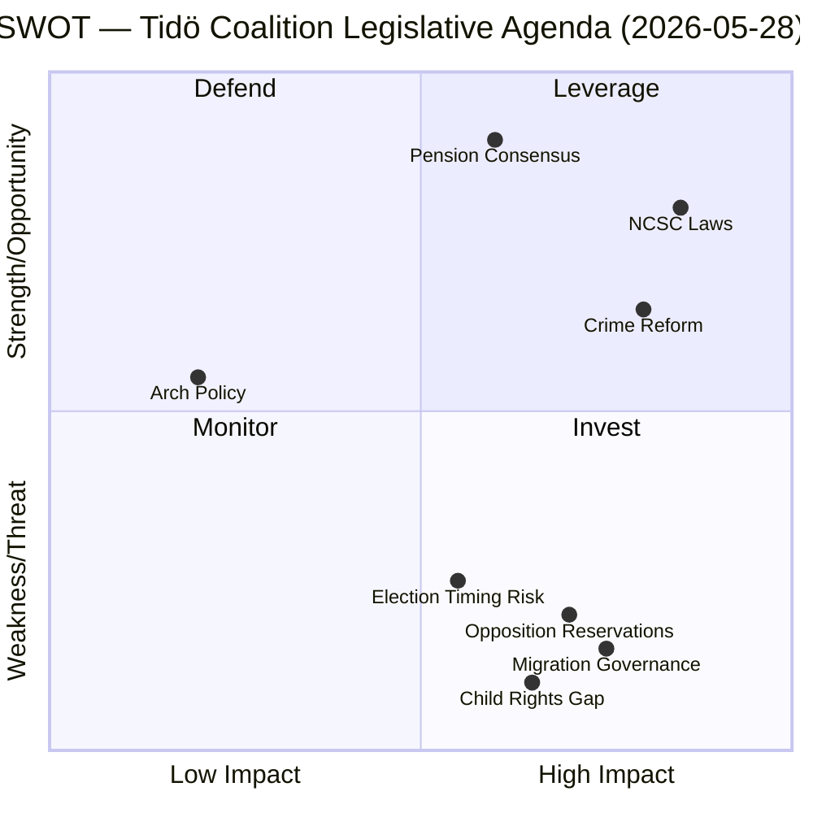

# SWOT Analysis — Committee Reports, 2026-05-28

<!-- artifact: swot-analysis | family: A | pass: 2 -->

## Analytical Frame

SWOT applied at two levels: (1) the **Tidö coalition's** legislative agenda as revealed by these betänkanden, and (2) **Sweden's democratic governance** capacity in the domains covered.

## Strengths

**S1 — NCSC legal foundation completed (HD01FöU15)**
Three interlocking laws close the OSL secrecy gap and provide FRA a clear personal-data processing mandate within NCSC. This removes the primary operational constraint on Sweden's national cyber threat-sharing capability. Evidence: prop 2025/26:214; FöU unanimous except C reservation.

**S2 — Criminal justice reform has broad coalition support (HD01JuU38)**
The prison-escape criminalisation + recidivism sentencing package passed with only MP dissent (on pt 1). S, V, and C did not reserve — suggesting the core criminal justice measures enjoy wider-than-expected support. Evidence: JuU38 reservation list shows only Ulrika Westerlund m.fl. (MP), mot 2025/26:4062.

**S3 — Pension system mechanical surplus mechanism (HD01SfU25)**
The unanimous Pension Group agreement on "gas" mechanism demonstrates the pension system's cross-party robustness. Writing off the historical debt to the state removes a long-running fiscal ambiguity. Evidence: prop 2025/26:169; Viktor Wärnick (M) SfU chair.

**S4 — Legislative timing advantage**
FöU15 (15 July) and JuU38 (2 July) enter force before the election. The coalition can campaign on delivered security legislation, not promises.

## Weaknesses

**W1 — Migration detention governance failure unresolved (HD01SfU34)**
The government's minimalist response to RiR 2025:32 (accepting analysis, rejecting statutory reform) leaves the governance gap documented by Riksrevisionen in place. Five opposition reservations (S, V, C, MP) spanning rule-of-law, detention criteria, oversight, inter-agency coordination, and child rights signal that administrative guidelines will be insufficient. Evidence: HD01SfU34 reservations 1–5; RiR 2025:32.

**W2 — FöU15 civil-liberties gap (C reservation)**
Centerpartiet's reservation on pt 2 (mot 2025/26:4093) calls for broader legislative framework for NCSC — acknowledging that the new laws expand FRA authority without comprehensive privacy safeguards in the new framework. This creates a future legislative obligation.

**W3 — JuU38 vistelseföreskrifter implementation risk**
Movement restrictions for gang-adjacent probationers/parolees require accurate gang-affiliation assessment. Polismyndigheten and Kriminalvården must build cooperative information-exchange protocols. Risk of disproportionate application and ECHR Art. 8 challenges. Evidence: JuU38 §§ on vistelseföreskrifter.

**W4 — UU18 full text unavailable**
HD01UU18 (war materiel regulatory framework) could not be fully analysed due to empty fullContent. This is a coverage gap in this run.

## Opportunities

**O1 — NIS2 compliance acceleration**
FöU15's NCSC laws position Sweden ahead of several EU peer states on NIS2 implementation. The structured information-sharing framework could become a model for Nordic cooperation on critical-infrastructure cyber defence.

**O2 — Opposition fragmentation potential**
While S+V+C+MP united on SfU34 reservations, their internal positions differ. C's inclusion in migration-detention reservations is tactically motivated (rule-of-law); C continues to vote with Tidö on economic policy. The opposition coalition is structurally fragile.

**O3 — Pension system communication advantage**
The unanimous pension agreement gives both coalition and opposition a shared success story. In an election marked by security-migration polarisation, pension consensus is a credibility-building tool for M and S simultaneously.

**O4 — Architecture/design policy low-cost signalling**
KrU9 costs nothing legislatively but allows M+KD+L to claim urban quality-of-life commitment without fiscal exposure. Design policy is increasingly salient to younger urban voters.

## Threats

**T1 — Migration governance as election weapon (HD01SfU34)**
The five reservation parties (S, V, C, MP) will use RiR 2025:32 in the election campaign as evidence of Tidö coalition governance failures in migration management. The Riksrevisionen's credibility as an independent body makes this a high-quality line of attack. Evidence: SfU34 reservations 2–5 citing specific Riksrevisionen recommendations rejected by the majority.

**T2 — JuU38 ECHR/international legal challenges**
Prison-escape criminalisation for detained asylum seekers may conflict with international refugee law and ECHR Art. 5 (right to liberty). MP's reservation (mot 2025/26:4062) explicitly raises this concern. EU and CoE monitoring bodies may flag Sweden's approach.

**T3 — NCSC FRA expansion public scrutiny**
The new FRA personal-data processing authority within NCSC will face civil-society and media scrutiny. Sweden's previous controversies around FRA signals intelligence (Lex FRA 2008, subsequent reforms) mean privacy advocacy groups are mobilised. Timeline: immediate post-adoption.

**T4 — Implementation deadline compression**
Three packages (FöU15, JuU38, SfU25) all enter force in July–August 2026, within 6 weeks of each other and immediately before the election. Simultaneous implementation by multiple agencies (FRA, Kriminalvården, Polismyndigheten, Pensionsmyndigheten) creates operational risk.
