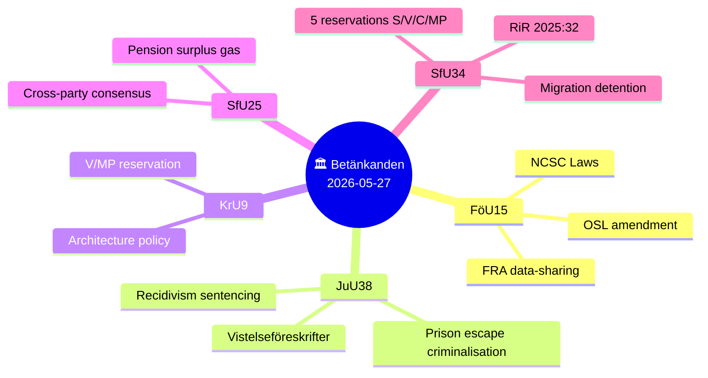

# Synthesis Summary — Committee Reports, 2026-05-28

<!-- artifact: synthesis-summary | family: A | pass: 2 -->

## Overview

Five Swedish parliamentary committee reports published on 27 May 2026 collectively advance a broad security agenda that spans cybersecurity law, criminal justice reform, social insurance mechanics, and migration oversight accountability — all compressed into a 108-day sprint before the 13 September 2026 general election.

## Policy Domain Analysis

### 1. National Cybersecurity (HD01FöU15 — FöU)

**Proposition 2025/26:214** creates three new legal instruments targeting the National Cybersecurity Centre (NCSC):

1. **Uppgiftsskyldighetslagen** — mandatory information-sharing obligation for agencies participating in NCSC. Current OSL rules blocked effective intelligence exchange between SÄPO, FRA, MSB, MUST, and Polismyndigheten within the centre's framework.
2. **FRA personuppgiftslagen** — dedicated data-processing act allowing FRA to process personal data within NCSC activities, previously a legal grey area that constrained threat analysis.
3. **OSL amendment** — adds a secrecy provision protecting individuals mentioned in NCSC threat-assessment materials from public disclosure.

**Committee outcome**: FöU approved all three proposals unanimously except for a Centerpartiet reservation (pt 2) requesting broader legislation on future NCSC framework clarity. Committee chair: Peter Hultqvist (S).

**Entry into force**: 15 July 2026 — within 7 weeks.

**Strategic significance**: Sweden has operated NCSC since 2020 but its legal foundation was patchwork. The new laws align Sweden with the EU NIS2 Directive obligation to operationalise CSIRT cooperation through legally structured information regimes. Timing — summer ahead of possible autumn cyber threats — is deliberate.

### 2. Criminal Justice Reform (HD01JuU38 — JuU)

**Proposition 2025/26:181** is the most politically charged package of the five. It enacts:

- **Criminalisation of escape**: Brottsbalken 17:12, 12a, 16 and 21:7, 15 amended to make escape from custody, remand prison, correctional facility, or migration detention a criminal offence. Previously escape itself was not punishable in Swedish law — an anomaly cited by law enforcement.
- **Recidivism weight increased**: Courts must now attach greater weight to prior convictions in sentencing. Combined with gang-connection factors, this accelerates sentence escalation for repeat offenders.
- **Extended probation+prison combinations**: Scope for skyddstillsyn (supervised probation) with prison component expanded.
- **Vistelseföreskrifter (movement restrictions)**: Mandatory geographic restrictions for probationers and parolees with documented gang connections. Courts can also impose victim-protective movement restrictions.
- **Modernised release preparation**: The rigid 4-category release-preparation taxonomy in prison law is replaced with "frigivningsförberedande åtgärder" — more individualised, agency-directed release progression.

**Entry into force**: 2 July 2026.

**Committee outcome**: JuU approved by majority. Miljöpartiet reserved against pt 1 (escape criminalisation), arguing it conflicts with international obligations regarding detained asylum seekers.

**Committee chair**: Henrik Vinge (SD). Composition: SD, M, S, KD, L, V, MP, C.

**Reservationer**: One — MP on escape criminalisation. This illustrates the 7:1 coalition majority even within a committee designed for proportional representation.

### 3. Architecture and Design Policy (HD01KrU9 — KrU)

**Government communication 2025/26:163** sets a new directional framework for Swedish architecture, form, and design policy — "Attraktiva platser." The KrU recommends laying the skrivelse to handlingarna and rejecting all 7 yrkanden in the MP follow-up motion (2025/26:4053, Mats Berglund m.fl.).

**Reservation**: V and MP jointly reserved on pt 2 (policy direction), arguing the government's ambitions were insufficiently concrete on social housing design quality and public space standards. V added a separate yttrande (particular opinion).

**Committee chair**: Mats Berglund (MP) — notable that the MP chair's party is in reservation, indicating inner-committee division.

**Impact**: Low DIW score — architecture policy rarely shifts electoral dynamics. However, the V+MP alignment here previews their likely joint platform on housing quality in the election campaign.

### 4. Pension Surplus Distribution (HD01SfU25 — SfU)

**Proposition 2025/26:169** implements the "gas" (gas pedal) mechanism agreed in the Pensionsgruppen (cross-party pension negotiation group). Key elements:

- New rules in socialförsäkringsbalken define when an "utdelningsbart överskott" (distributable surplus) exists in the income pension system.
- When surplus threshold is met, the mechanism automatically distributes the surplus, improving the system's financial balance indicator (balansindex) above 1.0.
- The government also writes off the income pension system's historical debt to the state under the earlier "låneöverenskommelse" — a bookkeeping reset that avoids future cross-subsidisation pressure.

**Entry into force**: 1 August 2026, first applied for year 2027.

**Committee outcome**: Unanimously approved. No reservations. All Pension Group parties (M, S, SD, V, KD, C, L, MP) endorsed via the Pension Group process.

**Significance**: Rare example of genuine cross-bloc consensus. The surplus mechanism strengthens pension system credibility and reduces long-run political risk of a balance ratio below 1.0.

### 5. Migration Detention Oversight (HD01SfU34 — SfU)

**Government communication 2025/26:137** responds to Riksrevisionen's report RiR 2025:32, which found that Swedish migration detention is operated without adequate governance, documentation, or proportionality assessment.

**Riksrevisionens key findings** (from the skrivelse):
- Detention is overused as a default tool without sufficient case-by-case necessity assessment.
- Migrationsverket and Polismyndigheten's cooperation frameworks are unclear.
- Detention facilities lack consistent standards; competence provisions for frontline staff are insufficient.
- Children's rights and child perspective are inadequately embedded in decision processes.

**Government response**: Accepted the Riksrevisionen's analysis and stated it will (a) issue clarifying guidelines, (b) review the cooperation agreement between Migrationsverket and Polismyndigheten, (c) strengthen monitoring and follow-up.

**Committee outcome**: SfU recommends laying the skrivelse to handlingarna while rejecting all 8 opposition yrkanden. This produced **five reservations**:

| # | Reservation | Parties | Substance |
|---|---|---|---|
| 1 | Rättssäkerhet m.m. | V, MP | Stricter rule-of-law and proportionality requirements in statute |
| 2 | Beslut om förvar | S, V, C, MP | Statutory criteria for detention decisions (C mot 2025/26:3976 yr.2) |
| 3 | Styrning och uppföljning | S, V, C, MP | Legally binding oversight requirements (S mot 2025/26:3968 yr.1) |
| 4 | Samverkan myndigheter | S, V, C, MP | Formal inter-agency coordination mandate (S+C motions) |
| 5 | Kompetens och barn | S, V, C, MP | Staffing standards + child-rights statutory obligation (S mot yr.3–4) |

**Election relevance**: With the election 108 days away, S+V+C+MP alignment on five reservation points demonstrates opposition unity on migration governance. The Tidö coalition majority blocked all amendments; the opposition will likely use RiR 2025:32 as a campaign document on M+SD governance failures in migration policy.

## Cross-Cutting Themes

**Theme 1 — Security legislation sprint**: FöU15 (cybersecurity) + JuU38 (criminal justice) + UU18 (war materiel, pending) all enter force before the election. The Tidö coalition is engineering a security legacy portfolio.

**Theme 2 — Opposition reservation density**: The SfU34 migration report generated 5 reservations covering S, V, C, MP — a broad coalition of the opposition united by rule-of-law concerns. Compare with JuU38's single MP reservation, showing that migration is the sharper fault line.

**Theme 3 — Consensus island**: SfU25 (pension) is the sole unanimous outcome. Cross-party Pension Group process is a rare institutional success; both coalition and opposition can claim credit.

**Theme 4 — NCSC maturation**: FöU15 completes the legal scaffolding for NCSC begun in 2020. This is the 4th major FöU betänkande on cybersecurity since 2021, reflecting sustained legislative investment in Sweden's cyber defence posture.

## Admiralty Reliability Assessment

| Source | Type | Reliability | Credibility |
|--------|------|-------------|-------------|
| HD01FöU15 | Official Riksdag text | A1 | Verified |
| HD01JuU38 | Official Riksdag text | A1 | Verified |
| HD01KrU9 | Official Riksdag text | A1 | Verified |
| HD01SfU25 | Official Riksdag text | A1 | Verified |
| HD01SfU34 | Official Riksdag text | A1 | Verified |
| HD01UU18 | Metadata only | A3 | Partial |
| IMF WEO-2026-04 | Cached; Datamapper unavailable | B2 | Assessed valid |
