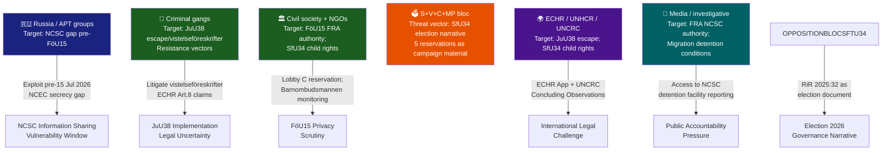

# Threat Analysis — Committee Reports, 2026-05-28

<!-- artifact: threat-analysis | family: A | pass: 2 -->

## Threat Actor Mapping



## Attack Tree Analysis

### Attack Tree 1 — Exploiting Pre-NCSC Law Information-Sharing Gap

**Root goal**: Adversary penetrates Swedish critical infrastructure via inter-agency intelligence gap before FöU15 entry into force (15 July 2026).

```
EXPLOIT NCSC GAP (pre-15 Jul 2026)
├─ Vector A: Spear phish MSB/FRA boundary staff
│    ├─ A1: Identify staff email via LinkedIn [trivial]
│    └─ A2: Craft typo-domain lure matching internal NCSC comms [moderate]
├─ Vector B: Target mid-tier agency (e.g. MSB) that currently cannot share TLP:RED IOCs with FRA
│    ├─ B1: Exploit OSL gap — agency refuses cross-NCSC IOC sharing [exploitable until 15 Jul]
│    └─ B2: Pivot from mid-tier agency to FRA-adjacent infrastructure
└─ Vector C: Compromise SIS/ENISA information-sharing conduit to NCSC
     └─ C1: ENISA NIS2 peer-review mismatched disclosure formats
```

**Mitigation**: Interim administrative information-sharing agreement (already reportedly in use informally); FöU15 entry into force 15 July closes the legal gap.

---

### Attack Tree 2 — Election Governance Narrative Weaponisation

**Root goal**: Opposition parties use RiR 2025:32 to dominate migration governance debate pre-13 September 2026 election.

```
CRYSTALLISE MIGRATION GOVERNANCE FAILURE NARRATIVE
├─ Phase 1: Parliamentary record creation (DONE — SfU34 five reservations filed)
├─ Phase 2: Media amplification
│    ├─ 2A: SVT Granskning Sverige reporting on detention conditions
│    └─ 2B: DN/Aftonbladet op-eds citing RiR 2025:32
├─ Phase 3: Barnombudsmannen / JO reports on child-rights gaps
│    └─ 3A: JO initiates own-initiative review of detention children
└─ Phase 4: Election campaign advertising
     └─ 4A: S, C, V, MP attack ads citing "kostsamt verktyg utan styrning" (RiR verbatim)
```

**Mitigation**: Government must deliver concrete governance actions (admin guidelines, MiV-Police coordination protocol, child-rights internal audit) within 90 days to blunt Phases 2–4.

---

### Attack Tree 3 — JuU38 Legal Challenge to Vistelseföreskrifter

**Root goal**: Organised crime-adjacent defendants challenge gang-affiliated movement restrictions under ECHR Art. 8.

```
ECHR ART. 8 LEGAL CHALLENGE
├─ Step 1: Defendant receives vistelseföreskrift citing gang connection
├─ Step 2: Defense counsel argues Polismyndigheten gang-register entry insufficiently evidenced
│    └─ 2A: Parallel JO complaint on register accuracy
├─ Step 3: Swedish court rules against restriction (possible — novel law)
│    └─ 3A: If upheld: ECHR application filed
└─ Step 4: ECtHR interim measure (rare but possible)
     └─ 4A: Swedish government must demonstrate proportionality assessment
```

**Mitigation**: Polismyndigheten should issue internal circulär on evidentiary standard for gang-connection before 2 July 2026. Domstolsverket should brief courts on the novel proportionality assessment framework.

---

## Intelligence Gaps

| Gap | Significance | Action |
|-----|-------------|--------|
| HD01UU18 full text unavailable | War materiel regulatory framework unknown | Re-download; seek in Riksdag API when published |
| SfU34 government response specificity | Unclear which administrative guidelines are being prepared | FOIA (offentlighetsprincipen) request to Justitiedepartementet for draft riktlinjer |
| NCSC operational readiness for FöU15 | Unknown whether FRA has technical infrastructure for new data processing mandate | FRA annual report (forthcoming Q3 2026) |
| JuU38 gang-register coverage | Unknown if Polismyndigheten register is ready to support vistelseföreskrift system | Rikspolischefen briefing requested |
