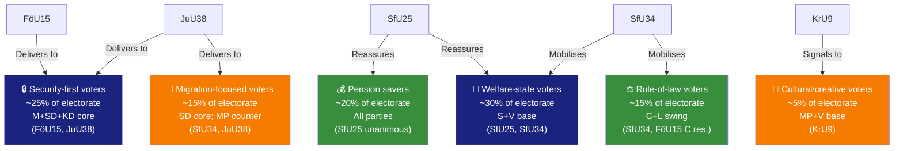

# Voter Segmentation Analysis — Committee Reports, 2026-05-28

<!-- artifact: voter-segmentation | family: D | pass: 2 -->

## Segmentation Framework

Voter segments affected by today's betänkanden, assessed against the 2022 electoral map and 2026 polling indicators.

## Segment-Level Analysis

### Segment 1 — Security-First Voters (~25%)

**Defining characteristics**: Prioritise national security, law enforcement effectiveness, cyber defence. Concentrated in M, SD, KD electorates. Significant military/reservist subgroup. Second-home and border-region residents (Gotland, Norrland) with Baltic security awareness.

**Effect of FöU15**: Directly addresses NCSC legal gap — confirms Sweden is investing in cyber defence. Positive for this segment. FRA's role is well-understood and accepted.

**Effect of JuU38**: Prison-escape criminalisation and gang-movement restrictions are core demands. SD's Vinge (JuU chair) delivering this package is maximally persuasive for SD security voters.

**Risk for segment**: C reservation on FöU15 future scope — minor; security-first voters do not prioritise civil-liberties arguments.

**Vote intent effect**: Consolidates M+SD+KD votes. Minor positive for L (despite L 4.7% threshold risk).

---

### Segment 2 — Welfare-State Voters (~30%)

**Defining characteristics**: Prioritise social insurance reliability, migration rule-of-law, healthcare access. S and V core. Includes large public-sector worker union (LO, TCO) affiliates.

**Effect of SfU25**: Pension surplus mechanism is reassuring — demonstrates cross-party consensus on social insurance stability.

**Effect of SfU34**: Five reservations from S+V+C+MP resonate strongly. The Riksrevisionen finding that detention lacks governance ("kostsamt utan styrning") aligns with this segment's rule-of-law expectation for welfare state institutions. S motion 2025/26:3968 (Ida Karkiainen m.fl.) is the anchor text.

**Vote intent effect**: S benefits from migration-governance attack. V benefits from strongest rule-of-law + child-rights position (res.1 co-held with MP). SfU25 provides no significant differential.

---

### Segment 3 — Rule-of-Law Voters (~15%)

**Defining characteristics**: Prioritise constitutional governance, administrative transparency, ECHR compliance, judicial independence. C, L, and educated urban M and S voters. Overlaps significantly with "urban liberal" demographic.

**Effect of FöU15**: C's reservation (future legislative framework) resonates with this segment — they want security AND framework governance.

**Effect of SfU34**: This is the highest-salience issue for rule-of-law voters. RiR 2025:32's documented governance failure and the five reservations signal competent oversight. C's selective participation (res.2–5, not res.1) positions C as calibrated rule-of-law advocate.

**Vote intent effect**: C benefits from SfU34 and FöU15 reservation visibility. Could arrest C's poll decline (C at ~6–7%). MP benefits from child-rights res.5 position.

---

### Segment 4 — Pension Savers (~20%)

**Defining characteristics**: Workers aged 45–65 monitoring pension adequacy. Sweden's premium pension system (PPM) involvement is near-universal. Income pensionssystemet affects all employees.

**Effect of SfU25**: The "gas" mechanism reassures that surplus will be distributed rather than absorbed by state debt. Historical debt write-off is positive. No party controversy.

**Vote intent effect**: Minor positive for whichever party most convincingly claims credit. Incumbent advantage (M+government) marginal. S Pensionsgruppen co-signatory — shared credit.

---

### Segment 5 — Migration-Focused Voters (~15%)

**Defining characteristics**: Two sub-groups: (a) enforcement-first voters (SD core, some M) who prioritise migration reduction; (b) rights-focused voters (MP, V, asylum-seeker advocacy networks) who prioritise individual rights.

**Sub-group a effect (enforcement-first)**: JuU38 escape criminalisation directly addresses a demand — people in migration detention should not be able to flee. Positive for SD enforcement narrative.

**Sub-group b effect (rights-focused)**: SfU34 reservations + MP's JuU38 reservation confirm MP/V as protectors of detained migrants' rights. SfU34 child-rights res.5 is highly salient for this sub-group.

**Vote intent effect**: Polarising — consolidates both SD and MP bases. Net effect at aggregate level: modest SD gain, modest MP retention.

---

### Segment 6 — Cultural/Creative Voters (~5%)

**Defining characteristics**: Urban cultural sector workers, architects, designers, creative industry. MP and V base. Concentrated in Stockholm Innerstad, Göteborg, Malmö urban core.

**Effect of KrU9**: V+MP reservation on architecture policy ambition resonates. The Mats Berglund (MP, KrU chair) dynamic — party in reservation against its own committee decision — is unusual but signals principled position-taking.

**Vote intent effect**: Minor positive for MP and V cultural flank. Does not affect national polling significantly.
