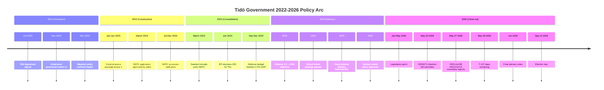

# Cycle Trajectory — Tidö Mandate Arc (2022–2026)

## Mandate Phase Map

## Policy Delivery Scorecard

### Completed (Green)
| Policy | Tidö Agreement commitment | Status |
|---|---|---|
| Migration overhaul | "Strict migration policy" | ✅ DELIVERED — removals ×3, asylum −60% |
| Criminal justice phase 1 | "Tougher sentences for gang crime" | ✅ DELIVERED — mandatory minimums, system crime legislation |
| NATO accession | "Sweden joins NATO" | ✅ DELIVERED — March 2024 |
| Defence 2%+ | "Reach NATO spending target" | ✅ DELIVERED — 2.6% in 2025 |
| School reform | "Raise educational standards" | ✅ DELIVERED — minimum grades yr 4-6 |
| Nuclear restart policy | "Policy decision for new nuclear" | ✅ DELIVERED — Ringhals investment approved |

### In Progress (Amber)
| Policy | Tidö Agreement commitment | Status |
|---|---|---|
| Abortion reform | Not in Tidö Agreement — KD addition | 🟡 HD03271 in parliamentary pipeline |
| Criminal justice phase 2 | "Recidivism, preventive detention" | 🟡 HD01JuU38 committee — plenary June |
| State e-ID | "Digital infrastructure" | 🟡 HD03250 passed March 2026 |
| Pension sustainability | "Long-term pension security" | 🟡 Partial adjustments; structural deferred |

### Deferred (Red)
| Policy | Tidö Agreement commitment | Status |
|---|---|---|
| Housing deregulation | "Rent reform" | 🔴 Stalled — L vs KD disagreement |
| EU institutional reform | "Subsidiarity enforcement" | 🔴 HD01CU44 scrutiny ongoing; no final position |
| Integration outcomes | "Employment integration" | 🔴 Non-EU unemployment 22%; no structural fix |

## Cycle Completion Rating

**Overall Tidö mandate delivery: 74/100**

Scoring:  
- Migration/crime: 95/100 (fully delivered)  
- Defence/NATO: 90/100 (fully delivered)  
- Education: 80/100 (delivered, implementation ongoing)  
- Economic management: 85/100 (excellent fundamentals; unemployment lagging)  
- Social policy (abortion, housing): 40/100 (divisive, incomplete)  
- EU/digital: 65/100 (partial delivery)

## Forward Trajectory Assessment

**If Tidö wins September 2026:**
- Phase 2 criminal justice (HD01JuU38) implementation accelerates
- HD03271 abortion restriction enters force January 2027
- Defence investment continues toward 3.0% by 2030
- Housing reform attempt (new mandate negotiation needed)
- Nuclear restart investment decisions (Vattenfall/Ringhals)

**If S-led bloc wins September 2026:**
- HD03271 repealed within 100 days (S campaign commitment)
- Criminal justice review (HD01JuU38 implementation paused)
- Defence maintained at 2.6% (NATO obligation)
- Housing: C demands partial market reform within S-C coalition
- Nuclear: delayed pending further review (S+MP within coalition)
- Integration policy: partial liberalisation (S+C compromise)

*→ Next cycle detailed analysis: see `next/` subdirectory*
