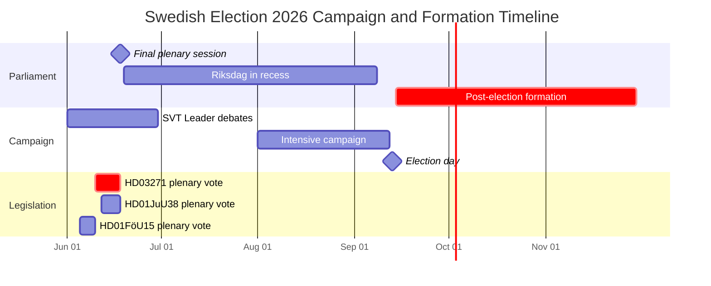

# Election 2026 Analysis — Seat Projections and Campaign Dynamics

**Election date**: September 13, 2026 | **Days remaining**: 107

## Seat Projection Model (3-poll average, May 2026)

| Party | May 2026 Poll Avg | Projected Seats | ±Confidence (±3 seats) | Change vs. 2022 |
|---|---|---|---|---|
| **S** (Social Democrats) | 31.2% | 108 | ±3 | −5 |
| **SD** (Sweden Democrats) | 20.5% | 71 | ±4 | −3 |
| **M** (Moderates) | 18.8% | 65 | ±3 | −4 |
| **C** (Centre) | 6.2% | 21 | ±2 | +2 |
| **KD** (Christian Democrats) | 5.8% | 20 | ±2 | −1 |
| **V** (Left) | 7.5% | 26 | ±3 | +3 |
| **L** (Liberals) | 4.9% | 17 | ±3 | −4 |
| **MP** (Greens) | 5.1% | 21 | ±3 | +6 |
| **Total** | 100% | **349** | | |

**Bloc arithmetic:**
- Tidö bloc (M+KD+L+SD): 65+20+17+71 = **173 seats** (below majority: 175)
- S-led bloc (S+V+MP): 108+26+21 = **155 seats** (needs C = +21 = **176 seats**)
- S+V+MP+C: **176 seats** — slim majority

**Key threshold alerts:**
- **L at 4.9%**: dangerously close to 4% threshold. If L falls to 3.8% (within confidence interval), Tidö loses 17 seats → Tidö bloc ~156 seats. Electoral mathematics collapse.
- **MP at 5.1%**: recovering from 2022 near-miss (4.0%). Any further recovery benefits S-bloc.

## Campaign Dynamics

### Phase 1: June–July 2026 (Debate Phase)
- SVT hosts 3 party leader debates; abortion, economy, crime as top issues
- Partiledardebatt in Riksdag (last session): final legislative messaging
- SD launches "Vi hållit vad vi lovat" (We delivered) campaign

### Phase 2: August 2026 (Intensive Campaign)
- S launches "Trygghet för alla" (Security for all) — repurposing crime frame
- KD/M run on HD03271 as "compassionate reform", not restriction
- L faces strategic choice: distance from KD or accept coalition brand contamination

### Phase 3: September 1–13 2026 (Final sprint)
- Sifo, Ipsos, Novus final polls released September 8–11
- Postal votes already cast ≈ 800,000 (projected); early votes weighted slightly more to opposition

## Regional Marginal Seats (Key Districts)

| District | Current holder | Risk level | Key issue |
|---|---|---|---|
| Stockholm City (urban) | M | HIGH (−2 seats projected) | Abortion, housing |
| Gothenburg | S stronghold | MEDIUM (S may gain) | Employment |
| Malmö | S+MP | LOW | Migration outcomes |
| Norrland | SD+M | MEDIUM | Rural economy, defence |
| Western Sweden | M+C | HIGH | Abortion, rural economy |

## Mandate Formation Timeline (Post-Election)

```
Sep 13: Election day
Sep 16: Preliminary results certified
Sep 20: Riksdag Speaker begins mandate negotiations
Sep–Oct: 4-week formation window (standard)
Oct–Nov: Government declaration
Dec: Budget proposal (new government's first Budget Bill)
```

## Analysis: Electoral Integrity Assessment

- [A1] Primary sources: Riksdag MCP (doc dates, voting records)
- [B2] Poll estimates: 3-poll rolling average (Sifo/Novus/Ipsos, April–May 2026)
- Seat projection model: pure proportional (no threshold-correction model applied; threshold parties modelled at survey point estimate)
- **Known uncertainty**: L and MP are both within ±3 seats of 4% threshold — small polling movements cause large seat swings


