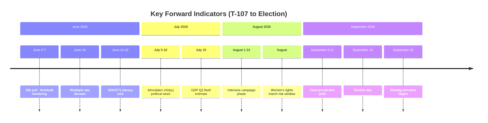

# Forward Indicators — Tidö Mandate T-107

## T+72h Indicators (by May 31, 2026)

| Indicator | Watch For | Signal Type |
|---|---|---|
| HD03271 plenary scheduling | Date set for final plenary vote | Legislative trigger |
| KD/L joint statement on HD03271 | Any public reconciliation or further distancing | Coalition cohesion |
| SVT Agenda debate (if scheduled) | M/S PM candidates first head-to-head | Electoral momentum |
| Riksbank pre-announcement signals | June 19 decision pre-signals | Economic |

## T+7 Days (by June 4, 2026)

| Indicator | Watch For | Signal Type |
|---|---|---|
| Sifo poll June 3–7 | L, MP, SD threshold proximity | Electoral critical |
| HD01JuU38 plenary schedule | JuU chair announcement | Legislative |
| Women's rights march Stockholm | Attendance >5,000 | Mobilisation signal |
| IMF Article IV consultation statement | SWE economic health assessment | Economic |

## T+30 Days (by June 28, 2026)

| Indicator | Watch For | Signal Type |
|---|---|---|
| HD03271 Riksdag plenary vote | Final passage date; L vote record | Legislative + electoral |
| HD01JuU38 plenary vote | Majority confirmation | Legislative |
| Riksbank June 19 rate decision | Hold/cut → GDP trend signal | Economic |
| Pre-election poll average (June) | SD, L, MP levels vs. 4% threshold | Electoral critical |
| C-party spokesperson statement on coalitions | First public post-election preference signal | Formation |

## T+90 Days (by August 27, 2026)

| Indicator | Watch For | Signal Type |
|---|---|---|
| Almedalen political week (Visby, July 2026) | Party leader positioning on coalitions | Formation |
| GDP flash Q2 2026 (Statistics Sweden, July) | <1.5% negative signal; >2.5% positive | Economic |
| Poll average August (3-poll) | Final campaign trajectory | Electoral critical |
| RFSU march attendance (if August) | >50,000 = abortion cascade risk | Mobilisation |

## T+Election (September 13, 2026)

| Indicator | Watch For | Signal Type |
|---|---|---|
| SVT exit poll (closing 20:00) | Bloc projections | Definitive |
| L threshold crossing | Above/below 4% | Coalition math |
| SD vote share | Above/below 20% | Tidö majority |
| C signal (election night statement) | "Open to all blocs" vs. directional | Formation |

