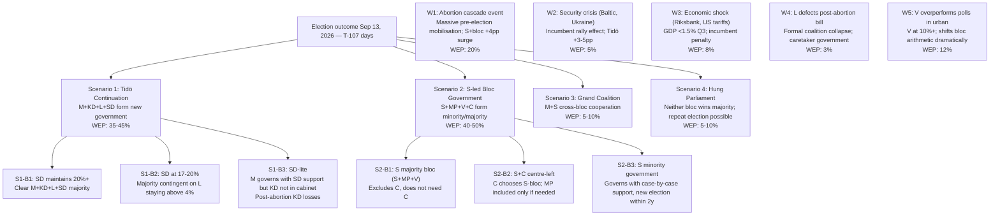

# Scenario Analysis — Tidö Mandate T-107 Outcome Tree

*Election horizon: September 13, 2026. WEP confidence language per horizon band.*

## Scenario Tree (4 Primary + 5 Wildcards)

## Scenario Probability Distribution (T-107)

| Scenario | Probability | Key Driver |
|---|---|---|
| S1: Tidö Continuation | **40%** | Economic competence, SD consolidation |
| S2: S-led Bloc | **47%** | Abortion mobilisation, unemployment |
| S3: Grand Coalition | **8%** | Neither bloc wins majority, stalemate |
| S4: Hung Parliament | **5%** | Highly fragmented vote, Riksdag deadlock |

*WEP assessment for cycle horizon: LIKELY [55–65%] for S-led bloc outcome; ROUGHLY EVEN for Tidö continuation.*

## Branch Details: Most Likely Outcome (S2-B2)

**S2-B2: S+C centre-left government (WEP: 22%)**  
- Prerequisite: S polls 31%+, C polls 6%+
- PM candidate: Magdalena Andersson (S)
- Cabinet: S (majority of ministers) + C (Finance or Trade ministers)
- MP and V provide confidence and supply from outside
- **Abortion policy reversal**: HD03271 repealed within 100 days
- **Economic policy**: continuity on fiscal surplus rules; C secures rural and enterprise agenda
- **NATO**: full continuity — C and S both strongly pro-NATO
- **Migration**: some liberalisation (S+MP pressure) vs. C demand for control — tension but functional compromise possible
- **Defence**: maintained at 2.6%+ (NATO obligation, cross-party consensus)

## Wildcard Escalation: W1 (Abortion Cascade)

If feminist mobilisation achieves 50,000+ march in Stockholm before August 31:
- S poll surge to 34%+
- MP poll surge from 4% to 6% (youth mobilisation)
- L urban vote collapses from 5% to 3.5% (below threshold → wasted votes)
- **Net effect**: S-led bloc majority becomes highly probable (WEP: >65%)
