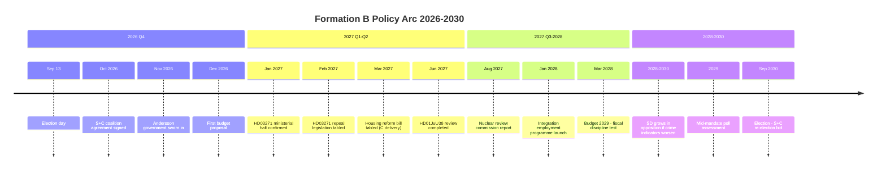
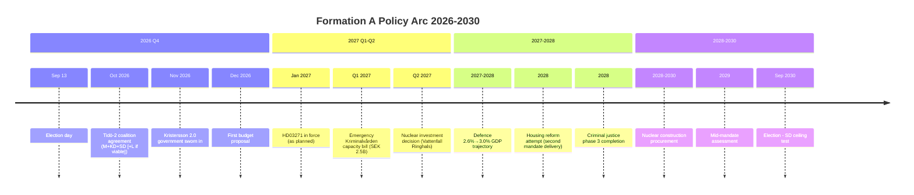

# Cycle Trajectory — Post-Election 2026–2030 Policy Arc

## Formation B (S+C) Policy Arc 2026–2030

## Formation A (Tidö 2.0) Policy Arc 2026–2030

## Structural Continuity (Both Formations)

| Policy | 2026 | 2027 | 2028 | 2029 | 2030 |
|---|---|---|---|---|---|
| NATO 2%+ spending | 2.6% | 2.6% | 2.7-3.0% | 2.8-3.0% | 2.8-3.0% |
| Cybersecurity centre | Operational | Full capacity | Expanded | Mature | — |
| State e-ID | Launch | Rollout | Mass adoption | Mature | — |
| School reform | Active | Implementation | Assessment | Adjustment | — |

## 2030 Electoral Setup

Both formations face the same 2030 electoral dynamics:
1. **Sweden's structural unemployment** (8.4% → 7.5–8.0% range): Whoever governs 2026–2030 will be judged against this trajectory
2. **NATO alliance costs**: If any NATO Article 5 triggering event occurs, Sweden's defence capacity is the defining issue
3. **EU integration**: Formation B creates closer EU alignment; Formation A maintains subsidiarity-sceptic position; EU citizens vote on this in 2024 EP elections → Swedish domestic echo in 2030
4. **SD permanence**: SD is now a structural feature of Swedish politics. In 2030, both formation models will need to account for SD at 18–24%
