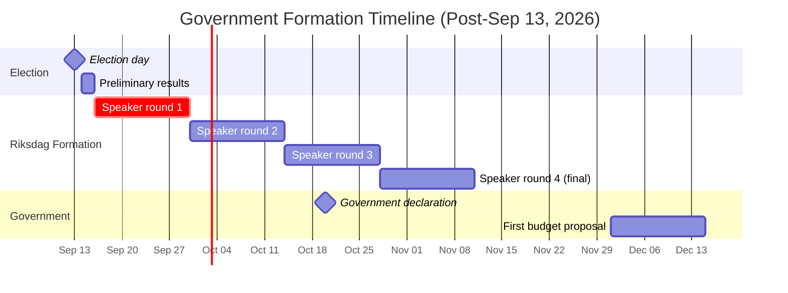

# Election 2026 — Formation Analysis (Post-Election)

## Seat-to-Formation Mapping

Based on projected seats (3-poll average May 2026):

| Formation | Required seats | Current projection | Gap | Viable? |
|---|---|---|---|---|
| Formation A: M+KD+L+SD | 175 | 173 | −2 | Borderline (SD must over-perform) |
| Formation B: S+V+MP+C | 175 | 176 | +1 | Marginally viable |
| Formation C: S+C only (+ V/MP external) | 175 | 129+26+21=176 | +1 | Same as B |
| Formation D: M+S+C grand | 175 | ~194 | +19 | Viable only if hung parliament |

## Formation Negotiation Timeline

## C-Party Decision as Decisive Variable

The entire post-election formation hinges on C's decision:

**If C chooses Formation B (S+C)**:
- C receives Finance Ministry or Industry Ministry
- C's housing reform is in coalition programme
- Formation B has 176-seat majority
- Formation is achievable within 4 weeks of election

**If C chooses Formation A (Tidö support)**:
- C returns to right-bloc; unusual given abortion and housing disagreements
- Tidö bloc could reach 194 seats (M+KD+SD+L+C = massive majority)
- Requires C to reverse its 2025 "open to all blocs" signalling
- Low probability (~10%)

**If C remains uncommitted**:
- Hung parliament risk
- Speaker's 4-round process plays out over 60 days
- Possible repeat election call by December 2026

## First Budget Bill Implications

| Formation | Budget headline | Key differences |
|---|---|---|
| Formation A | Defence 3.0%; criminal justice capacity; nuclear investment | Surplus maintained; tax cuts for employers |
| Formation B | Housing investment; integration employment; welfare (+S) | Fiscal discipline (C); deficit neutral |
| Grand Coalition | Compromise; defence maintained; moderate welfare | Most predictable; least politically distinctive |
