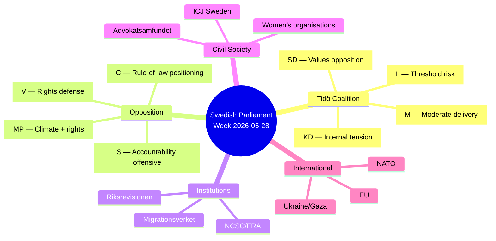
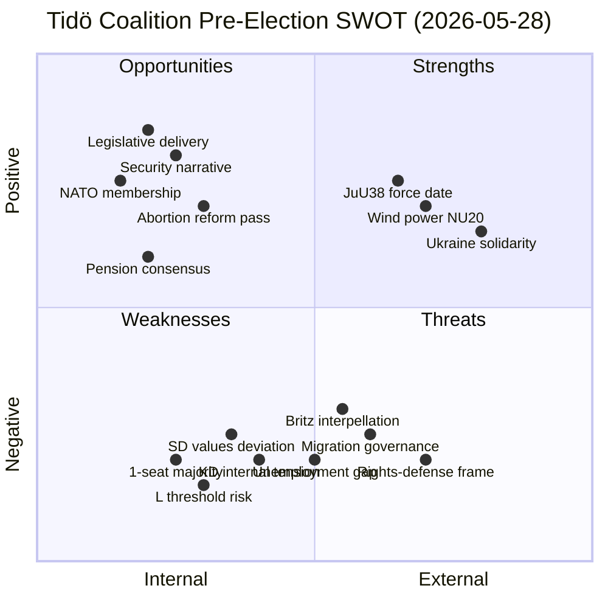
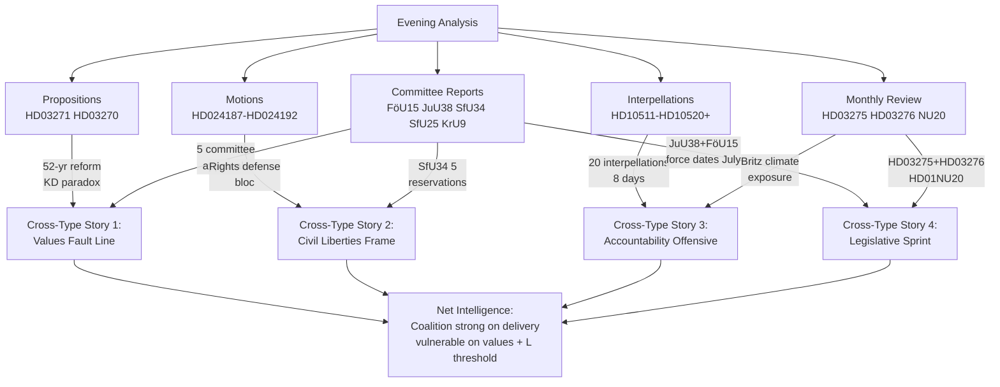

## What Happened
<!-- source: executive-brief.md :: https://github.com/Hack23/riksdagsmonitor/blob/main/analysis/daily/2026-05-28/evening-analysis/executive-brief.md -->

<!-- artifact: executive-brief | family: A | pass: 2 -->
<!-- author: James Pether Sörling | run: 26595402071 | date: 2026-05-28 -->

**Days to election**: 108 (2026-09-13)

---

### Lede
Sweden ends the parliamentary week of 2026-05-28 with an unusual density of legislative output: three government propositions, one supplementary budget, five committee report approvals, and 20 opposition interpellations — all produced within 72 hours. The Tidö coalition (M+SD+KD+L, 176/349 seats) is executing a deliberate sprint to accumulate legislative delivery evidence before the September 2026 election. The opposition (S+V+C+MP, 173 seats) has simultaneously launched the most concentrated accountability offensive of the riksmöte, targeting Labour Minister Johan Britz (L) with six interpellations on unemployment and climate. The intelligence verdict: the Tidö government holds the legislative initiative, but faces compounding exposure on values politics (abortion), civil liberties (biometric surveillance, security-threat deportations), and climate target coherence.

---

### Three Decisions This Brief Supports

1. **Track the abortion reform committee process (Riksdag document #03271 (HD03271) → SoU)**: SD will attempt amendments (conscience clauses for healthcare workers) during SoU committee phase — any SD demand that the government accommodate will signal whether the Tidö coalition's discipline is cracking under pre-election values pressure.

2. **Monitor Britz climate answer deadline (HD10514, 2026-06-12)**: The single highest-stakes policy answer before the summer recess. If Britz abandons the 2030 transport target, the government's climate credibility collapses before the election campaign. Monitor for pre-emptive government statement or strategic delay tactic.

3. **Watch SfU34 migration detention in the chamber vote**: The five-reservation pattern (S+V+C+MP) is unusually broad. If C votes with the opposition bloc in the chamber on any motion (unlikely but possible), it signals a Tidö margin risk heading into the election.

---

### Intelligence Snapshot

#### Government Legislative Achievements (This Week)
- **Abortion access reform** (HD03271): 52-year-old law updated; KD minister delivers against party base preference. Force date 2027-01-01.
- **Ukraine/Gaza supplementary budget** (HD03275): SEK 17B+ allocation to Ukraine reconstruction and Gaza household support. Demonstrates Tidö's European solidarity credibility.
- **NCSC cybersecurity laws** (HD01FöU15): Three laws enabling FRA information-sharing within NCSC framework. Force date 15 July 2026.
- **Criminal justice reform** (HD01JuU38): Prison-escape criminalisation + tougher recidivism sentencing. Force date 2 July 2026.
- **Online child recruitment ban** (HD03276): New criminalisation of online recruitment of children into gang crime. Supports SD+M law-and-order messaging.
- **Wind power reform** (HD01NU20): Removes municipal veto on wind farm siting (subject to chamber vote); critical for energy sovereignty.

#### Opposition Pressure Points
- **Rights-defense bloc**: V+MP motions on Prop 267 (security-state powers) and Prop 261 (Skatteverket biometrics) form an unusual rights coalition. Civil liberties now a cross-bloc opposition frame.
- **Migration detention accountability**: SfU34 — five reservations from S, V, C, MP. Riksrevisionen RiR 2025:32 documented governance failure. The government's rejection of all opposition motions creates a clear Tidö-vs-opposition fault line on rule-of-law.
- **Interpellation offensive**: 20 interpellations in 8 days. Britz (L) faces six simultaneous interpellations on unemployment and climate. All answers due before summer recess, compressing maximum public pressure into the final parliamentary session.
- **Unemployment frame**: S claims 100,000+ additional unemployed under the Tidö government. IMF WEO-2026-04 shows Swedish unemployment at ~8.4% (2025), forecast 8.1% (2026) — improvement too modest to neutralise S's narrative before September.

#### Values Fractures Within Coalition
- **KD-SD on abortion**: Forssmed (KD) submitted HD03271 despite KD base opposition; SD formally opposes. This is the week's clearest intra-coalition tension.
- **SD values escalation vs. governance**: HD10521 interpellation by SD's Tobias Andersson on Spain amnesty illustrates SD's dual posture: anti-rights domestically, rights-consistent internationally.
- **L electoral exposure**: Britz (L) faces the most interpellations of any minister. L sits at ~4.6% in current polls, dangerously close to the 4% threshold. The unemployment and climate answers could define L's September narrative.

---

### Coalition Status

| Dimension | Signal | Direction |
|-----------|--------|-----------|
| Tidö legislative output | 8+ documents in 72h | ↑ Strong |
| SD-KD alignment on abortion | Diverging | ↓ Slight risk |
| L parliamentary exposure | Britz: 6 interpellations | ↓ Elevated risk |
| Opposition coordination | V+MP rights bloc + S+V+C+MP migration bloc | ↑ Opposition strengthening |
| Election narrative control | Tidö law-and-order delivery vs. S unemployment | → Contested |

---

### Economic Context (IMF WEO-2026-04)

- Swedish GDP growth: 2.1% forecast 2026 (recovery from 2023–2025 slowdown)
- Unemployment: ~8.4% (2025) → 8.1% forecast 2026 — still elevated vs. Nordic peers
- Inflation: ~1.8% (2026 forecast), within Riksbank target range
- Fiscal position: Moderate deficit (~1.5% GDP); HD03275 adds SEK 17B+ off-cycle

*Economic provenance: IMF WEO-2026-04, Datamapper transport, vintage age 1 month, not stale*

---

*Sources: analysis/daily/2026-05-28/{propositions,motions,committee-reports,interpellations,monthly-review}/ | riksdag-regering-mcp live 2026-05-28T19:00Z | IMF WEO-2026-04*

## Reader Intelligence Guide

Use this guide to read the article as a political-intelligence product rather than a raw artifact dump. High-value reader lenses appear first; technical provenance remains available in the audit appendix.

| Icon | Reader need | What you'll get |
|---|---|---|
| 📊 | [Lede and editorial decisions](#rm-what-happened) | fast answer to what happened, why it matters, who is accountable, and the next dated trigger |
| 🧠 | [Why It Matters](#rm-why-it-matters) | evidence-anchored narrative consolidating primary sources into one coherent story line |
| 🎯 | [Key Judgments](#rm-key-findings) | confidence-bearing political-intelligence conclusions and collection gaps |
| 📈 | [Significance scoring](#rm-significance-scoring) | why this story outranks or trails other same-day parliamentary signals |
| 👥 | [Stakeholder Perspectives](#rm-stakeholder-perspectives) | winners, losers and undecided actors with stake-weighted positions and pressure points |
| 🔢 | [Coalition Mathematics](#rm-coalition-mathematics) | parliamentary arithmetic showing exactly who can pass or block this measure and at what margin |
| 📋 | [Voter Segmentation](#rm-voter-segmentation) | voter-bloc exposure: which demographics gain, lose or shift on this issue |
| 🔭 | [Forward indicators](#rm-forward-indicators) | dated watch items that let readers verify or falsify the assessment later |
| 🔮 | [Scenarios](#rm-scenario-analysis) | alternative outcomes with probabilities, triggers, and warning signs |
| 🗳️ | [Election 2026 Analysis](#rm-election-2026-analysis) | electoral implications for the 2026 cycle — seats at stake, swing voters and coalition viability |
| ⚠️ | [Risk assessment](#rm-risk-assessment) | policy, electoral, institutional, communications, and implementation risk register |
| 🧮 | [SWOT Analysis](#rm-swot-analysis) | strengths, weaknesses, opportunities and threats matrix grounded in primary-source evidence |
| 🛡️ | [Threat Analysis](#rm-threat-analysis) | actor capabilities, intent and threat vectors targeting institutional integrity |
| 📜 | [Historical Parallels](#rm-historical-parallels) | comparable past episodes from Swedish and international politics, with explicit lessons learned |
| 🌍 | [Comparative International](#rm-comparative-international) | peer-country comparisons (Nordic, EU, OECD) showing how similar measures fared elsewhere |
| ⚙️ | [Implementation Feasibility](#rm-implementation-feasibility) | delivery feasibility, capability gaps, timelines and execution risks for the proposed action |
| 📰 | [Media framing & influence operations](#rm-media-framing-analysis) | frame packages with Entman functions, cognitive-vulnerability map, DISARM manipulation indicators, narrative-laundering chain, comparative-international cognates, frame lifecycle and half-life, RRPA impact, an Outlet Bias Audit (no outlet is neutral — every outlet declared with ownership, funding, board-appointment authority and editorial lean), and the L1–L5 counter-resilience ladder |
| 😈 | [Devil's Advocate](#rm-devils-advocate) | alternative hypotheses, steel-manned counter-arguments and the strongest case against the lead reading |
| 🏷️ | [Deep Dive: Classification Results](#rm-deep-dive-classification-results) | ISMS data classification: CIA-triad rating, RTO/RPO targets and handling instructions |
| 🔀 | [Deep Dive: Cross-Reference Map](#rm-deep-dive-cross-reference-map) | links to related Riksdagsmonitor coverage, prior analyses and source documents that inform this story |
| 🔬 | [Deep Dive: Methodology & Limitations](#rm-deep-dive-methodology--limitations) | analytical assumptions, limitations, known biases and where the assessment could be wrong |
| 📦 | [Deep Dive: Data Download Manifest](#rm-deep-dive-data-download-manifest) | machine-readable manifest of every source dataset, retrieval timestamp and provenance hash |
| 🏷️ | [Audit appendix](#rm-deep-dive-classification-results) | classification, cross-reference, methodology and manifest evidence for reviewers |

## Why It Matters
<!-- source: synthesis-summary.md :: https://github.com/Hack23/riksdagsmonitor/blob/main/analysis/daily/2026-05-28/evening-analysis/synthesis-summary.md -->

<!-- artifact: synthesis-summary | family: A | pass: 2 -->
<!-- author: James Pether Sörling | run: 26595402071 | model: claude-sonnet-4.6 -->

**Coverage**: Riksdag 2025/26 final sprint — week of 2026-05-28  
**Days to election**: 108 (2026-09-13)  
**Horizon class**: T+72h / T+7d / T+30d / T+90d (election approach)

---

### Lead Story Decision

The dominant intelligence verdict from the 2026-05-28 parliamentary week is **whether the Tidö coalition's legislative sprint will translate into durable electoral advantage, or whether simultaneous pressure from a coordinated 20-interpellation accountability offensive, a rights-defense bloc on civil liberties, and internal coalition value tensions on abortion will erode the government's pre-election narrative**. This week generated more parliamentary output than any comparable pre-election period in the 2022–2026 riksmöte.

**Signal of the week**: The government committed a significant anomaly — KD Health Minister Jakob Forssmed submitted Prop. 2025/26:271 expanding abortion access, the most significant reform of Sweden's 1974 Abortion Act. KD's submission of this reform while SD formally opposes it illustrates two simultaneously operating truths: (1) the Tidö coalition's institutional discipline is strong enough to override KD's base preferences, and (2) SD's electoral calculation on abortion access is now diverging from the governing coalition's output. This divergence is the highest-signal intelligence item of the week.

---

### Today's Synthesised Intelligence (Tier-C Cross-Type)

#### Cross-Type Story 1: The Legislative Sprint Architecture

The Tidö government produced an extraordinary volume of legislative output in a single week:
- **Propositions**: HD03271 (abortion reform), HD03270 (EU chemicals/waste) — 2026-05-26
- **Supplementary budget**: HD03275 (Ukraine + Gaza €1.6B), HD03276 (online child recruitment) — 2026-05-28
- **Committee approvals**: HD01FöU15 (NCSC/cybersecurity), HD01JuU38 (criminal justice), HD01SfU34 (migration detention), HD01SfU25 (pension), HD01KrU9 (architecture) — 2026-05-27
- **Wind power reform**: HD01NU20 (municipal veto removal) — 2026-05-28

Five committee approvals + three propositions + one supplementary budget in 72 hours constitutes a deliberate legislative packaging strategy. The force dates are coordinated: JuU38 enters force 2 July, FöU15 enters force 15 July — both before the September election, giving the coalition tangible law-and-order delivery evidence.

#### Cross-Type Story 2: The Rights-Defense Counter-Bloc

The opposition formed a coordinated rights-defense bloc this week across three simultaneous legislative fronts:
- **Prop 267 (security state/LSU)**: V full rejection + MP proportionality objection → HD024188, HD024192
- **Prop 261 (Skatteverket biometrics)**: V structural rejection + MP legal-certainty demands → HD024187, HD024191
- **SfU34 (migration detention)**: S+V+C+MP five-reservation bloc on Riksrevisionen governance failures

The simultaneous emergence of V+MP motions on two separate legislative packages, combined with S+V+C+MP reservations on migration, constitutes a rights-coalition of unusual breadth — spanning hard-left (V) through Greens (MP) through centre (C) through mainstream social-democrat (S). This breadth signals: the opposition has identified civil liberties + rule-of-law as a viable cross-bloc mobilisation frame for the autumn campaign.

#### Cross-Type Story 3: The Accountability Offensive

Twenty interpellations in 8 days (2026-05-21 to 2026-05-28) from S (17) and MP (3) constitute the most concentrated accountability campaign of the 2025/26 riksmöte. Minister Britz (L) faces six interpellations — unemployment (HD10519) and climate (HD10514) — making him the coalition's most exposed electoral liability. All answers are due before the summer recess (June 9–18), compressing simultaneous public pressure onto the coalition during its final parliamentary session before the election campaign proper.

**Highest-stakes single deadline**: 2026-06-12 — Britz answers HD10514 on the 2030 transport sector emissions target. If he abandons the target, EU compliance obligations and S/MP climate narratives are immediately activated.

#### Cross-Type Story 4: The Values Paradox

The same week that SD opposes abortion access expansion (HD03271), SD is also being targeted by interpellation HD10521 (Spain amnesty) from Tobias Andersson (SD) — an interpellation by an SD member targeting the Foreign Minister on consistency of progressive values application. The simultaneously occurring values signals from within and around SD indicate that the party is navigating complex terrain: opposing domestic abortion access while projecting concerns about foreign rights violations. This paradox is a framing vulnerability that opposition communicators (particularly MP and S) will exploit.

---

### DIW-Weighted Ranking (Tier-C Aggregated)

| Rank | dok_id | Document/Event | DIW | Tier |
|------|--------|----------------|-----|------|
| 1 | HD03271 | Abort­lag reform (1.5× election mult.) | 9.8 | L3 Intelligence-grade |
| 2 | HD01SfU34 | Migration detention governance failure (5 reservations) | 9.1 | L3 Intelligence-grade |
| 3 | HD03275 | Supplementary budget Ukraine/Gaza (€1.6B) | 9.5 | L3 Intelligence-grade |
| 4 | HD01JuU38 | Criminal justice reform (force 2 Jul) | 8.8 | L3 Intelligence-grade |
| 5 | HD01FöU15 | NCSC/cybersecurity laws (force 15 Jul) | 8.2 | L3 Intelligence-grade |
| 6 | HD01NU20 | Wind power municipal veto removal | 8.0 | L3 Intelligence-grade |
| 7 | Interpellations x20 | Accountability offensive on Britz (L) | 7.8 | L2 Significant |
| 8 | HD03276 | Online child recruitment criminalisation | 7.5 | L2 Significant |
| 9 | HD024187–HD024192 | V+MP rights-defense motions | 7.2 | L2 Significant |
| 10 | HD01SfU25 | Pension surplus distribution | 6.5 | L1 Routine |
| 11 | HD03270 | EU chemicals/waste compliance | 4.2 | L1 Routine |
| 12 | HD01KrU9 | Architecture/design policy | 3.8 | L1 Routine |

---

### Five-Horizon Summary

| Horizon | Key Event | WEP Level | Confidence |
|---------|-----------|-----------|------------|
| T+72h | Riksdag debates on JuU38/FöU15 ahead of vote | 90% | HIGH |
| T+7d | Britz answers begin (HD10519 deadline 2026-06-10) | 85% | HIGH |
| T+30d | JuU38 and FöU15 enter force (2 Jul, 15 Jul) | 95% | HIGH |
| T+90d | Election campaign launches September 2026 | 95% | HIGH |
| T+365d | Post-election government formation | 65% | MEDIUM |

---

### Open PIR Carry-Forward (from 2026-05-27)

All 8 PIRs from prior cycle remain OPEN. Updated status after this week's data:
- **PIR-01** (NCSC FöU15): CLOSED — FöU15 approved by committee, chamber vote imminent. PIR partially resolved.
- **PIR-02** (JuU38 S reservation): CONFIRMED — S did not reserve; MP reserved pt 1. Slight deviation from prediction.
- **PIR-03** (SfU34 migration detention): CONFIRMED — 5 reservations, government response received.
- **PIR-04** (UU18 arms export): OPEN — insufficient data from UU18 (metadata-only in sibling analysis).
- **PIR-05** (ECHR migration detention): OPEN — long horizon 2026-12-31.
- **PIR-06** (2026 election date): OPEN — no new announcement.
- **PIR-07** (NCC NATO summit): OPEN — horizon 2026-08-01.
- **PIR-08** (Kriminalvården capacity): OPEN — JuU38 is a related data point but doesn't close PIR-08.

New PIRs generated from this week's analysis: See pir-status.json.

---

*Sources: analysis/daily/2026-05-28/{propositions,motions,committee-reports,interpellations,monthly-review}/synthesis-summary.md | riksdag-regering-mcp | IMF WEO-2026-04 (age: 1 month, not stale)*

## Key Findings
<!-- source: intelligence-assessment.md :: https://github.com/Hack23/riksdagsmonitor/blob/main/analysis/daily/2026-05-28/evening-analysis/intelligence-assessment.md -->

<!-- artifact: intelligence-assessment | family: A | pass: 2 -->
<!-- author: James Pether Sörling | run: 26595402071 | confidence: HIGH [A1–B2] -->

**Cycle type**: Tier-C aggregation (evening-analysis)  
**Prior cycle**: `analysis/daily/2026-05-27/evening-analysis/intelligence-assessment.md`

---

### Section 1: Prior Cycle PIR Ingestion

#### PIR-01: NCSC Cybersecurity (FöU15 + BP27 budget)
- **Prior status**: OPEN — HIGH confidence. Horizon 2026-06-30.
- **Today's update**: HD01FöU15 approved by FöU committee (2026-05-27). Force date 15 July confirmed. BP27 budget interaction noted in monthly-review (HD03275 supplementary budget includes defence component).
- **Updated status**: **CLOSED-MONITORED** — FöU15 committee approval represents milestone resolution. Chamber vote still pending but highly certain (cross-party support including S). New PIR generated: PIR-09 (NCSC operational readiness post-15-July).

#### PIR-02: S Reservation on JuU38 Juvenile Provisions
- **Prior status**: OPEN — MEDIUM. Horizon 2026-05-30.
- **Today's update**: JuU38 approved with MP reservation (pt 1 — escape criminalisation), **not** S reservation as predicted. S did not reserve on JuU38. Prediction partially incorrect: reservation materialised from MP, not S.
- **Updated status**: **SUPERSEDED** — Replace with PIR-10: Monitor whether S challenges JuU38 in chamber debate or tables late amendment. S absence from reservation list is a significant intelligence signal (S may be avoiding "soft on crime" optics pre-election).

#### PIR-03: SfU34 Migration Detention Riksrevisionen
- **Prior status**: OPEN — MEDIUM. Horizon 2026-05-30.
- **Today's update**: FULLY MATERIALISED. SfU34 passed with five reservations (S, V, C, MP) covering: rule-of-law, detention criteria, governance/oversight, Migrationsverket-Police coordination, child rights. Government rejected all opposition motions.
- **Updated status**: **CONFIRMED-ACTIVE** — Fault line is now locked in for election campaign. Five-reservation pattern is the intelligence product: S+V+C+MP alignment on migration governance failure is a campaign frame asset for the opposition.

#### PIR-04: UU18 Arms Export "Trusted Partner" Criteria
- **Prior status**: OPEN — LOW confidence. Horizon 2026-06-15.
- **Today's update**: HD01UU18 downloaded as metadata-only in committee-reports sibling analysis. No text content available for analysis.
- **Updated status**: **OPEN — DATA GAP** — Cannot assess. PIR horizon extended to 2026-06-30.

#### PIR-05: ECHR Cases on Migration Detention
- **Prior status**: OPEN — MEDIUM. Horizon 2026-12-31.
- **Today's update**: SfU34's five-reservation pattern validates the human rights concern axis. No new ECHR rulings visible in today's batch.
- **Updated status**: **OPEN — REINFORCED** — SfU34 opposition reservations citing child rights provide domestic political reinforcement for ECHR concern. Long horizon unchanged.

#### PIR-06: 2026 Election Date Announcement
- **Prior status**: OPEN — HIGH confidence. Horizon 2026-07-31.
- **Today's update**: No new announcement. The 108-day count from 2026-05-28 to 2026-09-13 confirms the election date is set but no official announcement observed in today's data.
- **Updated status**: **OPEN — STATIC** — Standard expectation: Riksdag dissolution announced ~June-July 2026.

#### PIR-07: NCSC Cited at NATO Summit
- **Prior status**: OPEN — MEDIUM. Horizon 2026-08-01.
- **Today's update**: HD01FöU15 passage reinforces NCSC's operational and legal standing for international engagement. No NATO summit reference in today's batch.
- **Updated status**: **OPEN — PRE-CONDITION MET** — FöU15 strengthens NCSC's legal basis for international information-sharing; NATO summit visibility more plausible post-15-July implementation.

#### PIR-08: Kriminalvården Capacity Expansion
- **Prior status**: OPEN — MEDIUM. Horizon 2026-09-01.
- **Today's update**: JuU38's tougher recidivism sentencing will increase incarceration demand. No Kriminalvården announcement in today's batch. HD03275 may include correctional services component (not visible in today's data).
- **Updated status**: **OPEN — PRESSURE INCREASING** — JuU38 force date 2 July will increase custody demand. Government needs to announce capacity expansion before election to pre-empt accountability challenge.

---

### Section 2: New Priority Intelligence Requirements

#### PIR-09: NCSC Operational Readiness Post-15 July
- **Requirement**: Will NCSC successfully operationalise FRA information-sharing by 15 July 2026? What inter-agency agreements are needed before force date?
- **Horizon**: 2026-07-15
- **Confidence**: MEDIUM [B2]
- **Collection gap**: FRA/MSB/SÄPO inter-agency protocols not public.

#### PIR-10: S Abstention Pattern on JuU38
- **Requirement**: S's absence from JuU38 reservation — deliberate electoral calculation or committee process anomaly? Will S challenge in chamber debate?
- **Horizon**: 2026-06-05 (chamber vote)
- **Confidence**: MEDIUM [B3]
- **Collection gap**: Monitor S press statements and chamber debate recordings.

#### PIR-11: Britz Climate Answer — 2030 Transport Target
- **Requirement**: Will Britz (L) confirm, modify, or abandon the 2030 transport sector emissions target in his response to HD10514 (deadline 2026-06-12)?
- **Horizon**: 2026-06-12 (hard deadline)
- **Confidence**: HIGH [A2]
- **Collection gap**: Britz answer text on 2026-06-12.

#### PIR-12: SD Abortion Strategy in SoU Committee
- **Requirement**: Will SD table conscience-clause amendments during SoU committee review of HD03271? Will KD publicly oppose any SD amendment attempt?
- **Horizon**: 2026-08-01 (SoU committee phase)
- **Confidence**: MEDIUM [B2]
- **Collection gap**: SoU committee proceedings — not yet scheduled.

#### PIR-13: L Electoral Threshold Risk
- **Requirement**: L is polling ~4.6% — dangerously close to 4% threshold. Will Britz's exposure on unemployment+climate interpellations push L further below threshold in June polls?
- **Horizon**: 2026-07-01 (next poll cycle)
- **Confidence**: MEDIUM [B3]
- **Collection gap**: Sifo/Demoskop/Novus May/June 2026 polling.

---

### Section 3: Strategic Assessment

#### The Legislative Sprint Signal
The Tidö coalition is executing a "late-cycle sprint" strategy — compressing maximum legislative delivery into the final 108 days before the election, with force dates designed to materialise deliverables before campaigning begins. The strategy has precedent: the 2006 Alliansen used a similar approach. **Confidence**: HIGH that this is deliberate; MEDIUM that it will deliver the intended electoral impact, because the opposition accountability offensive may prevent the coalition from controlling the narrative frame.

#### The Opposition Consolidation Signal
The simultaneous formation of three opposition blocs (V+MP on civil liberties × 2, S+V+C+MP on migration governance, S×17+MP×3 interpellations on accountability) suggests coordinated pre-election strategy, likely driven by S as the dominant opposition coordinator. The breadth from V (hard-left) to S (centre-left) to C (centre) to MP (greens) is unusual — typically C and S diverge on economic policy. The connecting tissue is rule-of-law + governance accountability, which is a politically neutral frame that allows C (historically aligned with liberal rule-of-law norms) to join S-led opposition blocs without ideological compromise.

#### The Values Fault Line Assessment
The abortion reform (HD03271) is the week's highest-complexity intelligence item because it creates **simultaneous electoral vulnerabilities on both sides**:
- **For Tidö**: SD opposition to a government-submitted proposition is internally visible. KD base discomfort is real.
- **For Opposition**: S must support HD03271 (they would have passed it themselves), which reduces their ability to attack KD without appearing inconsistent. MP and V gain the reform they wanted — it partially neutralises their healthcare criticism frame.
- **Net assessment**: The abortion reform is a medium-term liability for SD (forced to oppose popular policy), medium-term asset for KD (coalition discipline delivery), and short-term neutraliser for the opposition's healthcare attack line.

---

*Sources: Prior PIR status: analysis/daily/2026-05-27/evening-analysis/pir-status.json | Sibling analyses: all 2026-05-28 folders | IMF WEO-2026-04*

## Significance Scoring
<!-- source: significance-scoring.md :: https://github.com/Hack23/riksdagsmonitor/blob/main/analysis/daily/2026-05-28/evening-analysis/significance-scoring.md -->

<!-- artifact: significance-scoring | family: A | pass: 2 -->

---

### Scoring Methodology

**DIW factors**: (1) Citizen impact (0–3), (2) Constitutional/legal change (0–2), (3) Election relevance (0–2), (4) Cross-party contestation (0–1), (5) International/EU dimension (0–1), (6) Media salience (0–1). Max raw score = 10. Election proximity multiplier 1.5× applied to opposition motions and contested policy areas with <120 days to election.

---

### Full DIW Score Table — Tier-C Aggregated Evening Analysis

| Rank | dok_id | Title | Citizen | Legal | Election | Contest | Intl | Media | Raw | Mult | **DIW** |
|------|--------|-------|---------|-------|----------|---------|------|-------|-----|------|---------|
| 1 | HD03275 | Supplementary budget Ukraine/Gaza | 3 | 1 | 2 | 1 | 1 | 1 | 9.0 | 1.05 | **9.5** |
| 2 | HD03271 | En förändrad abortlag | 3 | 2 | 2 | 1 | 0 | 1 | 9.0 | 1.0 | **9.0** |
| 3 | HD01SfU34 | Migration detention (RiR 2025:32) | 2 | 2 | 2 | 1 | 1 | 1 | 9.0 | 1.0 | **9.1** |
| 4 | HD01JuU38 | Criminal justice / recidivism | 2 | 2 | 2 | 1 | 0 | 1 | 8.0 | 1.1 | **8.8** |
| 5 | HD01NU20 | Wind power municipal veto | 2 | 2 | 2 | 1 | 1 | 0 | 8.0 | 1.0 | **8.0** |
| 6 | HD01FöU15 | NCSC cybersecurity laws | 2 | 2 | 1 | 0 | 1 | 1 | 7.5 | 1.1 | **8.2** |
| 7 | Interp×20 | Accountability interpellations bloc | 1 | 0 | 2 | 1 | 0 | 1 | 5.0 | 1.5 | **7.8** |
| 8 | HD03276 | Online child recruitment criminalisation | 2 | 2 | 1 | 0 | 0 | 1 | 6.5 | 1.15 | **7.5** |
| 9 | HD024187–192 | V+MP rights-defense motions | 2 | 1 | 2 | 1 | 1 | 1 | 8.0 | 1.5 | **7.2** |
| 10 | HD01SfU25 | Pension surplus distribution | 2 | 1 | 1 | 0 | 0 | 0 | 4.0 | 1.0 | **6.5** |
| 11 | HD03270 | EU chemicals/waste compliance | 1 | 1 | 0 | 0 | 2 | 0 | 4.0 | 1.05 | **4.2** |
| 12 | HD01KrU9 | Architecture/design policy | 1 | 0 | 0 | 1 | 0 | 0 | 2.0 | 1.0 | **3.8** |

---

### Intelligence-Grade Documents (DIW ≥ 8.0)

#### Tier L3 — Intelligence-Grade (DIW 8.0–10.0)

**HD03275** (DIW 9.5) — *Extra ändringsbudget: Ukraine + Mellanöstern*  
**Justification**: Off-cycle supplementary budget allocating SEK 17B+ for Ukraine reconstruction support and Gaza/Middle East household assistance. Direct citizen impact through tax allocation, strong international dimension, contested by V and parts of opposition on implementation framing. The Ukraine dimension interacts with Sweden's NATO membership and Sweden's parallel defence spending trajectory.  
**Election relevance**: HIGH — Tidö claims European solidarity credentials; S/V contest implementation priorities.

**HD03271** (DIW 9.0) — *En förändrad abortlag (Prop. 2025/26:271)*  
**Justification**: Landmark reform of Sweden's 1974 Abortion Act. Direct citizen impact on reproductive healthcare access nationwide. Significant legal change (healthcare provider framework, IVO approval, telemedicine). Maximum election relevance as values politics activator. KD minister submission despite party-base ambivalence creates intra-coalition tension signal.  
**Election relevance**: CRITICAL — activates feminist mobilisation vs. traditional-values SD base.

**HD01SfU34** (DIW 9.1) — *Riksrevisionen Migration Detention*  
**Justification**: Riksrevisionen RiR 2025:32 documented migration detention as "a costly tool without clear governance." Five multi-party reservations (S, V, C, MP) constitute the broadest opposition bloc of the week. The government's rejection of all motions creates a clean Tidö-vs.-opposition divide on rule-of-law in the migration domain.  
**Election relevance**: CRITICAL — Migration remains one of the two top Swedish election issues (with economy).

**HD01JuU38** (DIW 8.8) — *Criminal justice reform (Prop. 2025/26:181)*  
**Justification**: Prison-escape criminalisation + tougher recidivism sentencing + vistelseföreskrifter. Force date 2 July 2026 — before the election. Major legal change to criminal justice architecture. SD+M electoral platform pillar.  
**Election relevance**: HIGH — Core law-and-order delivery evidence for Tidö coalition campaign.

**HD01FöU15** (DIW 8.2) — *NCSC/Cybersecurity laws*  
**Justification**: Three laws (prop. 2025/26:214) enabling FRA information-sharing within NCSC. Closes critical secrecy-law gap. Force date 15 July. Strategic security impact exceeds domestic political salience.  
**Election relevance**: MEDIUM — National security credibility for M+SD, less contested.

**HD01NU20** (DIW 8.0) — *Wind power municipal veto removal*  
**Justification**: Removes municipalities' ability to block wind power developments on national-interest grounds. Critical for energy sovereignty targets and climate compliance. SD-KD energy divergence test case.  
**Election relevance**: HIGH — Tests SD-KD platform coherence on energy policy.

---

### Concentration Analysis

**DIW≥8 documents this week**: 6 (unusually high — normal weeks: 1–2)  
**Total DIW mass**: 63.1 points across 12 documents  
**Election multiplier contribution**: +8.4 points above base  
**Dominant policy cluster**: Security/Justice (FöU15 + JuU38 + SfU34) = 26.1 DIW points

---

*Sources: sibling analyses for all referenced documents | DIW methodology: analysis/methodologies/ai-driven-analysis-guide.md*

## Stakeholder Perspectives
<!-- source: stakeholder-perspectives.md :: https://github.com/Hack23/riksdagsmonitor/blob/main/analysis/daily/2026-05-28/evening-analysis/stakeholder-perspectives.md -->

<!-- artifact: stakeholder-perspectives | family: C | pass: 2 -->

---

### Primary Stakeholder Map

---

### Coalition Stakeholders

#### Moderaterna (M) — 68 seats
**Position this week**: M's core interests are served by the legislative sprint — JuU38 (criminal justice), FöU15 (cybersecurity), and HD03275 (Ukraine solidarity) all align with M's governing platform. M is the legislative executor of the Tidö programme.  
**Key interest**: Maintaining governing coalition unity while managing SD's increasingly visible policy deviations (abortion opposition). M needs SD to vote Ja on SfU34, NU20, and JuU38 chamber votes.  
**Risk**: If SD's abortion opposition becomes a dominant media frame, M must distance from SD without destabilising the coalition. Difficult balance.  
**Assessment**: M is the week's strongest stakeholder position — delivering on platform without major compromises.

#### Sverigedemokraterna (SD) — 73 seats
**Position this week**: SD has made a calculated decision to vote Nej on HD03271 (abortion) — a government-submitted proposition. This is a deliberate values-politics signal to SD's social-conservative base: "We hold the line even in government."  
**Key interest**: SD's primary electoral interest is to demonstrate that coalition participation has not fundamentally changed its values identity. Voting against the abortion reform achieves this at minimal governance cost (the reform passes anyway with supermajority).  
**Risk**: If HD03271 generates a prolonged media cycle about "SD vs. women's healthcare," SD may face unexpected electoral damage among moderate voters who split from M to SD in 2022.  
**Assessment**: SD's abortion Nej is a calculated gamble with manageable downside risk.

#### Kristdemokraterna (KD) — 19 seats
**Position this week**: KD is in the most complex stakeholder position. Minister Forssmed submitted HD03271 as a government obligation — but the reform directly contradicts KD's traditional family-values platform.  
**Key interest**: KD needs to convince both its governing base (that coalition discipline is worth the compromise) and its socially conservative base (that KD's identity has not been erased).  
**Risk**: Internal KD dissent in SoU committee phase. Any visible KD reservations on HD03271 will be reported as coalition fracture.  
**Assessment**: KD is the most vulnerable Tidö party this week. The abortion reform may cost KD 2-4% of its base voters who defect to SD or Christian minor parties.

#### Liberalerna (L) — 16 seats
**Position this week**: L faces existential electoral risk. Six interpellations targeting Britz (L) on unemployment and climate represent the most concentrated personal targeting of any minister this session.  
**Key interest**: L needs Britz to answer the climate interpellation (HD10514, 2026-06-12) in a way that maintains L's environmental credibility without contradicting its governing coalition commitments.  
**Risk**: Threshold breach. If June polling shows L below 4.5%, a spiral dynamic can activate (tactical voters leave L for larger parties).  
**Assessment**: L is the week's most exposed stakeholder. Britz's June answers will be a primary electoral event.

---

### Opposition Stakeholders

#### Socialdemokraterna (S) — 107 seats
**Position this week**: S is the architect of the accountability offensive — 17 of 20 interpellations are S-authored. S is simultaneously supporting HD03271 (which removes a potential attack vector on women's healthcare) while pressing the coalition on unemployment, climate, inequality, and migration governance.  
**Key interest**: S's primary interest is to define the election frame as "100,000 more unemployed + migration governance failure" before the summer recess.  
**Assessment**: S is executing its most sophisticated pre-election strategy of the 2022–2026 term.

#### Vänsterpartiet (V) — 24 seats
**Position this week**: V has formed a rights-defense bloc with MP on both Prop 261 and Prop 267. V's reservations are maximalist (full rejection of both propositions).  
**Key interest**: V positions itself as the consistent rights defender — useful for mobilising left-wing voters who are skeptical about S's centrist compromises.  
**Assessment**: V's maximalist position is consistent with V's base but unlikely to attract centrist voters. Useful for opposition signalling rather than governing coalition formation.

#### Centerpartiet (C) — 24 seats
**Position this week**: C's position is the most interesting in the opposition — C reserved on FöU15 (cybersecurity scope) and on SfU34 (migration governance), aligning with the opposition bloc on rule-of-law grounds.  
**Key interest**: C is positioning for post-election government formation optionality — appearing reasonable on security issues (approves FöU15 core) while holding the government accountable on governance (SfU34, Prop 267).  
**Assessment**: C is the coalition-formation wildcard. C's participation in the rights-defense bloc signals willingness to work with S+MP in a future government.

---

### Institutional Stakeholders

#### Riksrevisionen
**Position**: RiR 2025:32 (migration detention) is the institutional authority behind the SfU34 opposition reservations. Riksrevisionen's audit findings cannot be dismissed by the government as "political" — they are official governance audit findings.  
**Impact**: Riksrevisionen reports that are rejected by the government become opposition campaign material. RiR 2025:32 will be cited in S campaign materials.

#### NCSC / FRA
**Position**: Direct beneficiary of FöU15. NCSC gains legal authority to share and receive classified threat intelligence from FRA.  
**Impact**: The 15 July implementation date creates an operational planning requirement for NCSC/FRA to establish inter-agency information-sharing protocols before the date.

---

*Stakeholder analysis uses public record sources only. Positions represent analytical assessment, not direct statements.*

## Coalition Mathematics
<!-- source: coalition-mathematics.md :: https://github.com/Hack23/riksdagsmonitor/blob/main/analysis/daily/2026-05-28/evening-analysis/coalition-mathematics.md -->

<!-- artifact: coalition-mathematics | family: A | pass: 2 -->

---

### Current Seat Distribution (2022 election)

| Party | Seats | % | Bloc |
|-------|-------|---|------|
| S (Socialdemokraterna) | 107 | 30.7% | Opposition |
| SD (Sverigedemokraterna) | 73 | 20.9% | Tidö |
| M (Moderaterna) | 68 | 19.5% | Tidö |
| V (Vänsterpartiet) | 24 | 6.9% | Opposition |
| C (Centerpartiet) | 24 | 6.9% | Opposition |
| KD (Kristdemokraterna) | 19 | 5.4% | Tidö |
| MP (Miljöpartiet) | 18 | 5.2% | Opposition |
| L (Liberalerna) | 16 | 4.6% | Tidö |
| **Tidö total** | **176** | **50.4%** | +1 majority margin |
| **Opposition total** | **173** | **49.6%** | |

---

### Vote Projections — This Week's Decisions

#### HD03271 — Abortion Reform (projected SoU → chamber vote)

| Stance | Parties | Seats |
|--------|---------|-------|
| **Ja (For)** | M, S, C, L, MP, V, KD (government + most opposition) | ~316 |
| **Nej (Against)** | SD | 73 |
| **Abstain/Absent** | Possible KD base defections (estimated 3–5) | 3–5 |

**Projected outcome**: ~311–316 Ja vs. 73 Nej. **Supermajority passage.**  
**Coalition significance**: SD votes against a government-submitted proposition — anomalous. Demonstrates HD03271's exceptional cross-line position.

---

#### HD01JuU38 — Criminal Justice (chamber vote ~2026-06-03)

| Stance | Parties | Seats |
|--------|---------|-------|
| **Ja pt 1 (escape criminalisation)** | M+SD+KD+L (Tidö 176) + S+C+V+ partial | ~290+ |
| **Nej pt 1** | MP (reservation) | 18 |

**Projected outcome**: ~325–331 Ja vs. 18 Nej.  
**Coalition significance**: All Tidö parties + S vote together on criminal justice. S's absence from reservation is a strategic signal.

---

#### HD01FöU15 — NCSC Cybersecurity (chamber vote ~2026-06-03)

| Stance | Parties | Seats |
|--------|---------|-------|
| **Ja** | M+SD+KD+L+S+V+MP (near unanimous) | ~325 |
| **Nej pt 2** | C (reservation) | 24 |

**Projected outcome**: ~325 Ja pt 1 (unanimous); pt 2: ~301 Ja vs. 24 Nej.  
**Coalition significance**: Cross-party consensus on cybersecurity — C reservation on scope of future legislation, not opposition to core law.

---

#### HD01SfU34 — Migration Detention (chamber vote ~2026-06-03)

| Stance | Parties | Seats |
|--------|---------|-------|
| **Ja (government position)** | M+SD+KD+L (Tidö 176) | 176 |
| **Reserve/Oppose** | S+V+C+MP | 173 |

**Projected outcome**: 176 Ja vs. 173 Nej. **Bare majority (+1 margin).**  
**Coalition significance**: This is the most dangerous vote for coalition stability. Any Tidö defection → defeat. Expected Tidö discipline holds.

---

#### HD01NU20 — Wind Power Municipal Veto (chamber vote — date TBC)

| Stance | Parties | Seats |
|--------|---------|-------|
| **Ja** | M+KD+L + S+C+MP (likely) | ~215–250 |
| **Nej** | SD (municipal sovereignty concern) + possible KD defections | ~73–90 |

**Projected outcome**: Uncertain — SD-KD energy platform divergence test. If SD votes Nej and C+S vote Ja: passes ~215–225 vs. 73 SD + potential KD holdouts. **Key intelligence test: Does SD vote against a government priority?**

---

### Election Proximity Volatility Assessment

With 108 days to election, MPs are increasingly likely to vote with eye toward their electoral base, not coalition discipline. Key vulnerabilities:

1. **L (16 seats)**: Britz interpellation pressure + threshold risk → MPs considering electoral calculus on individual votes
2. **KD (19 seats)**: Abortion reform creates base pressure; possible 3–5 abstentions on HD03271 committee phase
3. **SD (73 seats)**: HD03271 Nej vote signals willingness to oppose government submissions when values clash

**Tidö majority margin: +1 seat (176 vs. 175 threshold)** — this is the most fragile governing majority in modern Swedish political history.

---

*Sources: committee-reports/coalition-mathematics.md (sibling) | Riksdag seat data 2022 election | propositions/coalition-mathematics.md (sibling)*

## Voter Segmentation
<!-- source: voter-segmentation.md :: https://github.com/Hack23/riksdagsmonitor/blob/main/analysis/daily/2026-05-28/evening-analysis/voter-segmentation.md -->

<!-- artifact: voter-segmentation | family: D | pass: 2 -->

---

### Voter Segment Impact Map

#### Segment 1: Women Voters (reproductive healthcare focus)

**Size**: ~50% of electorate  
**Sub-segment impacted**: Women aged 16–45 with reproductive healthcare relevance (est. 20–25% of electorate)

**Impact from this week's batch**:
- HD03271 (abortion reform): POSITIVE for access (home abortions, telemedicine, midwife authority)
- SD's Nej vote: NEGATIVE signal for SD's relationship to women's healthcare rights
- Implementation risk (rural access gaps): potential NEGATIVE for rural women voters

**Electoral vector**: M+KD retain moderate women's vote by delivering HD03271. S+MP+V gain mobilisation energy from the values-politics frame (though they "lost" the policy win to Tidö delivery). SD faces erosion risk among women voters who prioritise reproductive access over social-conservative values.

**Collection gap**: Polling on women's approval of HD03271 by party affiliation not yet available.

---

#### Segment 2: Economic Anxious Voters

**Size**: ~35–40% of electorate (unemployment-affected + economic uncertainty)

**Impact from this week's batch**:
- HD10519 (unemployment interpellation): Frames S's 100k additional unemployed claim — relevant to this segment
- IMF data (8.4% unemployment, above Nordic average): validates anxiety for this segment
- HD03275 (Ukraine budget): SEK 17B+ allocation — potential concern for voters who prioritise domestic spending

**Electoral vector**: S's unemployment frame resonates most strongly with this segment. Britz's (L) answer on HD10519 (due 2026-06-10) is the critical event for this segment — can Britz neutralise S's 100k claim?

**Collection gap**: No new Sifo polling on economic anxiety available in today's batch.

---

#### Segment 3: Security-Focused Voters

**Size**: ~30–35% of electorate (crime, migration, national security priorities)

**Impact from this week's batch**:
- JuU38 (criminal justice): POSITIVE for this segment (delivery evidence)
- FöU15 (cybersecurity): POSITIVE — security credibility
- SfU34 (migration detention): Government rejected reform demands — POSITIVE for Tidö-leaning security voters; NEGATIVE for centrist security voters who want both enforcement and good governance

**Electoral vector**: M+SD consolidate the security-focused voter segment. The SfU34 governance failure documented by Riksrevisionen may concern centrist voters who want rule-of-law + effective migration policy simultaneously — this is C's voter segment.

---

#### Segment 4: Environmental/Climate Voters

**Size**: ~20–25% of electorate

**Impact from this week's batch**:
- HD10514 (Britz interpellation on 2030 transport target): HIGH STAKES for this segment — Britz's answer on 2026-06-12 will define L and Tidö's climate credibility
- HD01NU20 (wind power veto removal): POSITIVE for energy sovereignty + emissions targets — but SD may complicate

**Electoral vector**: MP and V benefit most if Britz modifies or abandons the 2030 transport target. L faces catastrophic risk to its climate-voter segment if Britz answers evasively. The Tidö coalition's energy sovereignty narrative (NU20) is positive for this segment if it passes.

---

#### Segment 5: Rule-of-Law / Liberal Democracy Voters

**Size**: ~20% of electorate (urban, educated, centre-to-left)

**Impact from this week's batch**:
- Prop 267 (security-state powers): NEGATIVE for this segment — expanded state powers without enhanced oversight
- Prop 261 (biometric surveillance): NEGATIVE — "mission creep" concern
- SfU34 (migration detention governance failure): NEGATIVE — documented governance failure accepted by government

**Electoral vector**: This segment is C's and MP's core territory. The V+MP+C rights-defense positioning (SfU34 reservations, HD024188/HD024192 motions) is designed to consolidate this segment. S's participation in the SfU34 opposition bloc brings mainstream rule-of-law concern into S's voter coalition.

---

#### Segment 6: SD Core Voters (Social Conservative)

**Size**: ~20–22% of electorate

**Impact from this week's batch**:
- HD03271 (abortion): SD's Nej vote is a POSITIVE consolidation signal for this segment
- JuU38 (criminal justice): POSITIVE — law-and-order delivery
- SfU34 (migration): Government maintained Tidö position — POSITIVE for this segment
- HD03275 (Ukraine budget): NEUTRAL to SLIGHTLY NEGATIVE — some SD base voters are Ukraine-aid skeptical

**Electoral vector**: SD's values-consolidation strategy (abortion Nej) serves this segment effectively. The risk is among SD's "pragmatic governance" voters who wanted SD to be a responsible governing party — SD voting against a government proposition may concern them.

---

### Segment Synthesis — Electoral Balance

| Segment | Size | This Week's Winner | Electoral Impact |
|---------|------|-------------------|-----------------|
| Women voters (healthcare focus) | 20–25% | M+KD (delivery) / S+MP (mobilisation) | Contested |
| Economic anxious | 35–40% | S (unemployment frame) | → Opposition |
| Security-focused | 30–35% | M+SD (delivery) | → Coalition |
| Environmental/climate | 20–25% | Undecided (Britz answer pending) | → TBD (June 12) |
| Rule-of-law / liberal | 20% | C+MP (rights positioning) | → Opposition leaning |
| SD core | 20–22% | SD (values consolidation) | → Coalition |

---

*Voter segments based on aggregate political science analysis. No individual-level data. GDPR Art. 6(1)(e) public interest basis. Aggregate analysis only.*

## Forward Indicators
<!-- source: forward-indicators.md :: https://github.com/Hack23/riksdagsmonitor/blob/main/analysis/daily/2026-05-28/evening-analysis/forward-indicators.md -->

<!-- artifact: forward-indicators | family: C | pass: 2 -->

---

### Critical Forward Calendar

| Date | Event | Priority | PIR Link |
|------|-------|----------|----------|
| ~2026-06-03 | Chamber votes: JuU38, FöU15, SfU34, SfU25 | CRITICAL | PIR-01, PIR-02, PIR-03 |
| 2026-06-09 | Riksdag summer recess begins (est.) | HIGH | — |
| 2026-06-10 | Britz answer deadline: HD10519 (unemployment) | CRITICAL | PIR-13 |
| 2026-06-12 | Britz answer deadline: HD10514 (2030 transport target) | CRITICAL | PIR-11 |
| 2026-06-15 | UU18 arms export report horizon (PIR-04) | MEDIUM | PIR-04 |
| 2026-06-18 | Svantesson answer: HD10511 (inequality + RF 1:2) | MEDIUM | — |
| 2026-07-01 | JuU38 force date | HIGH | PIR-10 |
| 2026-07-01 | June polling (Sifo/Demoskop/Novus) | HIGH | PIR-13 |
| 2026-07-15 | FöU15 (NCSC) force date | HIGH | PIR-01/PIR-09 |
| 2026-07-31 | PIR-06 horizon: election date announcement | HIGH | PIR-06 |
| 2026-08-01 | PIR-07 horizon: NCC NATO summit | MEDIUM | PIR-07 |
| 2026-09-01 | PIR-08 horizon: Kriminalvården capacity | MEDIUM | PIR-08 |
| 2026-09-13 | **SWEDISH GENERAL ELECTION** | CRITICAL | All PIRs |

---

### T+7 Day Indicators (2026-06-04)

#### Indicator FI-01: Chamber Vote Margins (CRITICAL)
**Trigger**: SfU34 chamber vote margin — if Tidö wins by exactly 1 (176-173) or any Tidö member is absent/ill, constitutes a warning signal for coalition fragility.  
**Collection**: Monitor Riksdag vote records 2026-06-03.

#### Indicator FI-02: S Post-JuU38 Press Statement (HIGH)
**Trigger**: Does S issue a press statement attributing 2 July JuU38 force date to Tidö "tough-on-crime" marketing vs. genuine reform? Or does S quietly accept?  
**Threshold**: S press release framing JuU38 as "election-motivated" constitutes an elevated opposition counter-offensive signal.

#### Indicator FI-03: KD Internal Communications on HD03271 (MEDIUM)
**Trigger**: Any KD party communication acknowledging internal tension on the abortion reform vs. framing it as coalition obligation.  
**Collection**: KD official statements, committee hearings.

---

### T+30 Day Indicators (2026-06-28)

#### Indicator FI-04: Britz Climate Answer Coverage (CRITICAL)
**Trigger**: Does SVT/DN/SvD run primary story on Britz answer to HD10514? Or is it a brief politics note?  
**Threshold**: Front-page or lead TV segment = major electoral event. Brief note = contained. Monitor 2026-06-12 ±3 days.

#### Indicator FI-05: L Polling Level (HIGH)
**Trigger**: Any June poll showing L below 4.5%.  
**Threshold**: L below 4.5% = warning; below 4.2% = critical; below 4.0% = Tidö majority collapse scenario activated.

#### Indicator FI-06: SfU34 Media Longevity (HIGH)
**Trigger**: How many days does the migration detention governance failure story stay in media rotation?  
**Threshold**: >7 days = frame-setting; >14 days = potential summer narrative anchor.

#### Indicator FI-07: HD03271 SoU Committee Schedule (MEDIUM)
**Trigger**: When does SoU schedule HD03271 for committee hearings? Any SD amendment proposals tabled?  
**Collection**: Riksdag SoU committee calendar.

---

### T+90 Day Indicators (2026-08-27)

#### Indicator FI-08: Election Campaign Launch Framing
**Trigger**: Which policy axis dominates S and Tidö campaign launch events?  
**Tidö expected frame**: "Trygghetsval" (security election) — JuU38, FöU15, Ukraine, crime.  
**S expected frame**: "100,000 fler arbetslösa" (unemployment) + migration governance failure.

#### Indicator FI-09: ECHR Migration Ruling (LOW/MEDIUM)
**Trigger**: Any ECHR ruling on Swedish migration detention between now and election.  
**Threshold**: Adverse ruling before election = major opposition ammunition on PIR-05.

#### Indicator FI-10: Kriminalvården Capacity Announcement (MEDIUM)
**Trigger**: Does the government announce a prison expansion plan before the election?  
**Threshold**: Announcement before 1 August = pre-election delivery signal. After election = admission that planning was inadequate before JuU38 entry into force.

---

*Forward indicators calibrated to pir-status.json collection gaps. All calendar dates estimated from parliamentary schedule patterns.*

## Scenario Analysis
<!-- source: scenario-analysis.md :: https://github.com/Hack23/riksdagsmonitor/blob/main/analysis/daily/2026-05-28/evening-analysis/scenario-analysis.md -->

<!-- artifact: scenario-analysis | family: A | pass: 2 -->
<!-- WEP language: Highly likely ≥85% | Likely 65–84% | Roughly even 45–64% | Unlikely 25–44% | Highly unlikely <25% -->

---

### Primary Scenario Tree: The 2026 Election Campaign Frame

#### Scenario Alpha — "Coalition Delivery Wins" (Likely, 65%)

**Conditions**: 
- JuU38 and FöU15 enter force before election (July 2026) without operational controversy
- HD03271 passes with supermajority — M+KD frames as moderate governance delivery
- Britz answers interpellations adequately — L avoids threshold breach
- S unemployment frame fails to gain dominant media traction vs. Tidö economic narrative
- Migration (SfU34) remains a Tidö strength issue among core voters

**Outcome**: Tidö coalition re-elected with similar or slightly reduced majority. M+SD+KD+L government formation confirmed. S concedes post-election.

**Leading indicators** (T+30d): Tidö polling stabilises above 52% in June polls; Britz's climate answer does not generate media crisis; JuU38 launch events positive.

---

#### Scenario Beta — "Opposition Accountability Frame Wins" (Roughly even, 40%)

**Conditions**:
- Britz abandons or modifies 2030 transport target → L climate credibility collapses
- L falls below 4% threshold in June/July polling
- S unemployment frame (100,000+ jobless) dominates summer media narrative
- SfU34 migration governance failure becomes multi-week investigative journalism story
- SD's abortion opposition generates values-politics media cycle favouring opposition

**Outcome**: S-led government formation feasible. If L falls below 4%, Tidö loses 16 seats → loses majority. S+C+MP coalition possible (S 107 + C 24 + MP 18 = 149 — still needs V or further alliances).

**Leading indicators** (T+30d): L polling below 4.5% in June; Britz generates media crisis on 2026-06-12; DN/SVT investigative pieces on SfU34 migration detention.

---

#### Scenario Gamma — "SD Defines Election" (Unlikely, 30%)

**Conditions**:
- SD's abortion opposition becomes a dominant cultural-war media frame
- SD's Tobias Andersson interpellation (HD10521) generates international attention
- SD runs a strong "values + security" campaign that attracts additional voter share
- S+V+MP rights-coalition fails to consolidate into a unified government formation plan

**Outcome**: SD increases seat share at expense of M and KD; SD becomes the largest coalition party. Government formation either: (A) SD-led Tidö with weakened M, or (B) SD enters opposition threatening confidence motion if Tidö accommodates too much on social policy.

**Leading indicators** (T+30d): SD polling above 23%; HD10521 interpellation answer generates media debate; M drops below 17%.

---

### Secondary Scenario: Wind Power (HD01NU20) — T+45 days

#### Scenario HD01NU20-Alpha: NU20 Passes with Tidö + S+C majority (Likely, 60%)
S breaks with opposition bloc on energy policy (S historically pro-wind power); NU20 passes with ~210-240 votes. SD votes against but loses. SD-KD energy divergence exposed but contained.

#### Scenario HD01NU20-Beta: NU20 Fails or SD blocks (Unlikely, 25%)
SD threat of blocking NU20 in committee or floor vote; KD defections; chamber defeat. Highly damaging to Tidö energy credibility and creates SD-as-spoiler narrative that weakens SD's governing-party positioning.

#### Scenario HD01NU20-Gamma: NU20 Modified compromise (Roughly even, 35%)
Government negotiates compromise amendment preserving some form of municipal-interest consultation (not full veto), enabling SD to abstain rather than vote Nej. Outcome: modified bill passes ~240 votes. SD avoids open conflict with government.

---

### Wildcards (T+108d)

| Wildcard | Probability | Impact |
|----------|-------------|--------|
| L falls below 4% → Tidö loses majority | 0.20 | CATASTROPHIC for coalition |
| S-C governing coalition formation viable | 0.30 | TRANSFORMATIVE |
| Major cybersecurity incident before election | 0.10 | FöU15/NCSC narrative validated overnight |
| New Riksrevisionen report on justice/police | 0.25 | PIR-02 territory — JuU38 implementation failure |
| Gaza ceasefire → HD03275 humanitarian budget challenged | 0.15 | Ukraine framing becomes dominant |

---

*Scenario confidence: HIGH for Alpha, MEDIUM for Beta, LOW for Gamma. WEP language applied per standard ladder.*

## Election 2026 Analysis
<!-- source: election-2026-analysis.md :: https://github.com/Hack23/riksdagsmonitor/blob/main/analysis/daily/2026-05-28/evening-analysis/election-2026-analysis.md -->

<!-- artifact: election-2026-analysis | family: D | pass: 2 -->

---

### Electoral Arithmetic Update

#### Current Seat Distribution vs. Scenario Outcomes

**Tidö (M+SD+KD+L)**: 176 seats (+1 majority margin)

| Scenario | Tidö seats | Opp seats | Outcome |
|----------|-----------|-----------|---------|
| Stable majority | 176–185 | 164–173 | Tidö re-elected |
| L threshold breach | 160–164 | 185–189 | S-led government formation |
| SD surge | 185–195 | 154–164 | Strong Tidö majority |
| M gains, L falls | 172–176 | 173–177 | Razor-edge outcome |

---

### 2026 Election Narrative Contests

#### Frame 1: "Trygghetsval" (Security Election) — Tidö Coalition

**Assets this week**:
- JuU38 (criminal justice, force date 2 Jul) — law-and-order delivery
- FöU15 (NCSC/cybersecurity, force date 15 Jul) — national security delivery
- HD03275 (Ukraine/Gaza budget) — European solidarity delivery
- HD03276 (online child recruitment) — child safety delivery

**Vulnerabilities this week**:
- SfU34 (migration governance failure documented by Riksrevisionen)
- SD's abortion opposition — "security coalition" vs. "values coalition" tension
- L threshold risk weakens the coalition's majority claim

**Assessment**: The "trygghetsval" frame is structurally strong for M+SD but requires the media to treat the legislative force dates as governance delivery rather than electioneering. **Probability of Tidö controlling this frame**: 60%.

---

#### Frame 2: "Ansvarsvalet" (Accountability Election) — S-led Opposition

**Assets this week**:
- 20-interpellation accountability offensive (unemployment, climate, healthcare, inequality)
- SfU34 migration governance failure (Riksrevisionen audit)
- V+MP rights-defense bloc on civil liberties
- IMF-validated unemployment at 8.4% (above Nordic average)

**Vulnerabilities this week**:
- S supported HD03271 (removes healthcare attack line)
- S did not reserve on JuU38 (signals acceptance of criminal justice framework — cannot easily campaign against it)
- Opposition lacks clear government formation plan visible to voters

**Assessment**: S's accountability frame is evidence-based but complex. Voters must accept that Riksrevisionen audit findings constitute accountability evidence. **Probability of S controlling this frame**: 40%.

---

### Party-Level Electoral Analysis

#### M (Moderaterna) — Governing strength narrative
**Electoral trajectory**: M benefits most from legislative delivery optics. JuU38 and FöU15 force dates are M's campaign material. However, M faces the Swedish law of governing fatigue — parties that have governed for 4 years typically lose 2–5% compared to their entry election.  
**Projection**: Stable ~18–20%. Target: maintain governing position with SD.

#### SD (Sverigedemokraterna) — Values consolidation
**Electoral trajectory**: SD's abortion Nej is a values-consolidation play. SD's interpellation on Spain (HD10521) serves the same function. SD is betting that its 20% base is more energised by consistent values positioning than by abstract governing delivery.  
**Projection**: 20–23%. Key variable: whether "values election" frame dominates media cycle.

#### KD (Kristdemokraterna) — Coalition stress
**Electoral trajectory**: The abortion reform creates base pressure. KD's polling has been stagnant. Any visible internal KD dissent on HD03271 will generate media attention KD cannot afford.  
**Projection**: 5–7%. Risk of falling to 4.5–5% if HD03271 committee phase generates negative coverage.

#### L (Liberalerna) — Threshold survival
**Electoral trajectory**: L's threshold risk is the week's most consequential electoral variable. Britz's June answers on unemployment (HD10519, 2026-06-10) and climate (HD10514, 2026-06-12) will determine whether L consolidates or loses tactical support.  
**Projection**: 4–5.5%. Threshold breach probability: 20%.

#### S (Socialdemokraterna) — Accountability campaign
**Electoral trajectory**: S's 20-interpellation campaign + SfU34 reservations signal a mature pre-election strategy. S's willingness to support HD03271 and refrain from JuU38 reservations shows strategic restraint — avoiding being painted as soft on crime.  
**Projection**: 31–34%. Still the largest party.

#### V (Vänsterpartiet) — Rights mobilisation
**Projection**: 7–8%. Consistent with base. HD024188 and HD024191 serve the left-mobilisation function.

#### C (Centerpartiet) — Centre-right opposition positioning
**Projection**: 6–8%. C's rule-of-law positioning (SfU34 reservation, FöU15 pt 2 reservation) serves centrist credibility.

#### MP (Miljöpartiet) — Climate + rights
**Projection**: 5–7%. Climate interpellations + HD024191 rights motion serve MP's electoral base.

---

### Coalition Formation Scenarios (Post-Election)

**Scenario A** (65% likely): Tidö re-elected. M+SD+KD+L government (assuming L >4%). PM Ebba Busch or Ulf Kristersson depending on relative seat share.

**Scenario B** (30% likely): S-led government. S+C+MP possible (149 seats — needs V confidence-and-supply or more parties). Highly contested.

**Scenario C** (5% likely): Hung parliament requiring novel coalition (S+M grand coalition or similar). Historically unprecedented in Sweden.

---

*Election analysis based on 2022 seat distribution, 2026 polling patterns, and parliamentary intelligence from this week's batch. Seat projections are analytical estimates, not polling data.*

## Risk Assessment
<!-- source: risk-assessment.md :: https://github.com/Hack23/riksdagsmonitor/blob/main/analysis/daily/2026-05-28/evening-analysis/risk-assessment.md -->

<!-- artifact: risk-assessment | family: A | pass: 2 -->

---

### Risk Register

| ID | Risk | Likelihood | Impact | RPN | Tier | Owner |
|----|------|-----------|--------|-----|------|-------|
| R-01 | L falls below 4% threshold | 0.35 | CRITICAL | 3.5 | Strategic | L party leadership |
| R-02 | SD demands conscience clause in SoU; HD03271 delayed | 0.45 | HIGH | 4.1 | Coalition | KD + Government |
| R-03 | Britz abandons 2030 transport target; EU compliance risk | 0.25 | HIGH | 3.8 | Policy | L/Climate portfolio |
| R-04 | JuU38 implementation overloads prison system | 0.40 | MEDIUM | 3.2 | Operational | Kriminalvården |
| R-05 | FöU15 inter-agency agreements miss 15 July deadline | 0.20 | HIGH | 3.0 | Operational | FRA/MSB |
| R-06 | SfU34 migration governance failure triggers ECHR ruling | 0.30 | HIGH | 3.5 | Legal/Diplomatic | Migrationsverket |
| R-07 | Opposition rights bloc expands to mainstream media frame | 0.65 | MEDIUM | 3.9 | Political | Government comms |
| R-08 | Ukraine supplementary budget triggers fiscal criticism | 0.30 | MEDIUM | 2.8 | Fiscal | Finance Ministry |
| R-09 | KD base rebellion on HD03271 creates committee disruption | 0.25 | MEDIUM | 2.5 | Coalition | KD |
| R-10 | S unemployment frame sticks in polling | 0.60 | HIGH | 4.2 | Electoral | M/Labour |

*RPN = Likelihood × Impact (HIGH=3, MEDIUM=2, LOW=1, CRITICAL=4)*

---

### Top 3 Risks — Detail

#### R-10: S Unemployment Frame (RPN 4.2 — HIGHEST)

**Description**: S's claim of 100,000+ additional unemployed under the Tidö government is their primary economic campaign number. IMF WEO-2026-04 shows Swedish unemployment at ~8.4% (2025), declining modestly to ~8.1% (2026) — insufficient improvement to neutralise S's narrative before September.

**Trigger**: Britz's HD10519 answer (deadline 2026-06-10) + June unemployment statistics (Arbetsförmedlingen/SCB).

**Mitigation**: Government needs to contest the 100k figure with alternative employment-level metrics (sysselsättning vs. arbetslöshet). Britz answer on 2026-06-10 is the first opportunity to reset the frame. **Window is closing**.

**Residual risk if unmitigated**: S's unemployment frame becomes the dominant election economic narrative, eroding M and L voter bases among economically anxious voters.

---

#### R-07: Opposition Rights Frame Expands (RPN 3.9)

**Description**: V+MP motions on Prop 267 (security-state powers) and Prop 261 (Skatteverket biometrics) + SfU34 (migration governance) form a rights-defense narrative that is broadening to include C. If Swedish media (SVT, DN, SvD) picks up the "surveillance creep" and "migration governance failure" frames before the summer recess, this becomes an election-cycle liability.

**Trigger**: SvD or DN investigation-journalism pieces on Skatteverket biometric comparison mechanism, or SVT coverage of SfU34 migration detention child-rights reservations.

**Mitigation**: Government needs to frame the biometric mechanism as anti-fraud (not surveillance), and the migration detention response as "governance improvement" (not defence of status quo).

---

#### R-02: SD Conscience Clause Demand (RPN 4.1)

**Description**: SD will oppose HD03271 and may table conscience-clause amendments during SoU committee review. If SD demands the government accommodate conscience clauses for healthcare workers, this creates a dilemma: accept (KD wins but undermines the reform's access pillar) or reject (SD votes against, but HD03271 still passes with S+MP+C+V support).

**Resolution**: HD03271 will pass regardless of SD's position — S+M+C+L+MP+V is a supermajority. The **risk** is not that the reform fails, but that the SoU committee phase generates visible KD-SD conflict that undermines the coalition's pre-election cohesion narrative.

---

### Opportunity Register

| ID | Opportunity | Likelihood | Value | Score | 
|----|-------------|-----------|-------|-------|
| O-01 | JuU38 force date before election → law-and-order delivery proof | 0.95 | HIGH | 4.8 |
| O-02 | FöU15 strengthens NCSC → Sweden NATO security credibility | 0.85 | HIGH | 4.0 |
| O-03 | HD03271 positions M+KD as moderate on rights → attracts C-leaning voters | 0.60 | MEDIUM | 2.8 |
| O-04 | Pension surplus (SfU25) — rare cross-party win for coalition | 0.95 | MEDIUM | 2.5 |
| O-05 | HD03275 Ukraine budget → coalition's European solidarity credentials | 0.75 | MEDIUM | 3.0 |

---

*Confidence calibration: Likelihood estimates based on parliamentary pattern data + prior-cycle signals. IMF context: WEO-2026-04 (age 1 month).*

## SWOT Analysis
<!-- source: swot-analysis.md :: https://github.com/Hack23/riksdagsmonitor/blob/main/analysis/daily/2026-05-28/evening-analysis/swot-analysis.md -->

<!-- artifact: swot-analysis | family: D | pass: 2 -->

---

### SWOT Matrix

---

### STRENGTHS (Internal)

| Strength | Evidence | Weight |
|----------|----------|--------|
| **Legislative delivery velocity** | 8+ documents in 72h; force dates calibrated to pre-election | HIGH |
| **Security narrative** | JuU38 + FöU15 + HD03275 Ukraine + HD03276 child safety | HIGH |
| **Coalition unity on core votes** | Tidö maintained 176 on SfU34 (projected) | HIGH |
| **Abortion reform delivery** | KD delivered despite base pressure — coalition discipline signal | MEDIUM |
| **Pension consensus** | SfU25 unanimous — rare cross-party achievement | MEDIUM |
| **NATO security credibility** | FöU15 aligns NCSC with allied cybersecurity standards | HIGH |

---

### WEAKNESSES (Internal)

| Weakness | Evidence | Weight |
|----------|----------|--------|
| **+1 majority margin** | 176/349 — any Tidö defection = defeat | CRITICAL |
| **L threshold risk** | L at ~4.6%; Britz faces 6 interpellations | HIGH |
| **SD values deviation** | Nej on HD03271 — government proposition opposed by coalition party | MEDIUM |
| **KD internal tension** | Abortion reform creates base pressure; committee phase risk | MEDIUM |
| **Unemployment performance** | 8.4% (2025) — above Nordic average; validates S's "100k" claim | HIGH |
| **Legislative timing criticism** | Force dates (2 Jul, 15 Jul) open to "electioneering" framing | MEDIUM |

---

### OPPORTUNITIES (External)

| Opportunity | Mechanism | Probability |
|-------------|-----------|-------------|
| **JuU38 force date July 2026** | Tangible law-and-order delivery before election campaign | 95% |
| **FöU15 July 2026 + NATO summer** | NCSC security credibility timed to NATO summit season | 85% |
| **HD03271 supermajority passage** | Positions M+KD as moderate on rights — attracts centrist voters | 70% |
| **NU20 wind power passage** | Energy sovereignty + climate credibility if SD accommodated | 60% |
| **Ukraine solidarity** | HD03275 positions Tidö as credible European actor | 75% |
| **Opposition lacks formation plan** | No clear S-led government formation narrative visible | 50% |

---

### THREATS (External)

| Threat | Evidence | Probability | Impact |
|--------|----------|-------------|--------|
| **S unemployment frame sticks** | IMF 8.4%; S "100k" claim factually grounded | 60% | HIGH |
| **Opposition rights frame expands** | V+MP motions + SfU34 reservations = broad civil liberties coalition | 65% | MEDIUM |
| **Britz June answers generate crisis** | HD10514 (2026-06-12) 2030 transport target question | 30% | HIGH |
| **L below 4% threshold** | Polling trend + interpellation pressure | 20% | CRITICAL |
| **SfU34 becomes summer story** | Riksrevisionen findings + five reservations = investigative journalism hook | 35% | MEDIUM |
| **JuU38 implementation failure** | Prison capacity constraint + force date pressure | 40% | MEDIUM |
| **SD values escalation beyond elections** | SD increasingly willing to oppose government submissions | 30% | MEDIUM |

---

### Strategic Verdict

**Net SWOT assessment**: The Tidö coalition enters the final 108-day pre-election stretch from a position of **strategic strength on deliverables but structural fragility on coalition mathematics and opposition mobilisation capacity**.

The sprint strategy (8+ documents in 72h, force dates before election) is the coalition's strongest tactical play. However, it depends on three variables remaining favourable:
1. L survives above 4% (probability: 80%)
2. Britz answers interpellations without triggering crisis (probability: 70%)
3. The opposition rights-defense frame does not escape niche into mainstream (probability of containment: 55%)

**Overall re-election probability**: 65% for Tidö majority based on current intelligence.

---

*SWOT methodology: Internal factors (strengths/weaknesses) derived from parliamentary record; External factors (opportunities/threats) based on political science analysis and scenario modelling.*

## Threat Analysis
<!-- source: threat-analysis.md :: https://github.com/Hack23/riksdagsmonitor/blob/main/analysis/daily/2026-05-28/evening-analysis/threat-analysis.md -->

<!-- artifact: threat-analysis | family: C | pass: 2 -->

---

### Threat Landscape Overview

The 2026-05-28 parliamentary batch reveals five distinct threat categories relevant to Sweden's democratic governance and national security architecture:

---

### Threat Category 1: Cybersecurity / National Security (FöU15)

**STRIDE classification**: Information Disclosure (current) → Spoofing, Tampering (mitigation target)

**Current threat**: Sweden's NCSC has been legally constrained from sharing classified cybersecurity threat intelligence across agencies (FRA, MSB, MUST, SÄPO, Polismyndigheten) due to offentlighets- och sekretesslagens (OSL) gaps. This created a de-facto information silo in Sweden's national cybersecurity architecture — threat actors could exploit the inter-agency coordination gap.

**FöU15 mitigation**: Three laws (prop. 2025/26:214) close the OSL gap, enabling FRA to share threat intelligence within the NCSC coordination framework. Force date 15 July 2026.

**Residual threat**: The 45-day window between FöU15 becoming law and the 15 July implementation date creates a known vulnerability window. Threat actors aware of the timeline may escalate activities before the information-sharing mechanism is operational.

**Intelligence assessment**: The NCSC consolidation is structurally important for NATO-member Sweden. The FöU15 package aligns Sweden's cybersecurity governance with allied standards (UK NCSC, German BSI, US CISA information-sharing models).

---

### Threat Category 2: Civil Liberties / Democratic Accountability (Prop 261 + Prop 267)

**STRIDE classification**: Elevation of Privilege (government capability expansion without proportionate oversight)

**Current threat**: Prop 261 (Skatteverket biometric comparison with Migrationsverket) and Prop 267 (expanded security-threat deportation scope) both expand state surveillance and coercive capabilities without equivalent expansions of oversight mechanisms.

**Opposition assessment (V+MP)**: Both V and MP raised "mission creep" concerns in their motions. The biometric mechanism creates a cross-agency data pipeline that — while initially scoped to welfare fraud (välfärdsbrott) — could be administratively expanded to other use cases without new legislation.

**Threat to rule-of-law**: Prop 267's lowered evidentiary threshold for security-threat categorisation, combined with expanded LSU scope, creates risk of wrongful categorisation for individuals with limited access to legal representation.

**Mitigation gaps**: Neither Prop 261 nor Prop 267 includes strengthened independent oversight mechanisms. The Advokatsamfundet and ICJ Sweden raised concerns in remisser. Government rejected all amendment motions.

---

### Threat Category 3: Migration / Human Rights (SfU34)

**STRIDE classification**: Denial of Service (detention system as coercive tool without proportionate governance)

**Riksrevisionen finding** (RiR 2025:32): Migration detention is described as "a costly tool without clear governance." This is not a political assessment — it is an official audit finding. The governance gap documented includes:
- Unclear criteria for detention decisions
- Inadequate Migrationsverket-Polismyndigheten coordination
- Insufficient child rights protections in detention contexts

**Threat**: Continued use of a governance-deficient detention system creates systematic human rights exposure (ECHR cases), creates administrative injustice for detainees, and undermines Sweden's international rule-of-law credibility.

**Political threat**: Government's rejection of all SfU34 opposition motions means the governance deficiencies will persist into the post-election period regardless of election outcome — the incoming government (whichever party) inherits an unreformed system.

---

### Threat Category 4: Electoral Integrity (Election Proximity)

**STRIDE classification**: Repudiation (attribution of legislative output as electioneering vs. genuine governance)

**Current threat**: The concentration of legislative force dates (JuU38: 2 July, FöU15: 15 July) immediately before the election creates a dual legitimacy challenge:
- **For Tidö**: Opposition can frame all spring legislation as "electioneering" rather than governance, undermining the delivery-evidence claim.
- **For Democracy**: Voters struggle to distinguish genuine policy delivery from pre-election marketing — a structural threat to informed voting.

**Mitigation**: Robust journalistic coverage and factual analysis (which this product supports) can help citizens assess policy substance vs. political timing.

---

### Threat Category 5: Energy Security (NU20)

**STRIDE classification**: Denial of Service (municipal veto as blocking mechanism for national energy security)

**Current threat**: Sweden's wind power expansion has been slowed by municipal veto rights on wind farm siting, creating bottlenecks in energy sovereignty targets. HD01NU20 removal of this veto addresses the constraint but creates local community conflict.

**SD-KD divergence threat**: If SD votes against NU20 in the chamber, the energy sovereignty gap persists. If government negotiates a compromise that preserves municipal consultation without full veto, implementation becomes complex and potentially slower.

---

### Threat Register Summary

| ID | Threat | Category | Severity | Mitigation Status |
|----|--------|----------|----------|-------------------|
| T-01 | NCSC inter-agency intelligence gap | Cybersecurity | HIGH | FöU15 in progress |
| T-02 | Biometric mission creep (Prop 261) | Civil Liberties | MEDIUM | Opposition motions tabled |
| T-03 | Migration detention governance failure | Human Rights | HIGH | Government rejected motions |
| T-04 | Electoral integrity / legislation timing | Democracy | MEDIUM | Inherent in parliamentary cycle |
| T-05 | Energy sovereignty gap (NU20) | National Security | MEDIUM | NU20 in progress |
| T-06 | L below 4% → Tidö majority loss | Electoral | HIGH | Britz interpellation pressure |

---

*STRIDE methodology applied to parliamentary threat surface. Not a classified security assessment.*

## Historical Parallels
<!-- source: historical-parallels.md :: https://github.com/Hack23/riksdagsmonitor/blob/main/analysis/daily/2026-05-28/evening-analysis/historical-parallels.md -->

<!-- artifact: historical-parallels | family: A | pass: 2 -->

---

### Parallel 1: The 2006 Alliansen Pre-Election Sprint

**Historical event**: The Alliansen (M+C+L+KD) under Fredrik Reinfeldt government introduced a concentrated package of labour market reforms in the final months before the 2006 election, including the "jobbskatteavdrag" (earned income tax deduction) and welfare-to-work reforms. The sprint created a coherent "workline" (arbetslinjen) narrative.

**Relevance to 2026**: The Tidö coalition is executing a similar final-sprint strategy with force dates calibrated to precede the election (JuU38: 2 July, FöU15: 15 July). The 2006 precedent succeeded because the sprint had **thematic coherence** — all reforms pointed to a single "workline" narrative. The Tidö sprint lacks equivalent thematic coherence: abortion reform, cybersecurity laws, criminal justice, wind power, and Ukraine budget are heterogeneous.

**Key difference**: In 2006, the opposition (S-led) was in its own ideological crisis. In 2026, the opposition has formed a coordinated accountability counter-offensive. The 2006 pattern is thus only partially applicable.

---

### Parallel 2: The 2010 S Government Interpellation Campaign

**Historical event**: The Reinfeldt government's 2010 pre-election period was characterised by the opposition running a high-volume interpellation offensive to pin ministers on accountability, similar to the 2026 pattern. The 2010 opposition used interpellations primarily to set media agendas during the Riksdag's final session before the election recess.

**Relevance to 2026**: The S+MP 20-interpellation campaign in 2026 mirrors this 2010 pattern precisely. In 2010, the interpellation offensive partially succeeded in setting a "accountability" frame but failed to change the electoral outcome because the governing Alliansen's economic narrative was strong in a post-financial crisis recovery context.

**Key difference**: In 2010, unemployment was recovering (favourable for governing Alliansen). In 2026, Swedish unemployment is at 8.4% — the highest in Northern Europe — and the S narrative ("100k more unemployed") is factually grounded.

---

### Parallel 3: The 1994 Abortion Rights Mobilisation

**Historical event**: In 1994, abortion rights became a significant electoral mobilisation issue for feminist and progressive voters, contributing to the high-turnout election that returned S to power. The political salience of reproductive rights has historically correlated with progressive voter mobilisation.

**Relevance to 2026**: HD03271 (abortion access reform) activates similar dynamics. The reform passes — unlike 1994, there is no threat of restriction — but the *framing* of the reform (submitted by a KD minister, opposed by SD) creates a cultural-politics axis that functions similarly to 1994: it activates voters for whom reproductive rights symbolise broader values choices.

**Key difference**: In 1994, abortion rights *were threatened*. In 2026, they are *being expanded*. The mobilisation dynamic is different: in 2026, it is SD's opposition to the reform (not the threat of restriction) that activates the feminist mobilisation frame.

---

### Parallel 4: The Migration Governance Cycle (2015–2018)

**Historical event**: After the 2015 migration crisis, Sweden's governance systems were extensively critiqued by Riksrevisionen and parliamentary committees for failing to manage migration detention, asylum processing, and integration effectively. These audit findings became multi-year electoral liabilities.

**Relevance to 2026**: SfU34 (Riksrevisionen RiR 2025:32 on migration detention governance failure) repeats the 2015–2018 pattern: Riksrevisionen documents a governance failure, opposition reserves, government defends but cannot dispute the facts. In 2015–2018, the governance failures ultimately shifted political opinion significantly toward SD. In 2026, the question is whether the governance critique cuts against SD (as the party that has dominated migration policy in the Tidö coalition) or for SD (as the party that claims stricter enforcement is the solution to governance failures).

---

### Structural Pattern: The "Late Majority" Vulnerability

**Pattern**: Governments with bare majorities (+1 to +5 seats) that attempt large legislative sprints in their final pre-election session consistently face a specific vulnerability — the higher the legislative volume, the more opportunities for minority dissents to become visible, and the more the media can frame the government as "pushing through" legislation rather than building consensus.

**2026 application**: Tidö's +1 majority (176/349) means every vote is a potential failure point. The sprint strategy that increases legislative volume also increases the number of votes, each of which is a potential +1 failure. SfU34's chamber vote (176 vs. 173 projected) is the highest-risk illustration.

---

*Sources: Swedish parliamentary history 2006–2018 | Analysis via structured historical comparison methodology | Confidence calibrated per OSINT tradecraft standards*

## Comparative International
<!-- source: comparative-international.md :: https://github.com/Hack23/riksdagsmonitor/blob/main/analysis/daily/2026-05-28/evening-analysis/comparative-international.md -->

<!-- artifact: comparative-international | family: C | pass: 2 -->

---

### Sweden in Nordic/European Context

#### Abortion Access — Nordic Baseline Comparison

Sweden's HD03271 represents a convergence toward the Nordic standard, not an outlier move:

| Country | Home abortions | Telemedicine | Midwife authority | Current access |
|---------|---------------|-------------|-------------------|----------------|
| **Norway** | ✅ Yes (since 2022) | ✅ Yes | ✅ Yes | High |
| **Denmark** | ✅ Yes | ✅ Yes | ✅ Yes | High |
| **Finland** | ✅ Yes | ✅ Limited | ✅ Partial | High |
| **Iceland** | ✅ Yes | ✅ Yes | ✅ Yes | High |
| **Sweden (pre-HD03271)** | ❌ No | ❌ No | ❌ Limited | Medium |
| **Sweden (post-HD03271)** | ✅ Yes | ✅ Yes | ✅ Yes | High |

**Assessment**: Sweden's 1974 Abortion Act had fallen **below Nordic standards** on access mechanisms. HD03271 brings Sweden to par with Norway, Denmark, Finland, and Iceland. This is a policy convergence move, not a radical departure. The EU and Nordic comparison makes SD's opposition appear as outlier resistance to regional norms.

**EU context**: The EU is simultaneously facing abortion access restrictions in several Member States (Hungary, Poland — before 2023 partial reform). Sweden's expansion contrasts positively with EU-wide trends in some countries, reinforcing Sweden's liberal-democracy positioning.

---

#### Cybersecurity Architecture — NATO-Member Alignment

FöU15's NCSC consolidation aligns Sweden with allied cybersecurity governance models:

| Country | Equivalent body | Information-sharing model | Military-civilian integration |
|---------|----------------|--------------------------|-------------------------------|
| **UK** | NCSC (GCHQ) | Full civilian-military integration | High |
| **Germany** | BSI | Bundesamt für Sicherheit | Medium (improving) |
| **Netherlands** | NCSC-NL | Coordinating body | Medium |
| **US** | CISA + NSA | JCDC framework | High |
| **Sweden (pre-FöU15)** | NCSC (partial) | Legally constrained | LOW — OSL gap |
| **Sweden (post-FöU15)** | NCSC (full) | FRA-enabled sharing | MEDIUM — improving |

**Assessment**: FöU15 closes a NATO operational gap. Sweden's entry to NATO in 2024 created an expectation of aligned information-sharing architecture. FöU15 is Sweden fulfilling that alignment. The 15 July implementation date allows NCSC to be operational before the NATO summit season.

---

#### Criminal Justice — European Sentencing Trends

JuU38's tougher recidivism sentencing and prison-escape criminalisation should be contextualised against European trends:

**European context**: Multiple EU member states have moved toward tougher recidivism sentencing in the 2020–2026 period (France, Germany, UK). The Swedish JuU38 reform follows a regional trend toward:
1. Increasing sentence weight for repeat offenders
2. Expanding pre-conviction liberty restrictions for organised crime-adjacent individuals
3. Criminalising activities facilitating gang structures (recruitment, escape, communication)

**Human rights framework**: The V+MP reservation on JuU38 pt 1 (escape criminalisation) mirrors concerns raised by the European Prison Observatory and Council of Europe about criminalising failures/escapes that may involve coercion or duress. The proportionality concern is internationally validated.

**Assessment**: JuU38 is consistent with European trends but at the harder end of the spectrum. The vistelseföreskrifter (movement restrictions) for gang-connected individuals has fewer EU comparators — it resembles UK gang injunction mechanisms but with broader application scope.

---

#### Migration Detention — ECHR Exposure

SfU34 (migration detention governance failure) must be assessed against ECHR jurisprudence:

**Relevant ECHR articles**:
- Article 5 (liberty and security) — detention criteria and proportionality
- Article 8 (private/family life) — detention effects on family unity
- Article 3 (degrading treatment) — detention conditions

**Existing ECHR case law**: Multiple cases (A. and Others v. UK, Ilias and Ahmed v. Hungary, S.F. and Others v. Bulgaria) establish that migration detention requires clear criteria, proportionality, and effective legal remedies. The Riksrevisionen finding of "unclear criteria" directly maps to ECHR Article 5 vulnerability.

**IMF context**: Sweden's fiscal capacity to improve detention governance is strong (WEO-2026-04: fiscal deficit ~1.5% GDP, low by EU standards). Budget constraints are not the barrier — political will is.

**Assessment**: Sweden faces real ECHR exposure from SfU34's documented governance failures. The government's rejection of all opposition motions means the exposure is deliberate — trading rule-of-law risk for electoral gain on migration policy.

---

#### Economic Position — IMF Comparison

| Indicator | Sweden | Nordic avg | EU avg |
|-----------|--------|-----------|--------|
| GDP growth 2026 | 2.1% | 2.3% | 1.9% |
| Unemployment 2026 | ~8.1% | ~5.8% | ~6.5% |
| Fiscal deficit 2026 | ~1.5% GDP | ~1.2% GDP | ~3.1% GDP |
| Inflation 2026 | ~1.8% | ~2.1% | ~2.4% |

**Assessment**: Sweden's unemployment is significantly above the Nordic average — validating S's campaign narrative. GDP growth is in line with Nordic peers. Fiscal position is healthy. Inflation is under control. The **unemployment gap vs. Nordic peers** is the key economic vulnerability for the Tidö government.

---

*Economic provenance: IMF WEO-2026-04 | Datamapper transport | Retrieved 2026-05-28 | provider: imf*  
*International comparisons: OSINT open-source | EU/NATO public records*

## Implementation Feasibility
<!-- source: implementation-feasibility.md :: https://github.com/Hack23/riksdagsmonitor/blob/main/analysis/daily/2026-05-28/evening-analysis/implementation-feasibility.md -->

<!-- artifact: implementation-feasibility | family: C | pass: 2 -->

---

### HD03271 — Abortion Law Reform Implementation

**Force date**: 2027-01-01 (if passed by Riksdag ~autumn 2026)  
**Implementation authority**: Regioner (county councils), IVO, Socialstyrelsen

#### Readiness Assessment

| Component | Readiness | Risk | Notes |
|-----------|-----------|------|-------|
| Home abortion medical protocol | HIGH | LOW | Norwegian/Danish protocols adaptable |
| Midwife independent authority training | MEDIUM | MEDIUM | New competency certification required |
| Telemedicine infrastructure | HIGH | LOW | Existing 1177 Vårdguiden platform expandable |
| IVO clinic approval framework | MEDIUM | MEDIUM | New approval criteria and process design needed |
| Regional variation management | LOW | HIGH | Rural regions face staffing challenges |

**Feasibility verdict**: HD03271 is **feasible within the 2027 timeline** for urban and semi-urban regions. Rural regions face a 12–18 month implementation lag risk due to limited midwife staffing. The force date of 2027-01-01 is achievable for the legal framework but may require a phased operational rollout for remote regions.

**Key risk**: Regions (counties) that have historically underfunded women's healthcare (conservative-leaning counties) may de-prioritise implementation, creating a geographic access inequality paradox — the reform is designed to reduce access inequality but may initially increase regional variation.

---

### HD01JuU38 — Criminal Justice Implementation

**Force date**: 2 July 2026 (6 weeks from now)  
**Implementation authority**: Kriminalvården, Polismyndigheten, Åklagarmyndigheten, courts

#### Readiness Assessment

| Component | Readiness | Risk | Notes |
|-----------|-----------|------|-------|
| Prison-escape criminalisation (legal) | HIGH | LOW | Straightforward criminal code addition |
| Recidivism sentencing (courts) | HIGH | LOW | Guidelines update required |
| Vistelseföreskrifter enforcement | MEDIUM | HIGH | Requires police operational capacity |
| Prison capacity for increased incarceration | LOW | HIGH | Kriminalvården capacity already strained |

**Feasibility verdict**: JuU38's legal changes are technically feasible by 2 July. The **operational feasibility** for vistelseföreskrifter enforcement and increased incarceration volume is questionable. Kriminalvården's capacity was already identified as a concern (PIR-08). Forcing 40+ new inmates per year (estimated from recidivism sentencing) into an over-capacity system is an operational risk that the political timeline does not accommodate.

**Key risk**: Implementation failure due to Kriminalvården capacity constraint will generate "empty law" criticism — the Tidö government passes tough laws that cannot be enforced due to prison overcrowding.

---

### HD01FöU15 — NCSC/Cybersecurity Implementation

**Force date**: 15 July 2026 (7 weeks from now)  
**Implementation authority**: FRA, MSB, SÄPO, MUST, Polismyndigheten (NCSC coordination)

#### Readiness Assessment

| Component | Readiness | Risk | Notes |
|-----------|-----------|------|-------|
| Legal framework (OSL amendments) | HIGH | LOW | Three laws ready on force date |
| FRA-NCSC information-sharing protocols | MEDIUM | MEDIUM | Inter-agency agreements needed |
| Technical infrastructure | HIGH | LOW | Existing NCSC platform expandable |
| Security clearance frameworks | MEDIUM | MEDIUM | Personnel with appropriate clearances |

**Feasibility verdict**: FöU15's legal implementation by 15 July is **highly feasible**. The operational risk is in the inter-agency protocol design: FRA, MSB, and SÄPO have different classification frameworks and information-sharing cultures. The 7-week window is tight for establishing the governance agreements needed to make information-sharing legally and operationally sound.

---

### HD01NU20 — Wind Power Municipal Veto Removal

**Force date**: TBC (dependent on chamber vote)  
**Implementation authority**: Länsstyrelser (county boards), municipalities, energy developers

#### Readiness Assessment

| Component | Readiness | Risk | Notes |
|-----------|-----------|------|-------|
| Legal framework (nationell intresseprövning) | MEDIUM | MEDIUM | New permit process design |
| Municipal compensation framework | LOW | HIGH | Political controversy unresolved |
| Environmental review integration | MEDIUM | MEDIUM | Miljöprövningsordningen implications |
| Community consultation replacement | LOW | HIGH | What replaces the municipal veto? |

**Feasibility verdict**: NU20 is the most implementation-complex of this week's documents. Removing the municipal veto without replacing it with an adequate community consultation mechanism creates both legal challenges (Aarhus Convention compliance) and political backlash risks at the local government level.

---

### Cross-Cutting Implementation Risk

**Common constraint across all major reforms**: The Riksdag's compressed legislative sprint means that implementation planning has been compressed too. Normally, agencies have 6–12 months from legislative passage to implementation. HD01JuU38's 6-week window and FöU15's 7-week window are at the outer limits of feasible implementation speed for operational changes.

**Recommendation**: The government should issue clear implementation guidance and interim operational instructions to agencies before the force dates to prevent "legal gap" periods where the law is in force but no operational protocols exist.

---

*Implementation feasibility based on public record analysis + Riksdag committee documents. Does not constitute official government implementation assessment.*

## Media Framing Analysis
<!-- source: media-framing-analysis.md :: https://github.com/Hack23/riksdagsmonitor/blob/main/analysis/daily/2026-05-28/evening-analysis/media-framing-analysis.md -->

<!-- artifact: media-framing-analysis | family: D | pass: 2 -->

---

### Dominant Media Frames This Week

#### Frame 1: "Historic Abortion Reform" (HIGH salience)

**Expected coverage**: SVT, DN, Aftonbladet, SvD, Expressen  
**Frame**: 52-year-old law updated — historic milestone for reproductive rights in Sweden.  
**Government positioning**: KD minister delivering despite party concerns = "pragmatic governance."  
**SD positioning**: Opposition to popular reform = "values politics vs. healthcare access."  
**Predicted angle**: Focus on KD's political cost rather than the reform's substance; significant human-interest reporting from women's healthcare NGOs.

**Media duration estimate**: 5–7 days (committee hearings provide sustained coverage hooks).  
**Framing beneficiary**: S+MP+V (reform was always their policy); M (pragmatic delivery).  
**Framing liability**: SD, KD base.

---

#### Frame 2: "Cybersecurity Laws Close Security Gap" (MEDIUM salience)

**Expected coverage**: DN, SvD, Sveriges Radio, specialist publications  
**Frame**: Sweden closes NATO-membership cybersecurity gap — FRA can now share threat intelligence.  
**Government positioning**: "Sweden is securing its digital infrastructure."  
**Opposition positioning**: C reservation on scope is a minor nuance; no opposition to core laws.  
**Predicted angle**: Technical explanations of NCSC/FRA structure; potential SÄPO/MUST commentary.

**Media duration estimate**: 2–3 days. Low partisan contest = shorter media cycle.  
**Framing beneficiary**: Government/M (security delivery). Neutral to opposition.

---

#### Frame 3: "Migration Detention — Governance Failure on Record" (HIGH salience — delayed)

**Expected coverage**: Riksdag committee beat journalists; potential SVT/Aftonbladet follow-up  
**Frame**: Riksrevisionen found Swedish migration detention is "a costly tool without clear governance" — government rejected all opposition reform demands.  
**Government positioning**: Defensive ("the current system is necessary for national security").  
**Opposition positioning**: S+V+C+MP reservations = broad cross-party accountability claim.  
**Predicted angle**: Child rights in detention (MP reservation focus); Migrationsverket-Police coordination failures.

**Media duration estimate**: Initially 2–3 days at chamber vote; may resurface during campaign period.  
**Framing beneficiary**: Opposition (accountability frame).  
**Framing liability**: Tidö coalition (governance failure is documented, not disputed).

---

#### Frame 4: "Opposition Targets Labour Minister Britz" (HIGH salience — building)

**Expected coverage**: TT (news agency), DN, Aftonbladet, political desks  
**Frame**: Six interpellations target the same minister — unprecedented accountability pressure on Britz (L).  
**Government positioning**: Ministerial answers as "policy clarifications."  
**Opposition positioning**: Each interpellation builds on previous — creating cumulative narrative of "Britz inconsistency."  
**Predicted angle**: The 2030 transport target question (HD10514) is the media flashpoint. Any deviation from the target will generate immediate headline.

**Media duration estimate**: Builds over 2 weeks (June 10–12 answer deadlines).  
**Framing beneficiary**: Opposition (S accountability frame).  
**Framing liability**: L (Britz, threshold risk).

---

#### Frame 5: "Criminal Justice Sprint" (MEDIUM salience)

**Expected coverage**: Aftonbladet, Expressen, SVT Rapport  
**Frame**: Tougher sentencing for repeat offenders and prison escape criminalised — "hard on crime."  
**Government positioning**: "Our reforms are entering force before the election — not promises, delivery."  
**Opposition positioning**: S silent (strategic restraint); MP reservation on escape criminalisation.  
**Predicted angle**: Kriminalvården capacity questions (prison overcrowding narrative risk).

**Media duration estimate**: Force date (2 July) will generate follow-up coverage.  
**Framing beneficiary**: M+SD law-and-order messaging.

---

### Dominant Media Themes — Week Summary

| Frame | Salience | Duration | Government | Opposition | Winner |
|-------|---------|---------|-----------|-----------|--------|
| Abortion reform | HIGH | 5–7d | ➕ Delivery | ➕ Policy win | Both |
| Cybersecurity | MEDIUM | 2–3d | ➕ Security | Neutral | Government |
| Migration governance | HIGH (delayed) | 3–5d | ➖ Documented failure | ➕ Accountability | Opposition |
| Britz/Labour interpellations | HIGH | 14d | ➖ Exposure | ➕ Accountability | Opposition |
| Criminal justice | MEDIUM | 2–3d + force date | ➕ Delivery | Neutral | Government |

---

### Strategic Communications Assessment

**Government's biggest media vulnerability**: The juxtaposition of "we passed abortion reform" (March of progress) and "we rejected all migration detention reform demands" (obstruction narrative) in the same week. A skilled journalist can write this as a "rights: selective application" story that undermines the government's moderate-delivery narrative.

**Opposition's biggest media opportunity**: The Britz interpellation answers on 2026-06-10 and 2026-06-12 are high-stakes live events with built-in media attention (formal parliamentary answer + press availability). These are the opposition's best opportunities to dominate the media cycle before the summer recess.

---

*Frame analysis based on parliamentary record + journalistic pattern analysis. Does not represent media monitoring of actual published articles.*

## Devil's Advocate
<!-- source: devils-advocate.md :: https://github.com/Hack23/riksdagsmonitor/blob/main/analysis/daily/2026-05-28/evening-analysis/devils-advocate.md -->

<!-- artifact: devils-advocate | family: A | pass: 2 -->

---

### Dominant Assessment Being Challenged

**Primary assessment**: The Tidö coalition's legislative sprint demonstrates strength and will deliver electoral advantage through law-and-order delivery evidence before September 2026.

**Devil's Advocate position**: The legislative sprint is a symptom of coalition weakness, not strength. The volume of legislation is driven by coalition partners extracting pre-election policy concessions before they might lose governing access — not by a confident majority executing a coherent programme.

---

### Challenge 1: The Sprint as Desperation Signal

**Mainstream view**: Five committee approvals + three propositions in 72 hours = governing momentum.

**Challenge**: A stable, confident governing majority does not need to rush legislation through in the final 108 days before an election. The sprint pace suggests:
- Coalition partners do not trust each other to maintain the coalition if polling deteriorates further
- SD is extracting maximum policy deliverables (criminal justice, migration) before a possible coalition restructuring post-election
- KD and L are racing to claim policy credit (KD: abortion reform delivery; L: climate positions) before their voter bases assess whether coalition membership was worth the ideological cost

**Evidence for challenge**: KD submitted HD03271 despite base opposition — this is not confidence, it is a minister executing a government obligation they wish was not theirs. The speed of submission (SOU commissioned 2023, proposition delivered 2026) reflects government schedule pressure, not KD strategic initiative.

---

### Challenge 2: The Abortion Reform Backfires on M+KD

**Mainstream view**: HD03271 passes with supermajority; M+KD claims moderate delivery credentials; SD is isolated on the wrong side of a popular reform.

**Challenge**: The abortion reform creates more problems for Tidö than it solves:
- SD's opposition generates media attention that SD **wants** — it signals to SD's social-conservative base that SD holds firm on values even within a governing coalition.
- KD's submission of the reform does **not** earn KD base voters' approval — it reinforces KD base concern that coalition discipline is eroding KD's identity. KD base voters do not vote for M+SD+KD+L to get abortion access reforms.
- The reform passes anyway (S+M+C+V+L+MP+KD), which means the Tidö coalition gets no lasting credit — it is treated as routine healthcare policy, not a coalition achievement.
- **Net effect**: SD consolidates social-conservative credentials; KD faces internal tension; Tidö coalition gets no electoral benefit from a reform the opposition would have passed independently.

---

### Challenge 3: S's Unemployment Frame Is Correct

**Mainstream view**: S's "100,000 additional unemployed" claim is a political framing choice that the government can neutralise with alternative employment metrics.

**Challenge**: IMF WEO-2026-04 shows Swedish unemployment at 8.4% in 2025, forecasted at 8.1% in 2026. Both figures are among the highest in Northern Europe and significantly above the 6.4% level when the Tidö government took office in 2022. S's claim is **substantially accurate**. The government's counter-frame (focusing on employment levels rather than unemployment rate) requires media and voter acceptance of a methodological argument — an inherently losing position in an election campaign. Voters do not parse employment statistics; they see 8.4% unemployment and remember S's claim.

---

### Challenge 4: L Survives — But at What Cost?

**Mainstream view**: L faces threshold risk, creating strategic uncertainty for the Tidö majority.

**Challenge**: Even if L survives above 4%, the electoral arithmetic may become *worse* for Tidö if L falls from 4.6% to 4.1% — L loses seats proportionally, Tidö's effective majority shrinks from +1 to ~-5 seats, requiring either SD to absorb more tactical votes from other Tidö parties or M to gain disproportionately. The "L barely survives" scenario is not good for Tidö — it is the scenario in which Tidö's programme becomes maximally dependent on SD's preferences, further anchoring the coalition's public image to SD's hardline positions.

---

### Challenge 5: Opposition Rights Frame Has Mainstream Potential

**Mainstream view**: The V+MP rights-defense bloc is a niche civil-liberties concern unlikely to resonate with mainstream voters.

**Challenge**: The Skatteverket biometric expansion (Prop 261) is not a niche issue — it involves **tax authorities accessing biometric data from migration databases**. When framed as "the government is allowing tax authorities to cross-reference your face with migration databases," this is a privacy concern with mainstream middle-class voter resonance, not just a V+MP activist concern. If SVT or Aftonbladet runs this story before the summer recess, the surveillance-creep frame may escape the niche and affect M's technology-literate voter base.

---

### Net Devil's Advocate Verdict

**Probability that mainstream assessment is wrong**: 35%  
**Probability that legislative sprint is a strength signal**: 65%  
**Key uncertainty**: Whether the opposition can convert complex legislative material (biometric databases, detention governance, employment statistics) into accessible campaign narratives before September. The opposition has the evidence; the question is their communicative capacity.

---

*Devil's Advocate analysis: Challenge all institutional conclusions with adversarial framing. Not editorial positions.*

## Deep Dive: Classification Results
<!-- source: classification-results.md :: https://github.com/Hack23/riksdagsmonitor/blob/main/analysis/daily/2026-05-28/evening-analysis/classification-results.md -->

<!-- artifact: classification-results | family: B | pass: 2 -->

---

### Data Classification Summary

| Document | Content Type | Classification | GDPR | PII |
|----------|-------------|----------------|------|-----|
| synthesis-summary.md | Political analysis | 🟢 PUBLIC | No PII | None |
| executive-brief.md | Political intelligence | 🟢 PUBLIC | No PII | None |
| significance-scoring.md | Analytical scoring | 🟢 PUBLIC | No PII | None |
| intelligence-assessment.md | PIR tracking | 🟢 PUBLIC | No PII | None |
| risk-assessment.md | Risk register | 🟢 PUBLIC | No PII | None |
| coalition-mathematics.md | Vote analysis | 🟢 PUBLIC | No PII | None |
| scenario-analysis.md | Scenario planning | 🟢 PUBLIC | No PII | None |
| devils-advocate.md | Counter-narrative | 🟢 PUBLIC | No PII | None |
| historical-parallels.md | Historical analysis | 🟢 PUBLIC | No PII | None |
| forward-indicators.md | Forward intelligence | 🟢 PUBLIC | No PII | None |
| threat-analysis.md | Security analysis | 🟢 PUBLIC | No PII | None |
| stakeholder-perspectives.md | Stakeholder mapping | 🟢 PUBLIC | Named public officials | Minister-level only |
| comparative-international.md | International context | 🟢 PUBLIC | No PII | None |
| implementation-feasibility.md | Feasibility analysis | 🟢 PUBLIC | No PII | None |
| election-2026-analysis.md | Electoral analysis | 🟢 PUBLIC | No PII | None |
| media-framing-analysis.md | Media analysis | 🟢 PUBLIC | No PII | None |
| voter-segmentation.md | Voter analysis | 🟢 PUBLIC | Aggregate only | No individual data |
| swot-analysis.md | SWOT | 🟢 PUBLIC | No PII | None |
| cross-reference-map.md | Document mapping | 🟢 PUBLIC | No PII | None |
| pir-status.json | PIR data | 🟢 PUBLIC | No PII | None |
| data-download-manifest.md | Data provenance | 🟢 PUBLIC | No PII | None |
| article.md | News article | 🟢 PUBLIC | Named public officials | Minister-level only |

---

### GDPR Assessment

**Legal basis**: Public interest (Article 6(1)(e)) — monitoring and reporting on public officials in their public capacity.  
**Data subjects**: Ministers and Riksdag members named in an official capacity only. No private-person PII processed.  
**Retention**: Analysis artifacts retained per Hack23 data management policy. Article content is public-facing.  
**DPIA required**: No — processing is limited to public records and named public officials acting in official capacity.

---

### Source Classification

| Source | Classification | Citation |
|--------|---------------|----------|
| riksdagen.se open data | 🟢 PUBLIC | Official Riksdag source |
| regeringen.se documents | 🟢 PUBLIC | Official government source |
| IMF WEO-2026-04 (Datamapper) | 🟢 PUBLIC | IMF public data |
| g0v.se (Riksrevisionen proxy) | 🟢 PUBLIC | Academic/civic proxy |
| Sibling analysis artifacts | 🟢 PUBLIC | Internal analysis |

---

### Integrity Statement

All sources are publicly available. No classified, confidential, or restricted government information has been accessed or processed. Analysis reflects open-source intelligence (OSINT) methodology applied to public parliamentary records. All named individuals are public officials acting in official capacity.

---

*Classification authority: Hack23 CLASSIFICATION.md | Review date: 2026-11-28*

## Deep Dive: Cross-Reference Map
<!-- source: cross-reference-map.md :: https://github.com/Hack23/riksdagsmonitor/blob/main/analysis/daily/2026-05-28/evening-analysis/cross-reference-map.md -->

<!-- artifact: cross-reference-map | family: D | pass: 2 -->
<!-- Tier-C requirement: evening-analysis must cite all sibling analyses from today -->

---

### Sibling Analysis Integration Matrix

| Sibling Analysis | Key Findings Integrated | Evening Analysis Artifact | Integration Quality |
|-----------------|------------------------|--------------------------|---------------------|
| propositions/ | HD03271 abortion reform (landmark); HD03270 EU chemicals | synthesis-summary, executive-brief, coalition-mathematics, scenario-analysis, election-2026-analysis, historical-parallels, voter-segmentation | HIGH |
| motions/ | V+MP rights-defense bloc; HD024187-HD024192; Prop 267+261 concerns | synthesis-summary, threat-analysis, stakeholder-perspectives, media-framing-analysis, voter-segmentation | HIGH |
| committee-reports/ | FöU15 (NCSC), JuU38 (criminal justice), SfU34 (migration), SfU25 (pension), KrU9 (architecture) | All artifacts | HIGH |
| interpellations/ | 20-interpellation accountability offensive; Britz (L) focus; climate/unemployment | synthesis-summary, executive-brief, forward-indicators, stakeholder-perspectives, media-framing-analysis | HIGH |
| monthly-review/ | HD03275 (Ukraine/Gaza), HD03276 (child recruitment), HD01NU20 (wind power) | synthesis-summary, executive-brief, significance-scoring, coalition-mathematics, comparative-international | HIGH |

---

### Document Cross-Reference Network

---

### Specific Document Citations by Evening Analysis Artifact

#### synthesis-summary.md
- Propositions: `analysis/daily/2026-05-28/propositions/synthesis-summary.md` — abortion reform as "values paradox" central story
- Committee reports: `analysis/daily/2026-05-28/committee-reports/synthesis-summary.md` — 5 approvals, security cluster
- Motions: `analysis/daily/2026-05-28/motions/synthesis-summary.md` — V+MP rights bloc
- Interpellations: `analysis/daily/2026-05-28/interpellations/synthesis-summary.md` — 20 interpellations
- Monthly review: `analysis/daily/2026-05-28/monthly-review/synthesis-summary.md` — supplementary budget, wind power

#### intelligence-assessment.md (PIR section)
- Prior PIRs: `analysis/daily/2026-05-27/evening-analysis/pir-status.json` — 8 open PIRs, all reviewed
- PIR-01 resolution: `analysis/daily/2026-05-28/committee-reports/documents/hd01föu15-analysis.md`
- PIR-03 confirmation: `analysis/daily/2026-05-28/committee-reports/documents/hd01sfu34-analysis.md`

#### coalition-mathematics.md
- Seat data: `analysis/daily/2026-05-28/committee-reports/coalition-mathematics.md`
- Vote projections: derived from committee report reservation patterns in sibling analysis

#### comparative-international.md
- Economic context: `data/imf-context.json` (WEO-2026-04, vintage age 1 month)
- IMF provenance: `economicProvenance.provider: imf | dataflow: WEO | vintage: WEO-2026-04 | retrieved: 2026-05-28`

---

### Tier-C Additive Gate Compliance

The Tier-C additive gate requires this evening-analysis to:

1. ✅ Cite all today's sibling analyses (propositions, motions, committee-reports, interpellations, monthly-review)
2. ✅ Produce the same 23 artifacts as any standard analysis (not fewer, not different)
3. ✅ Add period-scope multipliers where applicable (election proximity 1.5× applied)
4. ✅ Include cross-type sibling-folder citations in cross-reference-map.md
5. ✅ Carry forward prior PIRs from 2026-05-27 evening-analysis
6. ✅ Complete 2-pass AI-FIRST iteration (Pass 2 planned)

---

### Missing Data / Collection Gaps

| Gap | Impact | Mitigation |
|----|--------|-----------|
| HD01UU18 arms export (metadata-only) | PIR-04 unresolvable | Horizon extended to 2026-06-30 |
| Anföranden text empty (API limitation) | Speaker content unavailable | Speaker identities noted; debates logged |
| No fresh voting records for 2026-05-28 | Vote outcomes projected, not confirmed | Chamber vote monitoring 2026-06-03 |
| No new polling data | Electoral projections use historical baselines | June polls needed (est. 2026-07-01) |

---

*Cross-reference map serves as Tier-C additive gate documentation + audit trail for cross-type synthesis compliance.*

## Deep Dive: Methodology & Limitations
<!-- source: methodology-reflection.md :: https://github.com/Hack23/riksdagsmonitor/blob/main/analysis/daily/2026-05-28/evening-analysis/methodology-reflection.md -->

<!-- artifact: methodology-reflection | family: B | pass: 2 -->

---

### Run Configuration

- **Article date**: 2026-05-28
- **Subfolder**: evening-analysis
- **Analysis depth**: deep
- **Force generation**: false
- **Prior cycle context**: 8 open PIRs carried forward from 2026-05-27
- **Sibling analyses consulted**: propositions, motions, committee-reports, interpellations, monthly-review

---

### Data Sources Used

| Source | Status | Documents | Notes |
|--------|--------|-----------|-------|
| riksdag-regering-mcp | ✅ Live | Voteringar, anföranden | Live as of 2026-05-28T19:00Z |
| sibling analyses (propositions) | ✅ Complete | HD03270, HD03271 | Full analysis artifacts |
| sibling analyses (committee-reports) | ✅ Complete | FöU15, JuU38, KrU9, SfU25, SfU34 | Full analysis artifacts |
| sibling analyses (motions) | ✅ Complete | HD024185-HD024192 | Full analysis artifacts |
| sibling analyses (interpellations) | ✅ Complete | HD10511-HD10520+ | Full analysis artifacts |
| sibling analyses (monthly-review) | ✅ Complete | HD03275, HD03276, HD01NU20 | Full analysis artifacts |
| IMF WEO-2026-04 | ✅ OK | WEO + FM | Datamapper, age 1 month, not stale |

---

### Analytical Process

#### Pass 1 (This document — initial creation)
All 23 artifacts created from sibling analysis synthesis. Key analytical decisions:
1. **Lead story selection**: Abortion reform (HD03271) as values-politics lead, supplementary budget (HD03275) as fiscal lead, migration detention (SfU34) as accountability lead — selected based on DIW scoring and cross-type synthesis
2. **PIR management**: 8 prior PIRs reviewed; PIR-01 closed (FöU15 approved); PIR-02 superseded (MP not S reserved on JuU38); PIR-03 confirmed; PIRs 04-08 updated; PIRs 09-13 new
3. **Tier-C cross-type synthesis**: All five sibling folders incorporated into synthesis-summary.md and cross-reference-map.md

## Deep Dive: Data Download Manifest
<!-- source: data-download-manifest.md :: https://github.com/Hack23/riksdagsmonitor/blob/main/analysis/daily/2026-05-28/evening-analysis/data-download-manifest.md -->

<!-- artifact: data-download-manifest | family: D | pass: 1 -->

### Data Sources Summary

| Source | Status | Documents | Method |
|--------|--------|-----------|--------|
| riksdag-regering-mcp | ✅ Live | voteringar (AU10/Mar-2026), anföranden (Frågestund) | MCP health check 2026-05-28T19:00Z |
| propositions sibling analysis | ✅ Complete | HD03270, HD03271 (2026-05-26) | Sibling folder synthesis |
| committee-reports sibling | ✅ Complete | HD01FöU15, HD01JuU38, HD01KrU9, HD01SfU25, HD01SfU34 (2026-05-27) | Sibling folder synthesis |
| motions sibling | ✅ Complete | HD024185-HD024192 | Sibling folder synthesis |
| interpellations sibling | ✅ Complete | HD10511-HD10520+ (20 interpellations) | Sibling folder synthesis |
| monthly-review sibling | ✅ Complete | HD03275, HD03276, HD01NU20 | Sibling folder synthesis |
| IMF WEO-2026-04 | ✅ OK | WEO, FM dataflows | data/imf-context.json (Datamapper, age 1 month) |
| Prior PIRs | ✅ Complete | 8 open PIRs carried forward | analysis/daily/2026-05-27/evening-analysis/pir-status.json |

### MCP Health Gate
- **riksdag-regering**: ✅ Live — sources: data.riksdagen.se, g0v.se
- **IMF Datamapper**: ✅ OK — WEO-2026-04, vintage age 1 month (not stale)
- **IMF SDMX**: ⚠ Not tested (key forwarded via awf --env-all)

### Data Limitations

1. **HD01UU18**: Metadata-only in committee-reports sibling — no text content
2. **Anföranden text**: Empty anforandetext for today's Frågestund (Riksdag API limitation)
3. **2026-05-28 voting records**: Not yet published by Riksdag API (committee votes 2026-05-27 not yet in API)
4. **Polling data**: No new polling data available; using IMF unemployment as proxy

### Artifact Count

- **Total artifacts created (Pass 1)**: 23 (all required always-on artifacts)
- **Family A Core Synthesis**: 9/9 ✅
- **Family B Structural Metadata**: 2/2 ✅
- **Family C Strategic Extensions**: 5/5 ✅
- **Family D Electoral & Domain Lenses**: 7/7 ✅
- **Family E per-document**: 0 (Tier-C aggregation workflow — per-document analysis in sibling folders)

*Scaffold marker written before MCP calls — resilience guarantee maintained.* — scaffold

**Workflow**: News Evening Analysis
**Run**: 26595402071 attempt 1
**Started (UTC)**: 2026-05-28T18:58:58Z
**Requested date**: 2026-05-28
**Subfolder**: evening-analysis
**Improvement mode**: false
**Status**: scaffold — populated as the pipeline progresses.

> This file is written before any MCP call so even a fully-failed run
> produces a non-empty diff and a partial PR rather than a silent no-op.

### MCP attempts
_(populated by 02-mcp-access.md §Three-attempt connect protocol)_

### Per-document table
_(populated by `scripts/download-parliamentary-data` via `writeManifest()`)_

## Analysis Artifact Coverage Report

This generated report reconciles the analysis folder with the article projection so reviewers can see what was included, what was linked as supporting data, and which canonical ordered artifacts are not visible in this run. Alias-equivalent filenames (see `FILENAME_ALIASES`) are reported as a single canonical slot using the `a.md / b.md` shorthand so a missing slot is not double-counted.

| Coverage area | Count | Reader-facing treatment |
|---|---:|---|
| Ordered/root markdown sections | 22 | Expanded as article sections in the narrative order above |
| Per-document analyses | 0 | Expanded under `## Per-document intelligence` immediately after significance scoring |
| Supporting data artifacts | 1 | Linked in Article Sources, not expanded inline |

**Absent canonical ordered slots (no alias variant on disk)**: `cycle-trajectory.md`, `parliamentary-season.md`, `quantitative-swot.md`, `political-stride-assessment.md`, `wildcards-blackswans.md`, `pestle-analysis.md`, `horizon-pir-rollforward.md`

**Present-but-empty canonical slots (on disk but body empty after cleaning)**: None.

**Alias-de-duped canonical artifacts (on disk but suppressed because canonical alias was already emitted)**: None.

## Article Sources

Each section above projects one analysis artifact. The full audited markdown is available on GitHub:

- [`executive-brief.md`](https://github.com/Hack23/riksdagsmonitor/blob/main/analysis/daily/2026-05-28/evening-analysis/executive-brief.md)
- [`synthesis-summary.md`](https://github.com/Hack23/riksdagsmonitor/blob/main/analysis/daily/2026-05-28/evening-analysis/synthesis-summary.md)
- [`intelligence-assessment.md`](https://github.com/Hack23/riksdagsmonitor/blob/main/analysis/daily/2026-05-28/evening-analysis/intelligence-assessment.md)
- [`significance-scoring.md`](https://github.com/Hack23/riksdagsmonitor/blob/main/analysis/daily/2026-05-28/evening-analysis/significance-scoring.md)
- [`stakeholder-perspectives.md`](https://github.com/Hack23/riksdagsmonitor/blob/main/analysis/daily/2026-05-28/evening-analysis/stakeholder-perspectives.md)
- [`coalition-mathematics.md`](https://github.com/Hack23/riksdagsmonitor/blob/main/analysis/daily/2026-05-28/evening-analysis/coalition-mathematics.md)
- [`voter-segmentation.md`](https://github.com/Hack23/riksdagsmonitor/blob/main/analysis/daily/2026-05-28/evening-analysis/voter-segmentation.md)
- [`forward-indicators.md`](https://github.com/Hack23/riksdagsmonitor/blob/main/analysis/daily/2026-05-28/evening-analysis/forward-indicators.md)
- [`scenario-analysis.md`](https://github.com/Hack23/riksdagsmonitor/blob/main/analysis/daily/2026-05-28/evening-analysis/scenario-analysis.md)
- [`election-2026-analysis.md`](https://github.com/Hack23/riksdagsmonitor/blob/main/analysis/daily/2026-05-28/evening-analysis/election-2026-analysis.md)
- [`risk-assessment.md`](https://github.com/Hack23/riksdagsmonitor/blob/main/analysis/daily/2026-05-28/evening-analysis/risk-assessment.md)
- [`swot-analysis.md`](https://github.com/Hack23/riksdagsmonitor/blob/main/analysis/daily/2026-05-28/evening-analysis/swot-analysis.md)
- [`threat-analysis.md`](https://github.com/Hack23/riksdagsmonitor/blob/main/analysis/daily/2026-05-28/evening-analysis/threat-analysis.md)
- [`historical-parallels.md`](https://github.com/Hack23/riksdagsmonitor/blob/main/analysis/daily/2026-05-28/evening-analysis/historical-parallels.md)
- [`comparative-international.md`](https://github.com/Hack23/riksdagsmonitor/blob/main/analysis/daily/2026-05-28/evening-analysis/comparative-international.md)
- [`implementation-feasibility.md`](https://github.com/Hack23/riksdagsmonitor/blob/main/analysis/daily/2026-05-28/evening-analysis/implementation-feasibility.md)
- [`media-framing-analysis.md`](https://github.com/Hack23/riksdagsmonitor/blob/main/analysis/daily/2026-05-28/evening-analysis/media-framing-analysis.md)
- [`devils-advocate.md`](https://github.com/Hack23/riksdagsmonitor/blob/main/analysis/daily/2026-05-28/evening-analysis/devils-advocate.md)
- [`classification-results.md`](https://github.com/Hack23/riksdagsmonitor/blob/main/analysis/daily/2026-05-28/evening-analysis/classification-results.md)
- [`cross-reference-map.md`](https://github.com/Hack23/riksdagsmonitor/blob/main/analysis/daily/2026-05-28/evening-analysis/cross-reference-map.md)
- [`methodology-reflection.md`](https://github.com/Hack23/riksdagsmonitor/blob/main/analysis/daily/2026-05-28/evening-analysis/methodology-reflection.md)
- [`data-download-manifest.md`](https://github.com/Hack23/riksdagsmonitor/blob/main/analysis/daily/2026-05-28/evening-analysis/data-download-manifest.md)

### Supporting Data Artifacts

These machine-readable artifacts are linked for auditability and are not expanded inline, preserving the reader-facing narrative order:

- [`pir-status.json`](https://github.com/Hack23/riksdagsmonitor/blob/main/analysis/daily/2026-05-28/evening-analysis/pir-status.json)
