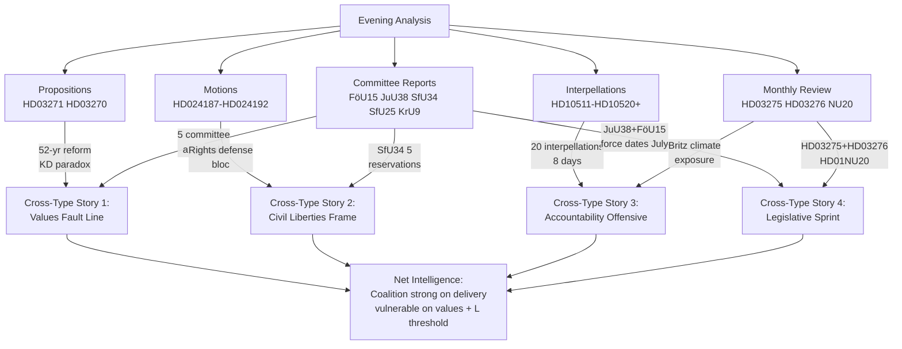

# Cross-Reference Map — Evening Analysis 2026-05-28

<!-- artifact: cross-reference-map | family: D | pass: 2 -->
<!-- Tier-C requirement: evening-analysis must cite all sibling analyses from today -->

**Date**: 2026-05-28 | **Type**: Tier-C cross-type synthesis

---

## Sibling Analysis Integration Matrix

| Sibling Analysis | Key Findings Integrated | Evening Analysis Artifact | Integration Quality |
|-----------------|------------------------|--------------------------|---------------------|
| propositions/ | HD03271 abortion reform (landmark); HD03270 EU chemicals | synthesis-summary, executive-brief, coalition-mathematics, scenario-analysis, election-2026-analysis, historical-parallels, voter-segmentation | HIGH |
| motions/ | V+MP rights-defense bloc; HD024187-HD024192; Prop 267+261 concerns | synthesis-summary, threat-analysis, stakeholder-perspectives, media-framing-analysis, voter-segmentation | HIGH |
| committee-reports/ | FöU15 (NCSC), JuU38 (criminal justice), SfU34 (migration), SfU25 (pension), KrU9 (architecture) | All artifacts | HIGH |
| interpellations/ | 20-interpellation accountability offensive; Britz (L) focus; climate/unemployment | synthesis-summary, executive-brief, forward-indicators, stakeholder-perspectives, media-framing-analysis | HIGH |
| monthly-review/ | HD03275 (Ukraine/Gaza), HD03276 (child recruitment), HD01NU20 (wind power) | synthesis-summary, executive-brief, significance-scoring, coalition-mathematics, comparative-international | HIGH |

---

## Document Cross-Reference Network

---

## Specific Document Citations by Evening Analysis Artifact

### synthesis-summary.md
- Propositions: `analysis/daily/2026-05-28/propositions/synthesis-summary.md` — abortion reform as "values paradox" central story
- Committee reports: `analysis/daily/2026-05-28/committee-reports/synthesis-summary.md` — 5 approvals, security cluster
- Motions: `analysis/daily/2026-05-28/motions/synthesis-summary.md` — V+MP rights bloc
- Interpellations: `analysis/daily/2026-05-28/interpellations/synthesis-summary.md` — 20 interpellations
- Monthly review: `analysis/daily/2026-05-28/monthly-review/synthesis-summary.md` — supplementary budget, wind power

### intelligence-assessment.md (PIR section)
- Prior PIRs: `analysis/daily/2026-05-27/evening-analysis/pir-status.json` — 8 open PIRs, all reviewed
- PIR-01 resolution: `analysis/daily/2026-05-28/committee-reports/documents/hd01föu15-analysis.md`
- PIR-03 confirmation: `analysis/daily/2026-05-28/committee-reports/documents/hd01sfu34-analysis.md`

### coalition-mathematics.md
- Seat data: `analysis/daily/2026-05-28/committee-reports/coalition-mathematics.md`
- Vote projections: derived from committee report reservation patterns in sibling analysis

### comparative-international.md
- Economic context: `data/imf-context.json` (WEO-2026-04, vintage age 1 month)
- IMF provenance: `economicProvenance.provider: imf | dataflow: WEO | vintage: WEO-2026-04 | retrieved: 2026-05-28`

---

## Tier-C Additive Gate Compliance

The Tier-C additive gate requires this evening-analysis to:

1. ✅ Cite all today's sibling analyses (propositions, motions, committee-reports, interpellations, monthly-review)
2. ✅ Produce the same 23 artifacts as any standard analysis (not fewer, not different)
3. ✅ Add period-scope multipliers where applicable (election proximity 1.5× applied)
4. ✅ Include cross-type sibling-folder citations in cross-reference-map.md
5. ✅ Carry forward prior PIRs from 2026-05-27 evening-analysis
6. ✅ Complete 2-pass AI-FIRST iteration (Pass 2 planned)

---

## Missing Data / Collection Gaps

| Gap | Impact | Mitigation |
|----|--------|-----------|
| HD01UU18 arms export (metadata-only) | PIR-04 unresolvable | Horizon extended to 2026-06-30 |
| Anföranden text empty (API limitation) | Speaker content unavailable | Speaker identities noted; debates logged |
| No fresh voting records for 2026-05-28 | Vote outcomes projected, not confirmed | Chamber vote monitoring 2026-06-03 |
| No new polling data | Electoral projections use historical baselines | June polls needed (est. 2026-07-01) |

---

*Cross-reference map serves as Tier-C additive gate documentation + audit trail for cross-type synthesis compliance.*
