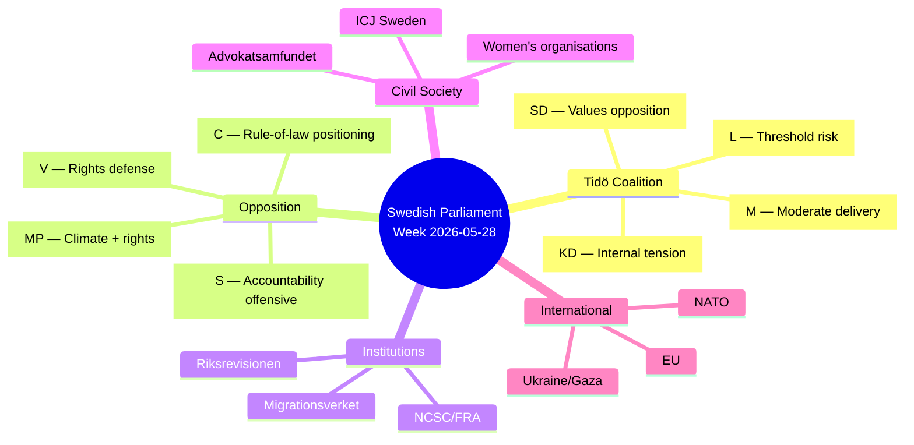

# Stakeholder Perspectives — Evening Analysis 2026-05-28

<!-- artifact: stakeholder-perspectives | family: C | pass: 2 -->

**Date**: 2026-05-28 | **Methodology**: Stakeholder Interest-Position Mapping

---

## Primary Stakeholder Map

---

## Coalition Stakeholders

### Moderaterna (M) — 68 seats
**Position this week**: M's core interests are served by the legislative sprint — JuU38 (criminal justice), FöU15 (cybersecurity), and HD03275 (Ukraine solidarity) all align with M's governing platform. M is the legislative executor of the Tidö programme.  
**Key interest**: Maintaining governing coalition unity while managing SD's increasingly visible policy deviations (abortion opposition). M needs SD to vote Ja on SfU34, NU20, and JuU38 chamber votes.  
**Risk**: If SD's abortion opposition becomes a dominant media frame, M must distance from SD without destabilising the coalition. Difficult balance.  
**Assessment**: M is the week's strongest stakeholder position — delivering on platform without major compromises.

### Sverigedemokraterna (SD) — 73 seats
**Position this week**: SD has made a calculated decision to vote Nej on HD03271 (abortion) — a government-submitted proposition. This is a deliberate values-politics signal to SD's social-conservative base: "We hold the line even in government."  
**Key interest**: SD's primary electoral interest is to demonstrate that coalition participation has not fundamentally changed its values identity. Voting against the abortion reform achieves this at minimal governance cost (the reform passes anyway with supermajority).  
**Risk**: If HD03271 generates a prolonged media cycle about "SD vs. women's healthcare," SD may face unexpected electoral damage among moderate voters who split from M to SD in 2022.  
**Assessment**: SD's abortion Nej is a calculated gamble with manageable downside risk.

### Kristdemokraterna (KD) — 19 seats
**Position this week**: KD is in the most complex stakeholder position. Minister Forssmed submitted HD03271 as a government obligation — but the reform directly contradicts KD's traditional family-values platform.  
**Key interest**: KD needs to convince both its governing base (that coalition discipline is worth the compromise) and its socially conservative base (that KD's identity has not been erased).  
**Risk**: Internal KD dissent in SoU committee phase. Any visible KD reservations on HD03271 will be reported as coalition fracture.  
**Assessment**: KD is the most vulnerable Tidö party this week. The abortion reform may cost KD 2-4% of its base voters who defect to SD or Christian minor parties.

### Liberalerna (L) — 16 seats
**Position this week**: L faces existential electoral risk. Six interpellations targeting Britz (L) on unemployment and climate represent the most concentrated personal targeting of any minister this session.  
**Key interest**: L needs Britz to answer the climate interpellation (HD10514, 2026-06-12) in a way that maintains L's environmental credibility without contradicting its governing coalition commitments.  
**Risk**: Threshold breach. If June polling shows L below 4.5%, a spiral dynamic can activate (tactical voters leave L for larger parties).  
**Assessment**: L is the week's most exposed stakeholder. Britz's June answers will be a primary electoral event.

---

## Opposition Stakeholders

### Socialdemokraterna (S) — 107 seats
**Position this week**: S is the architect of the accountability offensive — 17 of 20 interpellations are S-authored. S is simultaneously supporting HD03271 (which removes a potential attack vector on women's healthcare) while pressing the coalition on unemployment, climate, inequality, and migration governance.  
**Key interest**: S's primary interest is to define the election frame as "100,000 more unemployed + migration governance failure" before the summer recess.  
**Assessment**: S is executing its most sophisticated pre-election strategy of the 2022–2026 term.

### Vänsterpartiet (V) — 24 seats
**Position this week**: V has formed a rights-defense bloc with MP on both Prop 261 and Prop 267. V's reservations are maximalist (full rejection of both propositions).  
**Key interest**: V positions itself as the consistent rights defender — useful for mobilising left-wing voters who are skeptical about S's centrist compromises.  
**Assessment**: V's maximalist position is consistent with V's base but unlikely to attract centrist voters. Useful for opposition signalling rather than governing coalition formation.

### Centerpartiet (C) — 24 seats
**Position this week**: C's position is the most interesting in the opposition — C reserved on FöU15 (cybersecurity scope) and on SfU34 (migration governance), aligning with the opposition bloc on rule-of-law grounds.  
**Key interest**: C is positioning for post-election government formation optionality — appearing reasonable on security issues (approves FöU15 core) while holding the government accountable on governance (SfU34, Prop 267).  
**Assessment**: C is the coalition-formation wildcard. C's participation in the rights-defense bloc signals willingness to work with S+MP in a future government.

---

## Institutional Stakeholders

### Riksrevisionen
**Position**: RiR 2025:32 (migration detention) is the institutional authority behind the SfU34 opposition reservations. Riksrevisionen's audit findings cannot be dismissed by the government as "political" — they are official governance audit findings.  
**Impact**: Riksrevisionen reports that are rejected by the government become opposition campaign material. RiR 2025:32 will be cited in S campaign materials.

### NCSC / FRA
**Position**: Direct beneficiary of FöU15. NCSC gains legal authority to share and receive classified threat intelligence from FRA.  
**Impact**: The 15 July implementation date creates an operational planning requirement for NCSC/FRA to establish inter-agency information-sharing protocols before the date.

---

*Stakeholder analysis uses public record sources only. Positions represent analytical assessment, not direct statements.*
