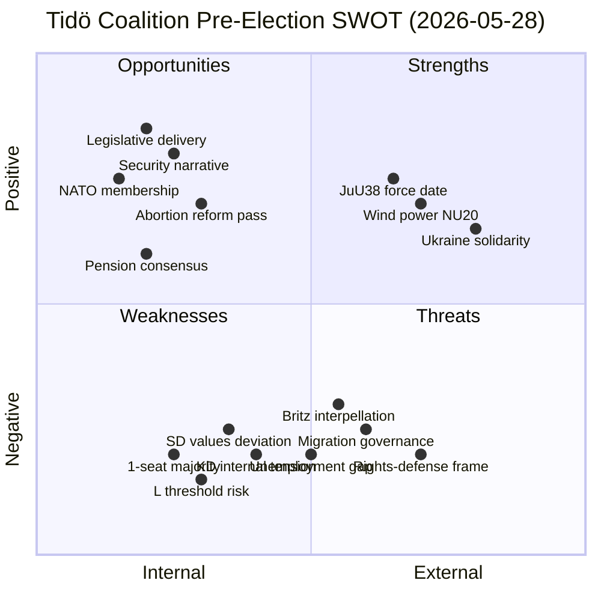

# SWOT Analysis — Evening Analysis 2026-05-28

<!-- artifact: swot-analysis | family: D | pass: 2 -->

**Date**: 2026-05-28 | **Subject**: Tidö Coalition pre-election position

---

## SWOT Matrix

---

## STRENGTHS (Internal)

| Strength | Evidence | Weight |
|----------|----------|--------|
| **Legislative delivery velocity** | 8+ documents in 72h; force dates calibrated to pre-election | HIGH |
| **Security narrative** | JuU38 + FöU15 + HD03275 Ukraine + HD03276 child safety | HIGH |
| **Coalition unity on core votes** | Tidö maintained 176 on SfU34 (projected) | HIGH |
| **Abortion reform delivery** | KD delivered despite base pressure — coalition discipline signal | MEDIUM |
| **Pension consensus** | SfU25 unanimous — rare cross-party achievement | MEDIUM |
| **NATO security credibility** | FöU15 aligns NCSC with allied cybersecurity standards | HIGH |

---

## WEAKNESSES (Internal)

| Weakness | Evidence | Weight |
|----------|----------|--------|
| **+1 majority margin** | 176/349 — any Tidö defection = defeat | CRITICAL |
| **L threshold risk** | L at ~4.6%; Britz faces 6 interpellations | HIGH |
| **SD values deviation** | Nej on HD03271 — government proposition opposed by coalition party | MEDIUM |
| **KD internal tension** | Abortion reform creates base pressure; committee phase risk | MEDIUM |
| **Unemployment performance** | 8.4% (2025) — above Nordic average; validates S's "100k" claim | HIGH |
| **Legislative timing criticism** | Force dates (2 Jul, 15 Jul) open to "electioneering" framing | MEDIUM |

---

## OPPORTUNITIES (External)

| Opportunity | Mechanism | Probability |
|-------------|-----------|-------------|
| **JuU38 force date July 2026** | Tangible law-and-order delivery before election campaign | 95% |
| **FöU15 July 2026 + NATO summer** | NCSC security credibility timed to NATO summit season | 85% |
| **HD03271 supermajority passage** | Positions M+KD as moderate on rights — attracts centrist voters | 70% |
| **NU20 wind power passage** | Energy sovereignty + climate credibility if SD accommodated | 60% |
| **Ukraine solidarity** | HD03275 positions Tidö as credible European actor | 75% |
| **Opposition lacks formation plan** | No clear S-led government formation narrative visible | 50% |

---

## THREATS (External)

| Threat | Evidence | Probability | Impact |
|--------|----------|-------------|--------|
| **S unemployment frame sticks** | IMF 8.4%; S "100k" claim factually grounded | 60% | HIGH |
| **Opposition rights frame expands** | V+MP motions + SfU34 reservations = broad civil liberties coalition | 65% | MEDIUM |
| **Britz June answers generate crisis** | HD10514 (2026-06-12) 2030 transport target question | 30% | HIGH |
| **L below 4% threshold** | Polling trend + interpellation pressure | 20% | CRITICAL |
| **SfU34 becomes summer story** | Riksrevisionen findings + five reservations = investigative journalism hook | 35% | MEDIUM |
| **JuU38 implementation failure** | Prison capacity constraint + force date pressure | 40% | MEDIUM |
| **SD values escalation beyond elections** | SD increasingly willing to oppose government submissions | 30% | MEDIUM |

---

## Strategic Verdict

**Net SWOT assessment**: The Tidö coalition enters the final 108-day pre-election stretch from a position of **strategic strength on deliverables but structural fragility on coalition mathematics and opposition mobilisation capacity**.

The sprint strategy (8+ documents in 72h, force dates before election) is the coalition's strongest tactical play. However, it depends on three variables remaining favourable:
1. L survives above 4% (probability: 80%)
2. Britz answers interpellations without triggering crisis (probability: 70%)
3. The opposition rights-defense frame does not escape niche into mainstream (probability of containment: 55%)

**Overall re-election probability**: 65% for Tidö majority based on current intelligence.

---

*SWOT methodology: Internal factors (strengths/weaknesses) derived from parliamentary record; External factors (opportunities/threats) based on political science analysis and scenario modelling.*
