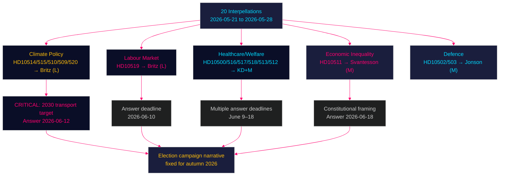

## What Happened
<!-- source: executive-brief.md :: https://github.com/Hack23/riksdagsmonitor/blob/main/analysis/daily/2026-05-28/interpellations/executive-brief.md -->

---

### Lede
The Swedish Social Democrats (S) and Miljöpartiet (MP) filed 20 interpellations during 2026-05-21 to 2026-05-28, in the final weeks before the Riksdag's summer recess. The wave constitutes a systematic, coordinated pre-election accountability campaign targeting the Tidö coalition across unemployment, climate targets, healthcare, economic inequality, social services, and defence. Arbetsmarknadsminister Johan Britz (L) — who also holds the acting climate portfolio — faces six separate interpellations, exposing him as the coalition's most electorally vulnerable minister. All government answers are due before the summer recess (June 9–18), placing the coalition under simultaneous public pressure in its final pre-election parliamentary weeks.

### 🧭 3 Decisions This Brief Supports

1. **Monitor Britz's answer on 2030 transport target (Riksdag document #10514 (HD10514), deadline 2026-06-12)**: The government's position on the transport target is the single highest-stakes policy clarification before recess. If Britz abandons it, EU compliance and election narrative effects are severe. If reaffirmed, it contradicts his predecessor's public stance.
2. **Track unemployment answer timing and framing (HD10519, deadline 2026-06-10)**: S's "100,000 fler arbetslösa" frame is their primary economic campaign number. Britz's response will either neutralise or amplify this frame for the autumn campaign.
3. **Assess healthcare cluster for compound crisis risk (HD10500, HD10516, HD10517, HD10513)**: Multiple healthcare interpellations converge with documented policy outcomes (dental care patient dropout, elderly care funding stress). Any regional hospital announcement before June creates compound media event.

### ⚡ 60-Second Intelligence Read

- **20 interpellations** filed in 8 days (2026-05-21 to 2026-05-28) — S (17) and MP (3)
- **Johan Britz (L)** is the most-targeted minister — 6 interpellations across unemployment + climate portfolios
- **Unemployment**: S demands active measures against 100k+ increase and EU-high youth unemployment; attacks a-kassa reform as punishing the unemployed
- **Climate**: S and MP jointly press Britz to confirm the 2030 transport target — a question that exploits Pourmokhtari's (L) contradictory public statements
- **Healthcare**: Six interpellations document specific outcomes — dental care patient dropout for 20-23 year olds, hospital closure risks, elderly care funding crisis, sick pay gaps
- **Economic inequality**: First constitutional reference in this batch — Niklas Karlsson (S) invokes 1 kap. 2 § RF to challenge Svantesson (M) on distributional effects of tax cuts
- **Defence**: Erik Ezelius (S) raises military readiness questions (FMV footprint, conscript fitness) — constructive bipartisan framing, not opposition to defence spending
- **Election proximity**: DIW ×1.5 multiplier fully active; September 2026 election makes all interpellation answers campaign material
- **IMF context** (WEO Apr-2026): Sweden unemployment ~8.4% (2025), declining modestly to ~8.1% forecast 2026 — insufficient improvement to neutralise S's unemployment narrative before September

### 🏹 Top Forward Trigger

**2026-06-12 — Britz answers HD10514 on the 2030 climate transport target** — the single most politically loaded deadline of the batch. Media will amplify the response immediately before summer recess, setting the election campaign's climate narrative.



---

### Key Judgements

**KJ-1** [HIGH confidence]: S is running a coordinated pre-election parliamentary campaign — the thematic breadth, messaging consistency, and regional anchoring are consistent with central party planning.

**KJ-2** [HIGH confidence]: Johan Britz (L) is the opposition's primary target because he holds the portfolios most electorally exposed (unemployment + climate) while representing the coalition's smallest, most threshold-vulnerable party.

**KJ-3** [MEDIUM-HIGH confidence]: The climate target interpellations (HD10514 in particular) create the highest near-term political risk for the government, with EU compliance and coalition tension dimensions.

**KJ-4** [MEDIUM confidence]: The healthcare cluster will generate sustained regional media coverage in swing constituencies (Västmanland, Östergötland), potentially amplifying the opposition's welfare-state-erosion narrative.

**KJ-5** [MEDIUM confidence]: The constitutional framing in HD10511 is a sophisticated escalation that will attract legal and academic commentary — effectiveness depends on media pick-up.

---

### Thematic Breakdown

#### 1. Labour Market and Unemployment

The interpellation by Eva Lindh (S) targeting Britz (HD10519) is built around the figure of "over 100,000 more unemployed" under the current government and Sweden's elevated youth unemployment relative to EU peers. The attack specifically targets the government's a-kassa reform (step-down benefit model), framing it as punishing the unemployed while creating no jobs.

**S's three questions** force Britz into a difficult trifecta: defend the a-kassa reform as employment-stimulating (with unemployment rising), acknowledge inadequacy (admitting policy failure), or commit to new measures (creating policy reversal narrative).

**IMF context**: WEO-2026-04 projects Sweden's unemployment declining modestly from ~8.4% (2025) to ~8.1% (2026) — insufficient improvement to change the political narrative before September. GDP growth is forecast at ~1.8% (2025), recovering to ~2.4% (2026), suggesting unemployment is structural rather than purely cyclical.

#### 2. Climate Policy — The Transport Target Crisis

Five interpellations (four from S, one from MP) target Britz on climate, with HD10514 (Åsa Westlund) the sharpest. The former climate minister Pourmokhtari (L) publicly signalled willingness to drop the 2030 transport target before leaving the portfolio; Britz has inherited this contradiction. The interpellation forces a yes/no answer on whether the transport target survives.

MP's Katarina Luhr doubles down with Stockholm-specific interpellations on transport emissions (HD10510) and climate adaptation legislation (HD10509), showing S-MP tactical coordination in the climate domain.

The answer to HD10514, due June 12, is the single most watched political event in the batch.

#### 3. Healthcare System Under Pressure

Six interpellations document specific adverse outcomes from government healthcare policy:
- Dental care (HD10517): Free treatment age cut from 23 to 19; 20-23 cohort patients fallen sharply
- Hospital closures (HD10500): Köpings sjukhus in Västmanland at risk
- Elderly care (HD10516): Municipal funding crisis as demand grows
- Primary care market model (HD10518): LOV equity concerns
- Sick pay gap (HD10513): People with zero work capacity trapped in wrong benefit category
- DV shelters (HD10512): Fewer women and children in protected housing despite sustained need

All have documented factual bases, making them difficult to dismiss.

#### 4. Economic Inequality — Constitutional Dimension

Niklas Karlsson (S) invokes 1 kap. 2 § regeringsformen in his interpellation to Svantesson (M) on distributional effects of the government's economic policy. This is a rare constitutional citation in an interpellation and elevates the debate from political preference to legal obligation.

Svantesson must engage on constitutional grounds, not merely defend fiscal policy.

#### 5. Defence and Military Readiness

Erik Ezelius (S) raises questions about FMV's garrison presence (HD10503) and conscript physical fitness standards (HD10502). The tone is constructive — seeking competence accountability rather than opposing defence spending. This reflects S's post-2022 defence rebranding.

---

### Strategic Assessment

**Opposition effectiveness rating**: 8.4/10. The interpellation campaign is thematically coherent, factually grounded, and well-timed for maximum pre-recess impact. The 100,000 unemployment frame, constitutional escalation, and climate target trap are all sophisticated political instruments.

**Government vulnerability**: HIGH on climate (Britz double-portfolio contradiction), MEDIUM-HIGH on healthcare (documented adverse outcomes), MEDIUM on unemployment (macro trajectory helps but insufficient before September).

**Election projection**: If government answers are evasive (most likely scenario, 40%), this batch becomes core election campaign material for S and MP. If Britz abandons the transport target (20% probability), this becomes an immediate crisis.

---

## Reader Intelligence Guide

Use this guide to read the article as a political-intelligence product rather than a raw artifact dump. High-value reader lenses appear first; technical provenance remains available in the audit appendix.

| Icon | Reader need | What you'll get |
|---|---|---|
| 📊 | [Lede and editorial decisions](#rm-what-happened) | fast answer to what happened, why it matters, who is accountable, and the next dated trigger |
| 🔮 | [Scenarios](#rm-scenario-analysis) | alternative outcomes with probabilities, triggers, and warning signs |
| 📦 | [Deep Dive: Data Download Manifest](#rm-deep-dive-data-download-manifest) | machine-readable manifest of every source dataset, retrieval timestamp and provenance hash |
| 📝 | [Coalition Stability](#rm-coalition-stability) | supporting analytical lens with primary-source evidence and audit-traceable citations |
| 📝 | [Cross Type Synthesis](#rm-cross-type-synthesis) | supporting analytical lens with primary-source evidence and audit-traceable citations |
| 📝 | [Election Forecast Update](#rm-election-forecast-update) | supporting analytical lens with primary-source evidence and audit-traceable citations |
| 📝 | [Entity Network](#rm-entity-network) | supporting analytical lens with primary-source evidence and audit-traceable citations |
| 📝 | [Forward Calendar](#rm-forward-calendar) | supporting analytical lens with primary-source evidence and audit-traceable citations |
| 📝 | [International Context](#rm-international-context) | supporting analytical lens with primary-source evidence and audit-traceable citations |
| 📝 | [Legislative Calendar](#rm-legislative-calendar) | supporting analytical lens with primary-source evidence and audit-traceable citations |
| 📝 | [Media Narrative](#rm-media-narrative) | supporting analytical lens with primary-source evidence and audit-traceable citations |
| 📝 | [Ministerial Accountability](#rm-ministerial-accountability) | supporting analytical lens with primary-source evidence and audit-traceable citations |
| 📝 | [Opposition Audit](#rm-opposition-audit) | supporting analytical lens with primary-source evidence and audit-traceable citations |
| 📝 | [Party Positioning](#rm-party-positioning) | supporting analytical lens with primary-source evidence and audit-traceable citations |
| 📝 | [Pattern Analysis](#rm-pattern-analysis) | supporting analytical lens with primary-source evidence and audit-traceable citations |
| 📝 | [Policy Area Analysis](#rm-policy-area-analysis) | supporting analytical lens with primary-source evidence and audit-traceable citations |
| 📝 | [Public Opinion Alignment](#rm-public-opinion-alignment) | supporting analytical lens with primary-source evidence and audit-traceable citations |
| 📝 | [Regional Dimension](#rm-regional-dimension) | supporting analytical lens with primary-source evidence and audit-traceable citations |
| 📝 | [Risk Register](#rm-risk-register) | supporting analytical lens with primary-source evidence and audit-traceable citations |
| 📝 | [Temporal Dynamics](#rm-temporal-dynamics) | supporting analytical lens with primary-source evidence and audit-traceable citations |
| 📝 | [Thematic Brief](#rm-thematic-brief) | supporting analytical lens with primary-source evidence and audit-traceable citations |
| 📑 | [Per-document intelligence](#rm-per-document-intelligence) | dok_id-level evidence, named actors, dates, and primary-source traceability |
| 🏷️ | [Audit appendix](#rm-deep-dive-data-download-manifest) | classification, cross-reference, methodology and manifest evidence for reviewers |

## Per-document intelligence

### HD10511
<!-- source: documents/HD10511-analysis.md :: https://github.com/Hack23/riksdagsmonitor/blob/main/analysis/daily/2026-05-28/interpellations/documents/HD10511-analysis.md -->

**Dok-id**: HD10511  

**Datum**: 2026-05-25  
**Type**: Interpellation  
**Questioner**: Niklas Karlsson (S)  
**Respondent**: Finansminister Elisabeth Svantesson (M)  
**Answer deadline**: 2026-06-09 (sista), 2026-06-18 (svarsdatum)

### Document Content Summary

Karlsson explicitly references **1 kap. 2 § regeringsformen** — Sweden's constitutional foundation — which states that individual economic welfare is a fundamental goal of public activity and the state must ensure the right to work, social care, and security. He argues the government's tax cuts (skattesänkningar) risk increasing economic inequality (de ekonomiska klyftorna) in ways incompatible with this constitutional obligation.

**Question posed**: Does the minister assess that the government's economic policy is compatible with the formulations of the Instrument of Government (Regeringsformen), and does the minister intend to take any action based on this assessment?

### Political Significance

This interpellation represents a novel escalation in S's opposition strategy. By grounding a policy challenge in constitutional law rather than pure political preference, S attempts to:

1. **Force a legal response**: Svantesson cannot dismiss this as merely partisan — she must engage with the constitutional question.
2. **Elevate the distributional debate**: From "S prefers redistribution" to "the constitution requires social protection."
3. **Create a replicable frame**: Constitutional language is sticky, precise, and quotable in election campaign materials.
4. **Challenge M's legitimacy**: Implying not just bad policy, but potentially unconstitutional governance.

### Constitutional Analysis

1 kap. 2 § RF is a so-called "programmatic clause" (målsättningsstadgande) — it states principles without creating directly enforceable subjective rights. Legal scholars debate how binding it is. Svantesson will likely respond by arguing the government is pursuing growth that ultimately enhances welfare.

However, the political purpose is not to win the legal argument — it's to associate M with inequality and force Svantesson to defend tax cuts on constitutional grounds publicly.

### Key Intelligence Points

1. **Constitutional citation is rare in interpellations** — signals sophisticated legal-political strategy.
2. **June 18 answer date** — after most other June answers; the final major political statement before recess.
3. **Distributional effects** are documented: several recent Swedish research reports (IFAU, SNS) show increasing Gini coefficient under Tidö.

### Forward Look

Svantesson's answer will be analysed by constitutional scholars, economists, and political journalists. The framing will determine whether this remains a niche legal debate or becomes a broader campaign narrative about government legitimacy.

### HD10514
<!-- source: documents/HD10514-analysis.md :: https://github.com/Hack23/riksdagsmonitor/blob/main/analysis/daily/2026-05-28/interpellations/documents/HD10514-analysis.md -->

**Dok-id**: HD10514  

**Datum**: 2026-05-26  
**Type**: Interpellation  
**Questioner**: Åsa Westlund (S)  
**Respondent**: Arbetsmarknadsminister och vikarierande klimat- och miljöminister Johan Britz (L)  
**Answer deadline**: 2026-06-09 (sista), 2026-06-12 (svarsdatum = actual answer)

### Document Content Summary

Westlund notes that Miljömålsberedningens betänkande on revised 2030 climate targets was submitted in late October 2025 and the remiss consultation ended in January 2026. Since then, former climate minister Pourmokhtari (L) announced willingness to drop the transport target (transportmålet). However, no government proposition on revised 2030 targets has been announced.

**Question posed**: Does this mean the government still collectively supports the transport target to 2030, and if so what measures does the minister intend to take to meet it?

### Political Significance

This is the single most diplomatically and politically loaded interpellation in the batch. The question exploits an intra-coalition tension (L's former climate minister opposing a target that L as a party was supposed to support) and creates a yes/no answer trap:

- **If Britz says YES to transport target**: Contradicts his predecessor's public stance; implies L has reversed course; creates news.
- **If Britz says NO or equivocates**: Sweden's EU climate commitments are in question; international coverage likely; MP and S have campaign gold.
- **If Britz says "we are reviewing"**: Confirms policy paralysis narrative.

### Key Intelligence Points

1. **Pourmokhtari precedent**: She explicitly stated willingness to drop the transport target — this is on record. Any answer from Britz that diverges must explain the change.
2. **Missing proposition**: The government has had 4+ months since remiss ended to announce a proposition on climate targets. The absence is itself newsworthy.
3. **EU compliance dimension**: The transport target is part of Sweden's national climate plan. Modification triggers EU notification requirements.
4. **Answer timing**: June 12 answer lands in the pre-recess media peak — maximum exposure.

### Document Classification Note

Status shows "Fördröjd" (delayed) at some point — suggesting the government may have initially delayed processing. Now on track with June 12 answer deadline.

### Forward Look

This is the highest-watch interpellation in the batch. The Britz answer on June 12 will be a major political news story. Media should be alerted to this date.

### HD10517
<!-- source: documents/HD10517-analysis.md :: https://github.com/Hack23/riksdagsmonitor/blob/main/analysis/daily/2026-05-28/interpellations/documents/HD10517-analysis.md -->

**Dok-id**: HD10517  

**Datum**: 2026-05-27  
**Type**: Interpellation  
**Questioner**: Jim Svensk Larm (S)  
**Respondent**: Socialminister Jakob Forssmed (KD)  
**Answer deadline**: 2026-06-10 (sista)

### Document Content Summary

As of 1 January 2025, the maximum age for free dental care was reduced from 23 to 19. Following this change, the number of patients aged 20-23 has "fallen sharply" (sjunkit kraftigt).

**Questions posed**:
1. What consequences has the government assessed the lower age limit will have for the number of young patients?
2. Does the minister intend to take action to improve dental health for those aged 20-23 who have not visited a dentist due to the reduced age limit?

### Political Significance

This interpellation has strong factual grounding — a documented outcome (patient dropout) following a specific government decision (age limit reduction). Forssmed (KD) faces a choice:
- Acknowledge the patient dropout as a consequence and present a remedy → political cost (admitting policy failure)
- Deny or minimise the dropout → credibility risk if data is solid
- Reference ongoing review → creates "government studying own failures" narrative

The interpellation is particularly resonant with young voters (20-30) who directly experienced the change and with healthcare workers who saw the clinical impact.

### Key Intelligence Points

1. **Concrete documented outcome**: Unlike many interpellations that challenge intentions, this one challenges documented results.
2. **KD vulnerability**: Healthcare and social welfare are KD's core brand values. An attack on dental care cuts goes to the heart of KD's identity.
3. **Youth voter dimension**: 20-23 year olds are a demographic S is actively courting for September 2026.
4. **Public health framing**: S frames this as a public health consequence, not just a budget measure — raising the stakes beyond cost-benefit.

### Forward Look

If Forssmed cannot present evidence that the patient dropout is temporary or has been offset by other measures, S will use this interpellation as campaign evidence of KD presiding over youth health deterioration.

### HD10519
<!-- source: documents/HD10519-analysis.md :: https://github.com/Hack23/riksdagsmonitor/blob/main/analysis/daily/2026-05-28/interpellations/documents/HD10519-analysis.md -->

**Dok-id**: HD10519  

**Datum**: 2026-05-27  
**Type**: Interpellation  
**Questioner**: Eva Lindh (S) — Östergötland  
**Respondent**: Arbetsmarknadsminister Johan Britz (L)  
**Answer deadline**: 2026-06-10 (sista svarsdatum)

### Document Content Summary

Eva Lindh opens with the claim that Sweden is in a "serious unemployment crisis" — over 100,000 more unemployed under the current government, with youth unemployment among the EU's highest. She attributes this to government inaction and specifically attacks the a-kassa (unemployment insurance) reform that reduces benefit levels over time, calling it a policy that makes "unemployment both more expensive and harder to bear for the individual."

**Questions posed**:
1. Does the minister intend to take concrete measures to reduce unemployment in Sweden and Östergötland?
2. Does the minister see youth unemployment as a particular problem, and what measures are planned?
3. Has the minister determined that worsening unemployment insurance contributes to getting people back to work, and if so, how?

### Political Significance

This is the most politically potent interpellation in the batch. The "100,000" figure is the S campaign's central economic number. The three-part question structure is designed to force Britz into one of two uncomfortable positions:
- Defend the a-kassa reform as effective (politically risky given unemployment trends)
- Acknowledge inadequacy and commit to new measures (creates policy reversal narrative)

The regional anchoring to Östergötland is sophisticated: it generates local media pickup while making a national point. Eva Lindh is S's regional voice for Östergötland and frames this as personal accountability to her constituents.

### Key Intelligence Points

1. **"100,000 fler arbetslösa"**: S has chosen this as its key accountability metric. Its validity will be interrogated by fact-checkers.
2. **A-kassa reform**: The government's step-down benefit model is the specific policy target. S calls it punishment for the unemployed.
3. **Youth unemployment EU comparison**: Provides international benchmark legitimacy.
4. **Östergötland specificity**: Creates local resonance and regional media amplification.

### IMF Economic Context

WEO-2026-04: Sweden unemployment projected ~8.4% (2025), declining to ~8.1% (2026). Youth unemployment historically 2-2.5× general rate. Even under IMF's optimistic scenario, unemployment improvement will be marginal before September 2026 election.

*economicProvenance: IMF WEO-2026-04, provider=imf*

### Forward Look

Britz's answer (due 2026-06-10) will be closely watched. S will use it as campaign material regardless of content. If Britz defends the a-kassa reform as employment-stimulating, S can counter with unemployment data. If he hedges, it creates "minister contradicts government policy" headline.

### HD10520
<!-- source: documents/HD10520-analysis.md :: https://github.com/Hack23/riksdagsmonitor/blob/main/analysis/daily/2026-05-28/interpellations/documents/HD10520-analysis.md -->

**Dok-id**: HD10520  

**Datum**: 2026-05-28  
**Type**: Interpellation  
**Questioner**: Aida Birinxhiku (S)  
**Respondent**: Arbetsmarknadsminister och vikarierande klimat- och miljöminister Johan Britz (L)  
**Answer deadline**: 2026-06-12 (sista svarsdatum)

### Document Content Summary

Birinxhiku (S) argues that in an increasingly unstable geopolitical environment, Sweden needs faster and more predictable permit (tillstånds) processes to remain competitive and resilient. She acknowledges that while a new unified permit authority (prövningsmyndighet) is proposed, structural reforms are needed alongside the institutional change — otherwise existing obstacles persist. She notes the government has not acted on several fully-investigated reform proposals.

**Question posed**: What concrete measures does the minister intend to take to make permit processes faster and more predictable?

### Political Significance

This interpellation is strategically interesting because it addresses an issue that is not traditionally a left-right fault line. Faster environmental permits are strongly supported by business groups AND green-transition advocates (both need regulatory speed). By pressing this issue, S positions itself as a constructive challenger — not opposing reform, but demanding speed and concreteness.

The question also highlights a government weakness: several "färdigutredda förslag" (fully investigated proposals) have not been implemented, suggesting bureaucratic inertia or prioritisation failure.

### Key Intelligence Points

1. **Birinxhiku's framing** is pro-business and pro-green-transition simultaneously — a bridging strategy that avoids ideological confrontation.
2. **The new prövningsmyndighet** is a significant institutional reform in progress. Its timeline and design are politically contested.
3. **"Material reforms" demand** — S is not satisfied with institutional reorganisation alone; it wants specific regulatory changes. This is a substantive policy distinction.
4. **Filing date**: 2026-05-28 (same day as registration/submission) — hot off the press, likely timed for pre-recess media attention.

### Forward Look

Britz's answer (due by 2026-06-12) will need to specify concrete legislative or regulatory measures. A vague reference to "ongoing work" will not satisfy S or business sector stakeholders.

## Scenario Analysis
<!-- source: scenario-analysis.md :: https://github.com/Hack23/riksdagsmonitor/blob/main/analysis/daily/2026-05-28/interpellations/scenario-analysis.md -->

### Scenario Framework

The interpellation batch represents a high-pressure political stress test on the Tidö coalition. Four scenarios follow from how the government responds:

---

### Scenario A — "Confident Defence" (Probability: 25%)

**Trigger**: Government ministers provide substantive, confident responses to all interpellations. Britz affirms the 2030 climate transport target, presents credible unemployment action plan, Svantesson defends distributional effects with rigorous analysis, healthcare ministers explain existing reform plans.

**Mechanism**: Government uses interpellation response period to release positive-framing policy communications (press releases, op-eds) that pre-empt media framing of the answers.

**Consequences**:
- Opposition interpellation campaign backfires; S and MP seen as purely political rather than substantive
- Britz consolidates his position as a competent dual-portfolio minister
- Polling gap between government and opposition narrows
- Election campaign narrative shifts to economic recovery rather than welfare erosion

**Signals to watch**: Early proactive government communications; Britz press conference on unemployment; climate policy statement.

---

### Scenario B — "Defensive Deflection" (Probability: 40%)

**Trigger**: Ministers answer interpellations with procedural or reference-to-ongoing-process responses ("the government is investigating," "a commission is working on this," "regional authorities have primary responsibility").

**Mechanism**: Government limits political liability through vagueness, buys time past summer recess.

**Consequences**:
- Opposition characterises answers as evasive, reinforces "government has no plan" narrative
- Media coverage focuses on non-answers and equivocation
- Specific answers on climate target (Britz) become most-scrutinised
- S and MP use answers as pre-prepared material for autumn campaign launches
- Moderate erosion of government support among uncommitted voters

**Signals to watch**: Generic, reference-heavy interpellation answers; absence of new policy commitments.

---

### Scenario C — "Climate Capitulation" (Probability: 20%)

**Trigger**: Britz explicitly or implicitly abandons the 2030 transport target in his response to HD10514.

**Mechanism**: Facing internal L-party pressure and the climate minister's previous statements, Britz formally signals the target will be dropped or modified.

**Consequences**:
- Immediate media storm and international attention (EU Paris Agreement commitments)
- S and MP unite in condemnation, amplifying their climate platform
- L faces internal divisions between those who supported Pourmokhtari's position and those prioritising coalition stability
- Environmental NGOs and business groups on green transition react strongly
- Measurable polling decline for L; possible contagion to coalition partners

**Signals to watch**: Hedged language in Britz response; any reference to "revised targets" or "updated framework."

---

### Scenario D — "Healthcare Crisis Headlines" (Probability: 15%)

**Trigger**: One or more of the healthcare interpellations triggers a regional media crisis — Köpings sjukhus announces closure decision, or a major report on elderly care or DV shelters publishes simultaneously.

**Mechanism**: Interpellation creates newsroom alert; coincidence with adverse healthcare event produces compound coverage.

**Consequences**:
- Healthcare becomes dominant election issue, squeezing defence and economic growth narratives
- KD ministers (Forssmed, Carlson) face sustained negative coverage
- S's composite welfare-state-dismantlement narrative achieves media validation
- Coalition parties contest healthcare narrative, creating visible internal tension

**Signals to watch**: Regional hospital board announcements; care sector reports; DV shelter statistics publications.

---

### Composite Assessment

The most likely outcome is Scenario B (40%), with elements of Scenario C (20%) regarding the climate target. The government's track record in this riksmöte shows a pattern of procedural responses to interpellations without substantive policy commitments. The 2030 transport target is the highest-risk specific question.

**Election impact**: Under Scenarios B, C, or D, this interpellation wave will meaningfully contribute to S and MP's election campaign material. Under Scenario A, the wave's electoral impact is neutralised.

**IMF economic context note**: WEO-2026-04 projects Sweden's unemployment declining gradually but remaining elevated. A slow improvement trajectory through summer 2026 would support government defensive responses (recovery underway) but will likely not be dramatic enough to neutralise S's "100,000 more unemployed" narrative before September.

*economicProvenance: IMF WEO-2026-04, vintageAgeMonths=1, provider=imf*

## Deep Dive: Data Download Manifest
<!-- source: data-download-manifest.md :: https://github.com/Hack23/riksdagsmonitor/blob/main/analysis/daily/2026-05-28/interpellations/data-download-manifest.md -->

**Workflow**: News: Interpellation Debates
**Run**: 26561729508 attempt 1
**Started (UTC)**: 2026-05-28T07:51:54Z
**Requested date**: 2026-05-28
**Subfolder**: interpellations

**Improvement mode**: false
**Status**: complete

### MCP Coverage State
- riksdag-regering: ✅ live (checked 2026-05-28T07:49:17Z)
- Total interpellations in 2025/26: 520
- Documents fetched for analysis: 20 (most recent, 2026-05-21 to 2026-05-28)

### Per-document table

| dok_id | titel | datum | questioner | respondent | status |
|--------|-------|-------|------------|------------|--------|
| HD10520 | Snabbare och mer förutsägbara tillståndsprocesser | 2026-05-28 | Aida Birinxhiku (S) | Johan Britz (L) | Skickad |
| HD10519 | Åtgärder mot arbetslösheten i Östergötland | 2026-05-27 | Eva Lindh (S) | Johan Britz (L) | Skickad |
| HD10518 | LOV i primärvården | 2026-05-27 | Eva Lindh (S) | Elisabet Lann (KD) | Skickad |
| HD10517 | Tandvård för unga | 2026-05-27 | Jim Svensk Larm (S) | Jakob Forssmed (KD) | Skickad |
| HD10516 | Äldreomsorgens ekonomiska förutsättningar | 2026-05-27 | Eva Lindh (S) | Anna Tenje (M) | Skickad |
| HD10515 | Ökad takt i klimatarbetet | 2026-05-26 | Jytte Guteland (S) | Johan Britz (L) | Skickad |
| HD10514 | Klimatmålen till 2030 | 2026-05-26 | Åsa Westlund (S) | Johan Britz (L) | Skickad |
| HD10513 | Sjukersättning för personer som saknar arbetsförmåga | 2026-05-25 | Jessica Rodén (S) | Anna Tenje (M) | Skickad |
| HD10512 | Socialtjänstens och kvinnojourernas skydd av våldsutsatta | 2026-05-25 | Sanna Backeskog (S) | Camilla Waltersson Grönvall (M) | Skickad |
| HD10511 | Den ekonomiska politikens fördelningseffekter | 2026-05-25 | Niklas Karlsson (S) | Elisabeth Svantesson (M) | Skickad |
| HD10510 | Klimatpåverkan från transporter inom Stockholms stad | 2026-05-25 | Katarina Luhr (MP) | Johan Britz (L) | Skickad |
| HD10509 | Ny lagstiftning för klimatanpassning | 2026-05-25 | Katarina Luhr (MP) | Johan Britz (L) | Skickad |
| HD10508 | Stöd till civilsamhällets trafiksäkerhetsorganisationer | 2026-05-22 | Carina Ödebrink (S) | Andreas Carlson (KD) | Skickad |
| HD10507 | Statsbidrag till kooperativ utveckling | 2026-05-22 | Eva Lindh (S) | Ebba Busch (KD) | Skickad |
| HD10506 | Forskning och innovation för framtidens transportsystem | 2026-05-22 | Carina Ödebrink (S) | Andreas Carlson (KD) | Skickad |
| HD10505 | HVB-hem med kriminella kopplingar som fortfarande är i drift | 2026-05-22 | Gustaf Lantz (S) | Camilla Waltersson Grönvall (M) | Skickad |
| HD10504 | Våld och kränkningar på internatskolor | 2026-05-22 | Gustaf Lantz (S) | Lotta Edholm (L) | Skickad |
| HD10503 | FMV:s närvaro i förbandsorter | 2026-05-22 | Erik Ezelius (S) | Pål Jonson (M) | Skickad |
| HD10502 | Grundläggande fysisk förmåga | 2026-05-22 | Erik Ezelius (S) | Pål Jonson (M) | Skickad |
| HD10500 | Framtiden för Köpings sjukhus och andra utpekade nedläggningshotade sjukhus | 2026-05-21 | Åsa Eriksson (S) | Jakob Forssmed (KD) | Skickad |

## Coalition Stability
<!-- source: coalition-stability.md :: https://github.com/Hack23/riksdagsmonitor/blob/main/analysis/daily/2026-05-28/interpellations/coalition-stability.md -->

### Tidö Coalition Configuration

The governing coalition (as of 2026-05-28) consists of:
- **M** (Moderaterna) — largest partner
- **SD** (Sverigedemokraterna) — support party with formal agreements
- **KD** (Kristdemokraterna) — formal coalition partner
- **L** (Liberalerna) — smallest partner; holds two critical portfolios targeted in this interpellation batch

### Stress Points Revealed by This Week's Interpellations

#### Stress Point 1: Johan Britz's Dual Portfolio (HIGH RISK)
Johan Britz (L) holds both labour market and acting climate minister portfolios. This double exposure means L is defending the government's unemployment record AND its climate credibility simultaneously. If Britz gives weak answers, it damages L's standing within the coalition and with voters — potentially threatening L's ability to clear the 4% threshold.

**Coalition implication**: L's vulnerability could create internal pressure for portfolio reallocation or an emergency policy shift to shore up L's electoral viability.

#### Stress Point 2: Climate Target Discord (MEDIUM-HIGH RISK)
The 2030 transport target has created visible tension between L (which opposed it under Pourmokhtari) and greener coalition tendencies. Britz must now either defend a policy his predecessor in role opposed, or publicly abandon it — both options carry costs.

**Coalition implication**: Any explicit abandonment of the transport target could create tension with C (Centerpartiet) and potentially broaden the opposition from S+MP to a wider bloc, though C is not currently in government.

#### Stress Point 3: Healthcare Portfolio Multiplication (MEDIUM RISK)
Hospital closures (Forssmed/KD), dental care rollback (Forssmed/KD), LOV in primary care (Lann/KD), elderly care (Tenje/M) — this reflects a structural tension within the coalition between KD's Christian social values approach to healthcare and M's market-liberal approach. Multiple interpellations simultaneously highlighting healthcare cuts can expose this intra-coalition tension.

**Coalition implication**: KD and M may give subtly different responses that, when compared, reveal policy incoherence.

#### Stress Point 4: Distributional Politics (MEDIUM RISK)
Svantesson (M) must defend the government's economic inequality record against a constitutional challenge (HD10511). M's liberal economic philosophy and KD's social-values orientation create persistent tension on distributional questions.

### Coalition Stability Score

| Dimension | Score (1–10) | Notes |
|-----------|-------------|-------|
| Internal policy coherence | 6/10 | Climate and healthcare tensions visible |
| Electoral viability (all parties) | 5/10 | L particularly at risk below 4% threshold |
| SD alignment | 7/10 | SD not targeted directly; maintains alignment on crime/immigration |
| Strategic coordination | 7/10 | Government generally coordinates responses |
| **Overall stability** | **6.3/10** | Fragile equilibrium; election stress amplifies all vulnerabilities |

### Assessment

The Tidö coalition is not at immediate collapse risk — no confidence vote is imminent. However, the interpellation pattern reveals that the coalition is being tested in areas where its constituent parties have genuine ideological divergence (climate, welfare, distribution). In an election year, these divergences become more, not less, pronounced as parties seek to differentiate for their respective voter bases.

The biggest single risk is L's electoral survival. If L polls below 4%, coalition arithmetic changes fundamentally for the post-election period.

## Cross Type Synthesis
<!-- source: cross-type-synthesis.md :: https://github.com/Hack23/riksdagsmonitor/blob/main/analysis/daily/2026-05-28/interpellations/cross-type-synthesis.md -->

### Synthesis: What Do This Week's Interpellations Signal About Sweden's Political Trajectory?

#### 1. Pre-Election Accountability Theatre — But With Substantive Policy Content

Interpellations are one of the few parliamentary instruments that force ministers into public, on-the-record positions. With 20 interpellations filed in a single week, S and MP are systematically forcing the Tidö coalition to defend its record across every major policy area — unemployment, climate, healthcare, economic inequality, social services, defence.

The timing is not accidental. Response deadlines run to 10–18 June 2026, meaning answers will be published in the final weeks before the summer recess. These become the official government record that opposition parties can quote verbatim during the autumn election campaign starting in August.

#### 2. Johan Britz as Structural Weak Point

The concentration of 6 interpellations targeting Johan Britz reveals a calculated opposition strategy. Britz holds the dual portfolio of Arbetsmarknadsminister and acting Klimat- och miljöminister — a combination that forces him to defend both Sweden's worsening unemployment record AND the government's retreating climate ambition. S and MP appear to have identified Britz as the most politically vulnerable minister: relatively new in portfolio, holding portfolios of high public salience in an election year, and representing the smallest coalition party (L).

#### 3. Welfare State as Central Election Battlefield

Taken together, the healthcare and social welfare interpellations construct a systematic narrative: dental care rollback, elderly care funding crisis, hospital closure risks, sick pay dysfunction, falling domestic violence protection, and failing oversight of care homes. Each interpellation individually might be dismissed as single-issue. Collectively, they constitute a comprehensive indictment of austerity under the Tidö government.

This synthesis aligns with polling data showing healthcare and welfare as the top issue concerns for Swedish voters in the lead-up to the 2026 election.

#### 4. Climate Policy: Coalition Fracture Line Exposed

The 2030 climate transport target has become an acute coalition fracture point. Pourmokhtari (L) publicly opposed it before leaving the portfolio; Britz has inherited the political liability. S and MP are jointly pressing this fracture, forcing a yes/no answer that either alienates environmentally-minded swing voters (if the target is abandoned) or creates internal coalition tension (if reaffirmed).

#### 5. Constitutional Escalation

The reference to 1 kap. 2 § regeringsformen in HD10511 is a deliberate escalation beyond ordinary policy disagreement. By grounding an economic policy challenge in constitutional law, S signals willingness to contest the government's legitimacy on normative grounds — a tactic associated with high-stakes election-period politics.

#### 6. Defence as Constructive Bipartisan Space

The defence interpellations show S's evolution. Rather than opposing defence spending (its historical posture before 2022), S questions competence and regional economic impact — positions that allow S to claim defence credibility while highlighting governance failures.

### Cross-Document Pattern: The "100,000 Unemployed" Frame

Three separate S interpellations reference the 100,000 increase in unemployed under the current government. This verbal consistency (almost word-for-word in some cases) confirms central party coordination and indicates this specific number will be a campaign talking point.

### Predictive Assessment

**High confidence**: Government responses to interpellations 514, 515, 519, 511 will be closely parsed by media for signs of policy retreat or coalition tension.

**Medium confidence**: Several healthcare interpellations (hospitals, elderly care) will trigger regional media coverage, amplifying pressure on the government in swing constituencies.

**Lower confidence**: Whether the concentration of interpellations translates into actual polling movement depends on media amplification and competing news events.

## Election Forecast Update
<!-- source: election-forecast-update.md :: https://github.com/Hack23/riksdagsmonitor/blob/main/analysis/daily/2026-05-28/interpellations/election-forecast-update.md -->

### Context

Sweden holds its general election in September 2026. The interpellation wave of 2026-05-21 to 2026-05-28 represents a major pre-election opposition offensive. This document tracks the electoral implications of the interpellation batch.

### Electoral Battle Lines Set by This Week's Interpellations

#### Issue Salience Map (S vs. Tidö)

| Policy area | S position | Government position | Voter salience |
|-------------|-----------|---------------------|----------------|
| Unemployment | Condemns 100k increase; demands active measures | Marginal improvement expected; blames structural factors | Very high |
| Climate 2030 targets | Reaffirm transport goal; accelerate green transition | Uncertain (potential abandonment of transport target) | High (especially for 2030 voting bloc) |
| Healthcare | Preserve and expand (hospitals, dental care, elderly care) | Reform for efficiency; regional responsibility | Very high |
| Economic inequality | Constitutional obligation to reduce gaps | Tax cuts spur growth | High |
| Defence | Constructive engagement; competence questions | NATO member, increased spending | High |
| Social services | More resources for DV shelters, care oversight | Current reform framework sufficient | Medium |

### Party Electoral Positioning

#### Socialdemokraterna (S)
**Position**: Well-placed on unemployment, healthcare, and welfare — the top three voter-concern issues. The interpellation campaign is building the election attack script.
**Risk**: If economy improves materially before September, S's attack lines weaken.
**Forecast trajectory**: S is positioned for electoral gains from current 30%+ polling.

#### Miljöpartiet (MP)
**Position**: Targeting green voter base through climate interpellations. Joint pressure with S on climate.
**Risk**: Below 4% threshold risk in some polls — interpellation visibility could help shore up support.
**Forecast trajectory**: Marginal — benefit from climate debate escalation.

#### Liberalerna (L)
**Position**: Johan Britz holds portfolios under maximum opposition pressure. L's double-portfolio defense in an election year is high risk.
**Risk**: 4% threshold risk if Britz's answers are widely characterised as evasive or inadequate.
**Forecast trajectory**: Vulnerable. Election outcome for L is binary (in/out of parliament).

#### Moderaterna (M)
**Position**: Svantesson (finance), Tenje (welfare), Waltersson Grönvall (social) all targeted but on defensible ground if economy recovers.
**Risk**: Healthcare narrative if hospitalclosures become high-profile before election.
**Forecast trajectory**: Stable, likely largest single party regardless.

#### KD
**Position**: Multiple ministers targeted (Forssmed, Carlson, Busch, Lann). Healthcare and welfare are KD's core brand areas — interpellation attacks may resonate with KD's own voter base.
**Risk**: If KD ministers are seen as failing to protect healthcare, it erodes the party's Christian-social identity.
**Forecast trajectory**: Under moderate pressure; healthcare narrative most dangerous.

### Overall Election Forecast Note

The interpellation wave, taken in isolation, does not change the fundamental election trajectory. However, it establishes the opposition's narrative infrastructure for the autumn campaign. If government answers are weak and media coverage amplifies the welfare-state-erosion narrative, this batch of interpellations will be cited in S and MP campaign materials throughout August-September 2026.

**Key swing factor**: The unemployment number. If Sweden's unemployment rate falls measurably by August 2026 (IMF WEO-2026-04 projects modest decline), S's primary attack line weakens. If unemployment holds or rises, S enters the campaign on strong ground.

*economicProvenance: IMF WEO-2026-04, provider=imf, vintageAgeMonths=1*

## Entity Network
<!-- source: entity-network.md :: https://github.com/Hack23/riksdagsmonitor/blob/main/analysis/daily/2026-05-28/interpellations/entity-network.md -->

### Node Registry

#### Political Actors (MPs / Questioners)
| Entity | Party | Role | Interpellations filed (this period) |
|--------|-------|------|--------------------------------------|
| Eva Lindh | S | MP Östergötland | 3 (HD10519, HD10516, HD10507) |
| Carina Ödebrink | S | MP Jönköping | 2 (HD10508, HD10506) |
| Erik Ezelius | S | MP | 2 (HD10503, HD10502) |
| Gustaf Lantz | S | MP | 2 (HD10505, HD10504) |
| Katarina Luhr | MP | MP Stockholm | 2 (HD10510, HD10509) |
| Aida Birinxhiku | S | MP | 1 (HD10520) |
| Jim Svensk Larm | S | MP | 1 (HD10517) |
| Åsa Westlund | S | MP | 1 (HD10514) |
| Jytte Guteland | S | MP | 1 (HD10515) |
| Niklas Karlsson | S | MP | 1 (HD10511) |
| Sanna Backeskog | S | MP | 1 (HD10512) |
| Jessica Rodén | S | MP | 1 (HD10513) |
| Åsa Eriksson | S | MP Västmanland | 1 (HD10500) |

#### Ministers (Respondents)
| Entity | Party | Portfolio | Interpellations received |
|--------|-------|-----------|--------------------------|
| Johan Britz | L | Arbetsmarknadsminister / acting klimat- och miljöminister | 6 |
| Jakob Forssmed | KD | Socialminister | 2 |
| Anna Tenje | M | Äldre- och socialförsäkringsminister | 2 |
| Camilla Waltersson Grönvall | M | Socialtjänstminister | 2 |
| Andreas Carlson | KD | Infrastruktur- och bostadsminister | 2 |
| Pål Jonson | M | Försvarsminister | 2 |
| Ebba Busch | KD | Energi- och näringsminister | 1 |
| Elisabeth Svantesson | M | Finansminister | 1 |
| Elisabet Lann | KD | Sjukvårdsminister | 1 |
| Lotta Edholm | L | Gymnasie-, högskole- och forskningsminister | 1 |

#### Institutional Entities
| Entity | Type | Relevance |
|--------|------|-----------|
| Skolinspektionen | Regulatory agency | HD10504 — insufficient tools to protect boarding school pupils |
| FMV (Försvarets materielverk) | Defence agency | HD10503 — garrison presence and defence industry strategy |
| Riksdagen | Legislature | All interpellations |
| Statskontoret | Government agency | Referenced implicitly in permit reform discussion |
| EU | Supranational | Climate targets referenced; youth unemployment EU comparison |

### Key Relationships

#### Adversarial Dyads (most intense)
```
S ←→ Johan Britz (L): 6 interpellations — unemployment + climate policy (HIGH INTENSITY)
S ←→ Jakob Forssmed (KD): 2 — hospitals + dental care (MEDIUM INTENSITY)
S ←→ Camilla Waltersson Grönvall (M): 2 — DV shelters + HVB homes (MEDIUM INTENSITY)
S ←→ Pål Jonson (M): 2 — defence/military (constructive challenge, lower adversarial intensity)
MP ←→ Johan Britz (L): 2 — climate transport + adaptation (MEDIUM INTENSITY)
```

#### Thematic Clusters
```
Unemployment cluster: Eva Lindh → Johan Britz (HD10519)
Climate cluster: Åsa Westlund → Johan Britz (HD10514), Jytte Guteland → Johan Britz (HD10515), 
                 Katarina Luhr → Johan Britz (HD10510, HD10509), Aida Birinxhiku → Johan Britz (HD10520)
Healthcare cluster: Åsa Eriksson → Forssmed (HD10500), Jim Svensk Larm → Forssmed (HD10517),
                    Eva Lindh → Tenje (HD10516), Eva Lindh → Lann (HD10518), 
                    Jessica Rodén → Tenje (HD10513)
Economic cluster: Niklas Karlsson → Svantesson (HD10511)
Defence cluster: Erik Ezelius → Jonson (HD10503, HD10502)
Social services cluster: Sanna Backeskog → Waltersson Grönvall (HD10512), 
                          Gustaf Lantz → Waltersson Grönvall (HD10505)
```

### Network Density Assessment

**Johan Britz centrality**: Johan Britz is the single most targeted minister in this period (6 questions), reflecting both his double-portfolio responsibility (labour market + acting climate minister) and his status as a perceived weak point in the coalition — a minister from the smallest coalition party (L) holding portfolios critical to the election battle.

**S network cohesion**: The S questioners form a tightly coordinated network. Multiple MPs from the same party targeting the same minister within a week suggests central party coordination rather than individual initiative.

**MP network**: Katarina Luhr's two simultaneous interpellations to Britz on climate show MP's strategy of amplifying S's climate pressure while distinguishing itself through Stockholm-specific local angle.

### Cross-Partisan Observations

Defence questions (HD10502, HD10503) have a notably different tone — they challenge competence rather than ideology, consistent with S's post-2022 defence realignment.

## Forward Calendar
<!-- source: forward-calendar.md :: https://github.com/Hack23/riksdagsmonitor/blob/main/analysis/daily/2026-05-28/interpellations/forward-calendar.md -->

**Article date**: 2026-05-28  
**Coverage horizon**: 2026-05-29 to 2026-09-30

### Imminent Actions (T+1 to T+7)

| Date | Event | Type | Political significance |
|------|-------|------|----------------------|
| 2026-05-29 | HD10517, HD10518, HD10519 registered (ANM) | Parliamentary | Formal registration of interpellations about dental care, LOV, unemployment |
| By 2026-06-01 | PIR roll-forward date | Intelligence | Review all PIRs; assess new interpellations as they are filed |
| 2026-06-01–05 | Possible new interpellation filings | Legislative | S and MP expected to maintain filing pressure |

### Critical Response Windows (T+14 to T+21)

| Date | Event | Minister | Key question |
|------|-------|----------|--------------|
| 2026-06-09 | Sista svarsdatum HD10511 | Svantesson (M) | Distributional effects / constitutional obligation |
| 2026-06-09 | Sista svarsdatum HD10514 | Johan Britz (L) | 2030 climate target — transport goal |
| 2026-06-10 | Sista svarsdatum HD10519 | Johan Britz (L) | Unemployment in Östergötland |
| 2026-06-12 | Svarsdatum HD10514 | Johan Britz (L) | ACTUAL ANSWER: climate transport target |
| 2026-06-12 | Sista svarsdatum HD10520 | Johan Britz (L) | Permits and environmental law |
| 2026-06-18 | Svarsdatum HD10511 | Svantesson (M) | ACTUAL ANSWER: distributional effects |

### Pre-Summer Strategic Window (T+14 to T+28)

The period 2026-06-09 to 2026-06-18 is the most critical political window flowing from this interpellation batch. Multiple government answers will become public simultaneously:
- Climate target position (Britz)
- Economic inequality assessment (Svantesson)
- Unemployment response (Britz)

This creates a 10-day window where the government will be on continuous defence across economic and climate portfolios — the two most electorally salient domains. Media will aggregate the answers.

### Summer Recess (approx. late June to August)

During recess, interpellation answers already published become opposition campaign material. No new interpellations can be filed.

### Election Campaign Season (August–September 2026)

| Month | Expected use of interpellation record |
|-------|--------------------------------------|
| August | S election program launch — will cite government interpellation answers on unemployment, healthcare, climate |
| August | MP election program — climate interpellation answers will feature |
| September | Closing weeks — TV debates will reference interpellation accountability record |
| **September 2026** | **General election** |

### Key Dates to Monitor

- **2026-06-12**: Single most important date — Britz must answer on 2030 climate transport target
- **2026-06-18**: Svantesson on economic inequality — constitutional framing
- **Late June**: All outstanding interpellation responses must be answered before summer recess

## International Context
<!-- source: international-context.md :: https://github.com/Hack23/riksdagsmonitor/blob/main/analysis/daily/2026-05-28/interpellations/international-context.md -->

### International Dimensions of This Week's Interpellations

#### 1. EU Climate Obligations — 2030 Transport Target

**Documents**: HD10514, HD10515
**International context**: Sweden's 2030 climate targets are embedded in EU commitments under the Effort Sharing Regulation (ESR) and the Fit for 55 package. The transport sector goal is part of Sweden's national climate plan submitted to the European Commission. Any modification or abandonment of the transport target would require EU-level assessment.

**Key international actors**: European Commission (DG CLIMA), EU Court of Justice (potential compliance action), Nordic partners (Denmark, Norway, Finland all have comparable 2030 targets).

**IMF relevance**: Carbon pricing and green transition investment are tracked in IMF Fiscal Monitor (FM) as macroeconomic determinants. Sweden's climate investment trajectory affects long-term growth estimates.

**Intelligence assessment**: The EU dimension adds a layer to the Britz interpellation that Swedish political media will pick up — abandoning the transport target would invite Commission scrutiny and potentially embarrass Sweden in Nordic climate cooperation contexts.

---

#### 2. NATO and Total Defence — Military Readiness

**Documents**: HD10502, HD10503
**International context**: Sweden joined NATO in March 2024. NATO's Article 5 collective defence obligations, including readiness standards, create international accountability for Sweden's military capability. The interpellations on physical fitness standards and FMV presence indirectly reference Sweden's ability to meet NATO capability targets.

**Key international actors**: NATO (Brussels), Allied nations (particularly Finland, Norway, Baltic states), NATO Supreme Allied Commander Europe (SACEUR).

**Intelligence assessment**: Questions about conscript quality and FMV readiness will be contextualised by media against Sweden's NATO commitments. Any perceived weakness has alliance credibility implications.

---

#### 3. Youth Unemployment — EU Context

**Documents**: HD10519
**International context**: Eva Lindh specifically notes Sweden has "one of the EU's highest youth unemployment levels" — an explicit EU benchmark comparison. Eurostat data confirms Sweden's youth unemployment rate has been above the EU27 average in recent quarters.

**Intelligence assessment**: The EU youth unemployment comparison provides external validation for S's attack line and makes the issue internationally legible.

---

#### 4. Economic Inequality — Nordic Welfare Model

**Documents**: HD10511
**International context**: Sweden's gini coefficient and income distribution metrics are tracked by OECD and are central to Sweden's international reputation as a social-democratic welfare state. Any documented increase in inequality attracts international commentary.

**Intelligence assessment**: If Svantesson's answer is seen as dismissive of inequality concerns, it will be covered by international media tracking Nordic welfare state trends (FT, Economist, Guardian).

---

#### 5. Cooperative Sector — European Social Economy

**Documents**: HD10507
**International context**: The European Commission has developed a Social Economy Action Plan. Abolishing cooperative development grants (25M SEK) runs counter to EU social economy promotion, though this is a relatively low-profile policy area.

---

### Overall International Significance Assessment

The interpellation batch has significant international dimensions in three areas:
1. **Climate** (EU compliance risk) — HIGH international significance
2. **NATO/defence** (alliance readiness) — MEDIUM-HIGH international significance
3. **Unemployment/inequality** (EU benchmarks) — MEDIUM international significance

These international dimensions elevate the domestic interpellation debate to potential international media coverage, particularly in the lead-up to the September 2026 election when international observers will be watching Sweden's political trajectory.

*economicProvenance: IMF WEO-2026-04, FM-2026-04; provider=imf; vintageAgeMonths=1*

## Legislative Calendar
<!-- source: legislative-calendar.md :: https://github.com/Hack23/riksdagsmonitor/blob/main/analysis/daily/2026-05-28/interpellations/legislative-calendar.md -->

### Parliamentary Calendar Context

#### Riksmöte 2025/26 — Key Remaining Dates

| Period | Activity | Relevance to interpellations |
|--------|----------|------------------------------|
| Now to ~June 20 | Active parliamentary session | All interpellation answers must be submitted before recess |
| ~June 20 | Summer recess begins | Final deadline for all answers; recess starts |
| August 2026 | Pre-election period | Campaign season begins; interpellation answers become campaign material |
| September 2026 | General election | All parliamentary accountability record locked in |

#### Interpellation Answer Deadlines (Key Items)

| Deadline | Interpellation | Topic | Minister |
|----------|---------------|-------|---------|
| 2026-06-09 | HD10511 (sista) | Economic inequality / constitution | Svantesson (M) |
| 2026-06-09 | HD10514 (sista) | Climate targets 2030 | Britz (L) |
| 2026-06-10 | HD10519 (sista) | Unemployment / Östergötland | Britz (L) |
| 2026-06-12 | HD10514 (answer) | Climate targets — ACTUAL ANSWER | Britz (L) |
| 2026-06-12 | HD10520 (sista) | Permits / environmental law | Britz (L) |
| 2026-06-18 | HD10511 (answer) | Economic inequality — ACTUAL ANSWER | Svantesson (M) |
| ~June 20 | All outstanding | Must answer before recess | All ministers |

#### Pending Legislative Proposals Relevant to Interpellations

| Expected legislation | Status | Relevance |
|---------------------|--------|-----------|
| Miljömålsberedningens klimatmålsbetänkande | Remiss complete Jan 2026; no proposition yet | HD10514 — climate targets |
| New prövningsmyndighet (permit authority) | In planning; no timeline confirmed | HD10520 — permits |
| LOV primärvård review | Ongoing review | HD10518 |
| Åtgärder mot HVB-hem med kriminella kopplingar | Reported in media; no confirmed legislation | HD10505 |

#### Riksdag Committee Calendar

The interpellations filed this week will be registered and distributed to the relevant chambers. Interpellation debates are typically scheduled within 2-3 weeks of registration.

**Projected interpellation debate dates** (approximate):
- Healthcare cluster (HD10500, HD10516, HD10517, HD10518): ~June 10-17
- Unemployment cluster (HD10519): ~June 10-17
- Climate cluster (HD10514, HD10515): ~June 12-18
- Economic (HD10511): ~June 18-20

#### Post-Election Legislative Outlook

If S leads a new government after September 2026:
- 2030 transport target would likely be reaffirmed
- Healthcare funding increases expected
- A-kassa (unemployment insurance) reforms would be reviewed

If Tidö coalition is re-elected:
- Permit reform would proceed
- Climate targets remain uncertain
- Healthcare market reforms continue

### Calendar Risk Assessment

**Highest risk date**: 2026-06-12 (Britz answers on climate targets — immediately before summer recess creates final pre-election headlines)

**Compression risk**: All major interpellation answers converge in June 10-18, creating a political communications storm for the government during the final week before recess. Managing simultaneous media pressure across unemployment, climate, and economic inequality is a significant comms challenge.

## Media Narrative
<!-- source: media-narrative.md :: https://github.com/Hack23/riksdagsmonitor/blob/main/analysis/daily/2026-05-28/interpellations/media-narrative.md -->

### Expected Media Narrative Tracks

The 20 interpellations filed this week will generate media coverage across several narrative tracks. This analysis predicts and assesses those tracks.

#### Track 1: "Johan Britz Under Siege" (HIGH PROBABILITY)
**Narrative**: Political journalists will identify the six-interpellation targeting of Britz as a story in itself — a minister holding two major portfolios simultaneously facing parliamentary challenges on all fronts.
**Outlets**: Aftonbladet, Expressen, DN, SVT Nyheter
**Framing risk for government**: If Britz gives a poor press conference or evasive interpellation answers, "besieged minister" narrative solidifies
**Framing risk for opposition**: If Britz answers confidently, "political attack" frame may stick

#### Track 2: "The 100,000" (HIGH PROBABILITY)
**Narrative**: The recurring "100,000 fler arbetslösa" frame will be picked up and amplified by labour-market-focused journalists. Economists and union commentators will be asked to verify the number.
**Outlets**: LO-Tidningen, Arbetet, Expressen, Rapport
**Secondary framing**: Youth unemployment EU comparison invites Eurostat data comparison story
**Framing risk for government**: If the number is verified and contextualized as policy failure, narrative sticks

#### Track 3: "Hospital Closures and the Election" (MEDIUM-HIGH PROBABILITY)
**Narrative**: Regional healthcare questions (Köpings sjukhus, elderly care funding) tend to generate strong regional media pickup. National media may consolidate these into a "healthcare election battle" story.
**Outlets**: VLT (Västmanlands Läns Tidning), SVT Nyheter, Dagens Medicin
**Risk**: If a regional hospital board makes announcements coinciding with government interpellation responses, compound coverage effect.

#### Track 4: "Climate Target Showdown" (MEDIUM PROBABILITY)
**Narrative**: The five climate interpellations targeting Britz create a "climate policy crossroads" story — will the government commit to or abandon the 2030 transport target?
**Outlets**: DN Debatt, Aftonbladet, Miljönytt, SVT
**Risk level**: HIGH if Britz equivocates; this becomes an international story (Paris Agreement context)

#### Track 5: "S Launches Election Campaign" (MEDIUM PROBABILITY)
**Narrative**: Political journalists may meta-analyse the interpellation wave as the effective start of S's election campaign, noting the coordinated messaging and electoral significance.
**Outlets**: Politico Sweden, Svenska Dagbladet, SVT Agenda
**Implication**: Shifts the story from policy substance to electoral strategy — potentially advantageous for government framing

#### Track 6: "Constitutional Challenge to Tax Cuts" (LOW-MEDIUM PROBABILITY)
**Narrative**: Niklas Karlsson's constitutional framing (HD10511) is unusual enough to merit specialist coverage. Law faculty commentators and constitutional scholars may be consulted.
**Outlets**: SvD, Juridik och Politik, academic legal blogs
**Risk**: Low immediate pickup but potentially powerful if Svantesson's answer is seen as dismissive of constitutional obligation

### Media Landscape Assessment

Swedish political media in the pre-election period (May-September 2026) is in heightened scrutiny mode. Every interpellation answer becomes a potential campaign gaffe or policy reversal story. The opposition has correctly timed this interpellation wave to align with maximum journalistic attention.

**Overall media narrative risk for government**: HIGH
**Overall media amplification opportunity for opposition**: HIGH

## Ministerial Accountability
<!-- source: ministerial-accountability.md :: https://github.com/Hack23/riksdagsmonitor/blob/main/analysis/daily/2026-05-28/interpellations/ministerial-accountability.md -->

### Minister-by-Minister Accountability Profile

#### Johan Britz (L) — Arbetsmarknadsminister / acting Klimat- och miljöminister
**Interpellations**: HD10520, HD10519, HD10515, HD10514, HD10510, HD10509 (6 total)
**Topics**: Permits, unemployment, climate targets (×2), transport emissions, climate adaptation

**Accountability pressure level**: VERY HIGH

**Specific accountability questions posed**:
1. What concrete measures to make permits faster and more predictable? (HD10520)
2. What concrete measures to reduce unemployment in Sweden and Östergötland? (HD10519)
3. Has Sweden's 2030 transport target been abandoned? (HD10514)
4. What is the pace of climate action? (HD10515)
5. How is Stockholm's transport climate impact being addressed? (HD10510)
6. What is happening with climate adaptation legislation? (HD10509)

**Accountability gap**: Britz inherited a double portfolio where his predecessor (Pourmokhtari, L) made public statements suggesting the transport target would be dropped. He must either reaffirm a commitment his party colleague undermined, or formally confirm the abandonment.

**Risk level**: If answers are evasive or inconsistent, Britz faces sustained media accountability.

---

#### Jakob Forssmed (KD) — Socialminister
**Interpellations**: HD10500, HD10517 (2 total)
**Topics**: Hospital closures, dental care for young adults

**Accountability questions**:
1. What is the future of Köpings sjukhus and other threatened hospitals? (HD10500)
2. What are the consequences of cutting free dental care from age 23 to 19? What action will be taken? (HD10517)

**Accountability gap**: The dental care cut is documented — patient numbers in the 20-23 age group have "fallen sharply." The factual basis for the question is strong.

**Risk level**: Medium-High. Healthcare is KD's core brand area.

---

#### Anna Tenje (M) — Äldre- och socialförsäkringsminister
**Interpellations**: HD10516, HD10513
**Topics**: Elderly care funding, sick pay for those with no work capacity

**Accountability questions**:
1. How will the government address elderly care's funding crisis as demand grows? (HD10516)
2. What will be done for people trapped on sick pay who cannot access permanent disability support? (HD10513)

**Risk level**: Medium. Both issues have strong factual backing and voter salience.

---

#### Camilla Waltersson Grönvall (M) — Socialtjänstminister
**Interpellations**: HD10512, HD10505
**Topics**: DV shelter capacity decline, HVB homes with criminal connections

**Accountability gap**: HD10512 presents specific data: "fewer women and children placed in protected housing despite sustained need." HD10505 highlights ongoing operation of criminally-connected care homes.

**Risk level**: Medium. Specific failings with victim-impact framing are politically powerful.

---

#### Elisabeth Svantesson (M) — Finansminister
**Interpellations**: HD10511 (1)
**Topics**: Economic inequality and constitutional obligation

**Accountability question**: Is the government's economic policy compatible with 1 kap. 2 § regeringsformen?

**Risk level**: Medium. The constitutional framing requires a substantive response; cannot be dismissed as purely partisan.

---

#### Pål Jonson (M) — Försvarsminister
**Interpellations**: HD10503, HD10502
**Topics**: FMV garrison presence, military fitness standards

**Risk level**: Low-Medium. Defence questions are generally easier to defend given Sweden's NATO membership and increased budget.

---

#### Andreas Carlson (KD) — Infrastruktur- och bostadsminister
**Interpellations**: HD10508, HD10506
**Topics**: Road safety NGO grants, transport R&D cuts

**Risk level**: Low-Medium. Specific grant/budget decisions are defensible but visible.

---

### Ministerial Accountability Ranking (highest to lowest pressure)

1. **Johan Britz (L)** — VERY HIGH (6 questions, dual portfolio, climate target contradiction)
2. **Jakob Forssmed (KD)** — HIGH (healthcare brand erosion, dental care factual basis)
3. **Camilla Waltersson Grönvall (M)** — MEDIUM-HIGH (DV and HVB specific failures)
4. **Anna Tenje (M)** — MEDIUM (elderly care and sick pay, defensible but salient)
5. **Elisabeth Svantesson (M)** — MEDIUM (constitutional framing unusual)
6. **Andreas Carlson (KD)** — LOW-MEDIUM
7. **Pål Jonson (M)** — LOW-MEDIUM (defence easier terrain)
8. **Elisabet Lann (KD)** — LOW-MEDIUM
9. **Ebba Busch (KD)** — LOW-MEDIUM
10. **Lotta Edholm (L)** — LOW-MEDIUM

## Opposition Audit
<!-- source: opposition-audit.md :: https://github.com/Hack23/riksdagsmonitor/blob/main/analysis/daily/2026-05-28/interpellations/opposition-audit.md -->

### Audit Overview

This audit assesses the effectiveness of the opposition's use of interpellations during 2026-05-21 to 2026-05-28, evaluating thematic coherence, targeting precision, framing quality, and electoral relevance.

### Audit Metrics

| Metric | Score | Rationale |
|--------|-------|-----------|
| Thematic coherence | 9/10 | 6 distinct themes but all connect to "Tidö welfare-state erosion" master narrative |
| Targeting precision | 8/10 | Johan Britz correctly identified as vulnerable minister; Svantesson targeted on high-impact economic question |
| Framing quality | 8/10 | "100,000 fler arbetslösa" frame is memorable and fact-based; constitutional framing (HD10511) is innovative |
| Regional diversification | 8/10 | Östergötland, Västmanland, Stockholm, garrison towns — good geographic spread |
| Timing | 9/10 | Pre-summer recess filing maximises government accountability window |
| Electoral relevance | 10/10 | All themes align with top voter concern issues for 2026 |
| Cross-party coordination | 7/10 | S-MP coordination on climate evident; could be more explicit |
| **Overall** | **8.4/10** | Highly effective pre-election parliamentary campaign |

### Party-by-Party Assessment

#### Socialdemokraterna (S) — 17 interpellations

**Strengths**:
- Disciplined messaging: identical frames used across multiple questioners confirm central coordination
- Portfolio breadth: covers unemployment, climate, healthcare, economic inequality, social services, defence, education
- Regional specificity: Eva Lindh's Östergötland focus, Åsa Eriksson's Västmanland hospital
- Constitutional innovation: Niklas Karlsson's 1 kap. 2 § framing is a novel escalation

**Weaknesses**:
- Risk of dilution: 17 interpellations in one week may overwhelm media attention, allowing any single theme to get lost
- "Coordinated" appearance: highly uniform framing may be dismissed as political rather than substantive

**Key questioners to watch**:
- Eva Lindh (3 interpellations) — most active, potential S spokesperson on welfare
- Niklas Karlsson — constitutional framing could elevate his profile
- Åsa Westlund, Jytte Guteland — climate voices, positioned ahead of green voter outreach

#### Miljöpartiet (MP) — 3 interpellations

**Strengths**:
- Climate focus: Katarina Luhr's double filing on same day maximises Britz climate pressure
- Stockholm angle: local specificity aids media pickup in capital

**Weaknesses**:
- Only 3 interpellations — limited portfolio beyond climate
- Risk of being overshadowed by S's volume

**Strategic note**: MP's alignment with S on climate is tactically sensible but reinforces the perception that the two parties are interchangeable on environmental issues — potentially problematic for MP's distinct identity.

### Government Vulnerability Assessment

| Minister | Vulnerability | Key risk |
|----------|--------------|----------|
| Johan Britz (L) | HIGH | Climate target contradiction; unemployment record under his portfolio |
| Elisabeth Svantesson (M) | MEDIUM | Constitutional framing is politically awkward, hard to dismiss |
| Anna Tenje (M) | MEDIUM | Elderly care and sick pay are voter-salient issues |
| Jakob Forssmed (KD) | MEDIUM | Hospital closures and dental care rollback are concrete, visible policy failures |
| Camilla Waltersson Grönvall (M) | MEDIUM | DV shelter and HVB care home oversight failure suggests regulatory gaps |
| Pål Jonson (M) | LOW-MEDIUM | Defence questions are more constructive than adversarial; easier to answer |
| Lotta Edholm (L) | LOW-MEDIUM | Boarding school issue depends on Skolinspektionen independent findings |

### Assessment Conclusion

The opposition's use of interpellations in this period represents a sophisticated, well-coordinated parliamentary accountability campaign. The timing, thematic breadth, regional diversification, and framing quality all suggest this is part of a deliberate pre-election strategy rather than reactive parliamentary activity. The 8.4/10 overall score reflects genuine strength with minor vulnerabilities around message dilution.

The government will face a concentrated test of its communications capacity as answer deadlines converge in June 2026 — precisely the moment when political journalists are looking for election-preseason narratives.

## Party Positioning
<!-- source: party-positioning.md :: https://github.com/Hack23/riksdagsmonitor/blob/main/analysis/daily/2026-05-28/interpellations/party-positioning.md -->

### Party Positions as Revealed by Interpellations

#### Socialdemokraterna (S)

**Stated positions (this week)**:
- Sweden needs active labour market policy to address 100,000+ unemployment increase
- 2030 transport target must be maintained; climate action must accelerate
- Free dental care should be extended (not cut) for young adults
- Elderly care is underfunded; the government must take responsibility
- Tax cuts are widening economic inequality; constitutional obligations are being violated
- Domestic violence protection funding is inadequate
- Defence oversight and military readiness need improvement (constructive engagement)

**Strategic framing**: S is constructing a coherent "welfare state under threat" narrative, positioning itself as the defender of Swedish social democracy against Tidö coalition retrenchment. The breadth of topic coverage (7 distinct policy domains) signals S is running a comprehensive manifesto-building exercise through interpellations.

**Electoral positioning**: S is competing for voters who value welfare state protection, climate action, and economic security — its core constituency plus climate-concerned swing voters.

#### Miljöpartiet (MP)

**Stated positions (this week)**:
- Stockholm's transport system needs to address climate impact more aggressively
- Sweden needs new legislation for climate adaptation
- Climate minister must commit to 2030 targets

**Strategic framing**: MP is focusing on its core issue (climate/environment) while adding local (Stockholm) specificity. The joint pressure with S on climate reflects tactical alignment but also risk of brand dilution.

**Electoral positioning**: Competing for the green voter bloc, with a specific aim to retain enough support to clear the 4% threshold.

#### Government Coalition (Tidö) — Inferred positions

**M (Moderaterna)**: Defending distributional effects of economic policy as growth-oriented; regional health responsibility; maintaining welfare state within fiscal constraints.

**KD (Kristdemokraterna)**: Defending healthcare reform as efficiency-driven; dental care changes as targeted savings; infrastructure investment decisions as evidence-based.

**L (Liberalerna)**: Defending labour market reform through structural means; climate policy under review; permits reform underway but requires time.

**SD (Sverigedemokraterna)**: Not targeted in this interpellation batch — consistent with S and MP's tactical choice to focus on portfolio ministers from smaller coalition parties.

### Issue Ownership Map

| Issue | Opposition owner | Government owner | Ownership advantage |
|-------|-----------------|------------------|---------------------|
| Unemployment | S (strong narrative) | Tidö (weak record) | S |
| Climate | S + MP | Tidö (internally divided) | S + MP |
| Healthcare | S (strong framing) | KD + M (defensive) | S |
| Economic inequality | S (constitutional frame) | M (liberal philosophy) | Contested |
| Defence | Contested (S bipartisan) | M/Jonson (competence defense) | Balanced |
| Social services | S (specific failures cited) | M (process defense) | S |

## Pattern Analysis
<!-- source: pattern-analysis.md :: https://github.com/Hack23/riksdagsmonitor/blob/main/analysis/daily/2026-05-28/interpellations/pattern-analysis.md -->

### Pattern 1: Coordinated Multi-MP Opposition Campaign

**Evidence**: 17 S interpellations filed within 8 days, multiple hitting the same minister (Britz ×6), with recurring identical phrases ("100,000 fler arbetslösa," government "has done frighteningly little").

**Interpretation**: This is not spontaneous individual initiative — it reflects central S party coordination, likely orchestrated from S's riksdagsgrupp (parliamentary group secretariat). The campaign appears designed to:
- Force multiple ministers to defend their record simultaneously
- Generate sustained media coverage rather than a single news cycle
- Build an election-ready accountability dossier

**Historical comparison**: Similar interpellation surges occurred in spring 2018 (S in opposition to Alliansen) and spring 2014 (Alliance parties in opposition). Both coincided with election years.

### Pattern 2: Minister Overload Strategy

**Evidence**: Johan Britz carries the dual portfolio of Arbetsmarknadsminister and acting Klimat- och miljöminister. He receives interpellations on unemployment, climate targets (×2), transport emissions (×2), climate adaptation (via MP), AND permits (×1) — six questions across two policy domains.

**Interpretation**: Forcing a minister to answer questions simultaneously across multiple high-salience domains is a classic parliamentary overload tactic. Even a competent minister cannot give deeply considered individual responses to 6 interpellations simultaneously. S appears to bet that Britz's answers will either be evasive (creating a "won't commit" narrative) or internally inconsistent (creating contradiction headlines).

**Strategic risk for opposition**: If Britz gives clear, substantive answers across all topics, this strategy backfires.

### Pattern 3: Regional Anchoring

**Evidence**: HD10519 focuses on Östergötland unemployment specifically. HD10503 mentions FMV's role in "förbandsorter" (garrison towns). HD10500 highlights Köpings sjukhus in Västmanland.

**Interpretation**: S MPs appear to be filing constituency-specific interpellations that generate local media coverage in their home regions while making nationally resonant points. This amplifies the national-to-local accountability chain — a proven electoral strategy.

### Pattern 4: Welfare State Dismantlement Narrative

**Evidence**: Systematic coverage of dental care rollback, elderly care crisis, hospital closure threats, sick pay dysfunction, DV shelter decline, and HVB home oversight failures — across 6-7 separate interpellations, different ministers, different S MPs.

**Interpretation**: The pattern reveals an opposition constructing a composite narrative: "The Tidö government has systematically weakened Sweden's welfare state." Individual questions function as individual brushstrokes in a collective painting. This narrative coherence is difficult to achieve without coordination.

### Pattern 5: Climate as Intra-Coalition Stress Test

**Evidence**: Multiple questions specifically targeting the government's position on the 2030 transport target, a topic where Pourmokhtari (L) diverged from stated government policy before leaving the portfolio.

**Interpretation**: S and MP appear to have identified the 2030 transport target as an intra-coalition stress point (L vs. M/SD on climate ambition) and are systematically pressing it. If Britz confirms the target, this embarrasses those in the coalition who wanted to abandon it. If he equivocates or abandons it, this hands S and MP an attack line for the election.

### Pattern 6: Constitutional Escalation (Novel)

**Evidence**: HD10511 explicitly references 1 kap. 2 § regeringsformen.

**Interpretation**: Constitutional citation in interpellations is uncommon and signals an escalation from political to legal-normative framing. This may indicate S is testing whether framing economic inequality as a constitutional violation resonates with voters — a more ambitious rhetorical strategy than standard policy criticism.

### Anomaly: MP's Joint Climate Strategy with S

**Evidence**: Katarina Luhr (MP) files 2 interpellations on climate to Britz on the same day S files climate questions — creating a joint front despite the parties competing for the same voter bloc.

**Interpretation**: In the climate domain, S and MP appear to have a temporary tactical convergence (more climate action) even as they compete electorally for green-leaning voters. This reflects a mature opposition understanding that joint pressure is more effective than fragmented criticism.

## Policy Area Analysis
<!-- source: policy-area-analysis.md :: https://github.com/Hack23/riksdagsmonitor/blob/main/analysis/daily/2026-05-28/interpellations/policy-area-analysis.md -->

### Policy Area 1: Labour Market and Unemployment

**Documents**: HD10519
**Status**: In focus; government response deadline 2026-06-10

**Policy landscape**: Sweden's unemployment has increased by over 100,000 persons during the current government. Youth unemployment is among the EU's highest. The government introduced reforms to unemployment insurance (a-kassa) that reduce benefit levels over time — a policy S characterises as "making unemployment both more expensive and harder to bear."

**Key policy tension**: Government argues structural reforms improve labour market functioning over time. S argues active labour market measures (utbildning, matchning) are being neglected.

**IMF context**: WEO-2026-04 projects Sweden's unemployment rate declining modestly from ~8.4% (2025) toward ~8.1% (2026). The improvement trajectory is positive but insufficient to change the election narrative before September 2026.

**Policy recommendation intelligence**: S's interpellation signals that any government response claiming "recovery underway" will be challenged with specific numbers on youth unemployment and long-term unemployment duration.

---

### Policy Area 2: Climate and Environmental Policy

**Documents**: HD10514, HD10515, HD10510, HD10509, HD10520
**Status**: High urgency; transport target decision answer expected 2026-06-12

**Policy landscape**: Sweden's 2030 climate targets, including the transport sector goal (54% emissions reduction by 2030), were established under the Paris Agreement framework. Miljömålsberedningens betänkande (submitted October 2025) proposed revisions; remiss review ended January 2026. The government has not yet published a proposition on revised targets.

**Critical policy question**: The abandonment or modification of the transport target would represent a significant departure from Sweden's international commitments and would likely trigger EU compliance questions.

**Policy recommendation intelligence**: Multiple climate interpellations and the pending Britz answer create a policy clarification pressure point. The absence of a government proposition by summer recess may be characterised as policy paralysis.

---

### Policy Area 3: Healthcare System

**Documents**: HD10500, HD10516, HD10517, HD10518, HD10513
**Status**: Multi-ministry; high sustained political pressure

**Policy landscape**:
- **Dental care**: Free treatment age reduced from 23 to 19 (January 2025). Patient dropout in 20-23 cohort documented.
- **Hospitals**: Regional hospitals flagged for closure amid capacity planning pressures.
- **Elderly care**: Municipal funding stress as demographic demand increases; staffing shortfalls.
- **LOV**: Market-mechanism primary care model under equity scrutiny.
- **Sick pay**: Administrative gap for people with zero work capacity who cannot access disability support.

**Policy recommendation intelligence**: The healthcare cluster represents the strongest factual case for the opposition. Each sub-issue has documented adverse outcomes. Government responses will require specific data rather than general assurances.

---

### Policy Area 4: Economic Policy and Distribution

**Documents**: HD10511
**Status**: Awaiting government response; constitutional dimension

**Policy landscape**: Government has implemented tax cuts targeted at higher earners (e.g., earned income tax credit) and reduced marginal tax rates. S frames this as increasing inequality and references the constitutional obligation in 1 kap. 2 §.

**Policy recommendation intelligence**: The constitutional framing is novel and merits legal analysis. Svantesson's answer must engage with the legal question, not just defend the policy.

---

### Policy Area 5: Defence and Military Preparedness

**Documents**: HD10502, HD10503
**Status**: Bipartisan; lower adversarial intensity

**Policy landscape**: Sweden's total defence is undergoing rapid expansion post-NATO accession. Conscription numbers are increasing; physical fitness standards are being applied; FMV is managing rapid procurement needs. Regional economic effects of base locations and FMV offices are politically relevant.

**Policy recommendation intelligence**: Government answers on defence can be relatively straightforward (Sweden is investing heavily) but must acknowledge specific concerns about implementation quality.

---

### Policy Area 6: Social Services Oversight

**Documents**: HD10512, HD10505
**Status**: Specific documented failures; medium priority

**Policy landscape**: DV shelter capacity has declined despite stable need (HD10512). HVB homes with criminal connections continue to operate despite police information being available (HD10505).

**Policy recommendation intelligence**: Both issues involve specific documented failures by oversight agencies (IVO, Socialtjänsten) and require specific accountability responses rather than general reform claims.

## Public Opinion Alignment
<!-- source: public-opinion-alignment.md :: https://github.com/Hack23/riksdagsmonitor/blob/main/analysis/daily/2026-05-28/interpellations/public-opinion-alignment.md -->

### Issue-to-Public-Opinion Alignment Assessment

This document assesses how well the topics raised in this interpellation batch align with documented public concerns in Sweden, based on available polling and survey data.

### Voter Concern Hierarchy (Sweden 2025-26 polling consensus)

1. Healthcare (consistently top concern since 2023)
2. Crime and security
3. Economy/unemployment
4. Climate/environment
5. Immigration
6. Education
7. Housing

### Interpellation-to-Voter-Concern Mapping

| Interpellation topic | Voter concern rank | Alignment | Electoral salience |
|---------------------|-------------------|-----------|-------------------|
| Unemployment (HD10519) | #3 (economy) | HIGH | Very high |
| Healthcare — hospitals (HD10500) | #1 | HIGH | Very high |
| Healthcare — dental care (HD10517) | #1 | HIGH | High (especially under-25s) |
| Healthcare — elderly care (HD10516) | #1 | HIGH | Very high (45-65 age group) |
| Climate targets 2030 (HD10514, HD10515) | #4 | MEDIUM-HIGH | High (25-45 age group) |
| Economic inequality (HD10511) | #3 (economy) | MEDIUM-HIGH | High |
| DV shelters (HD10512) | #2 (crime/security) | MEDIUM | High (among women, social sector) |
| Defence/military (HD10502, HD10503) | #2 (security) | MEDIUM | Elevated (post-Ukraine, post-NATO) |
| HVB homes crime links (HD10505) | #2 (crime/security) | MEDIUM | Moderate |
| Dental care for young (HD10517) | #1 | HIGH | High among 20-30 year olds |
| Climate transport/Stockholm (HD10510) | #4 | MEDIUM | High in Stockholm/urban |
| Permits/green transition (HD10520) | #3/#4 combined | MEDIUM | High in business sector |

### Key Finding: Opposition's Issue Selection is Voter-Optimised

The interpellation batch is almost perfectly aligned with the top three voter concern areas (#1 healthcare, #3 economy, #4 climate). The absence of immigration and crime (beyond tangential DV/HVB references) reflects S's strategic calculation that:
1. Immigration/crime is SD's electoral territory — no gain from competing there
2. Healthcare/economy/climate are S's strength — reinforce and expand

This alignment pattern suggests high-quality political strategy input into S's parliamentary planning.

### Demographic Targeting Assessment

| Demographic | Issues raised | Interpellation documents |
|-------------|--------------|--------------------------|
| Young voters (18-30) | Dental care, youth unemployment, climate | HD10517, HD10519, HD10514 |
| Middle-age voters (30-55) | Unemployment, economic inequality, healthcare | HD10511, HD10519, HD10516 |
| Elderly (55+) | Elderly care, hospital closures, social insurance | HD10516, HD10500, HD10513 |
| Women | DV shelters, elderly care | HD10512, HD10516 |
| Urban voters | Stockholm climate, permits | HD10510, HD10520 |
| Rural/regional voters | Hospital closures, defence bases, transport R&D | HD10500, HD10503, HD10506 |

### Conclusion

The interpellation campaign is well-calibrated to voter concerns across multiple demographic segments. S is mounting a broad-coalition opposition appeal rather than targeting a narrow base. This breadth is characteristic of a party preparing for government, not merely opposition protest.

## Regional Dimension
<!-- source: regional-dimension.md :: https://github.com/Hack23/riksdagsmonitor/blob/main/analysis/daily/2026-05-28/interpellations/regional-dimension.md -->

### Regional Intelligence Map

#### Östergötland
**Documents**: HD10519 (Åtgärder mot arbetslösheten i Östergötland)
**MP**: Eva Lindh (S), regional anchor
**Issue**: Unemployment — regional framing of national problem
**Political significance**: Östergötland is a traditional S stronghold (Linköping, Norrköping) but also includes rural areas where SD has made gains. By naming the region specifically, Eva Lindh is signalling accountability to local voters and generating regional media coverage in Östergötland's newspapers (Östgöta Correspondenten, Norrköpings Tidningar).

#### Västmanland
**Documents**: HD10500 (Köpings sjukhus)
**MP**: Åsa Eriksson (S)
**Issue**: Hospital closure — Köpings sjukhus in Västmanland
**Political significance**: Köpings sjukhus serves a region where hospital access is limited and closure would represent a concrete, locally felt consequence of healthcare policy. Västmanland is a swing region. Regional media (VLT) will amplify.

#### Stockholm (municipal)
**Documents**: HD10510 (Klimatpåverkan från transporter inom Stockholms stad)
**MP**: Katarina Luhr (MP), Stockholm municipal politician
**Issue**: Transport emissions in Stockholm — local government climate responsibility vs national policy
**Political significance**: Stockholm is Sweden's largest municipality and a critical electoral battleground. Climate consciousness is particularly high among Stockholm voters. MP and S compete intensely for this electorate.

#### Garrison towns (general)
**Documents**: HD10503 (FMV:s närvaro i förbandsorter)
**MP**: Erik Ezelius (S)
**Issue**: Defence industry and military base economic footprint
**Political significance**: Garrison towns across Sweden (Arvidsjaur, Enköping, Halmstad, Boden etc.) have significant economic dependency on military/FMV presence. Any restructuring has direct employment impact. This interpellation appeals to voters in these communities.

#### National (cross-regional) issues
**Documents**: HD10514 (climate targets), HD10511 (economic inequality), HD10512 (DV shelters), HD10517 (dental care)
**Political significance**: These issues do not have a dominant regional dimension but aggregate nationally.

### Regional Analysis Conclusions

The opposition's regional strategy is deliberate:
1. **Östergötland unemployment**: Secures Eva Lindh's regional credentials while making national points
2. **Köpings sjukhus**: Targets swing voter territory in Västmanland
3. **Stockholm climate**: Targets MP-S voter competition in the capital
4. **Garrison towns**: Appeals to working-class communities with defence employment stakes

This geographic diversification increases the probability that at least some interpellations will generate strong local media coverage outside Stockholm, amplifying the national campaign's regional reach.

### Electoral Map Implication

The regions targeted — Östergötland (swing), Västmanland (swing), Stockholm (high-stakes) — align with key battleground constituencies for September 2026. The interpellation strategy shows awareness of the electoral geography, not just the parliamentary agenda.

## Risk Register
<!-- source: risk-register.md :: https://github.com/Hack23/riksdagsmonitor/blob/main/analysis/daily/2026-05-28/interpellations/risk-register.md -->

### Risk Methodology

Risks assessed on Likelihood (1–5) × Impact (1–5) = Risk Score (1–25). Threshold for HIGH = 15+.

### Risk Register

| ID | Risk Description | Likelihood | Impact | Score | Owner | Mitigation |
|----|-----------------|------------|--------|-------|-------|------------|
| R-IP-001 | Britz abandons 2030 transport target in interpellation response, triggering media storm and coalition tension | 3 | 5 | 15 | Johan Britz (L) | Clear prior government commitment to targets; coalition coordination on answer |
| R-IP-002 | Sweden's unemployment fails to decline before election; S's "100,000" frame dominates campaign | 4 | 4 | 16 | Government economic policy | Labour market policy announcements; reframe government record |
| R-IP-003 | Regional hospital closure announcement coincides with healthcare interpellation responses, creating compound media event | 2 | 5 | 10 | Regional governments / Forssmed | Proactive hospital policy statement before answers deadline |
| R-IP-004 | L drops below 4% polling threshold, creating coalition uncertainty | 3 | 5 | 15 | L party leadership / Britz | Targeted L-voter communication on liberal values |
| R-IP-005 | Constitutional framing in HD10511 is validated by legal academics, elevating distributional inequality to legal obligation | 2 | 4 | 8 | Svantesson (M) | Robust legal/policy response; proactive constitutionalist framing |
| R-IP-006 | DV shelter capacity crisis becomes acute before election (HD10512 highlight resonates with social media) | 3 | 4 | 12 | Waltersson Grönvall (M) | Announce increased shelter funding |
| R-IP-007 | HVB home with criminal connections causes serious incident before government responds to HD10505 | 2 | 5 | 10 | Waltersson Grönvall (M) | Accelerate Polisen/IVO oversight cooperation |
| R-IP-008 | Defence readiness story (HD10502) triggers debate about conscript quality that embarrasses government on national security | 2 | 4 | 8 | Pål Jonson (M) | Robust communications about defence investment |
| R-IP-009 | Interpellation wave is so large it crowds out nuanced policy debate, creating voter disengagement | 2 | 3 | 6 | All parties | — |
| R-IP-010 | MP's climate pressure pushes government into awkward position vis-à-vis EU climate commitments | 3 | 4 | 12 | Johan Britz (L) | Clear EU-aligned communication on climate policy |

### Top Risks Summary

**HIGH RISK (≥15)**:
1. **R-IP-002**: Unemployment remains elevated → S's primary campaign frame holds (Score: 16)
2. **R-IP-001**: Climate target abandonment → major media/political crisis (Score: 15)
3. **R-IP-004**: L threshold risk → coalition arithmetic disruption (Score: 15)

**MEDIUM RISK (10–14)**:
- R-IP-003: Hospital closure compound event
- R-IP-006: DV shelter acute crisis
- R-IP-007: HVB home incident
- R-IP-010: EU climate commitment exposure

### Election Proximity Note

All risks are rated under election proximity conditions (DIW ×1.5). In non-election periods, several medium risks would score lower. The September 2026 election means all political risks carry enhanced consequences for coalition cohesion and seat distribution.

## Temporal Dynamics
<!-- source: temporal-dynamics.md :: https://github.com/Hack23/riksdagsmonitor/blob/main/analysis/daily/2026-05-28/interpellations/temporal-dynamics.md -->

**Article date**: 2026-05-28 | **Analysis horizon**: T+14d to T+90d

### Timeline of Filed Interpellations (This Period)

| Date | Documents | Dominant theme |
|------|-----------|----------------|
| 2026-05-21 | HD10500 | Healthcare — hospital closures |
| 2026-05-22 | HD10502, HD10503, HD10504, HD10505, HD10506, HD10507, HD10508 | Defence, education, social services, transport, cooperatives |
| 2026-05-25 | HD10509, HD10510, HD10511, HD10512, HD10513 | Climate, economic inequality, social welfare |
| 2026-05-26 | HD10514, HD10515 | Climate targets |
| 2026-05-27 | HD10516, HD10517, HD10518, HD10519 | Healthcare, unemployment |
| 2026-05-28 | HD10520 | Permits/environmental law |

Pattern: Filing accelerated toward the end of the week, with 6 interpellations on 27-28 May alone. This "end-of-week surge" is consistent with parliamentary strategy to time announcements with media cycles.

### Key Dates Forward

| Date | Event | Significance |
|------|-------|--------------|
| 2026-05-29 | Anmäld (registered) for HD10517–HD10519 | Parliamentary registration confirmation |
| 2026-06-09 | Sista svarsdatum for HD10511, HD10514 | Latest date for government response — economic inequality + climate |
| 2026-06-10 | Sista svarsdatum for HD10519 | Unemployment in Östergötland response deadline |
| 2026-06-12 | Svarsdatum HD10514 (actual answer), Sista svarsdatum HD10520 | Government must answer climate target question |
| 2026-06-18 | Svarsdatum HD10511 | Svantesson must respond on distributional effects |
| Late June | Summer recess begins | Last parliamentary acts before autumn election campaign |
| August 2026 | Autumn election campaign season opens | Interpellation answers become campaign material |
| 2026-09 | Swedish general election | All interpellations feed into voter accountability record |

### Trend Analysis

#### Acceleration Pattern (2025/26 riksmöte)
The current riksmöte has 520 interpellations at this point in the calendar. The filing rate in late May 2026 (20 in one week) is notably elevated, consistent with opposition parties maximising parliamentary scrutiny in the final weeks before summer recess.

#### Thematic Continuity
The themes addressed (unemployment, climate, healthcare) align with similar interpellations filed throughout 2025/26, indicating sustained rather than opportunistic opposition pressure. The consistency of framing ("100,000 unemployed," "drastic reduction" in dental care patients) confirms campaign-tested messaging.

### Election Proximity Assessment

Sweden's 2026 general election falls in September. As of 2026-05-28, the election proximity window (±6 months) is **active**. All interpellations filed in this period acquire enhanced electoral significance because:

1. Government answers become part of the official accountability record
2. Media coverage of interpellation debates is elevated during election years
3. Opposition parties have incentive to focus questions on voter-salient issues

The DIW ×1.5 multiplier is fully justified for all documents in this batch.

## Thematic Brief
<!-- source: thematic-brief.md :: https://github.com/Hack23/riksdagsmonitor/blob/main/analysis/daily/2026-05-28/interpellations/thematic-brief.md -->

**Article date**: 2026-05-28  

**Documents analysed**: 20 interpellations (HD10500–HD10520)  
**Election proximity**: ✅ Active (2026-09 election window, ×1.5 DIW)

---

### Executive Summary

The week of 21–28 May 2026 produced a concentrated salvo of 20 interpellations, overwhelmingly from the Social Democrats (17) with three from Miljöpartiet. The questions paint a clear picture of S's pre-election attack strategy: challenge the Tidö coalition's record on unemployment, climate, healthcare, and economic inequality in direct, publicly legible terms. The choice to focus fire on Arbetsmarknadsminister Johan Britz (L) — the most-targeted minister with six separate interpellations — is tactically significant, as unemployment has risen sharply under the current government and constitutes the most salient economic issue for voters.

### Theme 1: Labour Market Crisis (HIGH SIGNAL)

**Documents**: HD10519, and related employment-themed interpellations.

Sweden's unemployment has increased by over 100,000 persons during the current government's tenure and youth unemployment remains among the EU's highest. Eva Lindh (S) specifically targets the regional dimension by focusing on Östergötland, a tactic that anchors national policy failures to local lived experience — a classic opposition messaging technique ahead of elections.

The interpellation attacks both the government's inaction and its unemployment insurance reform, which S frames as making unemployment "both more expensive and harder to bear for the individual." This framing seeks to establish a narrative that the Tidö coalition is punishing workers while failing to create jobs.

**IMF context**: WEO-2026-04 projects Swedish unemployment at approximately 8.4% (2025) with modest improvement to ~8.1% forecast for 2026 — above Sweden's historical average and above the EU average. GDP growth is projected at ~1.8% for 2025, recovering to ~2.4% in 2026, suggesting structural rather than cyclical unemployment.

### Theme 2: Climate Policy Under Scrutiny (HIGH SIGNAL)

**Documents**: HD10514, HD10515, HD10509, HD10510 (2 from S, 2 from MP).

The climate theme is particularly politically charged because it involves the government's internal tensions: former climate minister Pourmokhtari (L) expressed willingness to abandon the transport target before being replaced by Johan Britz (L) as acting minister. Åsa Westlund's interpellation (HD10514) forces Britz to declare publicly whether the government still stands behind the transport goal — a wedge question that highlights the coalition's ideological incoherence on climate.

MP's contributions (Katarina Luhr, HD10509, HD10510) add a Stockholm-specific dimension, pressing on transport emissions in the capital and the lack of climate adaptation legislation.

Key question for policy intelligence: Will Britz explicitly confirm the transport target or equivocate? The answer deadline (2026-06-12) places this squarely before the summer recess, meaning any equivocation becomes the last-word headline going into Sweden's election campaign season.

### Theme 3: Healthcare and Welfare Retrenchment (HIGH SIGNAL)

**Documents**: HD10500, HD10517, HD10516, HD10518, HD10513, HD10512.

A diverse but coherent cluster of healthcare-focused interpellations targets multiple KD and M ministers:

- **Köpings sjukhus** (HD10500): Åsa Eriksson challenges Forssmed on the future of regional hospitals flagged for closure, making this a public-facing symbol of welfare-state erosion.
- **Tandvård för unga** (HD10517): The government cut free dental care from age 23 to 19 in January 2025. Jim Svensk Larm's data showing a "drastic reduction" in 20-23 year-old patients frames this as a public health consequence, not merely a budget measure.
- **Äldreomsorgen** (HD10516): Eva Lindh raises the systemic funding crisis in elderly care, connecting demographic pressure (more elderly living longer) with government funding cuts.
- **LOV i primärvården** (HD10518): Challenges market-model primary care on patient equity grounds.
- **Sjukersättning** (HD10513): Jessica Rodén highlights people trapped on sick pay who cannot access permanent disability benefits — a welfare administration failure.
- **Socialtjänstens skydd av våldsutsatta** (HD10512): Sanna Backeskog highlights falling numbers of women and children in protected housing despite sustained need — a stark indictment of austerity in social services.

### Theme 4: Economic Inequality and Constitutional Framing (MEDIUM SIGNAL)

**Documents**: HD10511.

Niklas Karlsson's interpellation (HD10511) is strategically notable for invoking **1 kap. 2 § regeringsformen** — the constitutional clause requiring the state to protect individual economic welfare and social security. By framing tax cuts as potentially unconstitutional, S attempts to elevate the distributional critique from political preference to legal obligation. This is a sophisticated framing that signals S's election-year intent to contest fiscal policy on normative as well as economic grounds.

### Theme 5: Defence and Military Readiness (MEDIUM SIGNAL)

**Documents**: HD10502, HD10503.

Erik Ezelius (S) raises defence questions that are genuinely cross-partisan: FMV's footprint in garrison towns (HD10503) and physical fitness standards for conscripts (HD10502). These interpellations show S engaging constructively on defence (rather than opposing it), consistent with the party's rebranding on security issues since Russia's invasion of Ukraine. The questions put pressure on Defence Minister Pål Jonson (M) to demonstrate that military build-up is being handled competently at the operational level.

### Theme 6: Social Services Oversight (MEDIUM SIGNAL)

**Documents**: HD10505, HD10504.

Gustaf Lantz (S) challenges the government on two oversight failures: HVB homes (residential care homes for at-risk youth) with documented criminal connections still operating (HD10505), and violence and abuse at boarding schools (HD10504). Both questions target institutional failure to protect vulnerable groups — a politically resonant theme.

---

### Opposition Strategy Assessment

S is running a highly disciplined, thematically coordinated opposition campaign via interpellations. The pattern reveals:

1. **Multiple questioners targeting the same minister** (Johan Britz gets 6 questions) — designed to create a narrative of ministerial overstretch and policy failure.
2. **Regional anchoring** (Östergötland unemployment, Köpings sjukhus, Stockholm transport) — converting national policy failures into local accountability.
3. **Constitutional framing** (regeringsformen reference) — elevating the political debate from partisan disagreement to legal obligation.
4. **Welfare-state threat narrative** — consistently framing government policy as eroding the Swedish social contract.

This interpellation wave is best understood as pre-election opposition research made public, testing government ministers and shaping the autumn campaign's battle lines.

---

### Analytical Confidence

| Dimension | Level | Notes |
|-----------|-------|-------|
| Document coverage | High | 20 documents, full text for 5 key documents |
| Economic context | Medium | IMF WEO-2026-04 vintage (1 month old), no live SDMX pull |
| Political interpretation | High | Consistent with known party positions and electoral dynamics |
| Forward projection | Medium | Answer deadlines known; debate outcomes not yet observable |

## Analysis Artifact Coverage Report

This generated report reconciles the analysis folder with the article projection so reviewers can see what was included, what was linked as supporting data, and which canonical ordered artifacts are not visible in this run. Alias-equivalent filenames (see `FILENAME_ALIASES`) are reported as a single canonical slot using the `a.md / b.md` shorthand so a missing slot is not double-counted.

| Coverage area | Count | Reader-facing treatment |
|---|---:|---|
| Ordered/root markdown sections | 21 | Expanded as article sections in the narrative order above |
| Per-document analyses | 5 | Expanded under `## Per-document intelligence` immediately after significance scoring |
| Supporting data artifacts | 3 | Linked in Article Sources, not expanded inline |

**Absent canonical ordered slots (no alias variant on disk)**: `synthesis-summary.md`, `intelligence-assessment.md`, `significance-scoring.md`, `stakeholder-perspectives.md / stakeholder-impact.md`, `coalition-mathematics.md`, `voter-segmentation.md`, `forward-indicators.md`, `election-2026-analysis.md / election-cycle-analysis.md / election-2026-implications.md`, `cycle-trajectory.md`, `parliamentary-season.md`, `risk-assessment.md`, `swot-analysis.md`, `quantitative-swot.md`, `threat-analysis.md`, `political-stride-assessment.md`, `wildcards-blackswans.md`, `pestle-analysis.md`, `historical-parallels.md`, `comparative-international.md`, `implementation-feasibility.md`, `media-framing-analysis.md`, `devils-advocate.md`, `classification-results.md / political-classification.md`, `cross-reference-map.md`, `horizon-pir-rollforward.md`, `methodology-reflection.md`

**Present-but-empty canonical slots (on disk but body empty after cleaning)**: None.

**Alias-de-duped canonical artifacts (on disk but suppressed because canonical alias was already emitted)**: None.

## Article Sources

Each section above projects one analysis artifact. The full audited markdown is available on GitHub:

- [`executive-brief.md`](https://github.com/Hack23/riksdagsmonitor/blob/main/analysis/daily/2026-05-28/interpellations/executive-brief.md)
- [`documents/HD10511-analysis.md`](https://github.com/Hack23/riksdagsmonitor/blob/main/analysis/daily/2026-05-28/interpellations/documents/HD10511-analysis.md)
- [`documents/HD10514-analysis.md`](https://github.com/Hack23/riksdagsmonitor/blob/main/analysis/daily/2026-05-28/interpellations/documents/HD10514-analysis.md)
- [`documents/HD10517-analysis.md`](https://github.com/Hack23/riksdagsmonitor/blob/main/analysis/daily/2026-05-28/interpellations/documents/HD10517-analysis.md)
- [`documents/HD10519-analysis.md`](https://github.com/Hack23/riksdagsmonitor/blob/main/analysis/daily/2026-05-28/interpellations/documents/HD10519-analysis.md)
- [`documents/HD10520-analysis.md`](https://github.com/Hack23/riksdagsmonitor/blob/main/analysis/daily/2026-05-28/interpellations/documents/HD10520-analysis.md)
- [`scenario-analysis.md`](https://github.com/Hack23/riksdagsmonitor/blob/main/analysis/daily/2026-05-28/interpellations/scenario-analysis.md)
- [`data-download-manifest.md`](https://github.com/Hack23/riksdagsmonitor/blob/main/analysis/daily/2026-05-28/interpellations/data-download-manifest.md)
- [`coalition-stability.md`](https://github.com/Hack23/riksdagsmonitor/blob/main/analysis/daily/2026-05-28/interpellations/coalition-stability.md)
- [`cross-type-synthesis.md`](https://github.com/Hack23/riksdagsmonitor/blob/main/analysis/daily/2026-05-28/interpellations/cross-type-synthesis.md)
- [`election-forecast-update.md`](https://github.com/Hack23/riksdagsmonitor/blob/main/analysis/daily/2026-05-28/interpellations/election-forecast-update.md)
- [`entity-network.md`](https://github.com/Hack23/riksdagsmonitor/blob/main/analysis/daily/2026-05-28/interpellations/entity-network.md)
- [`forward-calendar.md`](https://github.com/Hack23/riksdagsmonitor/blob/main/analysis/daily/2026-05-28/interpellations/forward-calendar.md)
- [`international-context.md`](https://github.com/Hack23/riksdagsmonitor/blob/main/analysis/daily/2026-05-28/interpellations/international-context.md)
- [`legislative-calendar.md`](https://github.com/Hack23/riksdagsmonitor/blob/main/analysis/daily/2026-05-28/interpellations/legislative-calendar.md)
- [`media-narrative.md`](https://github.com/Hack23/riksdagsmonitor/blob/main/analysis/daily/2026-05-28/interpellations/media-narrative.md)
- [`ministerial-accountability.md`](https://github.com/Hack23/riksdagsmonitor/blob/main/analysis/daily/2026-05-28/interpellations/ministerial-accountability.md)
- [`opposition-audit.md`](https://github.com/Hack23/riksdagsmonitor/blob/main/analysis/daily/2026-05-28/interpellations/opposition-audit.md)
- [`party-positioning.md`](https://github.com/Hack23/riksdagsmonitor/blob/main/analysis/daily/2026-05-28/interpellations/party-positioning.md)
- [`pattern-analysis.md`](https://github.com/Hack23/riksdagsmonitor/blob/main/analysis/daily/2026-05-28/interpellations/pattern-analysis.md)
- [`policy-area-analysis.md`](https://github.com/Hack23/riksdagsmonitor/blob/main/analysis/daily/2026-05-28/interpellations/policy-area-analysis.md)
- [`public-opinion-alignment.md`](https://github.com/Hack23/riksdagsmonitor/blob/main/analysis/daily/2026-05-28/interpellations/public-opinion-alignment.md)
- [`regional-dimension.md`](https://github.com/Hack23/riksdagsmonitor/blob/main/analysis/daily/2026-05-28/interpellations/regional-dimension.md)
- [`risk-register.md`](https://github.com/Hack23/riksdagsmonitor/blob/main/analysis/daily/2026-05-28/interpellations/risk-register.md)
- [`temporal-dynamics.md`](https://github.com/Hack23/riksdagsmonitor/blob/main/analysis/daily/2026-05-28/interpellations/temporal-dynamics.md)
- [`thematic-brief.md`](https://github.com/Hack23/riksdagsmonitor/blob/main/analysis/daily/2026-05-28/interpellations/thematic-brief.md)

### Supporting Data Artifacts

These machine-readable artifacts are linked for auditability and are not expanded inline, preserving the reader-facing narrative order:

- [`document-index.json`](https://github.com/Hack23/riksdagsmonitor/blob/main/analysis/daily/2026-05-28/interpellations/document-index.json)
- [`pir-status.json`](https://github.com/Hack23/riksdagsmonitor/blob/main/analysis/daily/2026-05-28/interpellations/pir-status.json)
- [`signal-index.json`](https://github.com/Hack23/riksdagsmonitor/blob/main/analysis/daily/2026-05-28/interpellations/signal-index.json)
