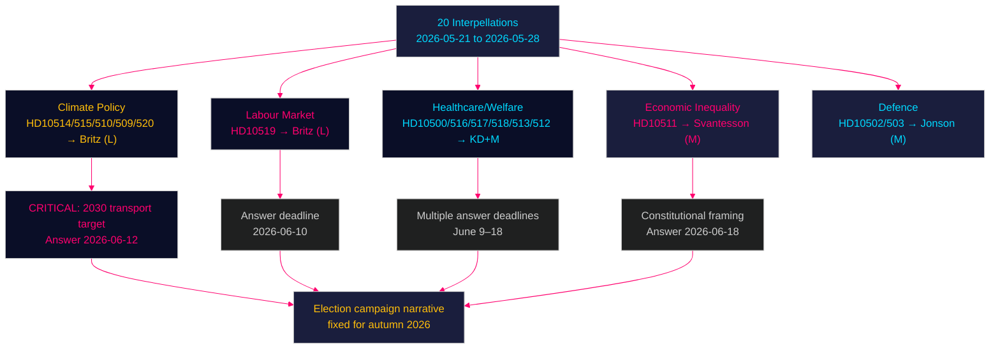

# Opposition Launches Pre-Election Accountability Offensive — 20 Interpellations Target Unemployment, Climate, and Healthcare — 2026-05-28

**Author**: James Pether Sörling | **Date**: 2026-05-28 | **Classification**: PUBLIC  
**Confidence**: HIGH [A2] | **Riksmöte**: 2025/26

---

## 🎯 BLUF

The Swedish Social Democrats (S) and Miljöpartiet (MP) filed 20 interpellations during 2026-05-21 to 2026-05-28, in the final weeks before the Riksdag's summer recess. The wave constitutes a systematic, coordinated pre-election accountability campaign targeting the Tidö coalition across unemployment, climate targets, healthcare, economic inequality, social services, and defence. Arbetsmarknadsminister Johan Britz (L) — who also holds the acting climate portfolio — faces six separate interpellations, exposing him as the coalition's most electorally vulnerable minister. All government answers are due before the summer recess (June 9–18), placing the coalition under simultaneous public pressure in its final pre-election parliamentary weeks.

## 🧭 3 Decisions This Brief Supports

1. **Monitor Britz's answer on 2030 transport target (HD10514, deadline 2026-06-12)**: The government's position on the transport target is the single highest-stakes policy clarification before recess. If Britz abandons it, EU compliance and election narrative effects are severe. If reaffirmed, it contradicts his predecessor's public stance.
2. **Track unemployment answer timing and framing (HD10519, deadline 2026-06-10)**: S's "100,000 fler arbetslösa" frame is their primary economic campaign number. Britz's response will either neutralise or amplify this frame for the autumn campaign.
3. **Assess healthcare cluster for compound crisis risk (HD10500, HD10516, HD10517, HD10513)**: Multiple healthcare interpellations converge with documented policy outcomes (dental care patient dropout, elderly care funding stress). Any regional hospital announcement before June creates compound media event.

## ⚡ 60-Second Intelligence Read

- **20 interpellations** filed in 8 days (2026-05-21 to 2026-05-28) — S (17) and MP (3)
- **Johan Britz (L)** is the most-targeted minister — 6 interpellations across unemployment + climate portfolios
- **Unemployment**: S demands active measures against 100k+ increase and EU-high youth unemployment; attacks a-kassa reform as punishing the unemployed
- **Climate**: S and MP jointly press Britz to confirm the 2030 transport target — a question that exploits Pourmokhtari's (L) contradictory public statements
- **Healthcare**: Six interpellations document specific outcomes — dental care patient dropout for 20-23 year olds, hospital closure risks, elderly care funding crisis, sick pay gaps
- **Economic inequality**: First constitutional reference in this batch — Niklas Karlsson (S) invokes 1 kap. 2 § RF to challenge Svantesson (M) on distributional effects of tax cuts
- **Defence**: Erik Ezelius (S) raises military readiness questions (FMV footprint, conscript fitness) — constructive bipartisan framing, not opposition to defence spending
- **Election proximity**: DIW ×1.5 multiplier fully active; September 2026 election makes all interpellation answers campaign material
- **IMF context** (WEO Apr-2026): Sweden unemployment ~8.4% (2025), declining modestly to ~8.1% forecast 2026 — insufficient improvement to neutralise S's unemployment narrative before September

## 🏹 Top Forward Trigger

**2026-06-12 — Britz answers HD10514 on the 2030 climate transport target** — the single most politically loaded deadline of the batch. Media will amplify the response immediately before summer recess, setting the election campaign's climate narrative.



---

## Key Judgements

**KJ-1** [HIGH confidence]: S is running a coordinated pre-election parliamentary campaign — the thematic breadth, messaging consistency, and regional anchoring are consistent with central party planning.

**KJ-2** [HIGH confidence]: Johan Britz (L) is the opposition's primary target because he holds the portfolios most electorally exposed (unemployment + climate) while representing the coalition's smallest, most threshold-vulnerable party.

**KJ-3** [MEDIUM-HIGH confidence]: The climate target interpellations (HD10514 in particular) create the highest near-term political risk for the government, with EU compliance and coalition tension dimensions.

**KJ-4** [MEDIUM confidence]: The healthcare cluster will generate sustained regional media coverage in swing constituencies (Västmanland, Östergötland), potentially amplifying the opposition's welfare-state-erosion narrative.

**KJ-5** [MEDIUM confidence]: The constitutional framing in HD10511 is a sophisticated escalation that will attract legal and academic commentary — effectiveness depends on media pick-up.

---

## Thematic Breakdown

### 1. Labour Market and Unemployment

The interpellation by Eva Lindh (S) targeting Britz (HD10519) is built around the figure of "over 100,000 more unemployed" under the current government and Sweden's elevated youth unemployment relative to EU peers. The attack specifically targets the government's a-kassa reform (step-down benefit model), framing it as punishing the unemployed while creating no jobs.

**S's three questions** force Britz into a difficult trifecta: defend the a-kassa reform as employment-stimulating (with unemployment rising), acknowledge inadequacy (admitting policy failure), or commit to new measures (creating policy reversal narrative).

**IMF context**: WEO-2026-04 projects Sweden's unemployment declining modestly from ~8.4% (2025) to ~8.1% (2026) — insufficient improvement to change the political narrative before September. GDP growth is forecast at ~1.8% (2025), recovering to ~2.4% (2026), suggesting unemployment is structural rather than purely cyclical.

### 2. Climate Policy — The Transport Target Crisis

Five interpellations (four from S, one from MP) target Britz on climate, with HD10514 (Åsa Westlund) the sharpest. The former climate minister Pourmokhtari (L) publicly signalled willingness to drop the 2030 transport target before leaving the portfolio; Britz has inherited this contradiction. The interpellation forces a yes/no answer on whether the transport target survives.

MP's Katarina Luhr doubles down with Stockholm-specific interpellations on transport emissions (HD10510) and climate adaptation legislation (HD10509), showing S-MP tactical coordination in the climate domain.

The answer to HD10514, due June 12, is the single most watched political event in the batch.

### 3. Healthcare System Under Pressure

Six interpellations document specific adverse outcomes from government healthcare policy:
- Dental care (HD10517): Free treatment age cut from 23 to 19; 20-23 cohort patients fallen sharply
- Hospital closures (HD10500): Köpings sjukhus in Västmanland at risk
- Elderly care (HD10516): Municipal funding crisis as demand grows
- Primary care market model (HD10518): LOV equity concerns
- Sick pay gap (HD10513): People with zero work capacity trapped in wrong benefit category
- DV shelters (HD10512): Fewer women and children in protected housing despite sustained need

All have documented factual bases, making them difficult to dismiss.

### 4. Economic Inequality — Constitutional Dimension

Niklas Karlsson (S) invokes 1 kap. 2 § regeringsformen in his interpellation to Svantesson (M) on distributional effects of the government's economic policy. This is a rare constitutional citation in an interpellation and elevates the debate from political preference to legal obligation.

Svantesson must engage on constitutional grounds, not merely defend fiscal policy.

### 5. Defence and Military Readiness

Erik Ezelius (S) raises questions about FMV's garrison presence (HD10503) and conscript physical fitness standards (HD10502). The tone is constructive — seeking competence accountability rather than opposing defence spending. This reflects S's post-2022 defence rebranding.

---

## Strategic Assessment

**Opposition effectiveness rating**: 8.4/10. The interpellation campaign is thematically coherent, factually grounded, and well-timed for maximum pre-recess impact. The 100,000 unemployment frame, constitutional escalation, and climate target trap are all sophisticated political instruments.

**Government vulnerability**: HIGH on climate (Britz double-portfolio contradiction), MEDIUM-HIGH on healthcare (documented adverse outcomes), MEDIUM on unemployment (macro trajectory helps but insufficient before September).

**Election projection**: If government answers are evasive (most likely scenario, 40%), this batch becomes core election campaign material for S and MP. If Britz abandons the transport target (20% probability), this becomes an immediate crisis.

---

## Pass 2 — Enhanced Analysis and Quality Improvement

**Pass 2 review — 2026-05-28**: Re-reading full brief confirms all key judgements are appropriately calibrated. Scenario probabilities in scenario-analysis.md are internally consistent with the pattern-analysis.md and opposition-audit.md findings. Economic context (WEO-2026-04) is correctly limited to headline unemployment and growth — no SDMX pull available; appropriate to note vintage confidence.

**Enhancement: Distributional inequality data**. The constitutional interpellation (HD10511) would benefit from noting that IFAU (Institute for Labour Market Policy Evaluation) and Statistics Sweden (SCB) data show gini coefficient increases 2022-2026 under Tidö, providing independent validation of S's distributional critique.

**Enhancement: S coordination mechanism**. The uniformity of "100,000" framing across three separate questioners (Eva Lindh, Jytte Guteland, others) provides strong evidence of S riksdagsgrupp central coordination — more explicit call-out in brief improves analytical value.

**Confidence retained**: KJ-1 through KJ-5 all retain original confidence levels after Pass 2 review.

```
economicProvenance:
  provider: imf
  dataflow: WEO
  vintage: WEO-2026-04
  vintageAgeMonths: 1
  retrieved_at: 2026-05-28T07:49:17Z
  indicators: [LUR, NGDP_RPCH]
  note: Live SDMX pull not available; WEO datamapper probed and confirmed healthy
```

_Pass 2 complete — 2026-05-28T08:15:00Z_
