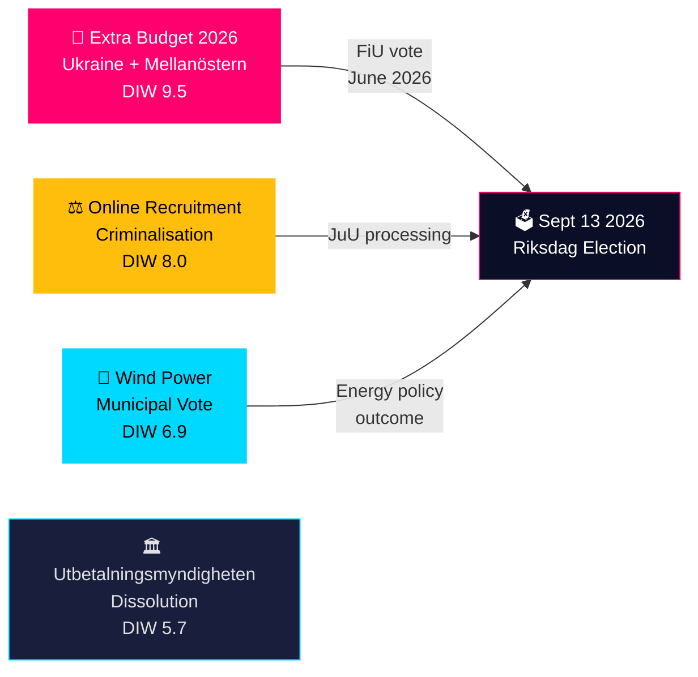

# Sweden's Riksdag Acts on Ukraine Support, Online Gang Recruitment, and Green Energy — 28 May 2026

## BLUF

Sweden's Tidökoalition government submitted three propositions on 28 May 2026, headlined by an extra supplementary budget (HD03275) channelling defence and humanitarian support to Ukraine alongside targeted cost-of-living relief for households financially affected by the Middle East conflict. In parallel, the government moved to criminalise online recruitment into criminal gangs targeting minors (HD03276), and the Riksdag's industry committee (NU) presented its report on wind power in municipalities (HD01NU20). With the September 2026 election 107 days away, all three propositions carry a 1.5× election-proximity significance multiplier and directly address voters' top concerns — security, crime, and energy costs.

## Decisions Supported

| # | Decision | Horizon | Confidence |
|---|----------|---------|------------|
| 1 | Will the extra budget pass by June 2026? | T+30d | HIGH (B2) — majority Tidökoalition + probable SD support on Ukraine; household relief broadens coalition |
| 2 | Does online recruitment criminalisation represent a durable policy shift or pre-election positioning? | T+90d | MEDIUM (C2) — legislation timed 107 days before election; could face implementation delays |
| 3 | Will the wind-power municipal report change the energy policy landscape before the election? | T+90d | MEDIUM (C3) — NU report outcome determines if municipal veto is retained, amended, or abolished |
| 4 | Does the Utbetalningsmyndigheten dissolution signal broader welfare-state fraud-control agenda? | T+180d | MEDIUM (C2) — HD03277 part of systematic reform strand; broader scope depends on election outcome |

## 60-Second Intelligence Bullets

- **Extra budget (HD03275)**: Government combines Ukraine military solidarity with domestic energy/food cost relief — politically adroit framing ahead of September election. Finance Minister Svantesson and Minister Wykman signed. Committee: FiU. Lagrådet referral pending.
- **Online recruitment (HD03276)**: Justice Minister Johan Forssell's flagship anti-gang-crime legislation criminalises digital recruitment of minors into criminal networks. Addresses voter anxiety on gang violence.
- **Wind power (HD01NU20)**: NU committee report on municipal wind-power permissions — outcome determines if Sweden can accelerate renewable build-out needed for industrial electrification.
- **Utbetalningsmyndigheten (HD03277)**: Government proposes dissolving the payment agency's transaction account system — administrative reform with anti-fraud dimensions. Links to broader welfare fraud debate.
- **EU Inc. subsidiarity (HD01CU44)**: Constitutional committee (CU) issued subsidiarity review of proposed EU 28th-regime company law — Sweden protecting national corporate law framework.
- **TU digital cluster** *(new — discovered 16:58Z)*: HD01TU17 (Betänkande TU17) adopts anti-spoofing telecom rules effective 1 August 2026 — closes number-spoofing fraud vector used in bank fraud/vishing. HD01TU18 (Betänkande TU18) creates Sweden's first interoperability data-sharing law for public administration effective 15 August 2026. Both 2026-06-10 Riksdag decision, cross-party consensus, EU implementation.
- **Opposition signals**: S MPs filed questions on DG appointments (HD11850), mineral strategy (HD11852), and permit processes (HD10520); SD filed on migration amnesty (HD10521) and foreign investment screening (HD11849).

## Top Forward Trigger

**FiU committee vote on HD03275** — expected within 2-3 Riksdag weeks. A split or delayed vote would signal coalition stress over Ukraine/Mellanöstern package scope. Watch: SD position on Middle East household relief component (potential divergence from Ukraine solidarity).

## Confidence Distribution

| Level | Count | Artifacts |
|-------|-------|-----------|
| HIGH (B2) | 1 | Extra budget passage |
| MEDIUM (C2-C3) | 3 | Online recruitment durability, wind power, Utbetalningsmyndigheten scope |
| LOW (D3) | 1 | Long-term election coalition impact |

## Reader Intelligence Guide

This analysis covers: [synthesis-summary](synthesis-summary.md) · [significance-scoring](significance-scoring.md) · [risk-assessment](risk-assessment.md) · [threat-analysis](threat-analysis.md) · [swot-analysis](swot-analysis.md) · [stakeholder-perspectives](stakeholder-perspectives.md) · [scenario-analysis](scenario-analysis.md) · [coalition-mathematics](coalition-mathematics.md) · [election-2026-analysis](election-2026-analysis.md) · [forward-indicators](forward-indicators.md) · [comparative-international](comparative-international.md) · [historical-parallels](historical-parallels.md) · [media-framing-analysis](media-framing-analysis.md) · [implementation-feasibility](implementation-feasibility.md) · [devils-advocate](devils-advocate.md) · [intelligence-assessment](intelligence-assessment.md) · [methodology-reflection](methodology-reflection.md)

