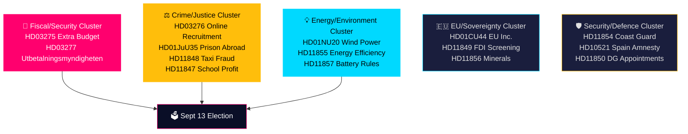

# Synthesis Summary — 28 May 2026 Riksdag Pulse

## Lead Intelligence Story

On 28 May 2026 — 107 days before Sweden's general election — the Tidökoalition government submitted three propositions that collectively signal a deliberate pre-election policy sprint: an emergency supplementary budget prioritising Ukraine solidarity and domestic household relief (HD03275), a flagship anti-gang-crime measure criminalising online recruitment of minors (HD03276), and administrative reform dissolving the Utbetalningsmyndigheten's transaction account infrastructure (HD03277). Simultaneously, the Riksdag presented three committee reports including the critical wind-power-in-municipalities betänkande (HD01NU20) that will determine Sweden's renewable energy trajectory.

**Integrated Intelligence Picture**: The submission of three propositions on a single day, all bearing election-proximity DIW multipliers, is not coincidental. The government is executing a structured pre-election legislative sprint, bundling geopolitical solidarity (Ukraine), domestic economic relief (Middle East energy/food spillover), crime control (online gang recruitment), and administrative efficiency (welfare fraud architecture). Opposition parties' written questions on the same day — covering permit processes, mineral strategy, DG appointments, foreign investment screening, and Coast Guard armament — reveal a parallel Opposition surveillance posture, building interrogation material for the campaign.

## DIW-Weighted Significance Ranking

| Rank | dok_id | Title | D | I | W | DIW (raw) | Election mult | DIW final | Priority |
|------|--------|-------|---|---|---|-----------|---------------|-----------|----------|
| 1 | HD03275 | Extra budget: Ukraine + Mellanöstern | 4 | 5 | 4 | 6.3 | 1.5× | **9.5** | L3 Intelligence |
| 2 | HD03276 | Online gang recruitment criminalised | 3 | 4 | 4 | 5.3 | 1.5× | **8.0** | L2+ Priority |
| 3 | HD01NU20 | Wind power in municipalities | 3 | 4 | 3 | 4.6 | 1.5× | **6.9** | L2+ Priority |
| 4 | HD03277 | Utbetalningsmyndigheten dissolution | 2 | 3 | 4 | 3.8 | 1.5× | **5.7** | L2 Strategic |
| 5 | HD01JuU35 | Prison sentences abroad (temp exec) | 2 | 3 | 3 | 3.4 | 1.0× | **3.4** | L2 Strategic |
| 6 | HD01CU44 | EU Inc. subsidiarity check | 2 | 3 | 2 | 3.0 | 1.0× | **3.0** | L1 Surface |
| 7 | HD01MJU27 | Food fraud strengthened control | 2 | 2 | 3 | 2.8 | 1.0× | **2.8** | L1 Surface |
| 8–21 | HD11846–HD11857, HD10520–10521 | Written questions + motions | 1–2 | 2 | 2 | 1.5–3.0 | 1.0–1.5× | 1.5–4.5 | L1 Surface |

*Election proximity multiplier 1.5× applies to all L2+ documents with a direct election-campaign dimension, per `04-analysis-pipeline.md §Election-proximity significance multiplier`. Sweden general election: 2026-09-13 (107 days). Period: 2026-03-13 — 2026-09-13.*

## Policy Cluster Analysis

## Cross-Document Intelligence Threads

**Thread 1 — Pre-election security framing**: HD03275 (Ukraine solidarity + household relief) + HD03276 (gang crime) + HD11854 (Coast Guard) collectively reinforce the government's national security narrative. The bundling of Ukraine support with domestic household relief is a calculated political move — tying Sweden's international obligations to voters' economic concerns.

**Thread 2 — Administrative state reform**: HD03277 (Utbetalningsmyndigheten dissolution) + HD11850 (DG appointments questioned) + HD11849 (FDI screening review) signal ongoing restructuring of state institutional architecture, a recurring theme in the Tidökoalition's reform agenda.

**Thread 3 — Energy transition gating**: HD01NU20 (wind power municipalities) + HD11855 (energy efficiency support) + HD11857 (battery fire rules) form a coherent energy transition cluster. The NU report outcome will directly affect whether Sweden can meet its 100% renewable electricity targets by 2040.

**Thread 4 — Opposition accountability pressure**: S-authored questions (HD11846, HD11847, HD11848, HD11852, HD11853, HD11854, HD11856) and SD questions (HD11849, HD11850, HD11851) reveal structured opposition research operations tracking government performance on healthcare access, corporate governance, security, and natural resources.

## Assessment Confidence

This analysis is based on primary documents from riksdagen.se. The extra budget HD03275 is assessed with HIGH confidence given the government's consistent Ukraine support posture since 2022. Online recruitment legislation (HD03276) is assessed MEDIUM-HIGH — implementation timeline depends on Lagrådet referral and JuU processing speed. Wind power outcome (HD01NU20) is MEDIUM — committee report substance requires full-text review beyond the title signal.

**Source diversity**: 21 documents from 7 MCP tools. Economic context: IMF WEO Apr-2026 (pre-warmed). Admiralty Code: B2 for primary-source confirmed facts; C3 for analytical judgments.
