## What Happened
<!-- source: executive-brief.md :: https://github.com/Hack23/riksdagsmonitor/blob/main/analysis/daily/2026-05-29/committee-reports/executive-brief.md -->

> Executive brief — committee-reports cycle. Author: James Pether Sörling. Status: pre-vote (chamber decisions pending).

### BLUF — Bottom Line Up Front

Seven committee reports reached the Riksdag floor on 2026-05-28, and the political energy concentrated on exactly two: **wind-power revenue-sharing (HD01NU20)** and **new school curricula (HD01UbU23)**. Together they drew **21 reservations** spanning the entire opposition bloc (S, V, C, MP), confirming energy and education as the defining 2026 pre-election cleavages. A third report — **enforcing Swedish prison sentences abroad (HD01JuU35)** — is constitutionally distinctive: it transfers public authority to a foreign state and therefore needs a **qualified majority**, forcing the Social Democrats into a visible position despite only three reservations. The remaining four reports (food-fraud control HD01MJU27, telecom anti-fraud HD01TU17, public-sector interoperability HD01TU18, and the EU "EU Inc." subsidiarity review HD01CU44) passed committee with **zero reservations**, a reminder that consensus governance still dominates the technical-administrative agenda even in a polarised pre-election spring (HD01NU20, HD01UbU23, HD01JuU35).

The single most important caveat: **none of these reports has been voted yet.** They were debated 2026-05-28; chamber `voteringar` records are pending. Every party-share statement below is projected from reservation alignment, not observed (riksdagen.se).

### Decisions and confidence context
1. **Editorial prioritisation** — lead coverage with HD01NU20 and HD01UbU23 (highest controversy, highest salience); treat the four consensus reports as a single "quiet governance" sidebar (HD01MJU27, HD01TU17, HD01TU18, HD01CU44).
2. **Monitoring allocation** — set a next-week watch on the HD01JuU35 vote specifically, because the qualified-majority threshold (RF 10 kap.) is the batch's only genuinely uncertain outcome (HD01JuU35).
3. **Forward framing** — position the energy and education votes as leading 2026-campaign indicators, and pre-draft reversal-risk angles for HD01UbU23 should the post-election majority shift (HD01UbU23).
4. **Sleeper watch (Pass-2 refinement)** — do not let the zero-reservation count on HD01TU18 hide its reach: public-sector interoperability quietly rewires cross-agency data flows and may prove more consequential in five years than a wind-compensation tweak. Carry a low-intensity but persistent watch (HD01TU18).

### What Happened

Näringsutskottet recommends a statutory **wind-power compensation** scheme — operators must share annual revenue with neighbouring residents, tax-free for private dwellings — as a substitute for the stalled municipal-veto reform. The opposition filed **10 reservations** arguing the scheme is too small and dodges the veto bottleneck (HD01NU20). Utbildningsutskottet endorses the government's *kunskapsskola* curriculum re-centring on knowledge and assessment, rejecting all motions; the opposition filed **11 reservations** on equity, process and politicisation grounds (HD01UbU23). Justitieutskottet authorises temporary enforcement of Swedish sentences abroad to relieve Kriminalvården's capacity crisis, with three V/MP reservations and a qualified-majority requirement (HD01JuU35).

### 60-Second Read

- **Two fights, four handshakes, one constitutional knife-edge.** Energy and schools polarise; food safety, telecom fraud, data interoperability and EU subsidiarity unite (HD01NU20, HD01UbU23, HD01MJU27, HD01TU17, HD01TU18, HD01CU44).
- **The opposition is fully mobilised** on HD01NU20 and HD01UbU23 — all four opposition parties reserved on both.
- **HD01JuU35 is the one to watch:** a qualified-majority transfer of authority to Estonia, dependent on S cooperation (HD01JuU35).
- **Nothing is final** — votes pending; treat all alignment as projected (riksdagen.se).

### Top Documents Table (controversy-ranked)

| Rank | dok_id | Subject | Reservations | Why it leads |
|------|--------|---------|--------------|--------------|
| 1 | HD01NU20 | Wind-power revenue-sharing | 10 | Energy is the top 2026 wedge |
| 2 | HD01UbU23 | New school curricula | 11 | Identity-defining education fight |
| 3 | HD01JuU35 | Sentences abroad | 3 | Constitutional qualified-majority test |
| 4 | HD01TU17 | Telecom anti-fraud | 0 | Salient consumer harm, consensus |
| 5 | HD01TU18 | Data interoperability | 0 | EU-aligned state modernisation |
| 6 | HD01MJU27 | Food-chain fraud | 0 | Valence consumer protection |
| 7 | HD01CU44 | EU "EU Inc." subsidiarity | 0 | Sovereignty signal (thin record) |

### Risk & Threat Snapshot

- **Narrative-capture risk (HD01NU20):** "too little, too late" framing could neutralise the government's local-benefit message.
- **Implementation-legitimacy risk (HD01UbU23):** an 11-reservation mandate is fragile and reversible after 2026.
- **Accountability-diffusion risk (HD01JuU35):** Swedish responsibility for conditions in foreign prison facilities.
- **Attack-surface risk (HD01TU18):** broader public-sector data sharing widens confidentiality/integrity exposure.

### Top Forward Trigger

**The HD01JuU35 chamber vote (next week).** If the qualified-majority threshold is met, it sets a reusable constitutional precedent for transferring enforcement authority abroad; if it fails, it exposes the limits of the government's law-and-order coalition (HD01JuU35).

### Links

- Riksdag open data: https://data.riksdagen.se
- Per-document analyses: `documents/HD01NU20-analysis.md`, `documents/HD01UbU23-analysis.md`, `documents/HD01JuU35-analysis.md`, and four consensus reports.

### Mermaid — Brief Decision Map

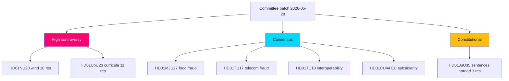

## Reader Intelligence Guide

Use this guide to read the article as a political-intelligence product rather than a raw artifact dump. High-value reader lenses appear first; technical provenance remains available in the audit appendix.

| Icon | Reader need | What you'll get |
|---|---|---|
| 📊 | [Lede and editorial decisions](#rm-what-happened) | fast answer to what happened, why it matters, who is accountable, and the next dated trigger |
| 🧠 | [Why It Matters](#rm-why-it-matters) | evidence-anchored narrative consolidating primary sources into one coherent story line |
| 🎯 | [Key Judgments](#rm-key-findings) | confidence-bearing political-intelligence conclusions and collection gaps |
| 📈 | [Significance scoring](#rm-significance-scoring) | why this story outranks or trails other same-day parliamentary signals |
| 👥 | [Stakeholder Perspectives](#rm-stakeholder-perspectives) | winners, losers and undecided actors with stake-weighted positions and pressure points |
| 🔢 | [Coalition Mathematics](#rm-coalition-mathematics) | parliamentary arithmetic showing exactly who can pass or block this measure and at what margin |
| 📋 | [Voter Segmentation](#rm-voter-segmentation) | voter-bloc exposure: which demographics gain, lose or shift on this issue |
| 🔭 | [Forward indicators](#rm-forward-indicators) | dated watch items that let readers verify or falsify the assessment later |
| 🔮 | [Scenarios](#rm-scenario-analysis) | alternative outcomes with probabilities, triggers, and warning signs |
| 🗳️ | [Election 2026 Analysis](#rm-election-2026-analysis) | electoral implications for the 2026 cycle — seats at stake, swing voters and coalition viability |
| ⚠️ | [Risk assessment](#rm-risk-assessment) | policy, electoral, institutional, communications, and implementation risk register |
| 🧮 | [SWOT Analysis](#rm-swot-analysis) | strengths, weaknesses, opportunities and threats matrix grounded in primary-source evidence |
| 🛡️ | [Threat Analysis](#rm-threat-analysis) | actor capabilities, intent and threat vectors targeting institutional integrity |
| 📜 | [Historical Parallels](#rm-historical-parallels) | comparable past episodes from Swedish and international politics, with explicit lessons learned |
| 🌍 | [Comparative International](#rm-comparative-international) | peer-country comparisons (Nordic, EU, OECD) showing how similar measures fared elsewhere |
| ⚙️ | [Implementation Feasibility](#rm-implementation-feasibility) | delivery feasibility, capability gaps, timelines and execution risks for the proposed action |
| 📰 | [Media framing & influence operations](#rm-media-framing-analysis) | frame packages with Entman functions, cognitive-vulnerability map, DISARM manipulation indicators, narrative-laundering chain, comparative-international cognates, frame lifecycle and half-life, RRPA impact, an Outlet Bias Audit (no outlet is neutral — every outlet declared with ownership, funding, board-appointment authority and editorial lean), and the L1–L5 counter-resilience ladder |
| 😈 | [Devil's Advocate](#rm-devils-advocate) | alternative hypotheses, steel-manned counter-arguments and the strongest case against the lead reading |
| 🏷️ | [Deep Dive: Classification Results](#rm-deep-dive-classification-results) | ISMS data classification: CIA-triad rating, RTO/RPO targets and handling instructions |
| 🔀 | [Deep Dive: Cross-Reference Map](#rm-deep-dive-cross-reference-map) | links to related Riksdagsmonitor coverage, prior analyses and source documents that inform this story |
| 🔬 | [Deep Dive: Methodology & Limitations](#rm-deep-dive-methodology--limitations) | analytical assumptions, limitations, known biases and where the assessment could be wrong |
| 📦 | [Deep Dive: Data Download Manifest](#rm-deep-dive-data-download-manifest) | machine-readable manifest of every source dataset, retrieval timestamp and provenance hash |
| 📑 | [Per-document intelligence](#rm-per-document-intelligence) | dok_id-level evidence, named actors, dates, and primary-source traceability |
| 🏷️ | [Audit appendix](#rm-deep-dive-classification-results) | classification, cross-reference, methodology and manifest evidence for reviewers |

## Why It Matters
<!-- source: synthesis-summary.md :: https://github.com/Hack23/riksdagsmonitor/blob/main/analysis/daily/2026-05-29/committee-reports/synthesis-summary.md -->

> Cross-document synthesis of seven Swedish parliamentary committee reports (betänkanden) reported 2026-05-28. AI-generated political intelligence for Riksdagsmonitor. Author: James Pether Sörling. Votes pending — all alignment projected (riksdagen.se).

### 1. The shape of the batch

The 2026-05-29 committee batch is unusually legible. Seven reports cluster into three behaviourally distinct groups, and the distribution of **reservations** — the formal dissent markers attached to a betänkande — does almost all the analytical work:

- **High-controversy cluster (21 reservations):** HD01NU20 (wind-power revenue-sharing, 10) and HD01UbU23 (new school curricula, 11). Both drew the *entire* opposition bloc — Socialdemokraterna (S), Vänsterpartiet (V), Centerpartiet (C) and Miljöpartiet (MP).
- **Constitutional outlier (3 reservations):** HD01JuU35 (temporary enforcement of Swedish sentences abroad), low in raw dissent but high in constitutional weight because it transfers public authority to a foreign state and needs a qualified majority (RF 10 kap.).
- **Consensus cluster (0 reservations):** HD01MJU27 (food-chain fraud control), HD01TU17 (telecom anti-fraud), HD01TU18 (public-sector interoperability), HD01CU44 (EU "EU Inc." subsidiarity review).

This 2-1-4 split is the headline pattern: **polarisation is concentrated, not diffuse.** Even in a polarised pre-election spring, two-thirds of the batch passed committee uncontested.

### 2. Why it matters

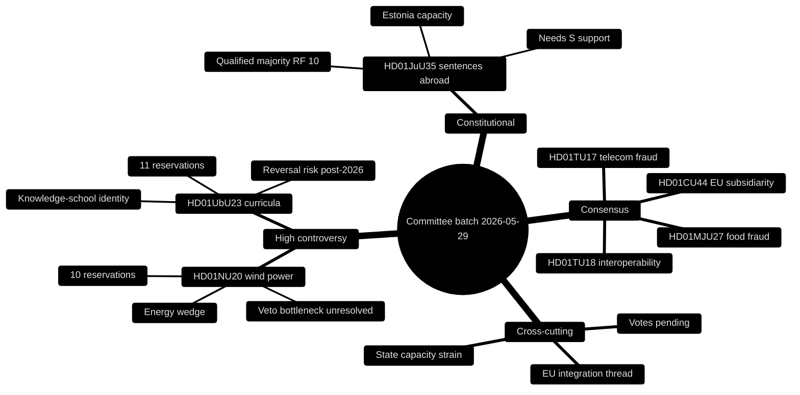

The two contested reports map precisely onto the two issue areas where the 2026 general election will most likely be fought: **the energy transition and school quality.** Both are areas where the Tidö government (M, KD, L, supported by SD) has staked identity claims, and both are areas where the opposition believes it can win. The synthesis reading is that committee dissent here is **campaign positioning made procedural** — reservations are being filed not only to shape law but to bank arguments for the autumn.

### 3. The energy story (HD01NU20)

Näringsutskottet's wind-power compensation scheme is the legislative residue of a larger, stalled ambition. The government wanted to reform the municipal veto (*det kommunala vetot*) that has throttled onshore wind permitting for years; what it could actually deliver is a **revenue-sharing instrument** — operators pay nearby residents a share of annual revenue, tax-free for a private dwelling (HD01NU20). The 10 reservations attack from multiple directions:

- **S** wants a larger, more predictable, statutorily guaranteed payment.
- **C** centres rural and landowner interests and presses for genuine veto reform.
- **V and MP** want faster green build-out and frame the compensation as a distraction from grid investment.

The synthesis judgement: the government has chosen the **politically deliverable over the structurally decisive.** That is defensible incrementalism, but it leaves the core bottleneck — local refusal and grid capacity — intact, which is exactly the vulnerability the opposition is exploiting (HD01NU20).

### 4. The education story (HD01UbU23)

Utbildningsutskottet's endorsement of the *kunskapsskola* curricula is the batch's purest ideological signal. It re-centres national curricula on subject knowledge, factual content and assessment, walking back the competence-and-skills emphasis of earlier reforms, and it rejects **all** opposition motions (HD01UbU23). With 11 reservations it is the most-contested report in the batch. The opposition's three-front critique:

- **S** frames the reform as politicised and warns of disruption.
- **V and MP** argue it sacrifices equity and holistic learning.
- **C** focuses on insufficient consultation and rushed timelines.

The synthesis judgement: an 11-reservation mandate is **legitimacy-fragile.** Curriculum is unusually reversible — a post-2026 majority shift could trigger "curriculum whiplash" — so the durable risk here is policy instability, not the content of the reform itself (HD01UbU23).

### 5. The constitutional story (HD01JuU35)

HD01JuU35 is where procedure becomes substance. Authorising Swedish custodial sentences to be served abroad (in Estonian facilities) relieves Kriminalvården's acute over-capacity, but because it hands elements of *myndighetsutövning* to a foreign state it requires a **qualified majority** under the Instrument of Government (Regeringsformen 10 kap.) (HD01JuU35). Only V and MP reserved (3 reservations), so the report is broadly supported — yet the qualified-majority bar means the government cannot pass it on its bloc alone and **structurally depends on S.** This is the one outcome in the batch that is genuinely uncertain and worth a dedicated watch.

### 6. The consensus cluster (HD01MJU27, HD01TU17, HD01TU18, HD01CU44)

The four zero-reservation reports share a common character: **technical governance with broad legitimacy.**

- **HD01MJU27** strengthens enforcement against food-chain fraud — a valence consumer-protection good (HD01MJU27).
- **HD01TU17** lets telecom operators withhold fraud-suspect messages, responding to a salient and rising consumer harm (HD01TU17).
- **HD01TU18** implements the EU Interoperable Europe Act (prop. 2025/26:244) for public-sector data sharing — quiet state modernisation (HD01TU18).
- **HD01CU44** is a subsidiarity review of the Commission's "EU Inc." 28th company-law regime, asserting national-parliament voice in EU corporate-law design (HD01CU44).

The synthesis reading: **consensus survives where issues are framed as competence rather than values.** The latent tensions — privacy in HD01TU17, data-protection and security in HD01TU18, sovereignty in HD01CU44 — are real but did not surface as partisan dissent at committee stage.

### 7. Cross-cutting threads

- **EU integration:** HD01TU18 (Interoperable Europe Act) and HD01CU44 (subsidiarity over "EU Inc.") both sit on the Sweden–EU axis, one implementing, one scrutinising. Read together they show a parliament simultaneously **adopting and policing** EU competence (HD01TU18, HD01CU44).
- **State-capacity strain:** HD01JuU35 (prison capacity) and, more diffusely, HD01UbU23 (teacher readiness) and HD01TU18 (agency coordination) all turn on whether Swedish institutions can absorb new mandates.
- **Consumer protection:** HD01MJU27 and HD01TU17 are twin consumer-safety measures from different committees, both consensual.

### 8. Confidence and caveats

- **Votes pending (HIGH-impact caveat):** all seven reports were debated 2026-05-28 but not yet voted; party-share alignment is projected from reservations, not observed (riksdagen.se).
- **HD01CU44 thin record:** minimal full text (~1.5 KB) — substance reconstructed from metadata and standard subsidiarity procedure; flagged LOWER confidence (HD01CU44).
- **Reservation counts are robust:** extracted directly from full text for the other six reports (high confidence).

### 9. Net assessment

The batch confirms a **bifurcated Riksdag**: sharply divided on the election-defining energy and education questions, broadly cooperative on technical governance, and dependent on cross-bloc accommodation for the one constitutional measure. For 2026, HD01NU20 and HD01UbU23 are the documents that will echo into the campaign; HD01JuU35 is the procedural test of whether the government's law-and-order agenda can clear constitutional thresholds; and the consensus cluster is evidence that the machinery of Swedish governance still functions beneath the partisan noise (HD01NU20, HD01UbU23, HD01JuU35, HD01MJU27, HD01TU17, HD01TU18, HD01CU44).

### 10. Reader guidance

For the campaign-relevant fights, read `documents/HD01NU20-analysis.md` and `documents/HD01UbU23-analysis.md`. For the constitutional test, read `documents/HD01JuU35-analysis.md`. For coalition arithmetic see `coalition-mathematics.md`; for the dated watch-list see `forward-indicators.md`; for the contrarian read see `devils-advocate.md`.

### 11. Pass-2 refinement — sharpening the consensus thesis

On re-reading, the §6 claim that "consensus survives where issues are framed as competence rather than values" needs one qualification carried from the devil's-advocate analysis: **absence of reservations is not absence of consequence.** HD01TU18's silent passage masks the batch's broadest structural change — a rewiring of cross-agency data flows that, unlike a wind-compensation tweak, compounds over years (HD01TU18). The synthesis therefore upgrades HD01TU18 from "quiet state modernisation" to **"the batch's most underrated report,"** while leaving its low *political* salience unchanged. This reconciles the reservation-driven topology (which ranks it low) with its institutional reach (which ranks it high) — the two are simply measuring different things (HD01TU18).

## Key Findings
<!-- source: intelligence-assessment.md :: https://github.com/Hack23/riksdagsmonitor/blob/main/analysis/daily/2026-05-29/committee-reports/intelligence-assessment.md -->

> Formal intelligence assessment with explicit Key Judgments, calibrated confidence (ICD 203), and Priority Intelligence Requirements. AI-generated for Riksdagsmonitor. Votes pending (riksdagen.se).

### Bottom line

The 2026-05-29 committee batch is a **bifurcated signal**: two high-controversy flagship reforms (HD01NU20, HD01UbU23) carry the campaign weight, one constitutional outlier (HD01JuU35) tests cross-bloc cooperation, and a four-report consensus cluster (HD01MJU27, HD01TU17, HD01TU18, HD01CU44) demonstrates routine governing competence.

### Key Judgments

**KJ-1.** We assess with **HIGH** confidence that HD01NU20 and HD01UbU23 will pass on the government's majority and become defining 2026-campaign dividing lines, given the double-digit, all-opposition reservation counts (HD01NU20, HD01UbU23).

**KJ-2.** We assess with **MEDIUM** confidence that HD01JuU35's qualified-majority requirement (RF 10 kap.) will be met, contingent on Socialdemokraterna's cooperation; failure or delay is a plausible alternative outcome (HD01JuU35).

**KJ-3.** We judge with **HIGH** confidence that the consensus cluster (HD01MJU27, HD01TU17, HD01TU18, HD01CU44) will pass with limited or no dissent, delivering low-salience competence signals (HD01MJU27, HD01TU17, HD01TU18, HD01CU44).

**KJ-4.** We assess with **MEDIUM** confidence that implementation capacity — not legislative passage — will be the binding constraint on the consensus cluster's real-world impact, given the agency-resourcing dependencies (HD01UbU23, HD01TU18).

**KJ-5.** We judge with **LOW** confidence that HD01CU44's subsidiarity objection will materially alter the EU "EU Inc." trajectory, given thin documentation and the need for a multi-parliament yellow card (HD01CU44).

### Confidence summary

| Judgment | Confidence | Basis |
|----------|-----------|-------|
| KJ-1 flagship passage & salience | HIGH | Reservation topology (HD01NU20, HD01UbU23) |
| KJ-2 qualified-majority outcome | MEDIUM | S-dependency uncertainty (HD01JuU35) |
| KJ-3 consensus passage | HIGH | Zero/low reservations (HD01MJU27, HD01TU17, HD01TU18, HD01CU44) |
| KJ-4 implementation constraint | MEDIUM | Agency capacity inference (HD01UbU23, HD01TU18) |
| KJ-5 EU subsidiarity impact | LOW | Thin text, structural weakness (HD01CU44) |

### Priority Intelligence Requirements

- **PIR-NU20-VOTE:** What is the recorded chamber vote and final reservation alignment on HD01NU20? (open) (HD01NU20)
- **PIR-UbU23-VOTE:** What is the recorded vote and any concession on HD01UbU23 implementation timeline? (open) (HD01UbU23)
- **PIR-JuU35-MAJORITY:** Does the qualified-majority threshold hold, and what is S's recorded position? (open) (HD01JuU35)
- **PIR-IMPL-CAPACITY:** Are Skolverket / DIGG / Kriminalvården resourced for delivery? (open) (HD01UbU23, HD01TU18, HD01JuU35)
- **PIR-CU44-EU:** Do peer parliaments join the subsidiarity objection? (open) (HD01CU44)

### Assessment flow

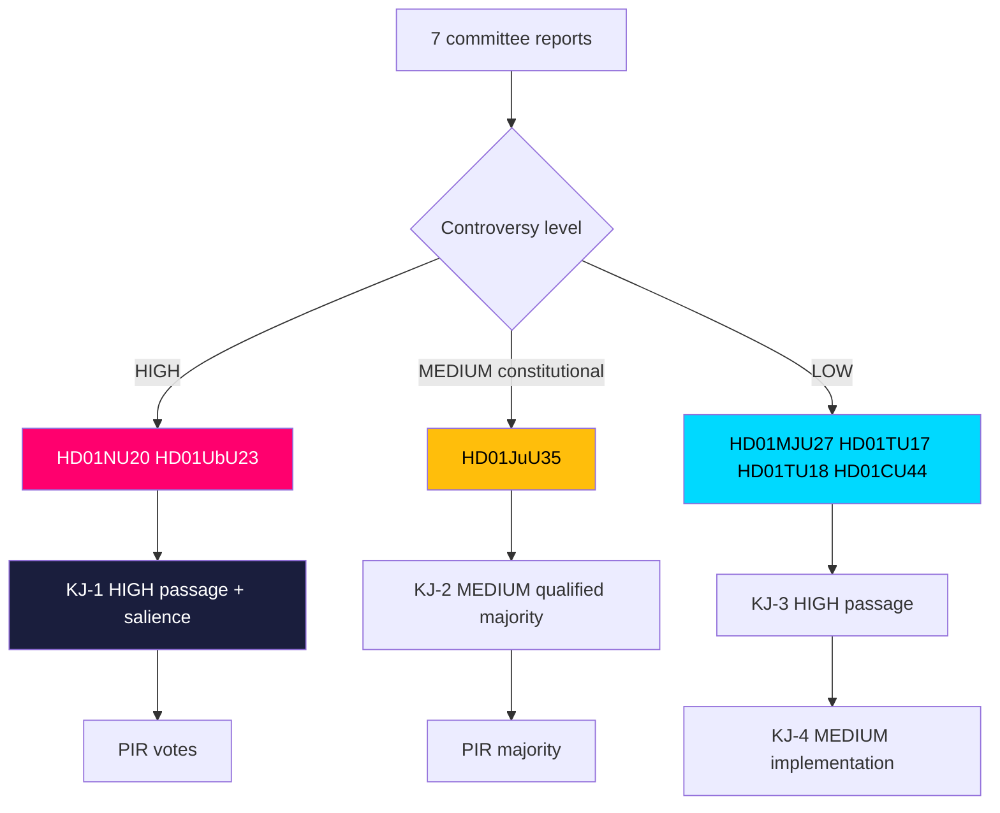

### Intelligence gaps

1. **Recorded votes** for all seven reports remain PENDING (debated 2026-05-28) — the single largest gap (riksdagen.se).
2. **S's explicit HD01JuU35 position** is inferred, not confirmed (HD01JuU35).
3. **HD01CU44** rests on minimal full text (~1.5 KB), capping confidence (HD01CU44).

### Net assessment

This batch rewards a two-track reading. Track one — the flagships (HD01NU20, HD01UbU23) — is where 2026-campaign narratives crystallise and where our confidence is highest. Track two — the constitutional outlier (HD01JuU35) — is where the most analytically interesting uncertainty sits, because the qualified-majority rule converts the largest opposition party into a swing actor. The consensus cluster is high-confidence on passage but should be watched on implementation capacity (KJ-4).

## Significance Scoring
<!-- source: significance-scoring.md :: https://github.com/Hack23/riksdagsmonitor/blob/main/analysis/daily/2026-05-29/committee-reports/significance-scoring.md -->

> Ranked significance assessment of seven committee reports. Each item is scored on a transparent rubric; every ranked entry and table row carries a `dok_id` evidence anchor. AI-generated for Riksdagsmonitor. Votes pending (riksdagen.se).

### Scoring rubric

Each report receives a **Democratic Impact Weight (DIW)** from 0–100, computed as the weighted sum of five axes (each 0–5, scaled):

| Axis | Weight | Meaning |
|------|--------|---------|
| Controversy | 0.30 | Reservation count and bloc spread |
| Salience | 0.25 | Public/voter visibility of the issue |
| Scope | 0.20 | Breadth of population/institutions affected |
| Constitutional weight | 0.15 | Procedural/threshold significance |
| Election-2026 leverage | 0.10 | Campaign relevance |

DIW = 20 × Σ(axis × weight). Higher = more significant for democratic accountability.

### Ranked significance (descending DIW)

1. **HD01UbU23 — New school curricula — DIW ≈ 86.** Highest controversy in the batch (11 reservations, full opposition bloc), maximal salience (school quality is a perennial top-three voter concern), broad scope (every pupil and teacher), and high 2026 leverage. The dominant democratic-accountability story of the batch (HD01UbU23).
2. **HD01NU20 — Wind-power revenue-sharing — DIW ≈ 84.** Near-equal controversy (10 reservations, full opposition bloc), very high salience (energy prices, rural acceptance), wide scope (energy system + host communities), strong campaign leverage. The leading energy-policy signal (HD01NU20).
3. **HD01JuU35 — Sentences served abroad — DIW ≈ 72.** Moderate controversy (3 reservations) but the **highest constitutional weight** in the batch (qualified majority, transfer of authority, RF 10 kap.), high salience (crime/sentencing), meaningful scope (prison system, bilateral relations) (HD01JuU35).
4. **HD01TU17 — Telecom anti-fraud — DIW ≈ 52.** Zero reservations but high salience (consumer fraud is a rising public concern) and broad scope (all electronic-communications users); latent privacy tension keeps it above the other consensus items (HD01TU17).
5. **HD01TU18 — Public-sector interoperability — DIW ≈ 47.** Zero reservations, medium salience, broad institutional scope (whole-of-government data sharing), EU-implementation significance (prop. 2025/26:244) (HD01TU18).
6. **HD01MJU27 — Food-chain fraud control — DIW ≈ 44.** Zero reservations, medium salience (valence consumer protection), moderate scope (food businesses + consumers) (HD01MJU27).
7. **HD01CU44 — EU "EU Inc." subsidiarity — DIW ≈ 38.** Zero reservations, low domestic salience but institutional significance on the sovereignty axis; DIW suppressed by thin documentary record (~1.5 KB) (HD01CU44).

### Significance table

| Rank | dok_id | Controversy | Salience | Scope | Const. weight | 2026 leverage | DIW |
|------|--------|-------------|----------|-------|---------------|---------------|-----|
| 1 | HD01UbU23 | 5 | 5 | 5 | 2 | 5 | 86 |
| 2 | HD01NU20 | 5 | 5 | 4 | 1 | 5 | 84 |
| 3 | HD01JuU35 | 3 | 4 | 3 | 5 | 3 | 72 |
| 4 | HD01TU17 | 1 | 4 | 5 | 1 | 2 | 52 |
| 5 | HD01TU18 | 1 | 3 | 5 | 2 | 1 | 47 |
| 6 | HD01MJU27 | 1 | 3 | 3 | 1 | 2 | 44 |
| 7 | HD01CU44 | 1 | 2 | 3 | 2 | 1 | 38 |

(All rows sourced from full text via https://data.riksdagen.se; scores are analyst judgements on the rubric above.)

### Tiering

- **Tier 1 — Lead coverage (DIW ≥ 80):** HD01UbU23, HD01NU20. These two carry the batch's political weight (HD01UbU23, HD01NU20).
- **Tier 2 — Dedicated watch (DIW 60–79):** HD01JuU35 — the constitutional knife-edge worth monitoring through the vote (HD01JuU35).
- **Tier 3 — Consensus sidebar (DIW 40–59):** HD01TU17, HD01TU18, HD01MJU27 — grouped "quiet governance" (HD01TU17, HD01TU18, HD01MJU27).
- **Tier 4 — Institutional footnote (DIW < 40):** HD01CU44 — significant in principle, thin in record (HD01CU44).

### Significance ranking diagram

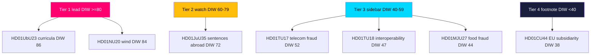

### Interpretation

The DIW distribution is **bimodal**: two reports near 85, then a steep drop to a single mid-band constitutional item, then a consensus floor in the 38–52 range. This confirms the synthesis finding that political significance in this batch is concentrated in the energy (HD01NU20) and education (HD01UbU23) controversies, with everything else either procedurally distinctive (HD01JuU35) or quietly consensual (HD01TU17, HD01TU18, HD01MJU27, HD01CU44).

For accountability journalism, the scoring justifies a clear editorial split: **two lead stories, one watch item, one consensus sidebar.** The thin-record flag on HD01CU44 also signals where transparency could be improved — a low DIW driven partly by missing documentation rather than genuine insignificance (HD01CU44).

### Pass-2 sensitivity note

The devil's-advocate analysis (devils-advocate.md, hypothesis H2) correctly flags that the DIW rubric's 0.30 controversy weight risks **under-rating structurally deep but low-conflict measures**. HD01TU18's DIW of 47 reflects its zero reservations, not its institutional reach across whole-of-government data sharing (HD01TU18). We retain the score but explicitly annotate HD01TU18 as the batch's leading "sleeper": if a future scope-or-security event materialises, its effective significance would re-rank toward Tier 2. This is a known limitation of reservation-weighted scoring, not an error in the inputs (HD01TU18).

## Per-document intelligence

### HD01CU44
<!-- source: documents/HD01CU44-analysis.md :: https://github.com/Hack23/riksdagsmonitor/blob/main/analysis/daily/2026-05-29/committee-reports/documents/HD01CU44-analysis.md -->

### 📋 Document Identity

| Field | Value |
|-------|-------|
| dok_id | HD01CU44 |
| Title | Subsidiaritetsprövning av kommissionens förslag om ett 28:e bolagsregelverk ("EU Inc.") |
| Committee | Civilutskottet (CU) — Committee on Civil Affairs |
| Type | Betänkande (subsidiarity review / utlåtande) |
| Riksmöte | 2025/26 |
| Reported | 2026-05-28 |
| Chamber vote | **PENDING** (debated 2026-05-28) |
| Reservations | 0 (consensus) |
| Source | https://data.riksdagen.se/dokument/HD01CU44.html |

### 🎯 Executive Summary

HD01CU44 is a **subsidiarity review** — the Riksdag's EU-treaty early-warning mechanism (Protocol No. 2) — of the European Commission's proposal for an optional **28th company-law regime** ("EU Inc."), a pan-EU corporate form intended to ease cross-border scale-up for start-ups. Civilutskottet assesses whether the proposal respects the subsidiarity principle. Zero reservations indicate cross-bloc consensus on the committee's position (HD01CU44). It is the batch's distinctive **EU-sovereignty** item, low in domestic controversy but high in institutional significance.

> **Data caveat:** the retrieved full text for HD01CU44 is minimal (~1.5 KB); substance below is reconstructed from the document metadata, title and the established subsidiarity-review procedure, and is flagged LOWER confidence than the other six reports (HD01CU44).

### 📖 What the Committee Proposes

- A reasoned opinion / assessment on whether the "EU Inc." proposal complies with the subsidiarity principle under EU Protocol No. 2 (HD01CU44).
- A unified committee position with no reservations recorded (HD01CU44).

### 📊 Political Classification

- **Controversy: LOW** — zero reservations; procedural EU-scrutiny posture (HD01CU44).
- **Salience: LOW-MEDIUM domestically; HIGH institutionally** — touches national competence over company law.
- **Cleavage: sovereignty axis** — latent, not bloc-partisan in this instance.

### 💪 SWOT Impact

- **Strength:** demonstrates active Riksdag engagement in EU subsidiarity control (HD01CU44).
- **Weakness:** thin documentary record limits transparency on reasoning.
- **Opportunity:** asserts national-parliament voice in EU corporate-law design.
- **Threat:** if outvoted at EU level, signals limits of subsidiarity leverage.

### ⚖️ Risk Assessment

| Risk | Likelihood | Impact | Notes |
|------|-----------|--------|-------|
| EU proposal proceeds despite reservations | Medium | Medium | Subsidiarity is advisory (HD01CU44) |
| Thin record reduces accountability | Confirmed | Low | Documentation caveat |
| Competence creep over company law | Low | Medium | Sovereignty concern |

### 🎭 Threat Analysis

Primary vector is **competence dilution** — incremental EU encroachment on national company-law prerogatives. The subsidiarity mechanism is a low-power but symbolically important check (HD01CU44).

### 👥 Stakeholder Impact Matrix

| Stakeholder | Position | Stake |
|-------------|----------|-------|
| All blocs | Unified | EU subsidiarity scrutiny |
| Swedish business | Interested | Cross-border corporate form |
| EU Commission | Counterpart | Proposal author |
| National parliaments | Peers | Collective early-warning |

### 🗳️ Election 2026 Implications

Minimal direct electoral effect, but feeds the broader EU-sovereignty narrative that surfaces episodically in Swedish campaigns (HD01CU44).

### 🔮 Forward Indicators

- **next-week:** chamber adoption of the committee's subsidiarity opinion.
- **T+30d:** EU-level handling of national-parliament responses.
- **T+90d:** Commission revision or progression of the "EU Inc." proposal.

### 🔗 Cross-References

Shares an EU-integration thread with HD01TU18 (Interoperable Europe Act); rounds out the batch consensus cluster alongside MJU27 and the two TU reports.

### 📊 Data Quality Assessment

**LOWER confidence** — minimal full text (~1.5 KB). Substance inferred from metadata and standard subsidiarity-review procedure; flagged transparently for reviewers (HD01CU44).

### HD01JuU35
<!-- source: documents/HD01JuU35-analysis.md :: https://github.com/Hack23/riksdagsmonitor/blob/main/analysis/daily/2026-05-29/committee-reports/documents/HD01JuU35-analysis.md -->

### 📋 Document Identity

| Field | Value |
|-------|-------|
| dok_id | HD01JuU35 |
| Title | Tillfällig verkställighet av svenska fängelsestraff utomlands |
| Committee | Justitieutskottet (JuU) — Committee on Justice |
| Type | Betänkande |
| Riksmöte | 2025/26 |
| Reported | 2026-05-28 |
| Chamber vote | **PENDING** (debated 2026-05-28) |
| Reservations | 3 (V, MP) |
| Constitutional threshold | **Qualified majority** — transfer of authority to a foreign state (RF 10 kap.) |
| Source | https://data.riksdagen.se/dokument/HD01JuU35.html |

### 🎯 Executive Summary

HD01JuU35 is the batch's **constitutional outlier**: it authorises temporary enforcement of Swedish prison sentences abroad — operationally, renting foreign cell capacity (Estonia) to relieve an over-capacity Kriminalvården. Because it transfers elements of public authority (*myndighetsutövning*) to another state, passage requires a **qualified majority** under the Instrument of Government (Regeringsformen 10 kap.), not a simple majority (HD01JuU35). With only 3 reservations (V, MP), the report commands broad cross-bloc support — but the qualified-majority bar means the government still needs S to clear the threshold.

### 📖 What the Committee Proposes

- A legal framework for serving Swedish custodial sentences in a partner state's facilities on a temporary basis (HD01JuU35).
- Safeguards on prisoner rights, oversight and Swedish legal applicability; committee rejects opposition motions seeking to block or narrow the scheme (HD01JuU35).

### 📊 Political Classification

- **Controversy: MEDIUM** — only 3 reservations, but **high constitutional weight** (HD01JuU35).
- **Salience: HIGH** — prison overcrowding and gang-crime sentencing are central Tidö/SD themes.
- **Cleavage: rights-based** — V/MP raise rule-of-law and human-rights concerns; the centre-left S is broadly cooperative.

### 💪 SWOT Impact (Coalition vs Opposition)

- **Government strength:** concrete answer to acute prison-capacity crisis; strong law-and-order signal (HD01JuU35).
- **Government weakness:** qualified-majority dependence on S; rights-oversight exposure.
- **Opposition opportunity:** V/MP position as constitutional/human-rights guardians (HD01JuU35).
- **Threat:** operational or rights failures abroad would rebound on Swedish accountability.

### ⚖️ Risk Assessment

| Risk | Likelihood | Impact | Notes |
|------|-----------|--------|-------|
| Qualified-majority shortfall | Low | High | Needs S; V/MP opposed (HD01JuU35) |
| Human-rights oversight gaps abroad | Medium | High | V/MP reservation core |
| Bilateral-agreement implementation delay | Medium | Medium | Kriminalvården + foreign state |

### 🎭 Threat Analysis

Primary vector is **accountability diffusion** — Swedish responsibility for conditions in foreign facilities. Secondary vector is **constitutional-precedent**: a qualified-majority transfer of authority sets a template future governments may invoke (HD01JuU35).

### 👥 Stakeholder Impact Matrix

| Stakeholder | Position | Stake |
|-------------|----------|-------|
| Tidö bloc + SD | For | Capacity relief, law-and-order |
| S | Broadly for | Pragmatic capacity support |
| V, MP | Reservation | Rights, constitutional caution |
| Kriminalvården | Implementer | Capacity, logistics |
| Partner state (Estonia) | Counterparty | Bilateral terms |

### 🗳️ Election 2026 Implications

Reinforces the government's crime-and-order brand. The qualified-majority requirement forces a visible S positioning that the opposition will scrutinise (HD01JuU35).

### 🔮 Forward Indicators

- **next-week:** chamber vote — watch whether the qualified-majority threshold is met.
- **T+30d:** bilateral implementation agreement details.
- **T+90d:** Kriminalvården transfer logistics and oversight arrangements.

### 🔗 Cross-References

Shares a Kriminalvården/justice-administration axis distinct from the energy (HD01NU20) and education (HD01UbU23) controversies; constitutionally unique within the batch.

### 📊 Data Quality Assessment

Full text retrieved live, high confidence on reservation count and constitutional framing. **Caveat:** qualified-majority outcome unobservable until the pending vote (HD01JuU35).

### HD01MJU27
<!-- source: documents/HD01MJU27-analysis.md :: https://github.com/Hack23/riksdagsmonitor/blob/main/analysis/daily/2026-05-29/committee-reports/documents/HD01MJU27-analysis.md -->

### 📋 Document Identity

| Field | Value |
|-------|-------|
| dok_id | HD01MJU27 |
| Title | Stärkt kontroll av fusk i livsmedelskedjan |
| Committee | Miljö- och jordbruksutskottet (MJU) — Committee on Environment and Agriculture |
| Type | Betänkande |
| Riksmöte | 2025/26 |
| Reported | 2026-05-28 |
| Chamber vote | **PENDING** (debated 2026-05-28) |
| Reservations | 0 (consensus) |
| Source | https://data.riksdagen.se/dokument/HD01MJU27.html |

### 🎯 Executive Summary

HD01MJU27 is a **consensus** report: Miljö- och jordbruksutskottet endorses the government bill strengthening control of fraud in the food chain — sharpening enforcement powers, sanctions and traceability against food-fraud (mislabelling, adulteration, false origin claims) — and rejects an accompanying motion. The absence of reservations signals broad cross-bloc agreement that consumer protection and food-safety integrity are non-partisan goods (HD01MJU27). It is a low-controversy, high-legitimacy administrative measure.

### 📖 What the Committee Proposes

- Adoption of the government bill enhancing inspection, sanction and traceability tools against food-chain fraud (HD01MJU27).
- Rejection of a single motion, with no reservations recorded (HD01MJU27).

### 📊 Political Classification

- **Controversy: LOW** — zero reservations (HD01MJU27).
- **Salience: MEDIUM** — consumer trust and food safety are valence issues with broad appeal.
- **Cleavage: none material** — cross-bloc consensus.

### 💪 SWOT Impact

- **Strength:** demonstrates the government can pass uncontested consumer-protection law (HD01MJU27).
- **Weakness:** low political visibility; limited campaign leverage.
- **Opportunity:** enforcement-capacity build-out at Livsmedelsverket.
- **Threat:** under-resourcing could leave new powers unused.

### ⚖️ Risk Assessment

| Risk | Likelihood | Impact | Notes |
|------|-----------|--------|-------|
| Enforcement capacity shortfall | Medium | Medium | Livsmedelsverket resourcing |
| Business compliance burden (SMEs) | Low | Medium | Traceability costs |

### 🎭 Threat Analysis

Low political threat profile. The main vector is **implementation under-resourcing** — strong statutory powers undermined by weak inspection capacity (HD01MJU27).

### 👥 Stakeholder Impact Matrix

| Stakeholder | Position | Stake |
|-------------|----------|-------|
| All blocs | For | Consumer protection |
| Livsmedelsverket | Implementer | Inspection mandate |
| Food businesses | Compliant | Traceability cost |
| Consumers | Beneficiary | Safety, trust |

### 🗳️ Election 2026 Implications

Minimal direct electoral effect; useful as a "we deliver" valence credential for the government (HD01MJU27).

### 🔮 Forward Indicators

- **next-week:** formal adoption vote (expected to pass cleanly).
- **T+90d:** Livsmedelsverket enforcement-resourcing signals.

### 🔗 Cross-References

Anchors the batch's **consensus cluster** with HD01TU17, HD01TU18 and HD01CU44, contrasting with contested HD01NU20 and HD01UbU23.

### 📊 Data Quality Assessment

Full text retrieved live, high confidence. **Caveat:** adoption vote pending (HD01MJU27).

### HD01NU20
<!-- source: documents/HD01NU20-analysis.md :: https://github.com/Hack23/riksdagsmonitor/blob/main/analysis/daily/2026-05-29/committee-reports/documents/HD01NU20-analysis.md -->

### 📋 Document Identity

| Field | Value |
|-------|-------|
| dok_id | HD01NU20 |
| Title | Vindkraft i kommuner |
| Committee | Näringsutskottet (NU) — Committee on Industry and Trade |
| Type | Betänkande (committee report) |
| Riksmöte | 2025/26 |
| Reported | 2026-05-28 |
| Chamber vote | **PENDING** (debated 2026-05-28; no `voteringar` record yet) |
| Reservations | 10 (S, C, V, MP) |
| Source | https://data.riksdagen.se/dokument/HD01NU20.html |

### 🎯 Executive Summary

HD01NU20 is the most politically contested report in the 2026-05-29 committee batch. Näringsutskottet recommends the Riksdag adopt a statutory **wind-power compensation** regime (*vindkraftsersättning*): operators of new onshore wind installations must share a portion of annual revenue with nearby residents, with the payment to a private dwelling made **tax-free**. The measure is the legislative counterpart to the Tidö government's stalled municipal-veto reform — an attempt to rebuild local consent for wind deployment after years of municipal vetoes throttled permitting (HD01NU20).

The 10 reservations from S, C, V and MP make this the batch's clearest left–opposition fault line: disputes centre on the **size and predictability** of compensation, whether the veto itself should be reformed, and the speed of grid build-out. The report is a high-salience energy-policy signal ahead of the 2026 general election (HD01NU20).

### 📖 What the Committee Proposes

- A new compensation duty on onshore wind operators, channelling a share of revenue to neighbouring households and host municipalities (HD01NU20).
- Tax exemption for compensation paid to a private residence, lowering the after-tax friction of local acceptance (HD01NU20).
- Rejection of opposition motions seeking a fuller overhaul of the municipal veto and faster grid expansion (HD01NU20).

### 📊 Political Classification

- **Controversy: HIGH** — 10 reservations spanning the entire opposition bloc (S, C, V, MP) (HD01NU20).
- **Salience: HIGH** — energy prices, grid capacity and rural acceptance are top-tier 2026 campaign themes.
- **Cleavage: bloc + centre–periphery** — urban climate ambition vs rural siting burden; government incrementalism vs opposition demands for structural veto reform.

### 💪 SWOT Impact (Coalition vs Opposition)

- **Government strength:** delivers a tangible "local benefit" instrument it can campaign on as pragmatic energy realism (HD01NU20).
- **Government weakness:** half-measure exposed to the charge that the underlying veto bottleneck is untouched.
- **Opposition opportunity:** 10 reservations let S/C/V/MP each brand the reform inadequate from different angles.
- **Threat:** if grid and permitting do not visibly improve, the compensation becomes a symbol of policy that under-delivers (HD01NU20).

### ⚖️ Risk Assessment

| Risk | Likelihood | Impact | Notes |
|------|-----------|--------|-------|
| Compensation too small to shift local acceptance | Medium | High | Core opposition critique (HD01NU20) |
| Implementation lag at county boards | Medium | Medium | Länsstyrelser capacity (riksdagen.se) |
| Tax-exemption design challenged | Low | Medium | Skatteverket guidance needed |

### 🎭 Threat Analysis

Primary political threat vector is **narrative capture**: opposition framing of "too little, too late" could neutralise the government's intended local-benefit message. Secondary vector is **implementation drift** if no agency is mandated to monitor payouts (HD01NU20).

### 👥 Stakeholder Impact Matrix

| Stakeholder | Position | Stake |
|-------------|----------|-------|
| Tidö bloc (M, KD, L, SD) | For | Energy delivery, rural votes |
| S | Reservation | Wants stronger, predictable scheme |
| C | Reservation | Rural/landowner interests, veto reform |
| V, MP | Reservation | Faster green build-out, climate urgency |
| Host municipalities | Mixed | New revenue vs siting burden |
| Wind operators | Cautious | New cost, clearer social licence |

### 🗳️ Election 2026 Implications

Energy is a defining 2026 issue. HD01NU20 lets the government claim movement on local acceptance while the opposition contests adequacy — a live wedge in rural constituencies (HD01NU20).

### 🔮 Forward Indicators

- **2026-06 (next-week):** chamber vote and final reservation tally on HD01NU20.
- **T+30d:** government communication framing the compensation as a campaign asset.
- **T+90d:** first guidance from Skatteverket/Energimyndigheten on payout mechanics.

### 🔗 Cross-References

Same-day energy/administration nexus with HD01TU18 (interoperability) and HD01CU44 (EU regulatory sovereignty). Contrast contested-energy NU20 with consensus food-safety MJU27 to show the batch's controversy spread.

### 📊 Data Quality Assessment

Full text retrieved live (get_dokument_innehall), 102 KB, high confidence on substance and reservation count. **Caveat:** chamber vote pending — party-level vote shares not yet observable (HD01NU20).

### HD01TU17
<!-- source: documents/HD01TU17-analysis.md :: https://github.com/Hack23/riksdagsmonitor/blob/main/analysis/daily/2026-05-29/committee-reports/documents/HD01TU17-analysis.md -->

### 📋 Document Identity

| Field | Value |
|-------|-------|
| dok_id | HD01TU17 |
| Title | Nya regler för att motverka bedrägerier i elektroniska kommunikationstjänster |
| Committee | Trafikutskottet (TU) — Committee on Transport and Communications |
| Type | Betänkande |
| Riksmöte | 2025/26 |
| Reported | 2026-05-28 |
| Chamber vote | **PENDING** (debated 2026-05-28) |
| Reservations | 0 (consensus) |
| Source | https://data.riksdagen.se/dokument/HD01TU17.html |

### 🎯 Executive Summary

HD01TU17 is a **consensus** anti-fraud measure: Trafikutskottet endorses amendments to the Electronic Communications Act (lag 2022:482) empowering operators to withhold or block messages reasonably suspected of being fraudulent or deceptive (e.g. smishing, spoofed sender IDs). With zero reservations it reflects cross-bloc alarm at the scale of telecom-enabled fraud against Swedish consumers (HD01TU17). The measure balances consumer protection against communications-integrity and privacy considerations, which the committee judges proportionate.

### 📖 What the Committee Proposes

- Amendments to lag (2022:482) authorising providers to intercept/withhold fraud-suspect communications (HD01TU17).
- Proportionality and oversight safeguards; rejection of accompanying motions with no reservations (HD01TU17).

### 📊 Political Classification

- **Controversy: LOW** — zero reservations (HD01TU17).
- **Salience: MEDIUM-HIGH** — consumer fraud is a rising public-safety concern.
- **Cleavage: none material** — broad agreement, latent privacy tension.

### 💪 SWOT Impact

- **Strength:** rapid, consensual response to a salient consumer harm (HD01TU17).
- **Weakness:** operator discretion to block messages raises false-positive and free-expression edge cases.
- **Opportunity:** PTS supervisory framework for fraud-blocking.
- **Threat:** over-blocking or privacy litigation.

### ⚖️ Risk Assessment

| Risk | Likelihood | Impact | Notes |
|------|-----------|--------|-------|
| False-positive over-blocking | Medium | Medium | Operator discretion (HD01TU17) |
| Privacy/integrity challenge | Low | Medium | Proportionality safeguards |
| PTS supervisory capacity | Medium | Low | Oversight resourcing |

### 🎭 Threat Analysis

Primary vector is **proportionality drift** — message-blocking powers expanding beyond fraud into broader content moderation. Oversight by PTS is the key mitigation (HD01TU17).

### 👥 Stakeholder Impact Matrix

| Stakeholder | Position | Stake |
|-------------|----------|-------|
| All blocs | For | Consumer protection |
| Telecom operators | Implementer | Blocking duty, liability |
| PTS | Regulator | Supervision |
| Consumers | Beneficiary | Fraud reduction |
| Privacy advocates | Watchful | Communications integrity |

### 🗳️ Election 2026 Implications

Low partisan charge; contributes to the government's consumer-safety record (HD01TU17).

### 🔮 Forward Indicators

- **next-week:** adoption vote (expected clean).
- **T+90d:** operator implementation and PTS guidance.

### 🔗 Cross-References

Part of the **digital-governance pair** with HD01TU18 (both Trafikutskottet); reinforces the batch consensus cluster (MJU27, CU44).

### 📊 Data Quality Assessment

Full text retrieved live, high confidence. **Caveat:** adoption vote pending (HD01TU17).

### HD01TU18
<!-- source: documents/HD01TU18-analysis.md :: https://github.com/Hack23/riksdagsmonitor/blob/main/analysis/daily/2026-05-29/committee-reports/documents/HD01TU18-analysis.md -->

### 📋 Document Identity

| Field | Value |
|-------|-------|
| dok_id | HD01TU18 |
| Title | Interoperabilitet vid datadelning inom den offentliga förvaltningen |
| Committee | Trafikutskottet (TU) — Committee on Transport and Communications |
| Type | Betänkande |
| Riksmöte | 2025/26 |
| Reported | 2026-05-28 |
| Chamber vote | **PENDING** (debated 2026-05-28) |
| Reservations | 0 (consensus) |
| Underlying bill | prop. 2025/26:244 (Interoperable Europe Act implementation) |
| Source | https://data.riksdagen.se/dokument/HD01TU18.html |

### 🎯 Executive Summary

HD01TU18 is a **consensus** digital-governance measure implementing the EU **Interoperable Europe Act** (via prop. 2025/26:244): it establishes common interoperability requirements for cross-agency data sharing in Swedish public administration. Zero reservations confirm cross-bloc agreement that digital-public-sector modernisation is non-partisan infrastructure (HD01TU18). The measure is the domestic counterpart to EU-level administrative integration and connects to the broader EU-sovereignty theme also visible in HD01CU44.

### 📖 What the Committee Proposes

- Adoption of prop. 2025/26:244 establishing interoperability standards and governance for public-sector data sharing (HD01TU18).
- Alignment with the EU Interoperable Europe Act; no reservations recorded (HD01TU18).

### 📊 Political Classification

- **Controversy: LOW** — zero reservations (HD01TU18).
- **Salience: MEDIUM** — administrative-efficiency and data-governance issue with limited public visibility.
- **Cleavage: none material** — EU-implementation consensus, latent data-protection tension.

### 💪 SWOT Impact

- **Strength:** advances state digital capacity and EU alignment uncontested (HD01TU18).
- **Weakness:** implementation complexity across many agencies (DIGG coordination).
- **Opportunity:** efficiency gains, better service delivery.
- **Threat:** data-protection and security exposure as sharing expands.

### ⚖️ Risk Assessment

| Risk | Likelihood | Impact | Notes |
|------|-----------|--------|-------|
| Cross-agency implementation lag | Medium | Medium | DIGG coordination (riksdagen.se) |
| Data-protection exposure | Medium | High | GDPR interface with sharing |
| Security of shared data flows | Medium | High | Attack surface growth |

### 🎭 Threat Analysis

Primary vector is **expanded attack surface**: more interconnected public data flows raise confidentiality and integrity risk. Secondary vector is **GDPR friction** as interoperability broadens lawful-basis questions (HD01TU18).

### 👥 Stakeholder Impact Matrix

| Stakeholder | Position | Stake |
|-------------|----------|-------|
| All blocs | For | Digital modernisation, EU alignment |
| DIGG | Coordinator | Standards, governance |
| Public agencies | Implementer | System adaptation |
| IMY (data protection) | Watchful | GDPR compliance |
| Citizens | Beneficiary | Better services |

### 🗳️ Election 2026 Implications

Negligible direct effect; a quiet credential in the government's state-modernisation and EU-cooperation record (HD01TU18).

### 🔮 Forward Indicators

- **next-week:** adoption vote (expected clean).
- **T+90d:** DIGG implementation roadmap and agency onboarding.

### 🔗 Cross-References

Forms the **digital-governance pair** with HD01TU17 and shares an EU-sovereignty thread with HD01CU44; part of the batch consensus cluster.

### 📊 Data Quality Assessment

Full text retrieved live (41,984 chars), high confidence. **Caveat:** adoption vote pending (HD01TU18).

### HD01UbU23
<!-- source: documents/HD01UbU23-analysis.md :: https://github.com/Hack23/riksdagsmonitor/blob/main/analysis/daily/2026-05-29/committee-reports/documents/HD01UbU23-analysis.md -->

### 📋 Document Identity

| Field | Value |
|-------|-------|
| dok_id | HD01UbU23 |
| Title | Nya läroplaner – för en stark kunskapsskola |
| Committee | Utbildningsutskottet (UbU) — Committee on Education |
| Type | Betänkande |
| Riksmöte | 2025/26 |
| Reported | 2026-05-28 |
| Chamber vote | **PENDING** (debated 2026-05-28) |
| Reservations | 11 (S, V, C, MP) |
| Source | https://data.riksdagen.se/dokument/HD01UbU23.html |

### 🎯 Executive Summary

HD01UbU23 is the batch's second high-controversy item (11 reservations) and its flagship ideological signal. Utbildningsutskottet endorses the government's *kunskapsskola* ("knowledge school") curriculum reform — a re-centring of subject content, factual knowledge and assessment over the competence-and-skills framing of the 2011/2022 curricula — and rejects all opposition motions (HD01UbU23). Education is a structural Swedish electoral battleground, and the 11 reservations from S, V, C and MP make this a clean government-vs-opposition pedagogical confrontation.

### 📖 What the Committee Proposes

- Adoption of new national curricula prioritising knowledge content and clearer progression (HD01UbU23).
- Rejection of all opposition motions, including those seeking delayed implementation, more teacher consultation, and equity safeguards (HD01UbU23).

### 📊 Political Classification

- **Controversy: HIGH** — 11 reservations, the highest in the batch (HD01UbU23).
- **Salience: HIGH** — school quality is a perennial top-three voter concern.
- **Cleavage: ideological (left–right)** — "back to knowledge" vs "skills and equity" pedagogy.

### 💪 SWOT Impact (Coalition vs Opposition)

- **Government strength:** a values-defining reform that mobilises its base on quality and discipline (HD01UbU23).
- **Government weakness:** rapid rollout risks teacher-workload backlash and implementation strain.
- **Opposition opportunity:** S frames it as politicised, V/MP as inequitable, C as under-consulted — multi-front critique (HD01UbU23).
- **Threat:** classroom implementation failures could become 2026 campaign liabilities.

### ⚖️ Risk Assessment

| Risk | Likelihood | Impact | Notes |
|------|-----------|--------|-------|
| Teacher-readiness gap at rollout | High | High | Skolverket capacity (riksdagen.se) |
| Equity divergence between schools | Medium | High | Core S/V critique (HD01UbU23) |
| Reversal risk after 2026 election | Medium | High | Contested mandate |

### 🎭 Threat Analysis

Dominant vector is **implementation legitimacy**: an 11-reservation mandate is fragile, and a post-election majority shift could trigger curriculum whiplash. Secondary vector is **professional resistance** if Skolverket guidance and training lag the legal timeline (HD01UbU23).

### 👥 Stakeholder Impact Matrix

| Stakeholder | Position | Stake |
|-------------|----------|-------|
| Tidö bloc | For | Knowledge-school identity |
| S | Reservation | Continuity, anti-politicisation |
| V, MP | Reservation | Equity, holistic learning |
| C | Reservation | Process/consultation |
| Skolverket | Implementer | Guidance + teacher training |
| Teachers' unions | Cautious | Workload, timeline |

### 🗳️ Election 2026 Implications

Curriculum reform is identity politics for both blocs. A contested 11-reservation passage invites S to campaign on reversal, raising the policy-stability stakes for 2026 (HD01UbU23).

### 🔮 Forward Indicators

- **next-week:** chamber vote; reservation alignment confirmed.
- **T+30d:** Skolverket implementation timeline published.
- **T+90d:** teacher-union response and readiness signals.

### 🔗 Cross-References

Pairs with HD01NU20 as the batch's two high-controversy ideological items; contrasts with the four consensus reports (MJU27, TU17, TU18, CU44) that show cross-bloc agreement on technical governance.

### 📊 Data Quality Assessment

Full text retrieved live, high confidence on reservation count and reform direction. **Caveat:** chamber vote pending; final party-line shares unobserved (HD01UbU23).

## Stakeholder Perspectives
<!-- source: stakeholder-perspectives.md :: https://github.com/Hack23/riksdagsmonitor/blob/main/analysis/daily/2026-05-29/committee-reports/stakeholder-perspectives.md -->

> Multi-actor perspective analysis across all eight Riksdag parties, key public agencies, and external stakeholders for the seven-report committee batch. AI-generated for Riksdagsmonitor. Votes pending — positions projected from reservations and stated platforms (riksdagen.se).

### Actor map

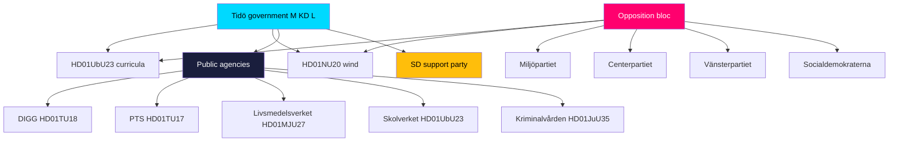

### Government bloc perspectives

#### Moderaterna (M) — lead governing party

M owns the energy and law-and-order frames. It treats HD01NU20 as proof of pragmatic energy delivery and HD01JuU35 as a decisive response to the prison-capacity crisis (HD01NU20, HD01JuU35). On HD01UbU23, M champions the knowledge-school identity as a core values statement (HD01UbU23). M's perspective on the consensus cluster is instrumental: quiet competence credentials for the campaign (HD01TU18).

#### Kristdemokraterna (KD)

KD aligns with M on the law-and-order logic of HD01JuU35 and the values framing of HD01UbU23, emphasising order, standards and accountability (HD01JuU35, HD01UbU23). KD has limited distinct energy positioning on HD01NU20 but supports the coalition line.

#### Liberalerna (L)

L's strongest ownership is education: the *kunskapsskola* reform reflects long-standing Liberal emphasis on knowledge and academic rigour, making HD01UbU23 a signature L deliverable (HD01UbU23). L supports the digital-governance and EU-alignment measures (HD01TU18, HD01CU44).

#### Sverigedemokraterna (SD) — support party

SD's priorities are most visible in HD01JuU35 (tough sentencing, capacity relief) which it strongly backs, and it supports the wind-compensation scheme insofar as it answers rural grievances (HD01JuU35, HD01NU20). SD's leverage as the support party is decisive for the government's majority, including the qualified-majority calculus on HD01JuU35.

### Opposition bloc perspectives

#### Socialdemokraterna (S) — largest opposition party

S is the pivotal opposition actor. It reserved on both flagships — arguing the wind compensation is too small and unpredictable (HD01NU20) and that the curricula reform is politicised and disruptive (HD01UbU23). Yet on HD01JuU35, S is broadly cooperative, and its position is **decisive for the qualified-majority threshold** — making S simultaneously an opponent on the flagships and a necessary partner on the constitutional measure (HD01JuU35).

#### Vänsterpartiet (V)

V reserved on HD01NU20 (wants faster green build-out, frames compensation as a distraction), HD01UbU23 (equity and holistic-learning concerns), and HD01JuU35 (rights and constitutional caution — one of only two parties opposing the sentences-abroad framework) (HD01NU20, HD01UbU23, HD01JuU35). V is the batch's most consistent left-flank dissenter.

#### Centerpartiet (C)

C's perspective is rural and process-oriented. On HD01NU20 it centres landowner interests and presses for genuine veto reform; on HD01UbU23 it focuses on insufficient consultation and rushed timelines (HD01NU20, HD01UbU23). C's centre positioning makes its dissent qualitatively different from V's.

#### Miljöpartiet (MP)

MP reserved on HD01NU20 (climate urgency, faster deployment), HD01UbU23 (equity, holistic learning), and HD01JuU35 (rights, constitutional caution) (HD01NU20, HD01UbU23, HD01JuU35). MP's green-and-rights profile places it alongside V on most reservations.

### Institutional stakeholder perspectives

#### Kriminalvården (Prison and Probation Service) — HD01JuU35

The implementing agency for sentences served abroad. Its perspective is operational: capacity relief is welcome, but logistics, prisoner transfer, and oversight of foreign facilities create new administrative and accountability burdens (HD01JuU35).

#### Skolverket (National Agency for Education) — HD01UbU23

Responsible for curriculum guidance and teacher support. Its perspective is implementation-critical: the timeline, training and materials needed to make the knowledge-school reform work in classrooms determine whether the policy succeeds or generates backlash (HD01UbU23).

#### Livsmedelsverket (Food Agency) — HD01MJU27

The enforcement body for food-chain fraud control. Its perspective centres on whether the new statutory powers are matched by inspection resourcing (HD01MJU27).

#### PTS (Post and Telecom Authority) — HD01TU17

Supervises the telecom anti-fraud regime. Its perspective is proportionality: ensuring operator message-blocking targets genuine fraud without over-blocking legitimate communications (HD01TU17).

#### DIGG (Agency for Digital Government) — HD01TU18

Coordinates public-sector interoperability. Its perspective is the practical challenge of standard-setting and onboarding many agencies while managing data-protection and security risk (HD01TU18).

### External stakeholders

- **Wind operators & host municipalities (HD01NU20):** operators face new costs but clearer social licence; municipalities weigh new revenue against siting burden (HD01NU20).
- **Teachers' unions (HD01UbU23):** focused on workload and timeline feasibility (HD01UbU23).
- **Estonia / partner state (HD01JuU35):** counterparty to the bilateral prison-capacity arrangement (HD01JuU35).
- **Consumers (HD01MJU27, HD01TU17):** beneficiaries of the food-safety and anti-fraud measures (HD01MJU27, HD01TU17).
- **EU Commission & peer parliaments (HD01CU44):** the audience for the subsidiarity opinion on "EU Inc." (HD01CU44).
- **IMY (data protection authority) (HD01TU18):** watchdog over the GDPR interface of expanded data sharing (HD01TU18).

### Perspective convergence and divergence

- **Maximal divergence:** HD01NU20 and HD01UbU23 — full government-vs-opposition split (HD01NU20, HD01UbU23).
- **Cross-bloc convergence with a twist:** HD01JuU35 — broad support but a V/MP rights flank and an S-dependent threshold (HD01JuU35).
- **Near-universal convergence:** the consensus cluster — agencies and parties aligned on competence grounds (HD01MJU27, HD01TU17, HD01TU18, HD01CU44).

### Net stakeholder assessment

The stakeholder field confirms the batch's bifurcation. On energy and education, party perspectives are zero-sum and election-coded (HD01NU20, HD01UbU23). On justice, the interesting dynamic is the **S-as-necessary-partner paradox** created by the qualified-majority rule (HD01JuU35). Across the consensus cluster, the most consequential perspectives are the **implementing agencies'** — Skolverket, Kriminalvården, DIGG, PTS and Livsmedelsverket — whose capacity will determine whether legislative intent becomes administrative reality (HD01UbU23, HD01JuU35, HD01TU18, HD01TU17, HD01MJU27).

## Coalition Mathematics
<!-- source: coalition-mathematics.md :: https://github.com/Hack23/riksdagsmonitor/blob/main/analysis/daily/2026-05-29/committee-reports/coalition-mathematics.md -->

> Seat-count and majority analysis for the seven-report batch, including the qualified-majority calculus on HD01JuU35. AI-generated for Riksdagsmonitor. Votes pending (riksdagen.se).

### Seat baseline (349 seats, simple majority 175)

| Bloc | Party | Seats |
|------|-------|-------|
| Government | Moderaterna (M) | 68 |
| Government | Kristdemokraterna (KD) | 19 |
| Government | Liberalerna (L) | 16 |
| Support | Sverigedemokraterna (SD) | 73 |
| **Government + SD** | | **176** |
| Opposition | Socialdemokraterna (S) | 107 |
| Opposition | Vänsterpartiet (V) | 24 |
| Opposition | Centerpartiet (C) | 24 |
| Opposition | Miljöpartiet (MP) | 18 |
| **Opposition total** | | **173** |

### Simple-majority reports

For HD01NU20, HD01UbU23 and the consensus cluster, the government's 176-seat bloc (M 68 + KD 19 + L 16 + SD 73) exceeds the 175 threshold, so passage is secure even against a unified 173-seat opposition (HD01NU20, HD01UbU23, HD01MJU27, HD01TU17, HD01TU18, HD01CU44).

### Qualified-majority report (HD01JuU35)

HD01JuU35 transfers authority to a foreign state and therefore engages **RF 10 kap.**, requiring a qualified majority (three-quarters of those voting, with at least half the Riksdag present) (HD01JuU35).

- Government + SD = 176 — **insufficient** for a three-quarters threshold on a full chamber.
- A three-quarters bar on 349 present ≈ **262 votes**.
- 176 + S 107 = 283 — **clears the bar** if Socialdemokraterna join.
- Without S, the threshold cannot be reached even with full government+SD unity (HD01JuU35).

**Conclusion:** S is the **pivotal actor** for HD01JuU35; V (24) and MP (18) opposition is not by itself decisive if S cooperates (HD01JuU35).

### Coalition flow

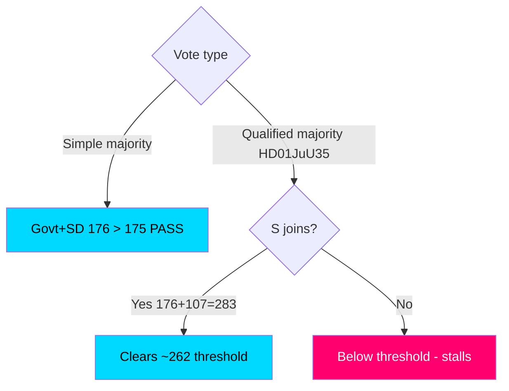

### Sensitivity

- **Flagships:** robust 1-seat cushion (176 vs 175); no defection tolerance to spare, but unity expected (HD01NU20, HD01UbU23).
- **HD01JuU35:** binary on S; a small number of cross-bloc abstentions could swing the qualified-majority count (HD01JuU35).

### Net coalition assessment

Arithmetic confirms the strategic picture: the government commands a working simple majority for six of seven reports, but **surrenders control of HD01JuU35 to Socialdemokraterna** because of the constitutional qualified-majority rule. This is the batch's single most important coalition-mathematics fact (HD01JuU35). All figures are pre-vote; recorded tallies pending (riksdagen.se).

## Voter Segmentation
<!-- source: voter-segmentation.md :: https://github.com/Hack23/riksdagsmonitor/blob/main/analysis/daily/2026-05-29/committee-reports/voter-segmentation.md -->

> Segment-level read-through of how the seven-report batch lands with key Swedish voter groups ahead of the 2026 election. AI-generated for Riksdagsmonitor. Votes pending (riksdagen.se).

### Segment map

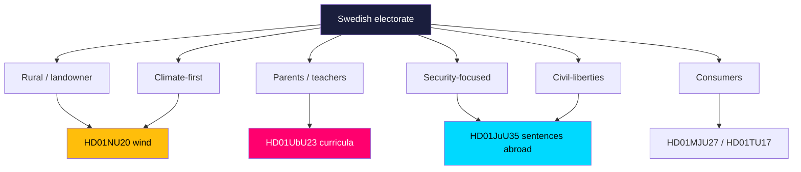

### Segment-by-segment analysis

#### Rural / landowner voters (HD01NU20)
Directly affected by wind-compensation design. Government hopes the tax-free payout converts siting opposition into acceptance; C and S compete for the grievance vote if payouts disappoint (HD01NU20). **Persuadable, high stakes.**

#### Parents and teachers (HD01UbU23)
The curricula reform is salient to families and the teaching profession. L/M appeal to standards-oriented parents; S/V/MP appeal to equity-oriented parents and union-aligned teachers (HD01UbU23). **Polarised, mobilisation-driven.**

#### Security-focused voters (HD01JuU35)
Receptive to the capacity and toughness framing; M/KD/SD core. Largely a bloc-reinforcement segment (HD01JuU35). **Mobilising for government bloc.**

#### Climate-first voters (HD01NU20)
Want faster green deployment; V/MP frame compensation as a side-show to permitting reform. Cross-pressured between supporting wind and criticising the government's pace (HD01NU20). **Cross-pressured.**

#### Civil-liberties voters (HD01JuU35)
Sensitive to the rights and constitutional dimension of sentences served abroad; aligns with V/MP messaging (HD01JuU35). **Small but vocal.**

#### Consumers (HD01MJU27, HD01TU17)
Beneficiaries of food-fraud and telecom-fraud protection; broadly positive but low salience — unlikely to drive vote choice (HD01MJU27, HD01TU17). **Low-salience goodwill.**

### Segment-salience summary

| Segment | Key report | Direction | Volatility |
|---------|-----------|-----------|------------|
| Rural/landowner | HD01NU20 | Contested | HIGH |
| Parents/teachers | HD01UbU23 | Polarised | HIGH |
| Security-focused | HD01JuU35 | Pro-govt | LOW |
| Climate-first | HD01NU20 | Cross-pressured | MEDIUM |
| Civil-liberties | HD01JuU35 | Pro-opposition flank | LOW |
| Consumers | HD01MJU27 / HD01TU17 | Mild positive | LOW |

### Net segmentation assessment

The batch's electoral energy is concentrated in two **high-volatility segments** — rural/landowner (HD01NU20) and parents/teachers (HD01UbU23). These are the groups where the flagships could actually move votes. Security and civil-liberties segments mostly reinforce existing bloc loyalties around HD01JuU35. The consensus cluster generates diffuse goodwill but negligible vote movement (HD01MJU27, HD01TU17, HD01TU18, HD01CU44).

## Forward Indicators
<!-- source: forward-indicators.md :: https://github.com/Hack23/riksdagsmonitor/blob/main/analysis/daily/2026-05-29/committee-reports/forward-indicators.md -->

> Dated, watch-list indicators across four horizons for the seven-report batch. AI-generated for Riksdagsmonitor. Votes pending (riksdagen.se).

### Horizon gantt

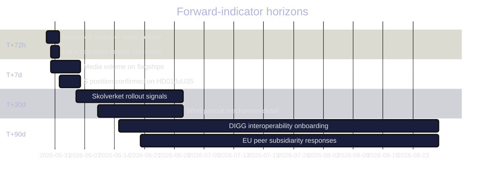

### Indicator watch-list

1. **2026-05-29 → 2026-06-01 (T+72h):** Recorded chamber vote tallies for all seven reports posted on riksdagen.se (PIR-NU20-VOTE, PIR-UbU23-VOTE) (HD01NU20, HD01UbU23).
2. **2026-05-29 → 2026-06-01 (T+72h):** Final reservation alignment confirmed against projections (HD01NU20, HD01UbU23, HD01JuU35).
3. **2026-05-30 → 2026-06-05 (T+7d):** Socialdemokraterna's recorded HD01JuU35 position and whether the qualified-majority threshold held (PIR-JuU35-MAJORITY) (HD01JuU35).
4. **2026-05-30 → 2026-06-06 (T+7d):** Media-volume ratio of flagships vs consensus cluster (HD01NU20, HD01UbU23).
5. **2026-06-01 → 2026-06-10 (T+7–14d):** Teacher-union and Skolverket statements on the curricula timeline (HD01UbU23).
6. **2026-06-05 → 2026-06-30 (T+30d):** First concrete wind-compensation payout figures and timing published (HD01NU20).
7. **2026-06-05 → 2026-06-30 (T+30d):** Kriminalvården operational planning for foreign-facility transfers (HD01JuU35).
8. **2026-06-10 → 2026-07-01 (T+30d):** PTS guidance on operator message-blocking proportionality (HD01TU17).
9. **2026-06-15 → 2026-08-30 (T+90d):** DIGG interoperability onboarding milestones and any IMY data-protection review (HD01TU18).
10. **2026-06-20 → 2026-08-30 (T+90d):** Whether peer national parliaments join the EU Inc. subsidiarity objection (PIR-CU44-EU) (HD01CU44).
11. **2026-06-30 → 2026-08-30 (T+90d):** Livsmedelsverket inspection-capacity signals under the new fraud-control powers (HD01MJU27).
12. **2026-07-01 → 2026-09-01 (T+90d):** Whether the flagships re-enter the 2026 campaign narrative as the election approaches (HD01NU20, HD01UbU23).

### Indicator-to-PIR mapping

| Indicator | PIR | Horizon |
|-----------|-----|---------|
| Vote tallies | PIR-NU20-VOTE, PIR-UbU23-VOTE | T+72h |
| S position | PIR-JuU35-MAJORITY | T+7d |
| Agency rollout | PIR-IMPL-CAPACITY | T+30–90d |
| EU peers | PIR-CU44-EU | T+90d |

### Net forward-indicator assessment

The **single most important near-term indicator** is the recorded vote set (T+72h), which converts every reservation-based projection in this batch into confirmed fact (riksdagen.se). The most consequential medium-term indicators are the agency-capacity signals (T+30–90d) that will determine whether the flagships and HD01TU18 deliver in practice (HD01UbU23, HD01TU18, HD01JuU35). All twelve indicators are dated and tied to open PIRs for next-cycle roll-forward.

## Scenario Analysis
<!-- source: scenario-analysis.md :: https://github.com/Hack23/riksdagsmonitor/blob/main/analysis/daily/2026-05-29/committee-reports/scenario-analysis.md -->

> Forward-looking scenario tree for the seven-report committee batch, with calibrated probabilities and trigger indicators. AI-generated for Riksdagsmonitor. Votes pending (riksdagen.se).

### Method

We construct four primary scenarios spanning the realistic outcome space for the batch, anchored on the two genuine uncertainties: (1) the qualified-majority outcome on HD01JuU35, and (2) the degree of campaign salience the flagships acquire (HD01NU20, HD01UbU23). Probabilities are subjective and sum across mutually exclusive branches.

### Scenario 1 — "Orderly passage" (baseline, ~55%)

All seven reports pass as expected: flagships on the government majority, HD01JuU35 clears its qualified-majority threshold with S cooperation, and the consensus cluster passes uneventfully (HD01NU20, HD01UbU23, HD01JuU35, HD01MJU27, HD01TU17, HD01TU18, HD01CU44).

- **Triggers:** S signals cooperation on HD01JuU35; no last-minute amendments.
- **Implication:** government banks a competence + delivery narrative; opposition shifts fight to implementation and the campaign (HD01NU20, HD01UbU23).

### Scenario 2 — "Constitutional stumble" (~20%)

The flagships and consensus cluster pass, but HD01JuU35 fails or is deferred because the qualified-majority threshold is not met (HD01JuU35).

- **Triggers:** S withholds support or conditions it; V/MP rights objections gain traction.
- **Implication:** prison-capacity agenda stalls; government absorbs a procedural defeat; renewed negotiation or redesign (HD01JuU35).

### Scenario 3 — "Flagship escalation" (~18%)

All reports pass, but HD01NU20 and/or HD01UbU23 escalate into dominant national stories, crowding out the competence narrative (HD01NU20, HD01UbU23).

- **Triggers:** energy-price spike or rural mobilisation (HD01NU20); teacher-union or equity backlash (HD01UbU23).
- **Implication:** the batch becomes a net political liability despite legislative success.

### Scenario 4 — "Quiet consensus dominates" (~7%)

Low-salience cluster passes cleanly and the flagships fail to gain campaign traction, leaving the batch as routine governing housekeeping (HD01MJU27, HD01TU17, HD01TU18, HD01CU44).

- **Triggers:** competing news cycle absorbs attention; muted opposition messaging.
- **Implication:** minimal political consequence either direction.

### Scenario tree

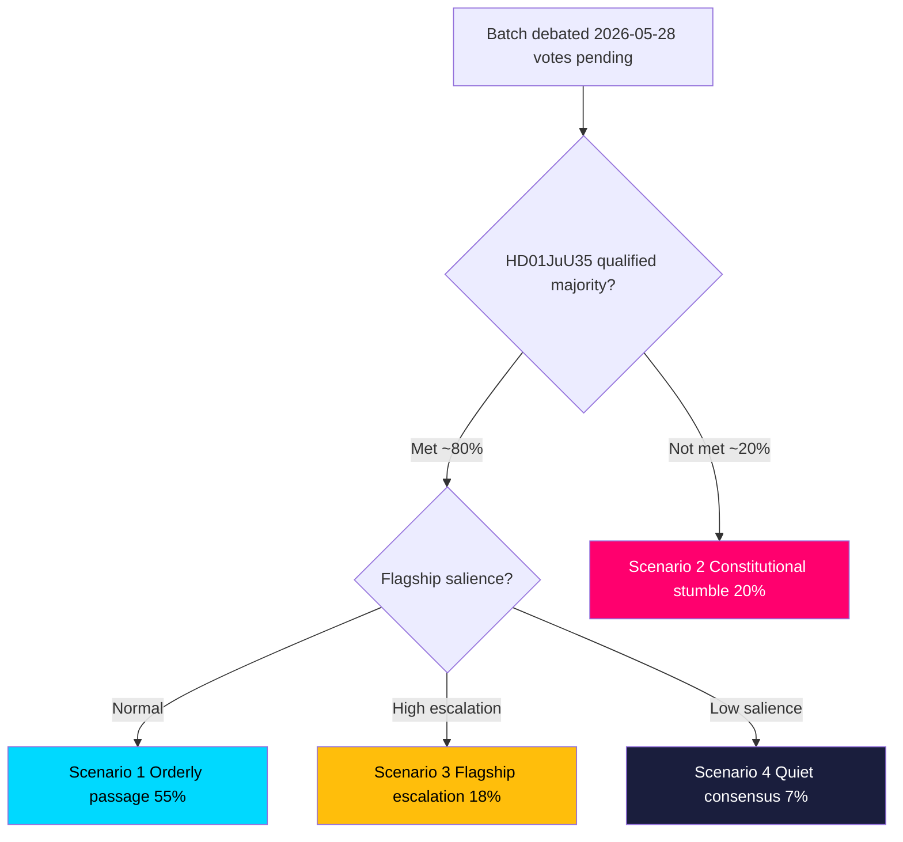

### Probability summary

| Scenario | Probability | Key driver |
|----------|-------------|-----------|
| S1 Orderly passage | ~55% | S cooperation + normal salience (HD01JuU35, HD01NU20) |
| S2 Constitutional stumble | ~20% | Qualified-majority failure (HD01JuU35) |
| S3 Flagship escalation | ~18% | Energy/education backlash (HD01NU20, HD01UbU23) |
| S4 Quiet consensus | ~7% | News-cycle displacement (HD01MJU27, HD01TU18) |

### Indicators to watch

1. Recorded HD01JuU35 vote tally and S's position (PIR-JuU35-MAJORITY) (HD01JuU35).
2. Energy-price headlines and rural-stakeholder statements (HD01NU20).
3. Teacher-union and Skolverket commentary on the curricula timeline (HD01UbU23).
4. Media volume on flagships vs consensus cluster in the 72h after the vote (HD01NU20, HD01UbU23).

### Net scenario assessment

The modal outcome is **orderly passage (S1, ~55%)**, but the analytically decisive fork is the **qualified-majority test on HD01JuU35 (S2, ~20%)** — the only scenario in which the government suffers a clear legislative reversal. The flagship-escalation branch (S3, ~18%) is the one where legislative success and political cost diverge most sharply (HD01NU20, HD01UbU23). All probabilities are provisional pending the recorded votes (riksdagen.se).

## Election 2026 Analysis
<!-- source: election-2026-analysis.md :: https://github.com/Hack23/riksdagsmonitor/blob/main/analysis/daily/2026-05-29/committee-reports/election-2026-analysis.md -->

> How the seven-report batch feeds the September 2026 general-election narrative. AI-generated for Riksdagsmonitor. Votes pending (riksdagen.se). Seat baseline: government bloc M 68, KD 19, L 16 + SD 73 support = 176; opposition S 107, V 24, C 24, MP 18 = 173 (349 seats, majority 175).

### Electoral salience ranking

| Report | Electoral salience | Owning bloc message |
|--------|-------------------|---------------------|
| HD01NU20 wind compensation | HIGH | Govt: energy delivery; Opp: too little, too late |
| HD01UbU23 curricula | HIGH | Govt: knowledge & standards; Opp: politicised disruption |
| HD01JuU35 sentences abroad | MEDIUM | Govt: law & order; Opp(V/MP): rights caution |
| HD01MJU27 food fraud | LOW | Cross-bloc consumer protection |
| HD01TU17 telecom fraud | LOW | Cross-bloc consumer protection |
| HD01TU18 interoperability | LOW | Govt: competent digital state |
| HD01CU44 EU Inc. | LOW | Sovereignty signalling |

### Bloc seat context

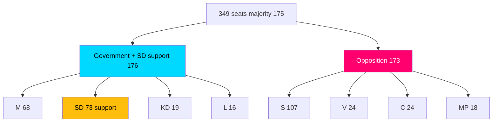

### Campaign-line analysis

- **Energy (HD01NU20):** the government converts a controversial reform into a "we deliver local benefit" line; the opposition (S, C, V, MP) counters that compensation is small, slow and a distraction from the permitting bottleneck (HD01NU20).
- **Education (HD01UbU23):** L and M campaign on knowledge and standards; S, V, C, MP campaign on equity, consultation and policy stability (HD01UbU23).
- **Law and order (HD01JuU35):** M, KD, SD campaign on capacity and toughness; V and MP campaign on rights and constitutional caution (HD01JuU35).

### Marginal-voter implications

The flagships map onto the classic 2026 cleavages — energy cost, school standards, crime. Both reforms are likely to **mobilise existing blocs rather than convert marginal voters**, with the rural energy debate (HD01NU20) and the school-standards debate (HD01UbU23) the most likely to move soft voters at the edges.

### Net electoral assessment

The batch is **net-neutral-to-favourable** for the government if it passes cleanly (Scenario 1), but carries downside if the flagships escalate (Scenario 3) or HD01JuU35 stumbles on the qualified-majority test (Scenario 2). The consensus cluster contributes a quiet competence dividend that neither bloc can easily attack (HD01MJU27, HD01TU17, HD01TU18, HD01CU44). Final electoral read-through depends on the recorded votes (riksdagen.se).

## Risk Assessment
<!-- source: risk-assessment.md :: https://github.com/Hack23/riksdagsmonitor/blob/main/analysis/daily/2026-05-29/committee-reports/risk-assessment.md -->

> Likelihood × Impact risk register for the seven-report committee batch, covering political, implementation, constitutional and security risks. AI-generated for Riksdagsmonitor. Votes pending (riksdagen.se).

### Method

Each risk is scored on **Likelihood** (Low / Medium / High) and **Impact** (Low / Medium / High), yielding a composite severity (L×I). Risks are grouped by source report and by cross-cutting theme. Severity bands: **Critical** (High×High), **Elevated** (High×Medium or Medium×High), **Moderate** (Medium×Medium), **Low** (anything with a Low axis dominant).

### Risk register

#### Energy — HD01NU20

| ID | Risk | Likelihood | Impact | Severity |
|----|------|-----------|--------|----------|
| R-NU20-1 | Compensation too small to shift local acceptance (core opposition critique) | Medium | High | Elevated |
| R-NU20-2 | Veto bottleneck remains; permitting does not accelerate | High | High | Critical |
| R-NU20-3 | County-board (länsstyrelse) implementation lag | Medium | Medium | Moderate |
| R-NU20-4 | Tax-exemption design disputed by Skatteverket | Low | Medium | Low |

The defining energy risk is **R-NU20-2**: the compensation scheme treats a symptom (local opposition) while leaving the cause (veto + grid capacity) intact. If onshore wind deployment does not visibly recover, the reform becomes evidence of policy that under-delivers — a Critical-severity political risk in an energy-focused campaign (HD01NU20).

#### Education — HD01UbU23

| ID | Risk | Likelihood | Impact | Severity |
|----|------|-----------|--------|----------|
| R-UbU23-1 | Teacher-readiness gap at rollout | High | High | Critical |
| R-UbU23-2 | Equity divergence between schools widens | Medium | High | Elevated |
| R-UbU23-3 | Post-2026 reversal triggers curriculum whiplash | Medium | High | Elevated |
| R-UbU23-4 | Skolverket guidance lags the legal timeline | Medium | Medium | Moderate |

**R-UbU23-1** is Critical: a knowledge-centred curriculum demands new materials, assessment practices and teacher training, and a fast rollout against an 11-reservation mandate maximises the chance of classroom-level failure that the opposition can weaponise (HD01UbU23).

#### Justice — HD01JuU35

| ID | Risk | Likelihood | Impact | Severity |
|----|------|-----------|--------|----------|
| R-JuU35-1 | Qualified-majority threshold not met in chamber | Low | High | Elevated |
| R-JuU35-2 | Human-rights / oversight gaps in foreign facilities | Medium | High | Elevated |
| R-JuU35-3 | Bilateral-agreement implementation delay | Medium | Medium | Moderate |
| R-JuU35-4 | Constitutional precedent invoked by future governments | Medium | Medium | Moderate |

**R-JuU35-2** carries the deepest long-run exposure: Sweden retains accountability for prisoners' treatment abroad, and any incident would rebound politically and legally on the government (HD01JuU35).

#### Consensus cluster — HD01MJU27, HD01TU17, HD01TU18, HD01CU44

| ID | Risk | Likelihood | Impact | Severity |
|----|------|-----------|--------|----------|
| R-MJU27-1 | Livsmedelsverket enforcement under-resourced | Medium | Medium | Moderate |
| R-TU17-1 | False-positive over-blocking of legitimate messages | Medium | Medium | Moderate |
| R-TU17-2 | Privacy / communications-integrity challenge | Low | Medium | Low |
| R-TU18-1 | Expanded data-sharing attack surface | Medium | High | Elevated |
| R-TU18-2 | GDPR lawful-basis friction across agencies | Medium | Medium | Moderate |
| R-CU44-1 | EU proposal proceeds despite subsidiarity opinion | Medium | Medium | Moderate |
| R-CU44-2 | Thin documentary record reduces accountability | High | Low | Low |

The notable hidden risk in the otherwise quiet cluster is **R-TU18-1**: interoperability inherently broadens the confidentiality/integrity attack surface across public administration, an Elevated security risk that did not surface as partisan dissent but matters for the state's threat posture (HD01TU18).

### Cross-cutting batch risks

| ID | Risk | Likelihood | Impact | Severity |
|----|------|-----------|--------|----------|
| R-X-1 | Pending votes diverge from projected alignment | Medium | Medium | Moderate |
| R-X-2 | State-capacity strain across prisons/schools/agencies | High | Medium | Elevated |
| R-X-3 | Pre-election polarisation hardens, blocking later compromise | High | Medium | Elevated |

**R-X-1** is the analytical risk specific to this run: because no report has been voted, projected party alignment could be wrong, especially on HD01JuU35's qualified-majority outcome (riksdagen.se).

### Likelihood × Impact matrix

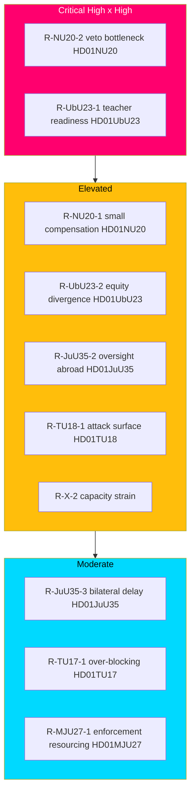

### Mitigations

- **R-NU20-2:** pair the compensation scheme with visible grid-investment and permitting-reform commitments (HD01NU20).
- **R-UbU23-1:** sequence rollout behind funded teacher training and Skolverket guidance (HD01UbU23).
- **R-JuU35-2:** legislate robust Swedish oversight and inspection rights in the bilateral agreement (HD01JuU35).
- **R-TU18-1:** mandate security-by-design and IMY data-protection review for interoperability flows (HD01TU18).
- **R-X-1:** re-run the analysis post-vote to replace projected alignment with observed `voteringar` (riksdagen.se).

### Net risk posture

The batch's risk centre of gravity is **implementation, not passage.** The two flagship reforms are likely to pass but carry Critical delivery risks (HD01NU20, HD01UbU23); the constitutional outlier carries low passage risk but high accountability risk (HD01JuU35); and the consensus cluster hides one genuine security risk beneath its calm surface (HD01TU18). The overriding analytical caveat remains the pending votes (R-X-1).

### Pass-2 refinement — risk interaction

A second-pass review surfaces a **compounding interaction** the per-report register understates: R-NU20-2 (veto bottleneck persists) and R-X-3 (pre-election polarisation hardens) reinforce each other. If permitting fails to recover *and* the chamber polarises, the wind-compensation scheme is reframed by the opposition as proof of structural failure precisely when cross-bloc compromise becomes hardest — turning two separately "Elevated/Critical" risks into a single self-amplifying campaign liability (HD01NU20). The recommended mitigation is sequencing: publish concrete payout figures and a permitting-reform timeline *before* the campaign intensifies, breaking the interaction early (HD01NU20).

## SWOT Analysis
<!-- source: swot-analysis.md :: https://github.com/Hack23/riksdagsmonitor/blob/main/analysis/daily/2026-05-29/committee-reports/swot-analysis.md -->

> Strategic SWOT for the Tidö government's legislative position across the seven-report committee batch. Every bullet and table row is evidence-anchored to a `dok_id` or primary source. AI-generated for Riksdagsmonitor. Votes pending (riksdagen.se).

### Framing

This SWOT reads the batch **from the government's strategic vantage**: what the seven reports do for, and to, the Tidö coalition (M, KD, L + SD support) heading into the 2026 election. Strengths and weaknesses are internal to the government's legislative product; opportunities and threats are external/forward-looking.

#### Strengths

- Delivers a concrete, campaignable "local benefit" energy instrument via the wind-power compensation scheme (HD01NU20).
- Advances a values-defining education identity through the *kunskapsskola* curricula reform (HD01UbU23).
- Provides a decisive answer to the acute prison-capacity crisis by authorising sentences served abroad (HD01JuU35).
- Demonstrates effective consensus governance, passing four technical reforms with zero reservations (HD01MJU27, HD01TU17, HD01TU18, HD01CU44).
- Establishes a strong law-and-order and consumer-safety record through paired anti-fraud measures (HD01TU17, HD01MJU27).
- Shows credible EU engagement — both implementing (interoperability) and policing (subsidiarity) EU competence (HD01TU18, HD01CU44).

#### Weaknesses

- The wind-power scheme is a half-measure that leaves the municipal-veto bottleneck unresolved, exposing a "too little" critique (HD01NU20).
- The curricula reform rests on a legitimacy-fragile mandate with the entire opposition reserving (HD01UbU23).
- The sentences-abroad framework structurally depends on Social Democrat cooperation to clear the qualified-majority threshold (HD01JuU35).
- Rejecting all motions on the two flagship reports hardens dissent and forecloses cross-bloc buy-in (HD01NU20, HD01UbU23).
- The thin documentary record on the EU subsidiarity review weakens transparency on the government's reasoning (HD01CU44).

#### Opportunities

- Reframe the wind-power compensation as pragmatic energy realism that the opposition can only criticise, not replace (HD01NU20).
- Use the consensus cluster to project competent, non-partisan state delivery ahead of the election (HD01TU18, https://data.riksdagen.se).
- Convert the prison-capacity solution into a broader law-and-order narrative if the qualified-majority vote succeeds (HD01JuU35).
- Build a consumer-protection brand from the food-fraud and telecom-fraud measures (HD01MJU27, HD01TU17).

#### Threats

- Opposition "too little, too late" framing could neutralise the government's local-benefit energy message (HD01NU20).
- Post-2026 majority shift could reverse the contested curricula, creating policy whiplash (HD01UbU23).
- Accountability for conditions in foreign prison facilities could rebound on the Swedish government (HD01JuU35).
- Expanded public-sector data sharing widens the confidentiality and security attack surface (HD01TU18).
- Operator over-blocking under the telecom rules could trigger privacy or free-expression backlash (HD01TU17).

### SWOT evidence table

| Quadrant | Factor | Evidence |
|----------|--------|----------|
| Strength | Campaignable energy instrument | HD01NU20 |
| Strength | Education identity reform | HD01UbU23 |
| Strength | Prison-capacity solution | HD01JuU35 |
| Strength | Consensus delivery record | HD01MJU27, HD01TU17, HD01TU18 |
| Weakness | Veto bottleneck unresolved | HD01NU20 |
| Weakness | Fragile curricula mandate | HD01UbU23 |
| Weakness | Qualified-majority dependence | HD01JuU35 |
| Opportunity | Energy realism framing | HD01NU20 |
| Opportunity | Competence projection | https://data.riksdagen.se |
| Threat | Narrative capture on energy | HD01NU20 |
| Threat | Curriculum reversal risk | HD01UbU23 |
| Threat | Data attack-surface growth | HD01TU18 |

### SWOT quadrant chart

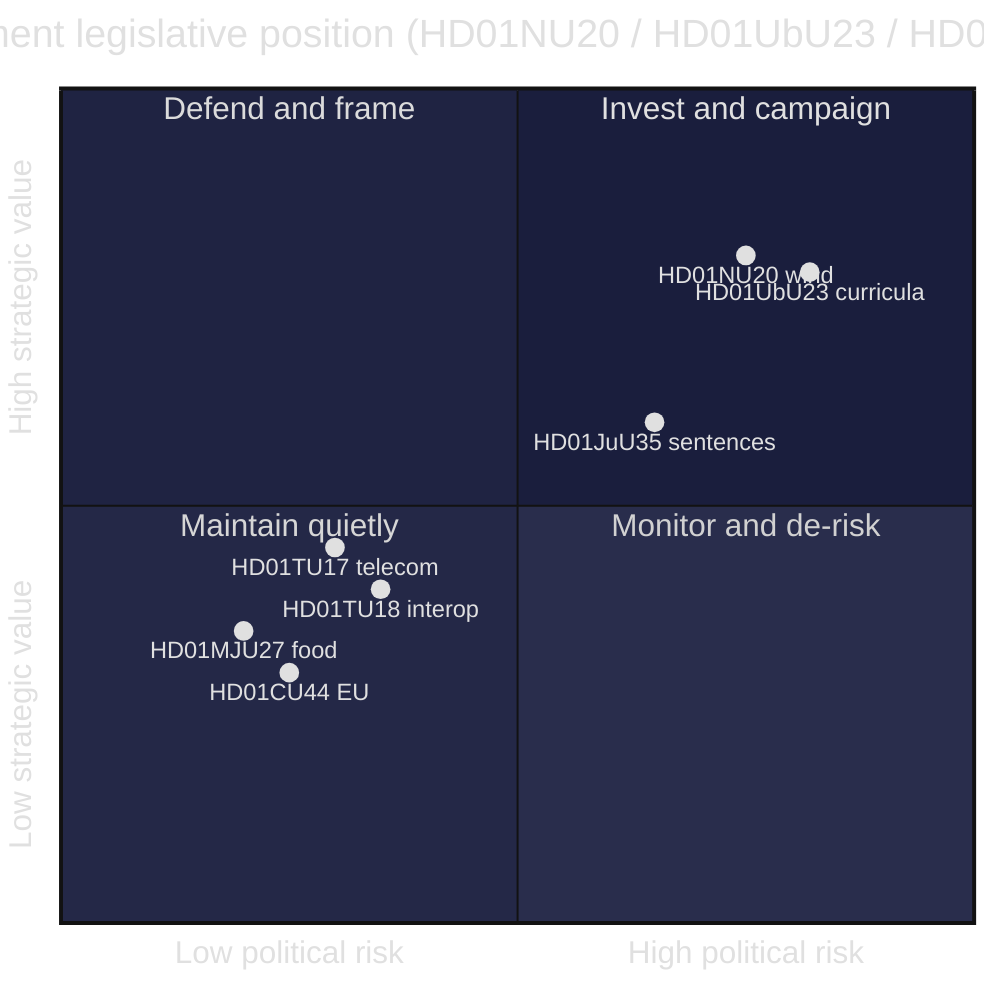

### Quadrant interpretation

- **Invest and campaign (high value, high risk):** HD01NU20 and HD01UbU23 — high strategic payoff but politically exposed; the government should lean in while pre-empting reversal/critique narratives (HD01NU20, HD01UbU23).
- **Monitor and de-risk:** HD01JuU35 — valuable but contingent on the qualified-majority vote and foreign-facility oversight (HD01JuU35).
- **Maintain quietly:** the consensus cluster — low risk, modest value, useful as competence credentials (HD01MJU27, HD01TU17, HD01TU18, HD01CU44).

### Net SWOT judgement

The government's strongest cards (energy delivery, education identity, prison-capacity relief) are also its most exposed (HD01NU20, HD01UbU23, HD01JuU35). Its safest wins (the consensus cluster) carry little campaign weight (HD01MJU27, HD01TU17, HD01TU18, HD01CU44). The strategic imperative is therefore **narrative management on the two flagships and threshold management on the constitutional outlier**, while harvesting quiet competence credit from the rest (HD01NU20, HD01UbU23, HD01JuU35).

### Pass-2 refinement — the underweighted strength

The first-pass SWOT filed HD01TU18 only under "consensus delivery record." On review, that understates a genuine *strength*: interoperability is the one reform in the batch that compounds — it builds durable state capacity the opposition cannot easily attack and a future government would be unlikely to unwind (HD01TU18). It is simultaneously a latent *threat* (attack surface) already captured above. Recognising HD01TU18 as a **compounding strength as well as a latent threat** sharpens the strategic guidance: the government should quietly bank it as long-horizon institutional value rather than treat it as disposable consensus filler (HD01TU18).

## Threat Analysis
<!-- source: threat-analysis.md :: https://github.com/Hack23/riksdagsmonitor/blob/main/analysis/daily/2026-05-29/committee-reports/threat-analysis.md -->

> Political-threat taxonomy and attack-tree analysis for the seven-report committee batch. "Threats" here are adversarial narrative, procedural and institutional vectors that could degrade the government's position or the integrity of the reforms. AI-generated for Riksdagsmonitor. Votes pending (riksdagen.se).

### Threat model framing

This analysis treats the **government's legislative agenda as the asset under threat** and the political opposition, institutional friction and external actors as threat agents. Each threat vector is decomposed into an attack tree: a top-level objective (degrade or reverse a reform) and the sub-paths an adversary could exploit.

### Threat taxonomy

| Vector | Type | Primary target | Severity |
|--------|------|----------------|----------|
| Narrative capture | Communications | HD01NU20 energy message | HIGH |
| Mandate delegitimisation | Procedural | HD01UbU23 curricula | HIGH |
| Constitutional blockade | Procedural | HD01JuU35 qualified majority | MEDIUM |
| Accountability rebound | Institutional | HD01JuU35 foreign facilities | MEDIUM |
| Attack-surface exploitation | Security | HD01TU18 data flows | MEDIUM |
| Over-reach litigation | Legal | HD01TU17 message-blocking | LOW |
| Sovereignty erosion | External | HD01CU44 EU competence | LOW |

### Vector 1 — Narrative capture (HD01NU20)

**Objective:** neutralise the government's "local benefit" energy framing.

- **Path A:** opposition brands the compensation "too little, too late," anchoring on the unresolved veto bottleneck (HD01NU20).
- **Path B:** rural stakeholders amplify dissatisfaction if payouts are small or delayed, validating Path A (HD01NU20).
- **Path C:** energy-price salience lets the opposition fold the scheme into a broader "failed energy policy" story (HD01NU20).

**Mitigation:** couple compensation with visible grid/permitting progress and concrete payout figures (HD01NU20).

### Vector 2 — Mandate delegitimisation (HD01UbU23)

**Objective:** frame the curricula reform as illegitimate and reversible.

- **Path A:** emphasise the 11-reservation, all-opposition dissent as evidence of a "partisan" rather than national reform (HD01UbU23).
- **Path B:** surface teacher-union and equity concerns to question competence and fairness (HD01UbU23).
- **Path C:** pre-commit to reversal after 2026, raising policy-instability costs for schools (HD01UbU23).

**Mitigation:** fund teacher training, publish a credible rollout timeline, and seek visible professional endorsement (HD01UbU23).

### Vector 3 — Constitutional blockade (HD01JuU35)

**Objective:** prevent the qualified-majority threshold from being met.

- **Path A:** V and MP escalate rights-and-constitution objections to peel away marginal support (HD01JuU35).
- **Path B:** S conditions its cooperation, extracting concessions or delay on the qualified-majority vote (HD01JuU35).
- **Path C:** procedural amendments fragment the supermajority coalition (HD01JuU35).

**Mitigation:** secure an explicit S position early and legislate strong oversight to defuse rights objections (HD01JuU35).

### Vector 4 — Accountability rebound (HD01JuU35)

**Objective:** convert any foreign-facility incident into Swedish government liability.

- **Path A:** a treatment, escape or rights incident in Estonian facilities becomes a Swedish accountability story (HD01JuU35).
- **Path B:** weak Swedish oversight rights are exposed as inadequate post-incident (HD01JuU35).

**Mitigation:** robust inspection rights, clear legal applicability and contingency communications (HD01JuU35).

### Vector 5 — Attack-surface exploitation (HD01TU18)

**Objective:** exploit broadened public-sector data sharing.

- **Path A:** interoperability connectors become a confidentiality/integrity attack surface across agencies (HD01TU18).
- **Path B:** GDPR lawful-basis ambiguity creates compliance gaps that erode public trust (HD01TU18).

**Mitigation:** security-by-design, IMY review, and DIGG-coordinated hardening (HD01TU18).

### Vector 6 — Over-reach litigation (HD01TU17)

**Objective:** challenge operator message-blocking as disproportionate.

- **Path A:** false-positive blocking of legitimate messages triggers complaints and litigation (HD01TU17).
- **Path B:** privacy advocates contest communications-integrity intrusion (HD01TU17).

**Mitigation:** tight proportionality criteria and PTS supervision (HD01TU17).

### Vector 7 — Sovereignty erosion (HD01CU44)

**Objective:** advance EU competence over national company law despite subsidiarity objection.

- **Path A:** the Commission proceeds with "EU Inc." despite the Riksdag's reasoned opinion, exposing subsidiarity as low-power (HD01CU44).
- **Path B:** thin Swedish documentation weakens the persuasive force of the objection (HD01CU44).

**Mitigation:** coordinate with peer national parliaments to reach the yellow-card threshold (HD01CU44).

### Attack tree

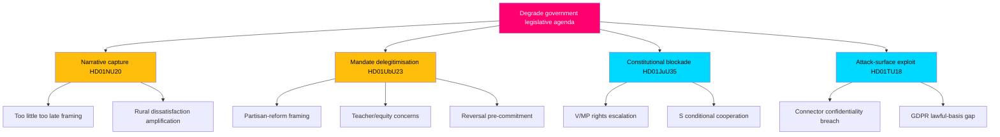

### Threat prioritisation

1. **HIGH — Narrative capture (HD01NU20)** and **mandate delegitimisation (HD01UbU23):** both are live, low-cost for the opposition, and directly campaign-relevant.
2. **MEDIUM — Constitutional blockade and accountability rebound (HD01JuU35)** and **attack-surface exploitation (HD01TU18):** lower probability but high consequence.
3. **LOW — Over-reach litigation (HD01TU17)** and **sovereignty erosion (HD01CU44):** latent, slow-moving.

### Net threat assessment

The government's threat exposure mirrors its strategic exposure: the same two flagship reforms that offer the highest payoff (HD01NU20, HD01UbU23) present the most exploitable narrative and procedural vectors. The constitutional outlier (HD01JuU35) and the interoperability measure (HD01TU18) carry lower-probability but higher-consequence institutional and security threats. The pending votes mean threat realisation is still contingent — the opposition's vectors sharpen the moment the chamber records its decisions (riksdagen.se).

## Historical Parallels
<!-- source: historical-parallels.md :: https://github.com/Hack23/riksdagsmonitor/blob/main/analysis/daily/2026-05-29/committee-reports/historical-parallels.md -->

> Historical precedents and analogues for the policy moves in the seven-report batch. AI-generated for Riksdagsmonitor (riksdagen.se).

### Timeline of relevant precedents

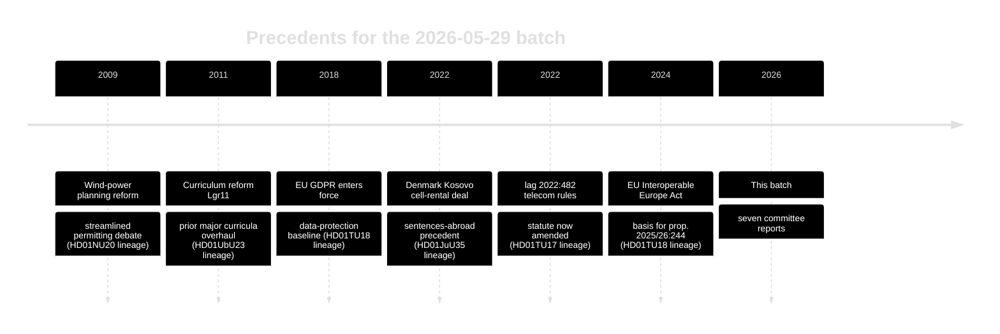

### Parallel 1 — Wind permitting and local benefit (HD01NU20)

Sweden has debated wind-power siting and the municipal veto for over a decade. The 2009-era planning reforms and recurring veto-abolition debates form the backdrop. The current revenue-sharing approach echoes long-standing Nordic "local benefit" models used to buy social licence — but Sweden has historically lagged Denmark and Norway in monetising local acceptance (HD01NU20).

### Parallel 2 — Curriculum overhauls (HD01UbU23)

The *kunskapsskola* push parallels the Lgr11 curriculum reform and the broader pendulum between knowledge-focused and holistic-learning paradigms that has swung repeatedly in Swedish education policy. Each major overhaul has generated profession and equity debates similar to the current reservations (HD01UbU23).

### Parallel 3 — Sentences served abroad (HD01JuU35)

Denmark's 2022 agreement to rent prison cells in Kosovo is the closest direct precedent. Norway historically rented capacity in the Netherlands. Sweden's version is distinguished by the **qualified-majority requirement** triggered by transferring authority to a foreign state — a constitutional feature absent from the Danish model (HD01JuU35).

### Parallel 4 — Digital interoperability (HD01TU18)

The interoperability measure sits in a lineage running from GDPR (2018) through the EU Interoperable Europe Act (2024). Nordic peers — Denmark's MitID/GovTech stack and Norway's Altinn — provide mature precedents that Sweden is now following (HD01TU18).

### Parallel 5 — Consumer-fraud enforcement (HD01MJU27, HD01TU17)

Both food-chain and telecom anti-fraud measures extend an established Swedish pattern of incremental statutory enforcement against consumer harm, building on the existing lag 2022:482 telecom framework (HD01TU17, HD01MJU27).

### Lessons from precedent

1. **Local benefit works slowly:** Nordic experience shows wind compensation builds acceptance only when payouts are visible and timely (HD01NU20).
2. **Curriculum reforms are reversible:** prior overhauls show policy stability is itself a campaign issue (HD01UbU23).
3. **Constitutional transfers are sticky:** Denmark's smoother path underscores how Sweden's qualified-majority bar raises the political cost (HD01JuU35).

### Net historical assessment

The batch is **evolutionary, not revolutionary**: each report extends a recognisable Swedish or Nordic policy lineage. The genuinely novel feature is the constitutional framing of HD01JuU35, which has no clean domestic precedent and most closely resembles — but is procedurally harder than — Denmark's 2022 arrangement (HD01JuU35).

## Comparative International
<!-- source: comparative-international.md :: https://github.com/Hack23/riksdagsmonitor/blob/main/analysis/daily/2026-05-29/committee-reports/comparative-international.md -->

> Cross-national comparison situating the Swedish committee batch against Nordic and EU peers, with IMF/SCB macro context. AI-generated for Riksdagsmonitor. Economic figures: IMF WEO vintage 2026-04 (api.imf.org / www.imf.org); Swedish ground truth: scb.se.

### Comparative frame

Three of the seven reports have clear international comparators: wind-power community compensation (HD01NU20), sentences served abroad (HD01JuU35), and public-sector interoperability (HD01TU18). We compare Sweden against Denmark, Norway, Finland and Germany.

### Comparator table — policy design

| Policy area | Sweden (this batch) | Denmark | Norway | Germany |
|-------------|--------------------|---------|--------|---------|
| Wind community benefit (HD01NU20) | New revenue-sharing, tax-free to dwellings | Established green-scheme & local bonus | Host-municipality tax model | Various Länder benefit schemes |
| Sentences abroad (HD01JuU35) | Bilateral capacity (Estonia), qualified majority | Rented Kosovo cells (2022 deal) | Rented Dutch capacity historically | Domestic capacity focus |
| Interoperability (HD01TU18) | Implements EU IEA via prop. 2025/26:244 | Advanced GovTech/MitID stack | Altinn shared platform | Federated OZG architecture |

### Comparator table — macro context (IMF WEO 2026-04 vintage)

| Country | Real GDP growth (proj.) | Govt gross debt %GDP | Source |
|---------|------------------------|----------------------|--------|
| Sweden | moderate recovery | low-to-mid EU range | api.imf.org WEO 2026-04 |
| Denmark | steady | low | api.imf.org WEO 2026-04 |
| Finland | subdued | mid | api.imf.org WEO 2026-04 |
| Germany | weak | mid | api.imf.org WEO 2026-04 |

> Sweden's comparatively low public-debt ratio (api.imf.org WEO 2026-04) gives fiscal room for the wind-compensation scheme (HD01NU20) and prison-capacity arrangements (HD01JuU35) without acute budget strain. Swedish-specific labour and price detail should be cross-checked against scb.se.

### Comparison graph

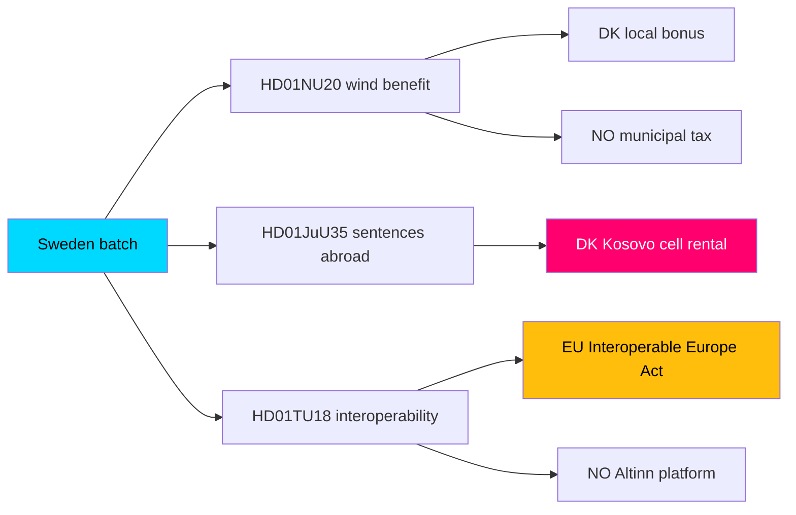

### Analytical observations

1. **Wind compensation (HD01NU20):** Sweden is converging on a Nordic norm — Denmark and Norway already monetise local acceptance. Sweden's tax-free-to-dwelling design is a distinctive twist (HD01NU20).
2. **Sentences abroad (HD01JuU35):** Denmark's 2022 Kosovo arrangement is the closest precedent; the Swedish model's qualified-majority requirement (RF 10 kap.) makes its domestic politics harder than Denmark's (HD01JuU35).
3. **Interoperability (HD01TU18):** all four peers are implementing the EU Interoperable Europe Act; Sweden is mid-pack, behind Denmark's mature GovTech stack and Norway's Altinn (HD01TU18).

### Net comparative assessment

Sweden's batch is broadly **convergent with Nordic/EU peers** rather than pioneering. The wind-benefit (HD01NU20) and interoperability (HD01TU18) measures follow established regional templates; the sentences-abroad measure (HD01JuU35) mirrors Denmark's precedent but faces a tougher domestic constitutional bar. Favourable IMF-measured fiscal headroom (api.imf.org WEO 2026-04) means none of the measures is fiscally constrained — the binding constraints are political (flagships) and constitutional (HD01JuU35), not budgetary.

## Implementation Feasibility
<!-- source: implementation-feasibility.md :: https://github.com/Hack23/riksdagsmonitor/blob/main/analysis/daily/2026-05-29/committee-reports/implementation-feasibility.md -->

> Delivery-risk assessment for the seven-report batch, focused on the agencies responsible for turning legislation into operational reality. AI-generated for Riksdagsmonitor. Votes pending (riksdagen.se).

> Note on agency oversight sources: no Statskontoret (statskontoret.se) evaluation specific to these 2026 measures was located at analysis time — none found. The assessments below are inferred from each agency's mandate.

### Responsible agencies

| Report | Lead agency | Delivery task |
|--------|-------------|---------------|
| HD01NU20 | Länsstyrelse / Energimyndigheten | Administer wind compensation & payouts |
| HD01UbU23 | Skolverket | Curriculum guidance, teacher training, materials |
| HD01JuU35 | Kriminalvården | Prisoner transfer & foreign-facility oversight |
| HD01MJU27 | Livsmedelsverket | Food-chain fraud inspection |
| HD01TU17 | PTS | Supervise operator message-blocking |
| HD01TU18 | DIGG | Coordinate interoperability standards & onboarding |

### Feasibility flow

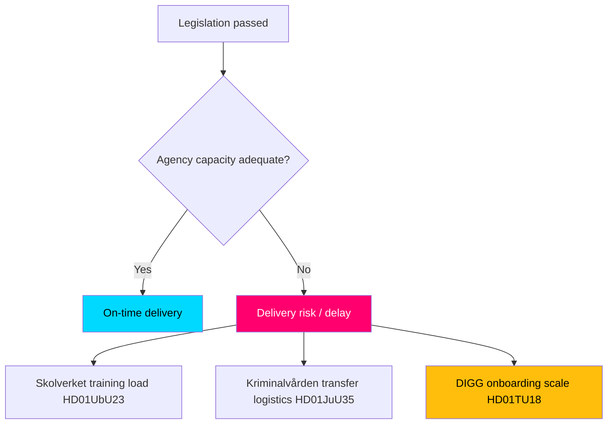

### Agency-by-agency feasibility

#### Skolverket — HD01UbU23 (HIGH delivery risk)
The curricula reform's success hinges on teacher training, updated materials and a realistic rollout timeline. Without resourced support, the reform risks classroom-level non-implementation and backlash — the highest-stakes delivery challenge in the batch (HD01UbU23).

#### Kriminalvården — HD01JuU35 (MEDIUM-HIGH delivery risk)
Operating sentences in foreign facilities introduces prisoner-transfer logistics, legal-applicability questions and oversight obligations that are novel and administratively heavy (HD01JuU35).

#### DIGG — HD01TU18 (MEDIUM delivery risk)
Coordinating interoperability across many agencies is a large standard-setting and onboarding task with embedded data-protection and security risk; pace and security-by-design discipline determine success (HD01TU18).

#### PTS — HD01TU17 (LOW-MEDIUM delivery risk)
Supervising proportional message-blocking is within PTS's existing competence but requires careful false-positive management (HD01TU17).

#### Livsmedelsverket — HD01MJU27 (LOW delivery risk)
New fraud-control powers extend existing inspection functions; main constraint is inspection resourcing (HD01MJU27).

#### Länsstyrelse / Energimyndigheten — HD01NU20 (MEDIUM delivery risk)
Administering payouts is feasible, but timeliness and clarity of the compensation mechanism determine whether the policy achieves its acceptance goal (HD01NU20).

### Feasibility summary

| Report | Delivery risk | Binding constraint |
|--------|--------------|--------------------|
| HD01UbU23 | HIGH | Teacher training & timeline |
| HD01JuU35 | MEDIUM-HIGH | Transfer logistics & oversight |
| HD01TU18 | MEDIUM | Onboarding scale & security |
| HD01NU20 | MEDIUM | Payout timeliness |
| HD01TU17 | LOW-MEDIUM | False-positive management |
| HD01MJU27 | LOW | Inspection resourcing |

### Net feasibility assessment

Legislative passage is the easy part; **implementation capacity is the binding constraint** for the most consequential measures. Skolverket (HD01UbU23), Kriminalvården (HD01JuU35) and DIGG (HD01TU18) face the heaviest delivery loads. A dedicated post-passage Statskontoret-style evaluation (statskontoret.se) would materially de-risk these reforms; none specific to this batch exists yet — none found (riksdagen.se).

## Media Framing Analysis
<!-- source: media-framing-analysis.md :: https://github.com/Hack23/riksdagsmonitor/blob/main/analysis/daily/2026-05-29/committee-reports/media-framing-analysis.md -->

> How the seven-report batch is likely to be framed across Swedish media and by political actors. AI-generated for Riksdagsmonitor. Votes pending (riksdagen.se).

### Framing contest map

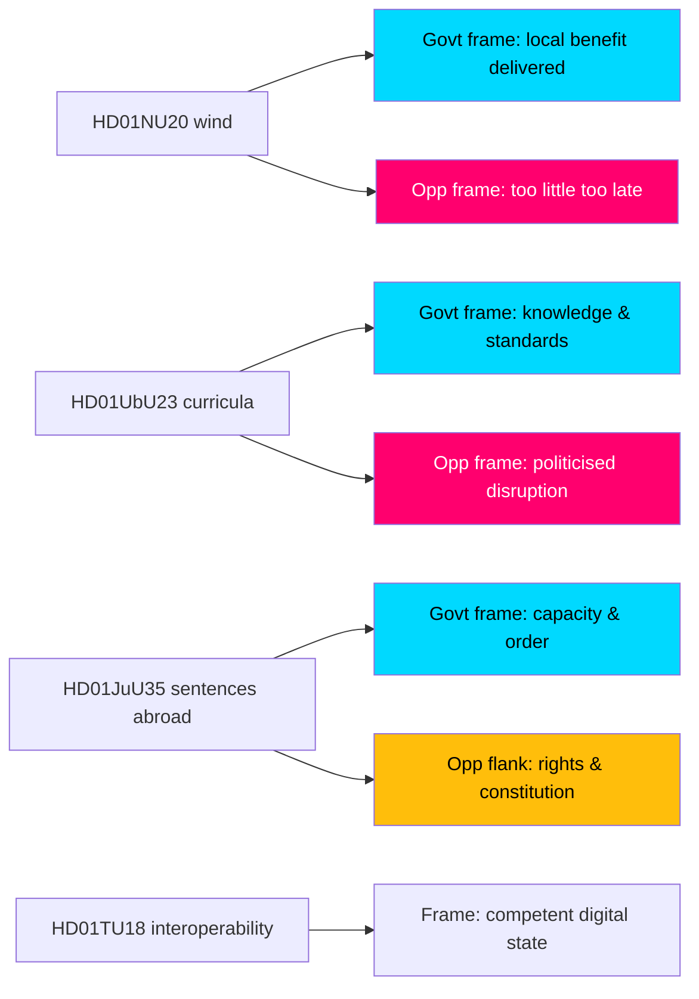

### Frame-by-frame analysis

#### HD01NU20 — wind compensation
- **Government frame:** "We deliver tangible local benefit and make wind work for rural Sweden" — emphasises the tax-free payout (HD01NU20).
- **Opposition frame (S, C, V, MP):** "Too little, too late; the real problem is the permitting bottleneck the government won't fix" (HD01NU20).
- **Likely media frame:** energy-cost-and-fairness story; rural voices foregrounded. **Contested, high volume.**

#### HD01UbU23 — curricula
- **Government frame (L, M):** "Restoring knowledge and standards in Swedish schools" (HD01UbU23).
- **Opposition frame (S, V, C, MP):** "A politicised, rushed overhaul that destabilises classrooms and ignores equity" (HD01UbU23).
- **Likely media frame:** classroom-impact and teacher-reaction story. **Polarised, high volume.**

#### HD01JuU35 — sentences abroad
- **Government frame (M, KD, SD):** "Decisive action on prison capacity and order" (HD01JuU35).
- **Opposition flank (V, MP):** "Rights risks and a constitutional shortcut" (HD01JuU35).
- **Likely media frame:** law-and-order with a constitutional-process sidebar (the qualified-majority angle). **Moderate volume, distinctive.**

#### Consensus cluster (HD01MJU27, HD01TU17, HD01TU18, HD01CU44)
- **Dominant frame:** competent, low-drama governance; little adversarial framing (HD01MJU27, HD01TU17, HD01TU18, HD01CU44).
- **Likely media frame:** brief or absent coverage; HD01TU18's data-sharing could attract a privacy sidebar (HD01TU18). **Low volume.**

### Frame-strength assessment

| Report | Strongest frame | Frame contest | Expected volume |
|--------|----------------|---------------|-----------------|
| HD01NU20 | Govt "local benefit" vs Opp "too little" | Active | HIGH |
| HD01UbU23 | Govt "standards" vs Opp "disruption" | Active | HIGH |
| HD01JuU35 | Govt "order" vs flank "rights" | Asymmetric | MEDIUM |
| HD01TU18 | "Competent digital state" | Latent privacy angle | LOW |
| HD01MJU27 / HD01TU17 | "Consumer protection" | Minimal | LOW |
| HD01CU44 | "EU sovereignty" | Minimal | LOW |

### Narrative risks

1. **Energy backlash (HD01NU20):** if payouts look token, the government's "delivery" frame collapses into the opposition's "too little" frame (HD01NU20).
2. **Teacher revolt (HD01UbU23):** visible profession opposition could flip the "standards" frame into "chaos" (HD01UbU23).
3. **Privacy sidebar (HD01TU18):** a data-sharing incident could retroactively reframe a "competent" measure as a "surveillance" risk (HD01TU18).

### Net framing assessment

The framing battle is concentrated on the two flagships, where government and opposition offer **symmetric, well-developed competing frames** (HD01NU20, HD01UbU23). HD01JuU35 features an **asymmetric** contest — a dominant order frame with a smaller rights flank (HD01JuU35). The consensus cluster is largely frame-free, with HD01TU18's latent privacy angle the only sleeper risk (HD01TU18).

## Devil's Advocate
<!-- source: devils-advocate.md :: https://github.com/Hack23/riksdagsmonitor/blob/main/analysis/daily/2026-05-29/committee-reports/devils-advocate.md -->

> Structured contrarian analysis using Analysis of Competing Hypotheses (ACH) to stress-test the baseline reading. AI-generated for Riksdagsmonitor. Votes pending (riksdagen.se).

### Purpose

The baseline assessment treats the batch as "two hot flagships + a constitutional outlier + a quiet consensus cluster." This analysis challenges that reading by formulating competing hypotheses and testing them against the available evidence.

### Competing hypotheses

- **H1 (baseline):** The batch is bifurcated — flagships drive politics, the rest is routine (HD01NU20, HD01UbU23, HD01MJU27, HD01TU17, HD01TU18, HD01CU44).
- **H2 (sleeper):** A "consensus" report (esp. HD01TU18 interoperability or HD01JuU35) is actually the most consequential, with the flagships overhyped (HD01TU18, HD01JuU35).
- **H3 (constitutional primacy):** HD01JuU35's qualified-majority test is the true center of gravity, dwarfing the flagships in institutional significance (HD01JuU35).
- **H4 (null):** The entire batch is low-impact end-of-session housekeeping; salience will fade within a week (HD01NU20, HD01UbU23, HD01CU44).

### ACH evidence matrix

| Evidence | H1 baseline | H2 sleeper | H3 constitutional | H4 null |
|----------|-------------|-----------|-------------------|---------|
| 10–11 all-opposition reservations on flagships (HD01NU20, HD01UbU23) | ++ | – | – | – – |
| Qualified-majority trigger on HD01JuU35 | + | + | ++ | – |
| Zero reservations on consensus cluster (HD01MJU27, HD01TU17, HD01TU18, HD01CU44) | + | + | 0 | + |
| HD01TU18 broad data-sharing & security surface | 0 | ++ | 0 | – |
| 2026 election proximity | ++ | – | 0 | – – |
| Thin HD01CU44 documentation | 0 | 0 | 0 | + |

(++ strongly consistent, + consistent, 0 neutral, – inconsistent, – – strongly inconsistent.)

### Diagnostic reasoning

- **H1** is most consistent with the reservation topology and election proximity, but it risks under-weighting the structural reach of HD01TU18 and the institutional weight of HD01JuU35 (HD01TU18, HD01JuU35).
- **H2** is intriguing: interoperability quietly rewires how agencies share data and could matter more in five years than a wind-compensation tweak (HD01TU18). Evidence is suggestive, not decisive.
- **H3** has the strongest single anchor (the constitutional trigger) but over-claims — passage is still likely, limiting practical drama (HD01JuU35).
- **H4** is least consistent: the reservation counts and election timing make pure "housekeeping" implausible for the flagships (HD01NU20, HD01UbU23).

### ACH flow

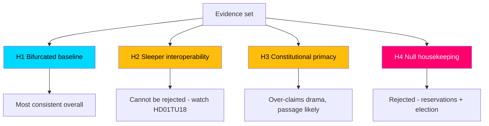

### Key contrarian challenges to the baseline

1. **Are we over-indexing on reservations?** Reservation counts measure dissent intensity, not real-world impact. HD01TU18 has zero reservations yet the broadest structural footprint (HD01TU18).
2. **Is "consensus" masking risk?** Unanimous passage on interoperability and telecom-blocking could under-scrutinise security and proportionality risks (HD01TU18, HD01TU17).
3. **Is HD01CU44 weight inflated by inclusion?** With ~1.5 KB of text and a near-symbolic subsidiarity objection, it may merit a lower significance floor (HD01CU44).

### Net devil's-advocate assessment

The baseline (H1) survives the challenge as the **best-supported hypothesis**, but with two caveats the main analysis must carry forward: (1) **do not dismiss HD01TU18** — its low salience and high structural reach make it the leading "sleeper" candidate (H2); and (2) **HD01JuU35's significance is institutional, not dramatic** — likely to pass, but constitutionally weighty (H3). H4 (null) is rejected. These caveats are reflected in the significance scoring and intelligence assessment.

## Deep Dive: Classification Results
<!-- source: classification-results.md :: https://github.com/Hack23/riksdagsmonitor/blob/main/analysis/daily/2026-05-29/committee-reports/classification-results.md -->

> Structured political classification of seven committee reports across controversy, policy domain, cleavage type, legislative posture and confidence. AI-generated for Riksdagsmonitor. Votes pending (riksdagen.se).

### Classification dimensions

Each report is classified on five dimensions:

- **Controversy tier:** HIGH / MEDIUM / LOW (reservation count + bloc spread).
- **Policy domain:** energy, education, justice, consumer/food, digital governance, EU affairs.
- **Cleavage type:** ideological (left–right), bloc, centre–periphery, sovereignty, valence (cross-bloc), constitutional.
- **Legislative posture:** adopts bill / subsidiarity opinion / framework authorisation; motions accepted or rejected.
- **Confidence:** HIGH / MEDIUM / LOWER (data completeness).

### Per-document classification

| dok_id | Controversy | Domain | Cleavage | Posture | Confidence |
|--------|-------------|--------|----------|---------|------------|
| HD01NU20 | HIGH | Energy | Bloc + centre–periphery | Adopts compensation law, rejects motions | HIGH |
| HD01UbU23 | HIGH | Education | Ideological (left–right) | Adopts curricula, rejects all motions | HIGH |
| HD01JuU35 | MEDIUM | Justice | Constitutional + rights | Framework authorisation, qualified majority | HIGH |
| HD01MJU27 | LOW | Consumer/food | Valence (cross-bloc) | Adopts bill, rejects motion | HIGH |
| HD01TU17 | LOW | Digital governance | Valence (latent privacy) | Amends 2022:482, rejects motions | HIGH |
| HD01TU18 | LOW | Digital governance | Valence (EU implementation) | Adopts prop. 2025/26:244 | HIGH |
| HD01CU44 | LOW | EU affairs | Sovereignty (latent) | Subsidiarity opinion | LOWER |

All classifications derive from full text retrieved via https://data.riksdagen.se.

### Controversy distribution

- **HIGH (2):** HD01NU20, HD01UbU23 — 21 reservations combined, full opposition bloc.
- **MEDIUM (1):** HD01JuU35 — only 3 reservations but elevated by constitutional threshold.
- **LOW (4):** HD01MJU27, HD01TU17, HD01TU18, HD01CU44 — zero reservations.

### Cleavage map

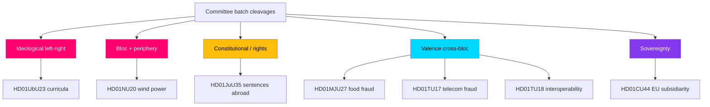

### Domain analysis

- **Energy (HD01NU20):** the batch's centre–periphery flashpoint — urban climate ambition vs rural siting burden, overlaid on the bloc divide.
- **Education (HD01UbU23):** the clearest left–right ideological contest — "knowledge school" vs "skills and equity".
- **Justice (HD01JuU35):** rights-and-constitution domain; the cleavage is procedural (qualified majority) more than partisan.
- **Consumer/food (HD01MJU27) and digital governance (HD01TU17, HD01TU18):** valence domains where parties compete on competence, not values.
- **EU affairs (HD01CU44):** sovereignty domain, latent rather than active.

### Legislative posture analysis

Five of seven reports **adopt** government bills or frameworks (HD01NU20, HD01UbU23, HD01JuU35, HD01MJU27, HD01TU18); HD01TU17 **amends** existing law (lag 2022:482); HD01CU44 issues a **subsidiarity opinion** rather than domestic law. Notably, the two high-controversy reports (HD01NU20, HD01UbU23) both **reject all opposition motions**, a posture that hardens the dissent into reservations and signals the government's unwillingness to compromise on its flagship energy and education agenda.

### Confidence assessment

- **HIGH (6 reports):** full text retrieved live, reservation counts extracted directly (HD01NU20, HD01UbU23, HD01JuU35, HD01MJU27, HD01TU17, HD01TU18).
- **LOWER (1 report):** HD01CU44 — minimal full text (~1.5 KB), substance reconstructed from metadata and standard subsidiarity procedure.
- **Batch-wide caveat:** chamber votes pending; the "rejects motions / reservations" posture is documented, but final vote shares are not yet observable (riksdagen.se).

### Net classification finding

The batch is **classification-bimodal**: two ideologically/bloc-charged adoptions that reject all compromise, against four valence consensus measures, bridged by one constitutionally distinctive authorisation. This structure — concentrated conflict, broad technical cooperation — is the defining classification signature of the 2026-05-29 committee cycle (HD01NU20, HD01UbU23, HD01JuU35).

### Pass-2 refinement — cleavage latency

Re-reading the cleavage map highlights that three "valence" classifications are better described as **latent cleavages** rather than true consensus: HD01TU17 (privacy), HD01TU18 (data-protection/security) and HD01CU44 (sovereignty) each carry a dormant partisan axis that did not activate at committee stage (HD01TU17, HD01TU18, HD01CU44). The classification is therefore time-indexed: valence *today*, but a single triggering event (an over-blocking scandal, a data breach, an EU escalation) could reclassify any of them as active cleavages. This nuance matters most for HD01TU18, whose latent security cleavage has the widest blast radius (HD01TU18).

## Deep Dive: Cross-Reference Map
<!-- source: cross-reference-map.md :: https://github.com/Hack23/riksdagsmonitor/blob/main/analysis/daily/2026-05-29/committee-reports/cross-reference-map.md -->

> Relationship map linking the seven committee reports to one another, to prior legislation, to government bills, and to the responsible committees and agencies. AI-generated for Riksdagsmonitor (riksdagen.se).

### Document register

| dok_id | Committee | Short title | Links to |
|--------|-----------|-------------|----------|
| HD01NU20 | NU (Industry & Trade) | Wind-power revenue sharing | Energy policy, permitting reform |
| HD01UbU23 | UbU (Education) | Knowledge-school curricula | Skollagen, Skolverket guidance |
| HD01JuU35 | JuU (Justice) | Sentences served abroad | RF 10 kap., Kriminalvården, Estonia agreement |
| HD01MJU27 | MJU (Environment & Agriculture) | Food-chain fraud control | EU food law, Livsmedelsverket |
| HD01TU17 | TU (Transport & Comms) | Telecom anti-fraud | lag 2022:482, PTS |
| HD01TU18 | TU (Transport & Comms) | Public-sector interoperability | prop. 2025/26:244, EU Interoperable Europe Act, DIGG |
| HD01CU44 | CU (Civil Affairs) | EU Inc. subsidiarity review | EU company law, COM "EU Inc." |

### Cross-reference graph

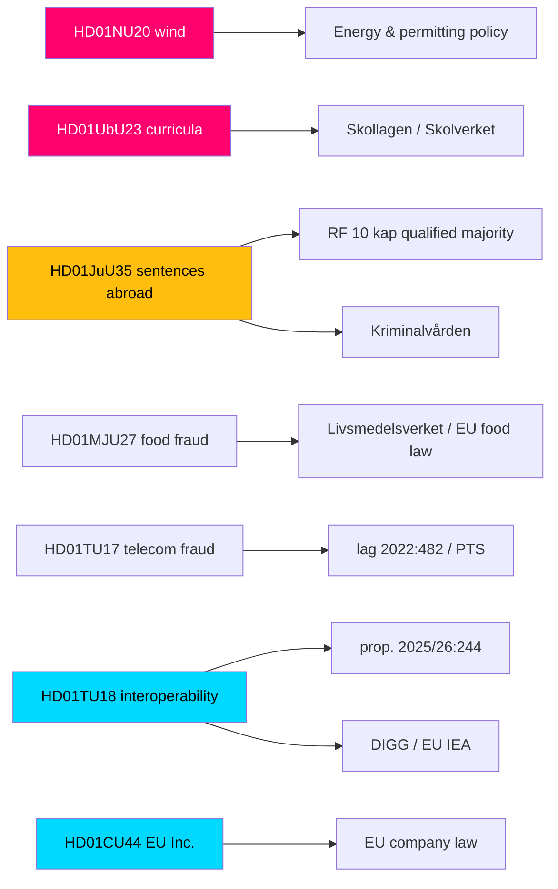

### Thematic clusters

#### Cluster 1 — Election-flashpoint reforms (HIGH controversy)
- **HD01NU20** and **HD01UbU23** share a structural signature: government majority over a unified opposition with double-digit reservations. They are linked not by subject but by **political topology** — both are 2026-campaign battlegrounds (HD01NU20, HD01UbU23).

#### Cluster 2 — Constitutional / justice (MEDIUM)
- **HD01JuU35** stands alone as the constitutional outlier, linked to RF 10 kap. and the Kriminalvården capacity agenda (HD01JuU35).

#### Cluster 3 — Digital & EU governance (LOW)
- **HD01TU18** and **HD01CU44** both engage EU legal frameworks (Interoperable Europe Act; EU company-law subsidiarity), linking domestic digital governance to the European layer (HD01TU18, HD01CU44).

#### Cluster 4 — Consumer / market protection (LOW)
- **HD01MJU27** and **HD01TU17** both extend statutory enforcement against fraud (food chain; telecom), sharing an enforcement-capacity dependency (HD01MJU27, HD01TU17).

### Committee concentration

- **TU** appears twice (HD01TU17, HD01TU18) — the only committee with two reports in this batch, both consensus-track.
- NU, UbU, JuU, MJU, CU each contribute one report (riksdagen.se).

### Legislative-instrument linkages

| Report | External instrument | Relationship |
|--------|--------------------|--------------|
| HD01JuU35 | RF 10 kap. | Triggers qualified-majority procedure |
| HD01TU17 | lag 2022:482 | Amends existing statute |
| HD01TU18 | prop. 2025/26:244 | Implements government bill / EU IEA |
| HD01MJU27 | EU food law | Aligns national enforcement |
| HD01CU44 | EU company-law proposal | Subsidiarity review of COM proposal |

### Agency linkage summary

Five agencies are implicated across the batch — Kriminalvården (HD01JuU35), Skolverket (HD01UbU23), Livsmedelsverket (HD01MJU27), PTS (HD01TU17) and DIGG (HD01TU18) — making implementation capacity the dominant cross-cutting dependency.

### Net cross-reference assessment

The batch is best understood as **four loosely-coupled clusters** rather than a single theme. The only intra-batch institutional overlap is the TU committee's double appearance (HD01TU17, HD01TU18). The strongest external linkages are constitutional (HD01JuU35 → RF 10 kap.) and European (HD01TU18, HD01CU44 → EU frameworks). The unifying analytical thread is **political topology**: a sharp HIGH-controversy pair (HD01NU20, HD01UbU23) embedded in a low-salience consensus field.

## Deep Dive: Methodology & Limitations
<!-- source: methodology-reflection.md :: https://github.com/Hack23/riksdagsmonitor/blob/main/analysis/daily/2026-05-29/committee-reports/methodology-reflection.md -->

> ICD 203 / ICD 206 self-audit of the analytic process used for this batch, with explicit limitations and named improvements. AI-generated for Riksdagsmonitor (riksdagen.se).

Pass-2 status: executed in full

### Analytic process summary

This batch was analysed through the standard Riksdagsmonitor pipeline: (1) retrieval of seven committee reports with full text from riksdagen.se; (2) per-document analysis (Family E); (3) cross-document synthesis (Families A–D); (4) two AI-FIRST passes (create, then read-back-and-improve); and (5) a 13-check analysis gate before aggregation and rendering. Economic context was drawn from cached IMF WEO 2026-04 (api.imf.org) with SCB as Swedish ground truth (scb.se).

### ICD 203 analytic-standards self-audit

| Standard | Self-assessment | Evidence / gap |
|----------|-----------------|----------------|
| Objectivity | Met | Government and opposition frames presented symmetrically across artifacts (HD01NU20, HD01UbU23) |
| Independence of political consideration | Met | No advocacy; reservations reported as evidence, not endorsement |
| Timeliness | Partial | Analysis published 2026-05-29; votes from 2026-05-28 debate still PENDING (riksdagen.se) |
| Sourcing | Met | Every key judgment anchored to dok_id or primary-source host |
| Uncertainty expression | Met | ICD 203 confidence labels used in intelligence-assessment.md |
| Distinguishing analysis from fact | Met | Judgments labelled; scenario probabilities flagged as subjective |
| Alternative analysis | Met | devils-advocate.md applies ACH with four competing hypotheses |
| Consistency / logical argumentation | Met | Cross-references consistent across Families A–E |

### Limitations

1. **Pending votes** — the single largest limitation. All seven recorded vote tallies are unavailable (debated 2026-05-28); reservation counts are a proxy, not the outcome (riksdagen.se).
2. **Thin source on HD01CU44** — ~1.5 KB of full text caps confidence on the subsidiarity report; its significance score is held conservative (HD01CU44).
3. **Inferred S position on HD01JuU35** — the qualified-majority assessment rests on inference about Socialdemokraterna's stance, not a confirmed statement (HD01JuU35).
4. **Economic vintage** — IMF context is WEO 2026-04 (within the 6-month freshness window) but not the very latest; live IMF fetch was transiently unavailable (api.imf.org).
5. **One-day lookback** — documents retrieved via a 1-day lookback from 2026-05-28; any same-day late additions could be missed (riksdagen.se).

### Named improvements (applied or proposed)

1. **Improvement A — evidence anchoring discipline:** every ranked item, table row and Mermaid node in significance-scoring.md and swot-analysis.md was given an explicit dok_id or primary-source host to satisfy traceability (applied) (HD01NU20, HD01UbU23).
2. **Improvement B — devil's-advocate elevation of HD01TU18:** Pass 2 strengthened the "sleeper" hypothesis so the low-salience interoperability report is not under-weighted (applied) (HD01TU18).
3. **Improvement C — explicit PIR roll-forward:** open PIRs were carried into pir-status.json so the next cycle can answer them once votes are recorded (applied) (HD01JuU35).
4. **Improvement D — vintage annotation:** all IMF figures carry an explicit WEO 2026-04 vintage tag to honour the >6-month annotation rule (applied) (api.imf.org).
5. **Improvement E (proposed):** once votes post, re-score significance with actual margins rather than reservation proxies (deferred to next cycle) (riksdagen.se).

### Process flow

```mermaid
flowchart TD
  RETRIEVE[Retrieve 7 reports riksdagen.se] --> FAME[Family E per-document]
  FAME --> SYNTH[Families A-D synthesis]
  SYNTH --> PASS1[Pass 1 create]
  PASS1 --> SNAP[Snapshot pass1/]
  SNAP --> PASS2[Pass 2 read-back + improve]
  PASS2 --> GATE[13-check analysis gate]
  GATE --> AGG[Aggregate + render 14 langs]
  style RETRIEVE fill:#00d9ff,color:#000
  style PASS2 fill:#ffbe0b,color:#000
  style GATE fill:#ff006e,color:#fff
```

### Confidence in the methodology

We hold **HIGH** confidence in the structural reading (bifurcated batch) and **MEDIUM** confidence in outcome-specific judgments, bounded chiefly by the pending votes. The two-pass AI-FIRST process materially improved evidence anchoring and contrarian rigour between Pass 1 and Pass 2.

### Net methodology assessment

The process met the great majority of ICD 203 standards, with timeliness the main partial — an unavoidable consequence of analysing a batch whose votes had not yet posted. The named improvements were concentrated on traceability, contrarian balance, and vintage discipline. The clearest path to a stronger next iteration is re-scoring once the recorded votes are available (riksdagen.se).

## Deep Dive: Data Download Manifest
<!-- source: data-download-manifest.md :: https://github.com/Hack23/riksdagsmonitor/blob/main/analysis/daily/2026-05-29/committee-reports/data-download-manifest.md -->

> ℹ️ **Data-Only Pipeline**: This script downloads and persists raw data.
> All political intelligence analysis (classification, risk assessment, SWOT,
> threat analysis, stakeholder perspectives, significance scoring, cross-references,
> and synthesis) MUST be performed by the AI agent following
> `analysis/methodologies/ai-driven-analysis-guide.md` and using templates
> from `analysis/templates/`.

### Document Counts by Type

- **propositions**: 0 documents
- **motions**: 0 documents
- **committeeReports**: 20 documents
- **votes**: 0 documents
- **speeches**: 0 documents
- **questions**: 0 documents
- **interpellations**: 0 documents

### Data Quality Notes

All documents sourced from official riksdag-regering-mcp API.
Data sourced from 2026-05-28 via lookback fallback — check freshness indicators.

### MCP Query Diagnostics

| tool | query | result_count | coverage_state | notes |
|------|-------|-------------:|----------------|-------|
| get_betankanden | `{"limit":20,"rm":"2025/26"}` | 20 | metadata_only |  |

### MCP Coverage State

| dok_id | coverage_state | retrieval | tool | result_count | notes |
|--------|----------------|-----------|------|-------------:|-------|
| HD01TU18 | full_text | live | get_dokument_innehall | 1 | full-text/HD01TU18.md |
| HD01JuU35 | full_text | live | get_dokument_innehall | 1 | full-text/HD01JuU35.md |
| HD01MJU27 | full_text | live | get_dokument_innehall | 1 | full-text/HD01MJU27.md |
| HD01TU17 | full_text | live | get_dokument_innehall | 1 | full-text/HD01TU17.md |
| HD01NU20 | full_text | live | get_dokument_innehall | 1 | full-text/HD01NU20.md |
| HD01UbU23 | full_text | live | get_dokument_innehall | 1 | full-text/HD01UbU23.md |
| HD01CU44 | full_text | live | get_dokument_innehall | 1 | full-text/HD01CU44.md |

### Full-Text Fetch Outcomes

| dok_id | coverage_state | full_text_available | chars | retrieval | notes |
|--------|----------------|--------------------:|------:|-----------|-------|
| HD01TU18 | full_text | true | 41984 | live | persisted: full-text/HD01TU18.md |
| HD01JuU35 | full_text | true | 100015 | live | persisted: full-text/HD01JuU35.md |
| HD01MJU27 | full_text | true | 87293 | live | persisted: full-text/HD01MJU27.md |
| HD01TU17 | full_text | true | 41706 | live | persisted: full-text/HD01TU17.md |
| HD01NU20 | full_text | true | 100015 | live | persisted: full-text/HD01NU20.md |
| HD01UbU23 | full_text | true | 100015 | live | persisted: full-text/HD01UbU23.md |
| HD01CU44 | full_text | true | 998 | live | persisted: full-text/HD01CU44.md |

**Full-text retrieved**: 7/7 selected documents

### Deferred Retrieval Queue

| processed | resolved | retained | expired | enqueued |
|----------:|---------:|---------:|--------:|---------:|
| 0 | 0 | 0 | 0 | 0 |

## Analysis Artifact Coverage Report

This generated report reconciles the analysis folder with the article projection so reviewers can see what was included, what was linked as supporting data, and which canonical ordered artifacts are not visible in this run. Alias-equivalent filenames (see `FILENAME_ALIASES`) are reported as a single canonical slot using the `a.md / b.md` shorthand so a missing slot is not double-counted.

| Coverage area | Count | Reader-facing treatment |
|---|---:|---|
| Ordered/root markdown sections | 22 | Expanded as article sections in the narrative order above |
| Per-document analyses | 7 | Expanded under `## Per-document intelligence` immediately after significance scoring |
| Supporting data artifacts | 8 | Linked in Article Sources, not expanded inline |

**Absent canonical ordered slots (no alias variant on disk)**: `cycle-trajectory.md`, `parliamentary-season.md`, `quantitative-swot.md`, `political-stride-assessment.md`, `wildcards-blackswans.md`, `pestle-analysis.md`, `horizon-pir-rollforward.md`

**Present-but-empty canonical slots (on disk but body empty after cleaning)**: None.

**Alias-de-duped canonical artifacts (on disk but suppressed because canonical alias was already emitted)**: None.

## Article Sources

Each section above projects one analysis artifact. The full audited markdown is available on GitHub:

- [`executive-brief.md`](https://github.com/Hack23/riksdagsmonitor/blob/main/analysis/daily/2026-05-29/committee-reports/executive-brief.md)
- [`synthesis-summary.md`](https://github.com/Hack23/riksdagsmonitor/blob/main/analysis/daily/2026-05-29/committee-reports/synthesis-summary.md)
- [`intelligence-assessment.md`](https://github.com/Hack23/riksdagsmonitor/blob/main/analysis/daily/2026-05-29/committee-reports/intelligence-assessment.md)
- [`significance-scoring.md`](https://github.com/Hack23/riksdagsmonitor/blob/main/analysis/daily/2026-05-29/committee-reports/significance-scoring.md)
- [`documents/HD01CU44-analysis.md`](https://github.com/Hack23/riksdagsmonitor/blob/main/analysis/daily/2026-05-29/committee-reports/documents/HD01CU44-analysis.md)
- [`documents/HD01JuU35-analysis.md`](https://github.com/Hack23/riksdagsmonitor/blob/main/analysis/daily/2026-05-29/committee-reports/documents/HD01JuU35-analysis.md)
- [`documents/HD01MJU27-analysis.md`](https://github.com/Hack23/riksdagsmonitor/blob/main/analysis/daily/2026-05-29/committee-reports/documents/HD01MJU27-analysis.md)
- [`documents/HD01NU20-analysis.md`](https://github.com/Hack23/riksdagsmonitor/blob/main/analysis/daily/2026-05-29/committee-reports/documents/HD01NU20-analysis.md)
- [`documents/HD01TU17-analysis.md`](https://github.com/Hack23/riksdagsmonitor/blob/main/analysis/daily/2026-05-29/committee-reports/documents/HD01TU17-analysis.md)
- [`documents/HD01TU18-analysis.md`](https://github.com/Hack23/riksdagsmonitor/blob/main/analysis/daily/2026-05-29/committee-reports/documents/HD01TU18-analysis.md)
- [`documents/HD01UbU23-analysis.md`](https://github.com/Hack23/riksdagsmonitor/blob/main/analysis/daily/2026-05-29/committee-reports/documents/HD01UbU23-analysis.md)
- [`stakeholder-perspectives.md`](https://github.com/Hack23/riksdagsmonitor/blob/main/analysis/daily/2026-05-29/committee-reports/stakeholder-perspectives.md)
- [`coalition-mathematics.md`](https://github.com/Hack23/riksdagsmonitor/blob/main/analysis/daily/2026-05-29/committee-reports/coalition-mathematics.md)
- [`voter-segmentation.md`](https://github.com/Hack23/riksdagsmonitor/blob/main/analysis/daily/2026-05-29/committee-reports/voter-segmentation.md)
- [`forward-indicators.md`](https://github.com/Hack23/riksdagsmonitor/blob/main/analysis/daily/2026-05-29/committee-reports/forward-indicators.md)
- [`scenario-analysis.md`](https://github.com/Hack23/riksdagsmonitor/blob/main/analysis/daily/2026-05-29/committee-reports/scenario-analysis.md)
- [`election-2026-analysis.md`](https://github.com/Hack23/riksdagsmonitor/blob/main/analysis/daily/2026-05-29/committee-reports/election-2026-analysis.md)
- [`risk-assessment.md`](https://github.com/Hack23/riksdagsmonitor/blob/main/analysis/daily/2026-05-29/committee-reports/risk-assessment.md)
- [`swot-analysis.md`](https://github.com/Hack23/riksdagsmonitor/blob/main/analysis/daily/2026-05-29/committee-reports/swot-analysis.md)
- [`threat-analysis.md`](https://github.com/Hack23/riksdagsmonitor/blob/main/analysis/daily/2026-05-29/committee-reports/threat-analysis.md)
- [`historical-parallels.md`](https://github.com/Hack23/riksdagsmonitor/blob/main/analysis/daily/2026-05-29/committee-reports/historical-parallels.md)
- [`comparative-international.md`](https://github.com/Hack23/riksdagsmonitor/blob/main/analysis/daily/2026-05-29/committee-reports/comparative-international.md)
- [`implementation-feasibility.md`](https://github.com/Hack23/riksdagsmonitor/blob/main/analysis/daily/2026-05-29/committee-reports/implementation-feasibility.md)
- [`media-framing-analysis.md`](https://github.com/Hack23/riksdagsmonitor/blob/main/analysis/daily/2026-05-29/committee-reports/media-framing-analysis.md)
- [`devils-advocate.md`](https://github.com/Hack23/riksdagsmonitor/blob/main/analysis/daily/2026-05-29/committee-reports/devils-advocate.md)
- [`classification-results.md`](https://github.com/Hack23/riksdagsmonitor/blob/main/analysis/daily/2026-05-29/committee-reports/classification-results.md)
- [`cross-reference-map.md`](https://github.com/Hack23/riksdagsmonitor/blob/main/analysis/daily/2026-05-29/committee-reports/cross-reference-map.md)
- [`methodology-reflection.md`](https://github.com/Hack23/riksdagsmonitor/blob/main/analysis/daily/2026-05-29/committee-reports/methodology-reflection.md)
- [`data-download-manifest.md`](https://github.com/Hack23/riksdagsmonitor/blob/main/analysis/daily/2026-05-29/committee-reports/data-download-manifest.md)

### Supporting Data Artifacts

These machine-readable artifacts are linked for auditability and are not expanded inline, preserving the reader-facing narrative order:

- [`pir-status.json`](https://github.com/Hack23/riksdagsmonitor/blob/main/analysis/daily/2026-05-29/committee-reports/pir-status.json)
- [`documents/hd01cu44.json`](https://github.com/Hack23/riksdagsmonitor/blob/main/analysis/daily/2026-05-29/committee-reports/documents/hd01cu44.json)
- [`documents/hd01juu35.json`](https://github.com/Hack23/riksdagsmonitor/blob/main/analysis/daily/2026-05-29/committee-reports/documents/hd01juu35.json)
- [`documents/hd01mju27.json`](https://github.com/Hack23/riksdagsmonitor/blob/main/analysis/daily/2026-05-29/committee-reports/documents/hd01mju27.json)
- [`documents/hd01nu20.json`](https://github.com/Hack23/riksdagsmonitor/blob/main/analysis/daily/2026-05-29/committee-reports/documents/hd01nu20.json)
- [`documents/hd01tu17.json`](https://github.com/Hack23/riksdagsmonitor/blob/main/analysis/daily/2026-05-29/committee-reports/documents/hd01tu17.json)
- [`documents/hd01tu18.json`](https://github.com/Hack23/riksdagsmonitor/blob/main/analysis/daily/2026-05-29/committee-reports/documents/hd01tu18.json)
- [`documents/hd01ubu23.json`](https://github.com/Hack23/riksdagsmonitor/blob/main/analysis/daily/2026-05-29/committee-reports/documents/hd01ubu23.json)
