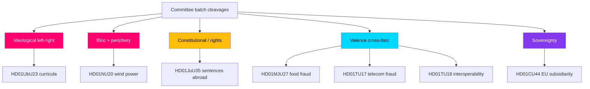

# Classification Results — Committee Reports Batch, 2026-05-29

> Structured political classification of seven committee reports across controversy, policy domain, cleavage type, legislative posture and confidence. AI-generated for Riksdagsmonitor. Votes pending (riksdagen.se).

## Classification dimensions

Each report is classified on five dimensions:

- **Controversy tier:** HIGH / MEDIUM / LOW (reservation count + bloc spread).
- **Policy domain:** energy, education, justice, consumer/food, digital governance, EU affairs.
- **Cleavage type:** ideological (left–right), bloc, centre–periphery, sovereignty, valence (cross-bloc), constitutional.
- **Legislative posture:** adopts bill / subsidiarity opinion / framework authorisation; motions accepted or rejected.
- **Confidence:** HIGH / MEDIUM / LOWER (data completeness).

## Per-document classification

| dok_id | Controversy | Domain | Cleavage | Posture | Confidence |
|--------|-------------|--------|----------|---------|------------|
| HD01NU20 | HIGH | Energy | Bloc + centre–periphery | Adopts compensation law, rejects motions | HIGH |
| HD01UbU23 | HIGH | Education | Ideological (left–right) | Adopts curricula, rejects all motions | HIGH |
| HD01JuU35 | MEDIUM | Justice | Constitutional + rights | Framework authorisation, qualified majority | HIGH |
| HD01MJU27 | LOW | Consumer/food | Valence (cross-bloc) | Adopts bill, rejects motion | HIGH |
| HD01TU17 | LOW | Digital governance | Valence (latent privacy) | Amends 2022:482, rejects motions | HIGH |
| HD01TU18 | LOW | Digital governance | Valence (EU implementation) | Adopts prop. 2025/26:244 | HIGH |
| HD01CU44 | LOW | EU affairs | Sovereignty (latent) | Subsidiarity opinion | LOWER |

All classifications derive from full text retrieved via https://data.riksdagen.se.

## Controversy distribution

- **HIGH (2):** HD01NU20, HD01UbU23 — 21 reservations combined, full opposition bloc.
- **MEDIUM (1):** HD01JuU35 — only 3 reservations but elevated by constitutional threshold.
- **LOW (4):** HD01MJU27, HD01TU17, HD01TU18, HD01CU44 — zero reservations.

## Cleavage map

## Domain analysis

- **Energy (HD01NU20):** the batch's centre–periphery flashpoint — urban climate ambition vs rural siting burden, overlaid on the bloc divide.
- **Education (HD01UbU23):** the clearest left–right ideological contest — "knowledge school" vs "skills and equity".
- **Justice (HD01JuU35):** rights-and-constitution domain; the cleavage is procedural (qualified majority) more than partisan.
- **Consumer/food (HD01MJU27) and digital governance (HD01TU17, HD01TU18):** valence domains where parties compete on competence, not values.
- **EU affairs (HD01CU44):** sovereignty domain, latent rather than active.

## Legislative posture analysis

Five of seven reports **adopt** government bills or frameworks (HD01NU20, HD01UbU23, HD01JuU35, HD01MJU27, HD01TU18); HD01TU17 **amends** existing law (lag 2022:482); HD01CU44 issues a **subsidiarity opinion** rather than domestic law. Notably, the two high-controversy reports (HD01NU20, HD01UbU23) both **reject all opposition motions**, a posture that hardens the dissent into reservations and signals the government's unwillingness to compromise on its flagship energy and education agenda.

## Confidence assessment

- **HIGH (6 reports):** full text retrieved live, reservation counts extracted directly (HD01NU20, HD01UbU23, HD01JuU35, HD01MJU27, HD01TU17, HD01TU18).
- **LOWER (1 report):** HD01CU44 — minimal full text (~1.5 KB), substance reconstructed from metadata and standard subsidiarity procedure.
- **Batch-wide caveat:** chamber votes pending; the "rejects motions / reservations" posture is documented, but final vote shares are not yet observable (riksdagen.se).

## Net classification finding

The batch is **classification-bimodal**: two ideologically/bloc-charged adoptions that reject all compromise, against four valence consensus measures, bridged by one constitutionally distinctive authorisation. This structure — concentrated conflict, broad technical cooperation — is the defining classification signature of the 2026-05-29 committee cycle (HD01NU20, HD01UbU23, HD01JuU35).

## Pass-2 refinement — cleavage latency

Re-reading the cleavage map highlights that three "valence" classifications are better described as **latent cleavages** rather than true consensus: HD01TU17 (privacy), HD01TU18 (data-protection/security) and HD01CU44 (sovereignty) each carry a dormant partisan axis that did not activate at committee stage (HD01TU17, HD01TU18, HD01CU44). The classification is therefore time-indexed: valence *today*, but a single triggering event (an over-blocking scandal, a data breach, an EU escalation) could reclassify any of them as active cleavages. This nuance matters most for HD01TU18, whose latent security cleavage has the widest blast radius (HD01TU18).
