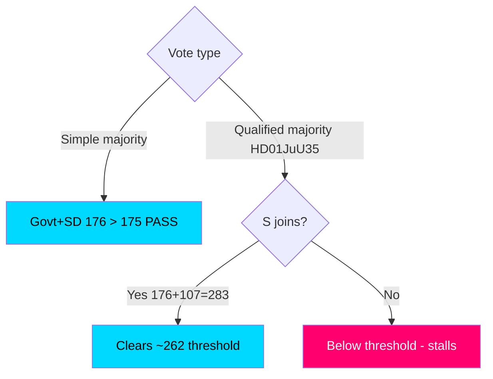

# Coalition Mathematics — Committee Reports Batch, 2026-05-29

> Seat-count and majority analysis for the seven-report batch, including the qualified-majority calculus on HD01JuU35. AI-generated for Riksdagsmonitor. Votes pending (riksdagen.se).

## Seat baseline (349 seats, simple majority 175)

| Bloc | Party | Seats |
|------|-------|-------|
| Government | Moderaterna (M) | 68 |
| Government | Kristdemokraterna (KD) | 19 |
| Government | Liberalerna (L) | 16 |
| Support | Sverigedemokraterna (SD) | 73 |
| **Government + SD** | | **176** |
| Opposition | Socialdemokraterna (S) | 107 |
| Opposition | Vänsterpartiet (V) | 24 |
| Opposition | Centerpartiet (C) | 24 |
| Opposition | Miljöpartiet (MP) | 18 |
| **Opposition total** | | **173** |

## Simple-majority reports

For HD01NU20, HD01UbU23 and the consensus cluster, the government's 176-seat bloc (M 68 + KD 19 + L 16 + SD 73) exceeds the 175 threshold, so passage is secure even against a unified 173-seat opposition (HD01NU20, HD01UbU23, HD01MJU27, HD01TU17, HD01TU18, HD01CU44).

## Qualified-majority report (HD01JuU35)

HD01JuU35 transfers authority to a foreign state and therefore engages **RF 10 kap.**, requiring a qualified majority (three-quarters of those voting, with at least half the Riksdag present) (HD01JuU35).

- Government + SD = 176 — **insufficient** for a three-quarters threshold on a full chamber.
- A three-quarters bar on 349 present ≈ **262 votes**.
- 176 + S 107 = 283 — **clears the bar** if Socialdemokraterna join.
- Without S, the threshold cannot be reached even with full government+SD unity (HD01JuU35).

**Conclusion:** S is the **pivotal actor** for HD01JuU35; V (24) and MP (18) opposition is not by itself decisive if S cooperates (HD01JuU35).

## Coalition flow

## Sensitivity

- **Flagships:** robust 1-seat cushion (176 vs 175); no defection tolerance to spare, but unity expected (HD01NU20, HD01UbU23).
- **HD01JuU35:** binary on S; a small number of cross-bloc abstentions could swing the qualified-majority count (HD01JuU35).

## Net coalition assessment

Arithmetic confirms the strategic picture: the government commands a working simple majority for six of seven reports, but **surrenders control of HD01JuU35 to Socialdemokraterna** because of the constitutional qualified-majority rule. This is the batch's single most important coalition-mathematics fact (HD01JuU35). All figures are pre-vote; recorded tallies pending (riksdagen.se).
