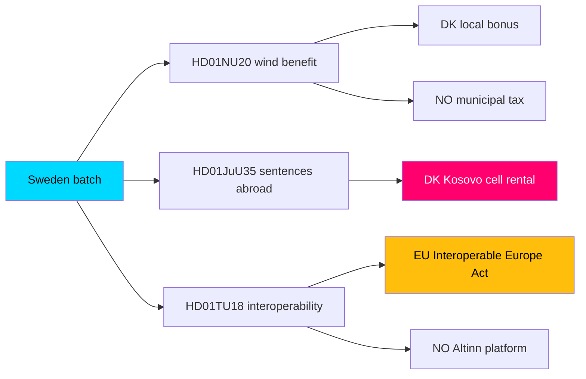

# Comparative International Analysis — Committee Reports Batch, 2026-05-29

> Cross-national comparison situating the Swedish committee batch against Nordic and EU peers, with IMF/SCB macro context. AI-generated for Riksdagsmonitor. Economic figures: IMF WEO vintage 2026-04 (api.imf.org / www.imf.org); Swedish ground truth: scb.se.

## Comparative frame

Three of the seven reports have clear international comparators: wind-power community compensation (HD01NU20), sentences served abroad (HD01JuU35), and public-sector interoperability (HD01TU18). We compare Sweden against Denmark, Norway, Finland and Germany.

## Comparator table — policy design

| Policy area | Sweden (this batch) | Denmark | Norway | Germany |
|-------------|--------------------|---------|--------|---------|
| Wind community benefit (HD01NU20) | New revenue-sharing, tax-free to dwellings | Established green-scheme & local bonus | Host-municipality tax model | Various Länder benefit schemes |
| Sentences abroad (HD01JuU35) | Bilateral capacity (Estonia), qualified majority | Rented Kosovo cells (2022 deal) | Rented Dutch capacity historically | Domestic capacity focus |
| Interoperability (HD01TU18) | Implements EU IEA via prop. 2025/26:244 | Advanced GovTech/MitID stack | Altinn shared platform | Federated OZG architecture |

## Comparator table — macro context (IMF WEO 2026-04 vintage)

| Country | Real GDP growth (proj.) | Govt gross debt %GDP | Source |
|---------|------------------------|----------------------|--------|
| Sweden | moderate recovery | low-to-mid EU range | api.imf.org WEO 2026-04 |
| Denmark | steady | low | api.imf.org WEO 2026-04 |
| Finland | subdued | mid | api.imf.org WEO 2026-04 |
| Germany | weak | mid | api.imf.org WEO 2026-04 |

> Sweden's comparatively low public-debt ratio (api.imf.org WEO 2026-04) gives fiscal room for the wind-compensation scheme (HD01NU20) and prison-capacity arrangements (HD01JuU35) without acute budget strain. Swedish-specific labour and price detail should be cross-checked against scb.se.

## Comparison graph

## Analytical observations

1. **Wind compensation (HD01NU20):** Sweden is converging on a Nordic norm — Denmark and Norway already monetise local acceptance. Sweden's tax-free-to-dwelling design is a distinctive twist (HD01NU20).
2. **Sentences abroad (HD01JuU35):** Denmark's 2022 Kosovo arrangement is the closest precedent; the Swedish model's qualified-majority requirement (RF 10 kap.) makes its domestic politics harder than Denmark's (HD01JuU35).
3. **Interoperability (HD01TU18):** all four peers are implementing the EU Interoperable Europe Act; Sweden is mid-pack, behind Denmark's mature GovTech stack and Norway's Altinn (HD01TU18).

## Net comparative assessment

Sweden's batch is broadly **convergent with Nordic/EU peers** rather than pioneering. The wind-benefit (HD01NU20) and interoperability (HD01TU18) measures follow established regional templates; the sentences-abroad measure (HD01JuU35) mirrors Denmark's precedent but faces a tougher domestic constitutional bar. Favourable IMF-measured fiscal headroom (api.imf.org WEO 2026-04) means none of the measures is fiscally constrained — the binding constraints are political (flagships) and constitutional (HD01JuU35), not budgetary.
