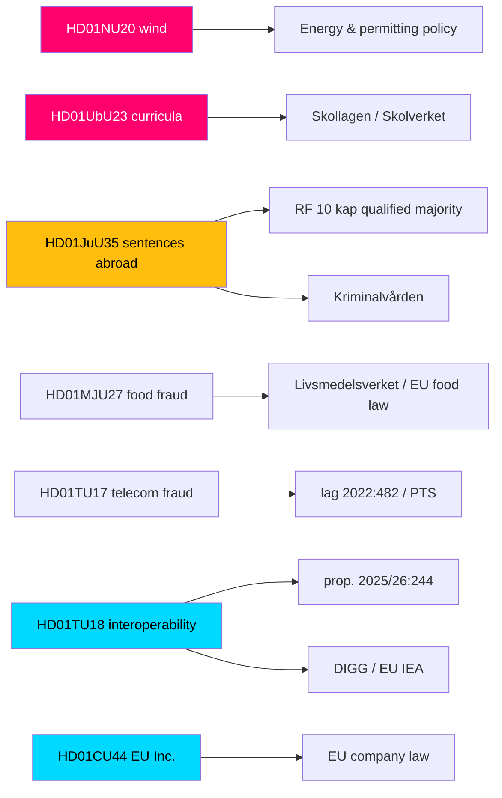

# Cross-Reference Map — Committee Reports Batch, 2026-05-29

> Relationship map linking the seven committee reports to one another, to prior legislation, to government bills, and to the responsible committees and agencies. AI-generated for Riksdagsmonitor (riksdagen.se).

## Document register

| dok_id | Committee | Short title | Links to |
|--------|-----------|-------------|----------|
| HD01NU20 | NU (Industry & Trade) | Wind-power revenue sharing | Energy policy, permitting reform |
| HD01UbU23 | UbU (Education) | Knowledge-school curricula | Skollagen, Skolverket guidance |
| HD01JuU35 | JuU (Justice) | Sentences served abroad | RF 10 kap., Kriminalvården, Estonia agreement |
| HD01MJU27 | MJU (Environment & Agriculture) | Food-chain fraud control | EU food law, Livsmedelsverket |
| HD01TU17 | TU (Transport & Comms) | Telecom anti-fraud | lag 2022:482, PTS |
| HD01TU18 | TU (Transport & Comms) | Public-sector interoperability | prop. 2025/26:244, EU Interoperable Europe Act, DIGG |
| HD01CU44 | CU (Civil Affairs) | EU Inc. subsidiarity review | EU company law, COM "EU Inc." |

## Cross-reference graph

## Thematic clusters

### Cluster 1 — Election-flashpoint reforms (HIGH controversy)
- **HD01NU20** and **HD01UbU23** share a structural signature: government majority over a unified opposition with double-digit reservations. They are linked not by subject but by **political topology** — both are 2026-campaign battlegrounds (HD01NU20, HD01UbU23).

### Cluster 2 — Constitutional / justice (MEDIUM)
- **HD01JuU35** stands alone as the constitutional outlier, linked to RF 10 kap. and the Kriminalvården capacity agenda (HD01JuU35).

### Cluster 3 — Digital & EU governance (LOW)
- **HD01TU18** and **HD01CU44** both engage EU legal frameworks (Interoperable Europe Act; EU company-law subsidiarity), linking domestic digital governance to the European layer (HD01TU18, HD01CU44).

### Cluster 4 — Consumer / market protection (LOW)
- **HD01MJU27** and **HD01TU17** both extend statutory enforcement against fraud (food chain; telecom), sharing an enforcement-capacity dependency (HD01MJU27, HD01TU17).

## Committee concentration

- **TU** appears twice (HD01TU17, HD01TU18) — the only committee with two reports in this batch, both consensus-track.
- NU, UbU, JuU, MJU, CU each contribute one report (riksdagen.se).

## Legislative-instrument linkages

| Report | External instrument | Relationship |
|--------|--------------------|--------------|
| HD01JuU35 | RF 10 kap. | Triggers qualified-majority procedure |
| HD01TU17 | lag 2022:482 | Amends existing statute |
| HD01TU18 | prop. 2025/26:244 | Implements government bill / EU IEA |
| HD01MJU27 | EU food law | Aligns national enforcement |
| HD01CU44 | EU company-law proposal | Subsidiarity review of COM proposal |

## Agency linkage summary

Five agencies are implicated across the batch — Kriminalvården (HD01JuU35), Skolverket (HD01UbU23), Livsmedelsverket (HD01MJU27), PTS (HD01TU17) and DIGG (HD01TU18) — making implementation capacity the dominant cross-cutting dependency.

## Net cross-reference assessment

The batch is best understood as **four loosely-coupled clusters** rather than a single theme. The only intra-batch institutional overlap is the TU committee's double appearance (HD01TU17, HD01TU18). The strongest external linkages are constitutional (HD01JuU35 → RF 10 kap.) and European (HD01TU18, HD01CU44 → EU frameworks). The unifying analytical thread is **political topology**: a sharp HIGH-controversy pair (HD01NU20, HD01UbU23) embedded in a low-salience consensus field.
