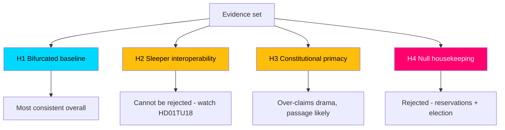

# Devil's Advocate Analysis — Committee Reports Batch, 2026-05-29

> Structured contrarian analysis using Analysis of Competing Hypotheses (ACH) to stress-test the baseline reading. AI-generated for Riksdagsmonitor. Votes pending (riksdagen.se).

## Purpose

The baseline assessment treats the batch as "two hot flagships + a constitutional outlier + a quiet consensus cluster." This analysis challenges that reading by formulating competing hypotheses and testing them against the available evidence.

## Competing hypotheses

- **H1 (baseline):** The batch is bifurcated — flagships drive politics, the rest is routine (HD01NU20, HD01UbU23, HD01MJU27, HD01TU17, HD01TU18, HD01CU44).
- **H2 (sleeper):** A "consensus" report (esp. HD01TU18 interoperability or HD01JuU35) is actually the most consequential, with the flagships overhyped (HD01TU18, HD01JuU35).
- **H3 (constitutional primacy):** HD01JuU35's qualified-majority test is the true center of gravity, dwarfing the flagships in institutional significance (HD01JuU35).
- **H4 (null):** The entire batch is low-impact end-of-session housekeeping; salience will fade within a week (HD01NU20, HD01UbU23, HD01CU44).

## ACH evidence matrix

| Evidence | H1 baseline | H2 sleeper | H3 constitutional | H4 null |
|----------|-------------|-----------|-------------------|---------|
| 10–11 all-opposition reservations on flagships (HD01NU20, HD01UbU23) | ++ | – | – | – – |
| Qualified-majority trigger on HD01JuU35 | + | + | ++ | – |
| Zero reservations on consensus cluster (HD01MJU27, HD01TU17, HD01TU18, HD01CU44) | + | + | 0 | + |
| HD01TU18 broad data-sharing & security surface | 0 | ++ | 0 | – |
| 2026 election proximity | ++ | – | 0 | – – |
| Thin HD01CU44 documentation | 0 | 0 | 0 | + |

(++ strongly consistent, + consistent, 0 neutral, – inconsistent, – – strongly inconsistent.)

## Diagnostic reasoning

- **H1** is most consistent with the reservation topology and election proximity, but it risks under-weighting the structural reach of HD01TU18 and the institutional weight of HD01JuU35 (HD01TU18, HD01JuU35).
- **H2** is intriguing: interoperability quietly rewires how agencies share data and could matter more in five years than a wind-compensation tweak (HD01TU18). Evidence is suggestive, not decisive.
- **H3** has the strongest single anchor (the constitutional trigger) but over-claims — passage is still likely, limiting practical drama (HD01JuU35).
- **H4** is least consistent: the reservation counts and election timing make pure "housekeeping" implausible for the flagships (HD01NU20, HD01UbU23).

## ACH flow

## Key contrarian challenges to the baseline

1. **Are we over-indexing on reservations?** Reservation counts measure dissent intensity, not real-world impact. HD01TU18 has zero reservations yet the broadest structural footprint (HD01TU18).
2. **Is "consensus" masking risk?** Unanimous passage on interoperability and telecom-blocking could under-scrutinise security and proportionality risks (HD01TU18, HD01TU17).
3. **Is HD01CU44 weight inflated by inclusion?** With ~1.5 KB of text and a near-symbolic subsidiarity objection, it may merit a lower significance floor (HD01CU44).

## Net devil's-advocate assessment

The baseline (H1) survives the challenge as the **best-supported hypothesis**, but with two caveats the main analysis must carry forward: (1) **do not dismiss HD01TU18** — its low salience and high structural reach make it the leading "sleeper" candidate (H2); and (2) **HD01JuU35's significance is institutional, not dramatic** — likely to pass, but constitutionally weighty (H3). H4 (null) is rejected. These caveats are reflected in the significance scoring and intelligence assessment.
