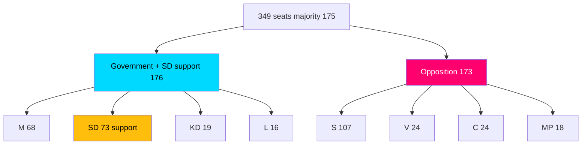

# Election 2026 Analysis — Committee Reports Batch, 2026-05-29

> How the seven-report batch feeds the September 2026 general-election narrative. AI-generated for Riksdagsmonitor. Votes pending (riksdagen.se). Seat baseline: government bloc M 68, KD 19, L 16 + SD 73 support = 176; opposition S 107, V 24, C 24, MP 18 = 173 (349 seats, majority 175).

## Electoral salience ranking

| Report | Electoral salience | Owning bloc message |
|--------|-------------------|---------------------|
| HD01NU20 wind compensation | HIGH | Govt: energy delivery; Opp: too little, too late |
| HD01UbU23 curricula | HIGH | Govt: knowledge & standards; Opp: politicised disruption |
| HD01JuU35 sentences abroad | MEDIUM | Govt: law & order; Opp(V/MP): rights caution |
| HD01MJU27 food fraud | LOW | Cross-bloc consumer protection |
| HD01TU17 telecom fraud | LOW | Cross-bloc consumer protection |
| HD01TU18 interoperability | LOW | Govt: competent digital state |
| HD01CU44 EU Inc. | LOW | Sovereignty signalling |

## Bloc seat context

## Campaign-line analysis

- **Energy (HD01NU20):** the government converts a controversial reform into a "we deliver local benefit" line; the opposition (S, C, V, MP) counters that compensation is small, slow and a distraction from the permitting bottleneck (HD01NU20).
- **Education (HD01UbU23):** L and M campaign on knowledge and standards; S, V, C, MP campaign on equity, consultation and policy stability (HD01UbU23).
- **Law and order (HD01JuU35):** M, KD, SD campaign on capacity and toughness; V and MP campaign on rights and constitutional caution (HD01JuU35).

## Marginal-voter implications

The flagships map onto the classic 2026 cleavages — energy cost, school standards, crime. Both reforms are likely to **mobilise existing blocs rather than convert marginal voters**, with the rural energy debate (HD01NU20) and the school-standards debate (HD01UbU23) the most likely to move soft voters at the edges.

## Net electoral assessment

The batch is **net-neutral-to-favourable** for the government if it passes cleanly (Scenario 1), but carries downside if the flagships escalate (Scenario 3) or HD01JuU35 stumbles on the qualified-majority test (Scenario 2). The consensus cluster contributes a quiet competence dividend that neither bloc can easily attack (HD01MJU27, HD01TU17, HD01TU18, HD01CU44). Final electoral read-through depends on the recorded votes (riksdagen.se).
