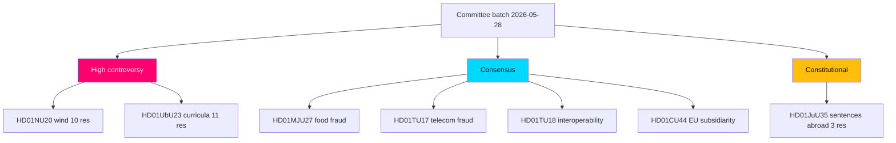

# Energy and Schools Split the Riksdag While Four Quiet Reforms Sail Through

> Executive brief — committee-reports cycle. Author: James Pether Sörling. Status: pre-vote (chamber decisions pending).

## BLUF — Bottom Line Up Front

Seven committee reports reached the Riksdag floor on 2026-05-28, and the political energy concentrated on exactly two: **wind-power revenue-sharing (HD01NU20)** and **new school curricula (HD01UbU23)**. Together they drew **21 reservations** spanning the entire opposition bloc (S, V, C, MP), confirming energy and education as the defining 2026 pre-election cleavages. A third report — **enforcing Swedish prison sentences abroad (HD01JuU35)** — is constitutionally distinctive: it transfers public authority to a foreign state and therefore needs a **qualified majority**, forcing the Social Democrats into a visible position despite only three reservations. The remaining four reports (food-fraud control HD01MJU27, telecom anti-fraud HD01TU17, public-sector interoperability HD01TU18, and the EU "EU Inc." subsidiarity review HD01CU44) passed committee with **zero reservations**, a reminder that consensus governance still dominates the technical-administrative agenda even in a polarised pre-election spring (HD01NU20, HD01UbU23, HD01JuU35).

The single most important caveat: **none of these reports has been voted yet.** They were debated 2026-05-28; chamber `voteringar` records are pending. Every party-share statement below is projected from reservation alignment, not observed (riksdagen.se).

## Decisions This Brief Supports

1. **Editorial prioritisation** — lead coverage with HD01NU20 and HD01UbU23 (highest controversy, highest salience); treat the four consensus reports as a single "quiet governance" sidebar (HD01MJU27, HD01TU17, HD01TU18, HD01CU44).
2. **Monitoring allocation** — set a next-week watch on the HD01JuU35 vote specifically, because the qualified-majority threshold (RF 10 kap.) is the batch's only genuinely uncertain outcome (HD01JuU35).
3. **Forward framing** — position the energy and education votes as leading 2026-campaign indicators, and pre-draft reversal-risk angles for HD01UbU23 should the post-election majority shift (HD01UbU23).
4. **Sleeper watch (Pass-2 refinement)** — do not let the zero-reservation count on HD01TU18 hide its reach: public-sector interoperability quietly rewires cross-agency data flows and may prove more consequential in five years than a wind-compensation tweak. Carry a low-intensity but persistent watch (HD01TU18).

## What Happened

Näringsutskottet recommends a statutory **wind-power compensation** scheme — operators must share annual revenue with neighbouring residents, tax-free for private dwellings — as a substitute for the stalled municipal-veto reform. The opposition filed **10 reservations** arguing the scheme is too small and dodges the veto bottleneck (HD01NU20). Utbildningsutskottet endorses the government's *kunskapsskola* curriculum re-centring on knowledge and assessment, rejecting all motions; the opposition filed **11 reservations** on equity, process and politicisation grounds (HD01UbU23). Justitieutskottet authorises temporary enforcement of Swedish sentences abroad to relieve Kriminalvården's capacity crisis, with three V/MP reservations and a qualified-majority requirement (HD01JuU35).

## 60-Second Read

- **Two fights, four handshakes, one constitutional knife-edge.** Energy and schools polarise; food safety, telecom fraud, data interoperability and EU subsidiarity unite (HD01NU20, HD01UbU23, HD01MJU27, HD01TU17, HD01TU18, HD01CU44).
- **The opposition is fully mobilised** on HD01NU20 and HD01UbU23 — all four opposition parties reserved on both.
- **HD01JuU35 is the one to watch:** a qualified-majority transfer of authority to Estonia, dependent on S cooperation (HD01JuU35).
- **Nothing is final** — votes pending; treat all alignment as projected (riksdagen.se).

## Top Documents Table (controversy-ranked)

| Rank | dok_id | Subject | Reservations | Why it leads |
|------|--------|---------|--------------|--------------|
| 1 | HD01NU20 | Wind-power revenue-sharing | 10 | Energy is the top 2026 wedge |
| 2 | HD01UbU23 | New school curricula | 11 | Identity-defining education fight |
| 3 | HD01JuU35 | Sentences abroad | 3 | Constitutional qualified-majority test |
| 4 | HD01TU17 | Telecom anti-fraud | 0 | Salient consumer harm, consensus |
| 5 | HD01TU18 | Data interoperability | 0 | EU-aligned state modernisation |
| 6 | HD01MJU27 | Food-chain fraud | 0 | Valence consumer protection |
| 7 | HD01CU44 | EU "EU Inc." subsidiarity | 0 | Sovereignty signal (thin record) |

## Risk & Threat Snapshot

- **Narrative-capture risk (HD01NU20):** "too little, too late" framing could neutralise the government's local-benefit message.
- **Implementation-legitimacy risk (HD01UbU23):** an 11-reservation mandate is fragile and reversible after 2026.
- **Accountability-diffusion risk (HD01JuU35):** Swedish responsibility for conditions in foreign prison facilities.
- **Attack-surface risk (HD01TU18):** broader public-sector data sharing widens confidentiality/integrity exposure.

## Top Forward Trigger

**The HD01JuU35 chamber vote (next week).** If the qualified-majority threshold is met, it sets a reusable constitutional precedent for transferring enforcement authority abroad; if it fails, it exposes the limits of the government's law-and-order coalition (HD01JuU35).

## Links

- Riksdag open data: https://data.riksdagen.se
- Per-document analyses: `documents/HD01NU20-analysis.md`, `documents/HD01UbU23-analysis.md`, `documents/HD01JuU35-analysis.md`, and four consensus reports.

## Mermaid — Brief Decision Map

