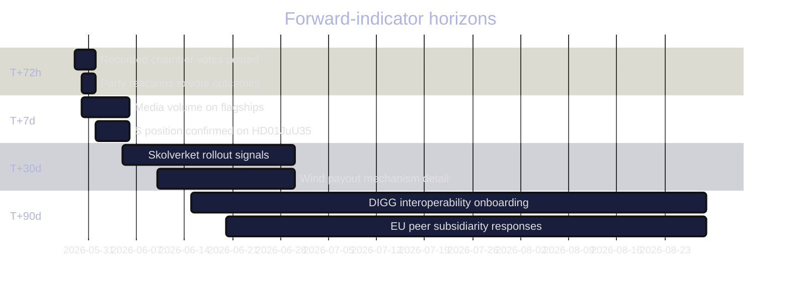

# Forward Indicators — Committee Reports Batch, 2026-05-29

> Dated, watch-list indicators across four horizons for the seven-report batch. AI-generated for Riksdagsmonitor. Votes pending (riksdagen.se).

## Horizon gantt

## Indicator watch-list

1. **2026-05-29 → 2026-06-01 (T+72h):** Recorded chamber vote tallies for all seven reports posted on riksdagen.se (PIR-NU20-VOTE, PIR-UbU23-VOTE) (HD01NU20, HD01UbU23).
2. **2026-05-29 → 2026-06-01 (T+72h):** Final reservation alignment confirmed against projections (HD01NU20, HD01UbU23, HD01JuU35).
3. **2026-05-30 → 2026-06-05 (T+7d):** Socialdemokraterna's recorded HD01JuU35 position and whether the qualified-majority threshold held (PIR-JuU35-MAJORITY) (HD01JuU35).
4. **2026-05-30 → 2026-06-06 (T+7d):** Media-volume ratio of flagships vs consensus cluster (HD01NU20, HD01UbU23).
5. **2026-06-01 → 2026-06-10 (T+7–14d):** Teacher-union and Skolverket statements on the curricula timeline (HD01UbU23).
6. **2026-06-05 → 2026-06-30 (T+30d):** First concrete wind-compensation payout figures and timing published (HD01NU20).
7. **2026-06-05 → 2026-06-30 (T+30d):** Kriminalvården operational planning for foreign-facility transfers (HD01JuU35).
8. **2026-06-10 → 2026-07-01 (T+30d):** PTS guidance on operator message-blocking proportionality (HD01TU17).
9. **2026-06-15 → 2026-08-30 (T+90d):** DIGG interoperability onboarding milestones and any IMY data-protection review (HD01TU18).
10. **2026-06-20 → 2026-08-30 (T+90d):** Whether peer national parliaments join the EU Inc. subsidiarity objection (PIR-CU44-EU) (HD01CU44).
11. **2026-06-30 → 2026-08-30 (T+90d):** Livsmedelsverket inspection-capacity signals under the new fraud-control powers (HD01MJU27).
12. **2026-07-01 → 2026-09-01 (T+90d):** Whether the flagships re-enter the 2026 campaign narrative as the election approaches (HD01NU20, HD01UbU23).

## Indicator-to-PIR mapping

| Indicator | PIR | Horizon |
|-----------|-----|---------|
| Vote tallies | PIR-NU20-VOTE, PIR-UbU23-VOTE | T+72h |
| S position | PIR-JuU35-MAJORITY | T+7d |
| Agency rollout | PIR-IMPL-CAPACITY | T+30–90d |
| EU peers | PIR-CU44-EU | T+90d |

## Net forward-indicator assessment

The **single most important near-term indicator** is the recorded vote set (T+72h), which converts every reservation-based projection in this batch into confirmed fact (riksdagen.se). The most consequential medium-term indicators are the agency-capacity signals (T+30–90d) that will determine whether the flagships and HD01TU18 deliver in practice (HD01UbU23, HD01TU18, HD01JuU35). All twelve indicators are dated and tied to open PIRs for next-cycle roll-forward.
