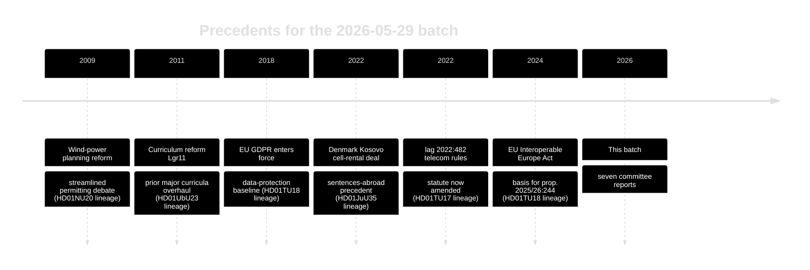

# Historical Parallels — Committee Reports Batch, 2026-05-29

> Historical precedents and analogues for the policy moves in the seven-report batch. AI-generated for Riksdagsmonitor (riksdagen.se).

## Timeline of relevant precedents

## Parallel 1 — Wind permitting and local benefit (HD01NU20)

Sweden has debated wind-power siting and the municipal veto for over a decade. The 2009-era planning reforms and recurring veto-abolition debates form the backdrop. The current revenue-sharing approach echoes long-standing Nordic "local benefit" models used to buy social licence — but Sweden has historically lagged Denmark and Norway in monetising local acceptance (HD01NU20).

## Parallel 2 — Curriculum overhauls (HD01UbU23)

The *kunskapsskola* push parallels the Lgr11 curriculum reform and the broader pendulum between knowledge-focused and holistic-learning paradigms that has swung repeatedly in Swedish education policy. Each major overhaul has generated profession and equity debates similar to the current reservations (HD01UbU23).

## Parallel 3 — Sentences served abroad (HD01JuU35)

Denmark's 2022 agreement to rent prison cells in Kosovo is the closest direct precedent. Norway historically rented capacity in the Netherlands. Sweden's version is distinguished by the **qualified-majority requirement** triggered by transferring authority to a foreign state — a constitutional feature absent from the Danish model (HD01JuU35).

## Parallel 4 — Digital interoperability (HD01TU18)

The interoperability measure sits in a lineage running from GDPR (2018) through the EU Interoperable Europe Act (2024). Nordic peers — Denmark's MitID/GovTech stack and Norway's Altinn — provide mature precedents that Sweden is now following (HD01TU18).

## Parallel 5 — Consumer-fraud enforcement (HD01MJU27, HD01TU17)

Both food-chain and telecom anti-fraud measures extend an established Swedish pattern of incremental statutory enforcement against consumer harm, building on the existing lag 2022:482 telecom framework (HD01TU17, HD01MJU27).

## Lessons from precedent

1. **Local benefit works slowly:** Nordic experience shows wind compensation builds acceptance only when payouts are visible and timely (HD01NU20).
2. **Curriculum reforms are reversible:** prior overhauls show policy stability is itself a campaign issue (HD01UbU23).
3. **Constitutional transfers are sticky:** Denmark's smoother path underscores how Sweden's qualified-majority bar raises the political cost (HD01JuU35).

## Net historical assessment

The batch is **evolutionary, not revolutionary**: each report extends a recognisable Swedish or Nordic policy lineage. The genuinely novel feature is the constitutional framing of HD01JuU35, which has no clean domestic precedent and most closely resembles — but is procedurally harder than — Denmark's 2022 arrangement (HD01JuU35).
