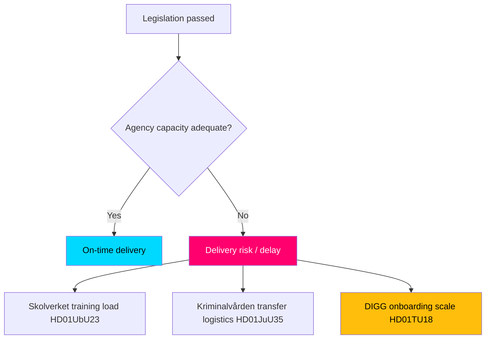

# Implementation Feasibility — Committee Reports Batch, 2026-05-29

> Delivery-risk assessment for the seven-report batch, focused on the agencies responsible for turning legislation into operational reality. AI-generated for Riksdagsmonitor. Votes pending (riksdagen.se).

> Note on agency oversight sources: no Statskontoret (statskontoret.se) evaluation specific to these 2026 measures was located at analysis time — none found. The assessments below are inferred from each agency's mandate.

## Responsible agencies

| Report | Lead agency | Delivery task |
|--------|-------------|---------------|
| HD01NU20 | Länsstyrelse / Energimyndigheten | Administer wind compensation & payouts |
| HD01UbU23 | Skolverket | Curriculum guidance, teacher training, materials |
| HD01JuU35 | Kriminalvården | Prisoner transfer & foreign-facility oversight |
| HD01MJU27 | Livsmedelsverket | Food-chain fraud inspection |
| HD01TU17 | PTS | Supervise operator message-blocking |
| HD01TU18 | DIGG | Coordinate interoperability standards & onboarding |

## Feasibility flow

## Agency-by-agency feasibility

### Skolverket — HD01UbU23 (HIGH delivery risk)
The curricula reform's success hinges on teacher training, updated materials and a realistic rollout timeline. Without resourced support, the reform risks classroom-level non-implementation and backlash — the highest-stakes delivery challenge in the batch (HD01UbU23).

### Kriminalvården — HD01JuU35 (MEDIUM-HIGH delivery risk)
Operating sentences in foreign facilities introduces prisoner-transfer logistics, legal-applicability questions and oversight obligations that are novel and administratively heavy (HD01JuU35).

### DIGG — HD01TU18 (MEDIUM delivery risk)
Coordinating interoperability across many agencies is a large standard-setting and onboarding task with embedded data-protection and security risk; pace and security-by-design discipline determine success (HD01TU18).

### PTS — HD01TU17 (LOW-MEDIUM delivery risk)
Supervising proportional message-blocking is within PTS's existing competence but requires careful false-positive management (HD01TU17).

### Livsmedelsverket — HD01MJU27 (LOW delivery risk)
New fraud-control powers extend existing inspection functions; main constraint is inspection resourcing (HD01MJU27).

### Länsstyrelse / Energimyndigheten — HD01NU20 (MEDIUM delivery risk)
Administering payouts is feasible, but timeliness and clarity of the compensation mechanism determine whether the policy achieves its acceptance goal (HD01NU20).

## Feasibility summary

| Report | Delivery risk | Binding constraint |
|--------|--------------|--------------------|
| HD01UbU23 | HIGH | Teacher training & timeline |
| HD01JuU35 | MEDIUM-HIGH | Transfer logistics & oversight |
| HD01TU18 | MEDIUM | Onboarding scale & security |
| HD01NU20 | MEDIUM | Payout timeliness |
| HD01TU17 | LOW-MEDIUM | False-positive management |
| HD01MJU27 | LOW | Inspection resourcing |

## Net feasibility assessment

Legislative passage is the easy part; **implementation capacity is the binding constraint** for the most consequential measures. Skolverket (HD01UbU23), Kriminalvården (HD01JuU35) and DIGG (HD01TU18) face the heaviest delivery loads. A dedicated post-passage Statskontoret-style evaluation (statskontoret.se) would materially de-risk these reforms; none specific to this batch exists yet — none found (riksdagen.se).
