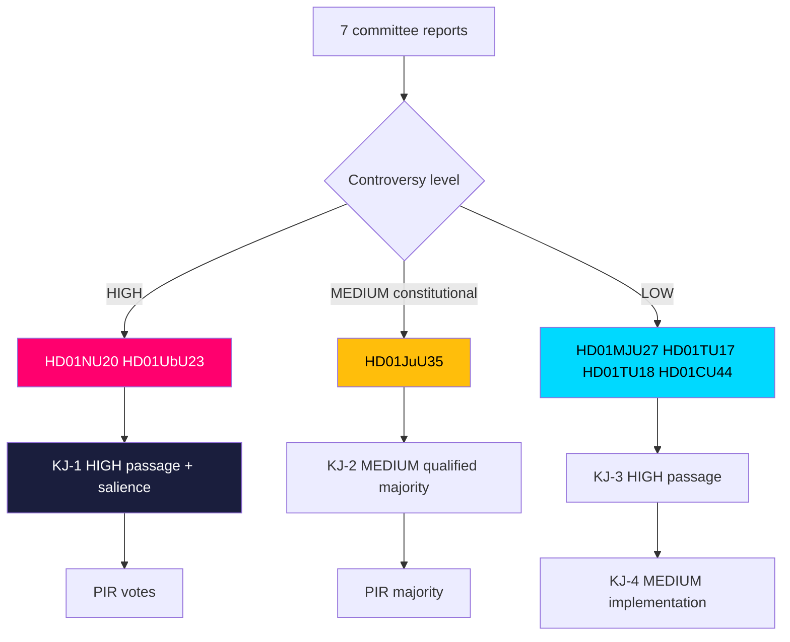

# Intelligence Assessment — Committee Reports Batch, 2026-05-29

> Formal intelligence assessment with explicit Key Judgments, calibrated confidence (ICD 203), and Priority Intelligence Requirements. AI-generated for Riksdagsmonitor. Votes pending (riksdagen.se).

## Bottom line

The 2026-05-29 committee batch is a **bifurcated signal**: two high-controversy flagship reforms (HD01NU20, HD01UbU23) carry the campaign weight, one constitutional outlier (HD01JuU35) tests cross-bloc cooperation, and a four-report consensus cluster (HD01MJU27, HD01TU17, HD01TU18, HD01CU44) demonstrates routine governing competence.

## Key Judgments

**KJ-1.** We assess with **HIGH** confidence that HD01NU20 and HD01UbU23 will pass on the government's majority and become defining 2026-campaign dividing lines, given the double-digit, all-opposition reservation counts (HD01NU20, HD01UbU23).

**KJ-2.** We assess with **MEDIUM** confidence that HD01JuU35's qualified-majority requirement (RF 10 kap.) will be met, contingent on Socialdemokraterna's cooperation; failure or delay is a plausible alternative outcome (HD01JuU35).

**KJ-3.** We judge with **HIGH** confidence that the consensus cluster (HD01MJU27, HD01TU17, HD01TU18, HD01CU44) will pass with limited or no dissent, delivering low-salience competence signals (HD01MJU27, HD01TU17, HD01TU18, HD01CU44).

**KJ-4.** We assess with **MEDIUM** confidence that implementation capacity — not legislative passage — will be the binding constraint on the consensus cluster's real-world impact, given the agency-resourcing dependencies (HD01UbU23, HD01TU18).

**KJ-5.** We judge with **LOW** confidence that HD01CU44's subsidiarity objection will materially alter the EU "EU Inc." trajectory, given thin documentation and the need for a multi-parliament yellow card (HD01CU44).

## Confidence summary

| Judgment | Confidence | Basis |
|----------|-----------|-------|
| KJ-1 flagship passage & salience | HIGH | Reservation topology (HD01NU20, HD01UbU23) |
| KJ-2 qualified-majority outcome | MEDIUM | S-dependency uncertainty (HD01JuU35) |
| KJ-3 consensus passage | HIGH | Zero/low reservations (HD01MJU27, HD01TU17, HD01TU18, HD01CU44) |
| KJ-4 implementation constraint | MEDIUM | Agency capacity inference (HD01UbU23, HD01TU18) |
| KJ-5 EU subsidiarity impact | LOW | Thin text, structural weakness (HD01CU44) |

## Priority Intelligence Requirements

- **PIR-NU20-VOTE:** What is the recorded chamber vote and final reservation alignment on HD01NU20? (open) (HD01NU20)
- **PIR-UbU23-VOTE:** What is the recorded vote and any concession on HD01UbU23 implementation timeline? (open) (HD01UbU23)
- **PIR-JuU35-MAJORITY:** Does the qualified-majority threshold hold, and what is S's recorded position? (open) (HD01JuU35)
- **PIR-IMPL-CAPACITY:** Are Skolverket / DIGG / Kriminalvården resourced for delivery? (open) (HD01UbU23, HD01TU18, HD01JuU35)
- **PIR-CU44-EU:** Do peer parliaments join the subsidiarity objection? (open) (HD01CU44)

## Assessment flow

## Intelligence gaps

1. **Recorded votes** for all seven reports remain PENDING (debated 2026-05-28) — the single largest gap (riksdagen.se).
2. **S's explicit HD01JuU35 position** is inferred, not confirmed (HD01JuU35).
3. **HD01CU44** rests on minimal full text (~1.5 KB), capping confidence (HD01CU44).

## Net assessment

This batch rewards a two-track reading. Track one — the flagships (HD01NU20, HD01UbU23) — is where 2026-campaign narratives crystallise and where our confidence is highest. Track two — the constitutional outlier (HD01JuU35) — is where the most analytically interesting uncertainty sits, because the qualified-majority rule converts the largest opposition party into a swing actor. The consensus cluster is high-confidence on passage but should be watched on implementation capacity (KJ-4).
