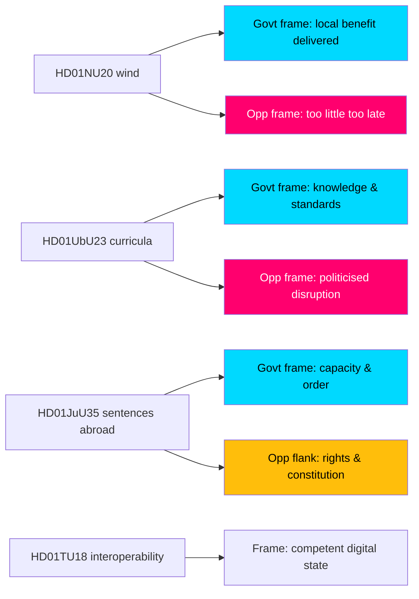

# Media Framing Analysis — Committee Reports Batch, 2026-05-29

> How the seven-report batch is likely to be framed across Swedish media and by political actors. AI-generated for Riksdagsmonitor. Votes pending (riksdagen.se).

## Framing contest map

## Frame-by-frame analysis

### HD01NU20 — wind compensation
- **Government frame:** "We deliver tangible local benefit and make wind work for rural Sweden" — emphasises the tax-free payout (HD01NU20).
- **Opposition frame (S, C, V, MP):** "Too little, too late; the real problem is the permitting bottleneck the government won't fix" (HD01NU20).
- **Likely media frame:** energy-cost-and-fairness story; rural voices foregrounded. **Contested, high volume.**

### HD01UbU23 — curricula
- **Government frame (L, M):** "Restoring knowledge and standards in Swedish schools" (HD01UbU23).
- **Opposition frame (S, V, C, MP):** "A politicised, rushed overhaul that destabilises classrooms and ignores equity" (HD01UbU23).
- **Likely media frame:** classroom-impact and teacher-reaction story. **Polarised, high volume.**

### HD01JuU35 — sentences abroad
- **Government frame (M, KD, SD):** "Decisive action on prison capacity and order" (HD01JuU35).
- **Opposition flank (V, MP):** "Rights risks and a constitutional shortcut" (HD01JuU35).
- **Likely media frame:** law-and-order with a constitutional-process sidebar (the qualified-majority angle). **Moderate volume, distinctive.**

### Consensus cluster (HD01MJU27, HD01TU17, HD01TU18, HD01CU44)
- **Dominant frame:** competent, low-drama governance; little adversarial framing (HD01MJU27, HD01TU17, HD01TU18, HD01CU44).
- **Likely media frame:** brief or absent coverage; HD01TU18's data-sharing could attract a privacy sidebar (HD01TU18). **Low volume.**

## Frame-strength assessment

| Report | Strongest frame | Frame contest | Expected volume |
|--------|----------------|---------------|-----------------|
| HD01NU20 | Govt "local benefit" vs Opp "too little" | Active | HIGH |
| HD01UbU23 | Govt "standards" vs Opp "disruption" | Active | HIGH |
| HD01JuU35 | Govt "order" vs flank "rights" | Asymmetric | MEDIUM |
| HD01TU18 | "Competent digital state" | Latent privacy angle | LOW |
| HD01MJU27 / HD01TU17 | "Consumer protection" | Minimal | LOW |
| HD01CU44 | "EU sovereignty" | Minimal | LOW |

## Narrative risks

1. **Energy backlash (HD01NU20):** if payouts look token, the government's "delivery" frame collapses into the opposition's "too little" frame (HD01NU20).
2. **Teacher revolt (HD01UbU23):** visible profession opposition could flip the "standards" frame into "chaos" (HD01UbU23).
3. **Privacy sidebar (HD01TU18):** a data-sharing incident could retroactively reframe a "competent" measure as a "surveillance" risk (HD01TU18).

## Net framing assessment

The framing battle is concentrated on the two flagships, where government and opposition offer **symmetric, well-developed competing frames** (HD01NU20, HD01UbU23). HD01JuU35 features an **asymmetric** contest — a dominant order frame with a smaller rights flank (HD01JuU35). The consensus cluster is largely frame-free, with HD01TU18's latent privacy angle the only sleeper risk (HD01TU18).
