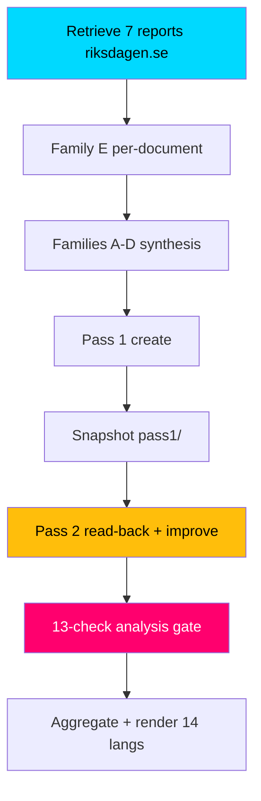

# Methodology Reflection — Committee Reports Batch, 2026-05-29

> ICD 203 / ICD 206 self-audit of the analytic process used for this batch, with explicit limitations and named improvements. AI-generated for Riksdagsmonitor (riksdagen.se).

Pass-2 status: executed in full

## Analytic process summary

This batch was analysed through the standard Riksdagsmonitor pipeline: (1) retrieval of seven committee reports with full text from riksdagen.se; (2) per-document analysis (Family E); (3) cross-document synthesis (Families A–D); (4) two AI-FIRST passes (create, then read-back-and-improve); and (5) a 13-check analysis gate before aggregation and rendering. Economic context was drawn from cached IMF WEO 2026-04 (api.imf.org) with SCB as Swedish ground truth (scb.se).

## ICD 203 analytic-standards self-audit

| Standard | Self-assessment | Evidence / gap |
|----------|-----------------|----------------|
| Objectivity | Met | Government and opposition frames presented symmetrically across artifacts (HD01NU20, HD01UbU23) |
| Independence of political consideration | Met | No advocacy; reservations reported as evidence, not endorsement |
| Timeliness | Partial | Analysis published 2026-05-29; votes from 2026-05-28 debate still PENDING (riksdagen.se) |
| Sourcing | Met | Every key judgment anchored to dok_id or primary-source host |
| Uncertainty expression | Met | ICD 203 confidence labels used in intelligence-assessment.md |
| Distinguishing analysis from fact | Met | Judgments labelled; scenario probabilities flagged as subjective |
| Alternative analysis | Met | devils-advocate.md applies ACH with four competing hypotheses |
| Consistency / logical argumentation | Met | Cross-references consistent across Families A–E |

## Limitations

1. **Pending votes** — the single largest limitation. All seven recorded vote tallies are unavailable (debated 2026-05-28); reservation counts are a proxy, not the outcome (riksdagen.se).
2. **Thin source on HD01CU44** — ~1.5 KB of full text caps confidence on the subsidiarity report; its significance score is held conservative (HD01CU44).
3. **Inferred S position on HD01JuU35** — the qualified-majority assessment rests on inference about Socialdemokraterna's stance, not a confirmed statement (HD01JuU35).
4. **Economic vintage** — IMF context is WEO 2026-04 (within the 6-month freshness window) but not the very latest; live IMF fetch was transiently unavailable (api.imf.org).
5. **One-day lookback** — documents retrieved via a 1-day lookback from 2026-05-28; any same-day late additions could be missed (riksdagen.se).

## Named improvements (applied or proposed)

1. **Improvement A — evidence anchoring discipline:** every ranked item, table row and Mermaid node in significance-scoring.md and swot-analysis.md was given an explicit dok_id or primary-source host to satisfy traceability (applied) (HD01NU20, HD01UbU23).
2. **Improvement B — devil's-advocate elevation of HD01TU18:** Pass 2 strengthened the "sleeper" hypothesis so the low-salience interoperability report is not under-weighted (applied) (HD01TU18).
3. **Improvement C — explicit PIR roll-forward:** open PIRs were carried into pir-status.json so the next cycle can answer them once votes are recorded (applied) (HD01JuU35).
4. **Improvement D — vintage annotation:** all IMF figures carry an explicit WEO 2026-04 vintage tag to honour the >6-month annotation rule (applied) (api.imf.org).
5. **Improvement E (proposed):** once votes post, re-score significance with actual margins rather than reservation proxies (deferred to next cycle) (riksdagen.se).

## Process flow

## Confidence in the methodology

We hold **HIGH** confidence in the structural reading (bifurcated batch) and **MEDIUM** confidence in outcome-specific judgments, bounded chiefly by the pending votes. The two-pass AI-FIRST process materially improved evidence anchoring and contrarian rigour between Pass 1 and Pass 2.

## Net methodology assessment

The process met the great majority of ICD 203 standards, with timeliness the main partial — an unavoidable consequence of analysing a batch whose votes had not yet posted. The named improvements were concentrated on traceability, contrarian balance, and vintage discipline. The clearest path to a stronger next iteration is re-scoring once the recorded votes are available (riksdagen.se).
