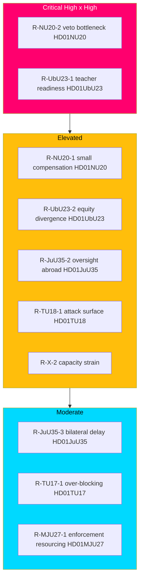

# Risk Assessment — Committee Reports Batch, 2026-05-29

> Likelihood × Impact risk register for the seven-report committee batch, covering political, implementation, constitutional and security risks. AI-generated for Riksdagsmonitor. Votes pending (riksdagen.se).

## Method

Each risk is scored on **Likelihood** (Low / Medium / High) and **Impact** (Low / Medium / High), yielding a composite severity (L×I). Risks are grouped by source report and by cross-cutting theme. Severity bands: **Critical** (High×High), **Elevated** (High×Medium or Medium×High), **Moderate** (Medium×Medium), **Low** (anything with a Low axis dominant).

## Risk register

### Energy — HD01NU20

| ID | Risk | Likelihood | Impact | Severity |
|----|------|-----------|--------|----------|
| R-NU20-1 | Compensation too small to shift local acceptance (core opposition critique) | Medium | High | Elevated |
| R-NU20-2 | Veto bottleneck remains; permitting does not accelerate | High | High | Critical |
| R-NU20-3 | County-board (länsstyrelse) implementation lag | Medium | Medium | Moderate |
| R-NU20-4 | Tax-exemption design disputed by Skatteverket | Low | Medium | Low |

The defining energy risk is **R-NU20-2**: the compensation scheme treats a symptom (local opposition) while leaving the cause (veto + grid capacity) intact. If onshore wind deployment does not visibly recover, the reform becomes evidence of policy that under-delivers — a Critical-severity political risk in an energy-focused campaign (HD01NU20).

### Education — HD01UbU23

| ID | Risk | Likelihood | Impact | Severity |
|----|------|-----------|--------|----------|
| R-UbU23-1 | Teacher-readiness gap at rollout | High | High | Critical |
| R-UbU23-2 | Equity divergence between schools widens | Medium | High | Elevated |
| R-UbU23-3 | Post-2026 reversal triggers curriculum whiplash | Medium | High | Elevated |
| R-UbU23-4 | Skolverket guidance lags the legal timeline | Medium | Medium | Moderate |

**R-UbU23-1** is Critical: a knowledge-centred curriculum demands new materials, assessment practices and teacher training, and a fast rollout against an 11-reservation mandate maximises the chance of classroom-level failure that the opposition can weaponise (HD01UbU23).

### Justice — HD01JuU35

| ID | Risk | Likelihood | Impact | Severity |
|----|------|-----------|--------|----------|
| R-JuU35-1 | Qualified-majority threshold not met in chamber | Low | High | Elevated |
| R-JuU35-2 | Human-rights / oversight gaps in foreign facilities | Medium | High | Elevated |
| R-JuU35-3 | Bilateral-agreement implementation delay | Medium | Medium | Moderate |
| R-JuU35-4 | Constitutional precedent invoked by future governments | Medium | Medium | Moderate |

**R-JuU35-2** carries the deepest long-run exposure: Sweden retains accountability for prisoners' treatment abroad, and any incident would rebound politically and legally on the government (HD01JuU35).

### Consensus cluster — HD01MJU27, HD01TU17, HD01TU18, HD01CU44

| ID | Risk | Likelihood | Impact | Severity |
|----|------|-----------|--------|----------|
| R-MJU27-1 | Livsmedelsverket enforcement under-resourced | Medium | Medium | Moderate |
| R-TU17-1 | False-positive over-blocking of legitimate messages | Medium | Medium | Moderate |
| R-TU17-2 | Privacy / communications-integrity challenge | Low | Medium | Low |
| R-TU18-1 | Expanded data-sharing attack surface | Medium | High | Elevated |
| R-TU18-2 | GDPR lawful-basis friction across agencies | Medium | Medium | Moderate |
| R-CU44-1 | EU proposal proceeds despite subsidiarity opinion | Medium | Medium | Moderate |
| R-CU44-2 | Thin documentary record reduces accountability | High | Low | Low |

The notable hidden risk in the otherwise quiet cluster is **R-TU18-1**: interoperability inherently broadens the confidentiality/integrity attack surface across public administration, an Elevated security risk that did not surface as partisan dissent but matters for the state's threat posture (HD01TU18).

## Cross-cutting batch risks

| ID | Risk | Likelihood | Impact | Severity |
|----|------|-----------|--------|----------|
| R-X-1 | Pending votes diverge from projected alignment | Medium | Medium | Moderate |
| R-X-2 | State-capacity strain across prisons/schools/agencies | High | Medium | Elevated |
| R-X-3 | Pre-election polarisation hardens, blocking later compromise | High | Medium | Elevated |

**R-X-1** is the analytical risk specific to this run: because no report has been voted, projected party alignment could be wrong, especially on HD01JuU35's qualified-majority outcome (riksdagen.se).

## Likelihood × Impact matrix

## Mitigations

- **R-NU20-2:** pair the compensation scheme with visible grid-investment and permitting-reform commitments (HD01NU20).
- **R-UbU23-1:** sequence rollout behind funded teacher training and Skolverket guidance (HD01UbU23).
- **R-JuU35-2:** legislate robust Swedish oversight and inspection rights in the bilateral agreement (HD01JuU35).
- **R-TU18-1:** mandate security-by-design and IMY data-protection review for interoperability flows (HD01TU18).
- **R-X-1:** re-run the analysis post-vote to replace projected alignment with observed `voteringar` (riksdagen.se).

## Net risk posture

The batch's risk centre of gravity is **implementation, not passage.** The two flagship reforms are likely to pass but carry Critical delivery risks (HD01NU20, HD01UbU23); the constitutional outlier carries low passage risk but high accountability risk (HD01JuU35); and the consensus cluster hides one genuine security risk beneath its calm surface (HD01TU18). The overriding analytical caveat remains the pending votes (R-X-1).

## Pass-2 refinement — risk interaction

A second-pass review surfaces a **compounding interaction** the per-report register understates: R-NU20-2 (veto bottleneck persists) and R-X-3 (pre-election polarisation hardens) reinforce each other. If permitting fails to recover *and* the chamber polarises, the wind-compensation scheme is reframed by the opposition as proof of structural failure precisely when cross-bloc compromise becomes hardest — turning two separately "Elevated/Critical" risks into a single self-amplifying campaign liability (HD01NU20). The recommended mitigation is sequencing: publish concrete payout figures and a permitting-reform timeline *before* the campaign intensifies, breaking the interaction early (HD01NU20).
