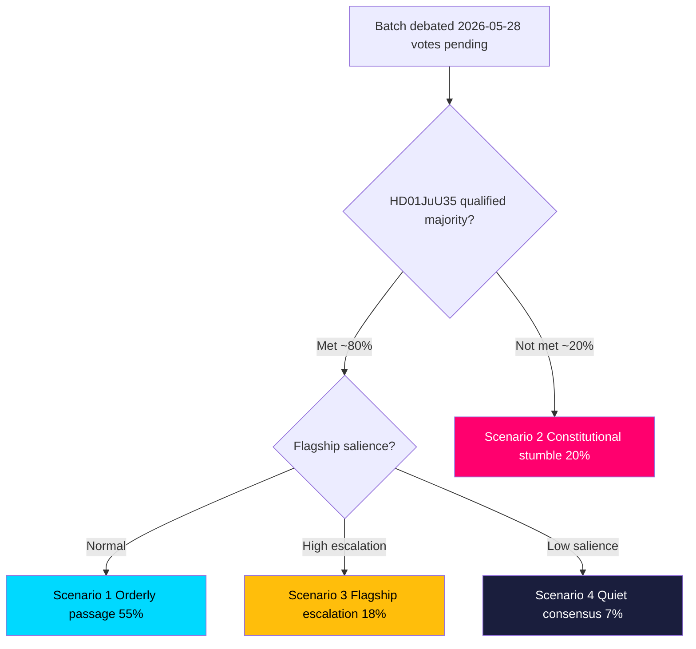

# Scenario Analysis — Committee Reports Batch, 2026-05-29

> Forward-looking scenario tree for the seven-report committee batch, with calibrated probabilities and trigger indicators. AI-generated for Riksdagsmonitor. Votes pending (riksdagen.se).

## Method

We construct four primary scenarios spanning the realistic outcome space for the batch, anchored on the two genuine uncertainties: (1) the qualified-majority outcome on HD01JuU35, and (2) the degree of campaign salience the flagships acquire (HD01NU20, HD01UbU23). Probabilities are subjective and sum across mutually exclusive branches.

## Scenario 1 — "Orderly passage" (baseline, ~55%)

All seven reports pass as expected: flagships on the government majority, HD01JuU35 clears its qualified-majority threshold with S cooperation, and the consensus cluster passes uneventfully (HD01NU20, HD01UbU23, HD01JuU35, HD01MJU27, HD01TU17, HD01TU18, HD01CU44).

- **Triggers:** S signals cooperation on HD01JuU35; no last-minute amendments.
- **Implication:** government banks a competence + delivery narrative; opposition shifts fight to implementation and the campaign (HD01NU20, HD01UbU23).

## Scenario 2 — "Constitutional stumble" (~20%)

The flagships and consensus cluster pass, but HD01JuU35 fails or is deferred because the qualified-majority threshold is not met (HD01JuU35).

- **Triggers:** S withholds support or conditions it; V/MP rights objections gain traction.
- **Implication:** prison-capacity agenda stalls; government absorbs a procedural defeat; renewed negotiation or redesign (HD01JuU35).

## Scenario 3 — "Flagship escalation" (~18%)

All reports pass, but HD01NU20 and/or HD01UbU23 escalate into dominant national stories, crowding out the competence narrative (HD01NU20, HD01UbU23).

- **Triggers:** energy-price spike or rural mobilisation (HD01NU20); teacher-union or equity backlash (HD01UbU23).
- **Implication:** the batch becomes a net political liability despite legislative success.

## Scenario 4 — "Quiet consensus dominates" (~7%)

Low-salience cluster passes cleanly and the flagships fail to gain campaign traction, leaving the batch as routine governing housekeeping (HD01MJU27, HD01TU17, HD01TU18, HD01CU44).

- **Triggers:** competing news cycle absorbs attention; muted opposition messaging.
- **Implication:** minimal political consequence either direction.

## Scenario tree

## Probability summary

| Scenario | Probability | Key driver |
|----------|-------------|-----------|
| S1 Orderly passage | ~55% | S cooperation + normal salience (HD01JuU35, HD01NU20) |
| S2 Constitutional stumble | ~20% | Qualified-majority failure (HD01JuU35) |
| S3 Flagship escalation | ~18% | Energy/education backlash (HD01NU20, HD01UbU23) |
| S4 Quiet consensus | ~7% | News-cycle displacement (HD01MJU27, HD01TU18) |

## Indicators to watch

1. Recorded HD01JuU35 vote tally and S's position (PIR-JuU35-MAJORITY) (HD01JuU35).
2. Energy-price headlines and rural-stakeholder statements (HD01NU20).
3. Teacher-union and Skolverket commentary on the curricula timeline (HD01UbU23).
4. Media volume on flagships vs consensus cluster in the 72h after the vote (HD01NU20, HD01UbU23).

## Net scenario assessment

The modal outcome is **orderly passage (S1, ~55%)**, but the analytically decisive fork is the **qualified-majority test on HD01JuU35 (S2, ~20%)** — the only scenario in which the government suffers a clear legislative reversal. The flagship-escalation branch (S3, ~18%) is the one where legislative success and political cost diverge most sharply (HD01NU20, HD01UbU23). All probabilities are provisional pending the recorded votes (riksdagen.se).
