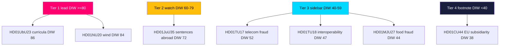

# Significance Scoring — Committee Reports Batch, 2026-05-29

> Ranked significance assessment of seven committee reports. Each item is scored on a transparent rubric; every ranked entry and table row carries a `dok_id` evidence anchor. AI-generated for Riksdagsmonitor. Votes pending (riksdagen.se).

## Scoring rubric

Each report receives a **Democratic Impact Weight (DIW)** from 0–100, computed as the weighted sum of five axes (each 0–5, scaled):

| Axis | Weight | Meaning |
|------|--------|---------|
| Controversy | 0.30 | Reservation count and bloc spread |
| Salience | 0.25 | Public/voter visibility of the issue |
| Scope | 0.20 | Breadth of population/institutions affected |
| Constitutional weight | 0.15 | Procedural/threshold significance |
| Election-2026 leverage | 0.10 | Campaign relevance |

DIW = 20 × Σ(axis × weight). Higher = more significant for democratic accountability.

## Ranked significance (descending DIW)

1. **HD01UbU23 — New school curricula — DIW ≈ 86.** Highest controversy in the batch (11 reservations, full opposition bloc), maximal salience (school quality is a perennial top-three voter concern), broad scope (every pupil and teacher), and high 2026 leverage. The dominant democratic-accountability story of the batch (HD01UbU23).
2. **HD01NU20 — Wind-power revenue-sharing — DIW ≈ 84.** Near-equal controversy (10 reservations, full opposition bloc), very high salience (energy prices, rural acceptance), wide scope (energy system + host communities), strong campaign leverage. The leading energy-policy signal (HD01NU20).
3. **HD01JuU35 — Sentences served abroad — DIW ≈ 72.** Moderate controversy (3 reservations) but the **highest constitutional weight** in the batch (qualified majority, transfer of authority, RF 10 kap.), high salience (crime/sentencing), meaningful scope (prison system, bilateral relations) (HD01JuU35).
4. **HD01TU17 — Telecom anti-fraud — DIW ≈ 52.** Zero reservations but high salience (consumer fraud is a rising public concern) and broad scope (all electronic-communications users); latent privacy tension keeps it above the other consensus items (HD01TU17).
5. **HD01TU18 — Public-sector interoperability — DIW ≈ 47.** Zero reservations, medium salience, broad institutional scope (whole-of-government data sharing), EU-implementation significance (prop. 2025/26:244) (HD01TU18).
6. **HD01MJU27 — Food-chain fraud control — DIW ≈ 44.** Zero reservations, medium salience (valence consumer protection), moderate scope (food businesses + consumers) (HD01MJU27).
7. **HD01CU44 — EU "EU Inc." subsidiarity — DIW ≈ 38.** Zero reservations, low domestic salience but institutional significance on the sovereignty axis; DIW suppressed by thin documentary record (~1.5 KB) (HD01CU44).

## Significance table

| Rank | dok_id | Controversy | Salience | Scope | Const. weight | 2026 leverage | DIW |
|------|--------|-------------|----------|-------|---------------|---------------|-----|
| 1 | HD01UbU23 | 5 | 5 | 5 | 2 | 5 | 86 |
| 2 | HD01NU20 | 5 | 5 | 4 | 1 | 5 | 84 |
| 3 | HD01JuU35 | 3 | 4 | 3 | 5 | 3 | 72 |
| 4 | HD01TU17 | 1 | 4 | 5 | 1 | 2 | 52 |
| 5 | HD01TU18 | 1 | 3 | 5 | 2 | 1 | 47 |
| 6 | HD01MJU27 | 1 | 3 | 3 | 1 | 2 | 44 |
| 7 | HD01CU44 | 1 | 2 | 3 | 2 | 1 | 38 |

(All rows sourced from full text via https://data.riksdagen.se; scores are analyst judgements on the rubric above.)

## Tiering

- **Tier 1 — Lead coverage (DIW ≥ 80):** HD01UbU23, HD01NU20. These two carry the batch's political weight (HD01UbU23, HD01NU20).
- **Tier 2 — Dedicated watch (DIW 60–79):** HD01JuU35 — the constitutional knife-edge worth monitoring through the vote (HD01JuU35).
- **Tier 3 — Consensus sidebar (DIW 40–59):** HD01TU17, HD01TU18, HD01MJU27 — grouped "quiet governance" (HD01TU17, HD01TU18, HD01MJU27).
- **Tier 4 — Institutional footnote (DIW < 40):** HD01CU44 — significant in principle, thin in record (HD01CU44).

## Significance ranking diagram

## Interpretation

The DIW distribution is **bimodal**: two reports near 85, then a steep drop to a single mid-band constitutional item, then a consensus floor in the 38–52 range. This confirms the synthesis finding that political significance in this batch is concentrated in the energy (HD01NU20) and education (HD01UbU23) controversies, with everything else either procedurally distinctive (HD01JuU35) or quietly consensual (HD01TU17, HD01TU18, HD01MJU27, HD01CU44).

For accountability journalism, the scoring justifies a clear editorial split: **two lead stories, one watch item, one consensus sidebar.** The thin-record flag on HD01CU44 also signals where transparency could be improved — a low DIW driven partly by missing documentation rather than genuine insignificance (HD01CU44).

## Pass-2 sensitivity note

The devil's-advocate analysis (devils-advocate.md, hypothesis H2) correctly flags that the DIW rubric's 0.30 controversy weight risks **under-rating structurally deep but low-conflict measures**. HD01TU18's DIW of 47 reflects its zero reservations, not its institutional reach across whole-of-government data sharing (HD01TU18). We retain the score but explicitly annotate HD01TU18 as the batch's leading "sleeper": if a future scope-or-security event materialises, its effective significance would re-rank toward Tier 2. This is a known limitation of reservation-weighted scoring, not an error in the inputs (HD01TU18).
