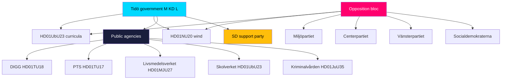

# Stakeholder Perspectives — Committee Reports Batch, 2026-05-29

> Multi-actor perspective analysis across all eight Riksdag parties, key public agencies, and external stakeholders for the seven-report committee batch. AI-generated for Riksdagsmonitor. Votes pending — positions projected from reservations and stated platforms (riksdagen.se).

## Actor map

## Government bloc perspectives

### Moderaterna (M) — lead governing party

M owns the energy and law-and-order frames. It treats HD01NU20 as proof of pragmatic energy delivery and HD01JuU35 as a decisive response to the prison-capacity crisis (HD01NU20, HD01JuU35). On HD01UbU23, M champions the knowledge-school identity as a core values statement (HD01UbU23). M's perspective on the consensus cluster is instrumental: quiet competence credentials for the campaign (HD01TU18).

### Kristdemokraterna (KD)

KD aligns with M on the law-and-order logic of HD01JuU35 and the values framing of HD01UbU23, emphasising order, standards and accountability (HD01JuU35, HD01UbU23). KD has limited distinct energy positioning on HD01NU20 but supports the coalition line.

### Liberalerna (L)

L's strongest ownership is education: the *kunskapsskola* reform reflects long-standing Liberal emphasis on knowledge and academic rigour, making HD01UbU23 a signature L deliverable (HD01UbU23). L supports the digital-governance and EU-alignment measures (HD01TU18, HD01CU44).

### Sverigedemokraterna (SD) — support party

SD's priorities are most visible in HD01JuU35 (tough sentencing, capacity relief) which it strongly backs, and it supports the wind-compensation scheme insofar as it answers rural grievances (HD01JuU35, HD01NU20). SD's leverage as the support party is decisive for the government's majority, including the qualified-majority calculus on HD01JuU35.

## Opposition bloc perspectives

### Socialdemokraterna (S) — largest opposition party

S is the pivotal opposition actor. It reserved on both flagships — arguing the wind compensation is too small and unpredictable (HD01NU20) and that the curricula reform is politicised and disruptive (HD01UbU23). Yet on HD01JuU35, S is broadly cooperative, and its position is **decisive for the qualified-majority threshold** — making S simultaneously an opponent on the flagships and a necessary partner on the constitutional measure (HD01JuU35).

### Vänsterpartiet (V)

V reserved on HD01NU20 (wants faster green build-out, frames compensation as a distraction), HD01UbU23 (equity and holistic-learning concerns), and HD01JuU35 (rights and constitutional caution — one of only two parties opposing the sentences-abroad framework) (HD01NU20, HD01UbU23, HD01JuU35). V is the batch's most consistent left-flank dissenter.

### Centerpartiet (C)

C's perspective is rural and process-oriented. On HD01NU20 it centres landowner interests and presses for genuine veto reform; on HD01UbU23 it focuses on insufficient consultation and rushed timelines (HD01NU20, HD01UbU23). C's centre positioning makes its dissent qualitatively different from V's.

### Miljöpartiet (MP)

MP reserved on HD01NU20 (climate urgency, faster deployment), HD01UbU23 (equity, holistic learning), and HD01JuU35 (rights, constitutional caution) (HD01NU20, HD01UbU23, HD01JuU35). MP's green-and-rights profile places it alongside V on most reservations.

## Institutional stakeholder perspectives

### Kriminalvården (Prison and Probation Service) — HD01JuU35

The implementing agency for sentences served abroad. Its perspective is operational: capacity relief is welcome, but logistics, prisoner transfer, and oversight of foreign facilities create new administrative and accountability burdens (HD01JuU35).

### Skolverket (National Agency for Education) — HD01UbU23

Responsible for curriculum guidance and teacher support. Its perspective is implementation-critical: the timeline, training and materials needed to make the knowledge-school reform work in classrooms determine whether the policy succeeds or generates backlash (HD01UbU23).

### Livsmedelsverket (Food Agency) — HD01MJU27

The enforcement body for food-chain fraud control. Its perspective centres on whether the new statutory powers are matched by inspection resourcing (HD01MJU27).

### PTS (Post and Telecom Authority) — HD01TU17

Supervises the telecom anti-fraud regime. Its perspective is proportionality: ensuring operator message-blocking targets genuine fraud without over-blocking legitimate communications (HD01TU17).

### DIGG (Agency for Digital Government) — HD01TU18

Coordinates public-sector interoperability. Its perspective is the practical challenge of standard-setting and onboarding many agencies while managing data-protection and security risk (HD01TU18).

## External stakeholders

- **Wind operators & host municipalities (HD01NU20):** operators face new costs but clearer social licence; municipalities weigh new revenue against siting burden (HD01NU20).
- **Teachers' unions (HD01UbU23):** focused on workload and timeline feasibility (HD01UbU23).
- **Estonia / partner state (HD01JuU35):** counterparty to the bilateral prison-capacity arrangement (HD01JuU35).
- **Consumers (HD01MJU27, HD01TU17):** beneficiaries of the food-safety and anti-fraud measures (HD01MJU27, HD01TU17).
- **EU Commission & peer parliaments (HD01CU44):** the audience for the subsidiarity opinion on "EU Inc." (HD01CU44).
- **IMY (data protection authority) (HD01TU18):** watchdog over the GDPR interface of expanded data sharing (HD01TU18).

## Perspective convergence and divergence

- **Maximal divergence:** HD01NU20 and HD01UbU23 — full government-vs-opposition split (HD01NU20, HD01UbU23).
- **Cross-bloc convergence with a twist:** HD01JuU35 — broad support but a V/MP rights flank and an S-dependent threshold (HD01JuU35).
- **Near-universal convergence:** the consensus cluster — agencies and parties aligned on competence grounds (HD01MJU27, HD01TU17, HD01TU18, HD01CU44).

## Net stakeholder assessment

The stakeholder field confirms the batch's bifurcation. On energy and education, party perspectives are zero-sum and election-coded (HD01NU20, HD01UbU23). On justice, the interesting dynamic is the **S-as-necessary-partner paradox** created by the qualified-majority rule (HD01JuU35). Across the consensus cluster, the most consequential perspectives are the **implementing agencies'** — Skolverket, Kriminalvården, DIGG, PTS and Livsmedelsverket — whose capacity will determine whether legislative intent becomes administrative reality (HD01UbU23, HD01JuU35, HD01TU18, HD01TU17, HD01MJU27).
