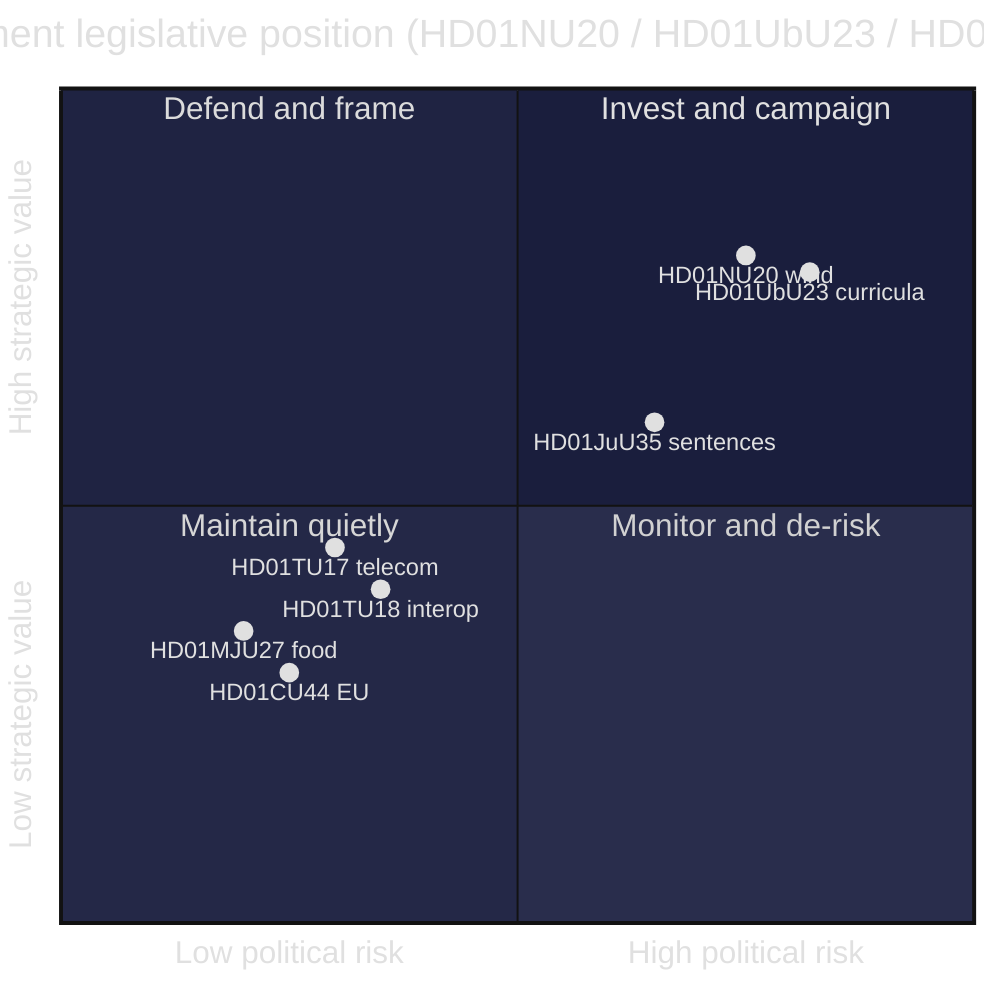

# SWOT Analysis — Committee Reports Batch, 2026-05-29

> Strategic SWOT for the Tidö government's legislative position across the seven-report committee batch. Every bullet and table row is evidence-anchored to a `dok_id` or primary source. AI-generated for Riksdagsmonitor. Votes pending (riksdagen.se).

## Framing

This SWOT reads the batch **from the government's strategic vantage**: what the seven reports do for, and to, the Tidö coalition (M, KD, L + SD support) heading into the 2026 election. Strengths and weaknesses are internal to the government's legislative product; opportunities and threats are external/forward-looking.

### Strengths

- Delivers a concrete, campaignable "local benefit" energy instrument via the wind-power compensation scheme (HD01NU20).
- Advances a values-defining education identity through the *kunskapsskola* curricula reform (HD01UbU23).
- Provides a decisive answer to the acute prison-capacity crisis by authorising sentences served abroad (HD01JuU35).
- Demonstrates effective consensus governance, passing four technical reforms with zero reservations (HD01MJU27, HD01TU17, HD01TU18, HD01CU44).
- Establishes a strong law-and-order and consumer-safety record through paired anti-fraud measures (HD01TU17, HD01MJU27).
- Shows credible EU engagement — both implementing (interoperability) and policing (subsidiarity) EU competence (HD01TU18, HD01CU44).

### Weaknesses

- The wind-power scheme is a half-measure that leaves the municipal-veto bottleneck unresolved, exposing a "too little" critique (HD01NU20).
- The curricula reform rests on a legitimacy-fragile mandate with the entire opposition reserving (HD01UbU23).
- The sentences-abroad framework structurally depends on Social Democrat cooperation to clear the qualified-majority threshold (HD01JuU35).
- Rejecting all motions on the two flagship reports hardens dissent and forecloses cross-bloc buy-in (HD01NU20, HD01UbU23).
- The thin documentary record on the EU subsidiarity review weakens transparency on the government's reasoning (HD01CU44).

### Opportunities

- Reframe the wind-power compensation as pragmatic energy realism that the opposition can only criticise, not replace (HD01NU20).
- Use the consensus cluster to project competent, non-partisan state delivery ahead of the election (HD01TU18, https://data.riksdagen.se).
- Convert the prison-capacity solution into a broader law-and-order narrative if the qualified-majority vote succeeds (HD01JuU35).
- Build a consumer-protection brand from the food-fraud and telecom-fraud measures (HD01MJU27, HD01TU17).

### Threats

- Opposition "too little, too late" framing could neutralise the government's local-benefit energy message (HD01NU20).
- Post-2026 majority shift could reverse the contested curricula, creating policy whiplash (HD01UbU23).
- Accountability for conditions in foreign prison facilities could rebound on the Swedish government (HD01JuU35).
- Expanded public-sector data sharing widens the confidentiality and security attack surface (HD01TU18).
- Operator over-blocking under the telecom rules could trigger privacy or free-expression backlash (HD01TU17).

## SWOT evidence table

| Quadrant | Factor | Evidence |
|----------|--------|----------|
| Strength | Campaignable energy instrument | HD01NU20 |
| Strength | Education identity reform | HD01UbU23 |
| Strength | Prison-capacity solution | HD01JuU35 |
| Strength | Consensus delivery record | HD01MJU27, HD01TU17, HD01TU18 |
| Weakness | Veto bottleneck unresolved | HD01NU20 |
| Weakness | Fragile curricula mandate | HD01UbU23 |
| Weakness | Qualified-majority dependence | HD01JuU35 |
| Opportunity | Energy realism framing | HD01NU20 |
| Opportunity | Competence projection | https://data.riksdagen.se |
| Threat | Narrative capture on energy | HD01NU20 |
| Threat | Curriculum reversal risk | HD01UbU23 |
| Threat | Data attack-surface growth | HD01TU18 |

## SWOT quadrant chart

## Quadrant interpretation

- **Invest and campaign (high value, high risk):** HD01NU20 and HD01UbU23 — high strategic payoff but politically exposed; the government should lean in while pre-empting reversal/critique narratives (HD01NU20, HD01UbU23).
- **Monitor and de-risk:** HD01JuU35 — valuable but contingent on the qualified-majority vote and foreign-facility oversight (HD01JuU35).
- **Maintain quietly:** the consensus cluster — low risk, modest value, useful as competence credentials (HD01MJU27, HD01TU17, HD01TU18, HD01CU44).

## Net SWOT judgement

The government's strongest cards (energy delivery, education identity, prison-capacity relief) are also its most exposed (HD01NU20, HD01UbU23, HD01JuU35). Its safest wins (the consensus cluster) carry little campaign weight (HD01MJU27, HD01TU17, HD01TU18, HD01CU44). The strategic imperative is therefore **narrative management on the two flagships and threshold management on the constitutional outlier**, while harvesting quiet competence credit from the rest (HD01NU20, HD01UbU23, HD01JuU35).

## Pass-2 refinement — the underweighted strength

The first-pass SWOT filed HD01TU18 only under "consensus delivery record." On review, that understates a genuine *strength*: interoperability is the one reform in the batch that compounds — it builds durable state capacity the opposition cannot easily attack and a future government would be unlikely to unwind (HD01TU18). It is simultaneously a latent *threat* (attack surface) already captured above. Recognising HD01TU18 as a **compounding strength as well as a latent threat** sharpens the strategic guidance: the government should quietly bank it as long-horizon institutional value rather than treat it as disposable consensus filler (HD01TU18).
