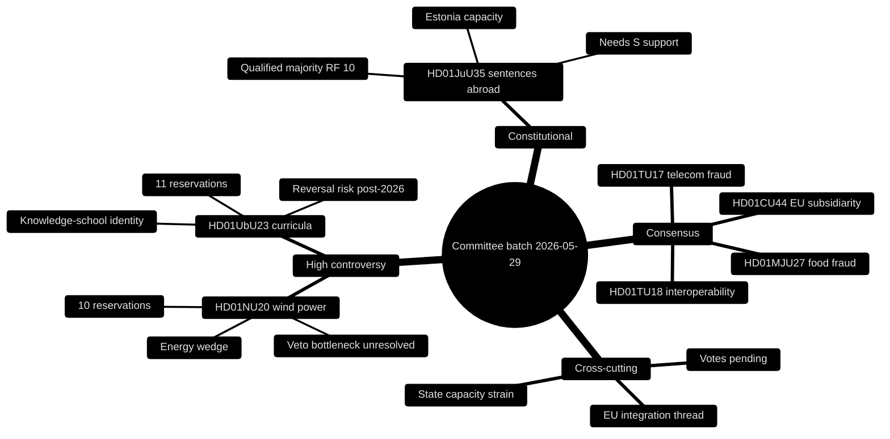

# Synthesis Summary — Committee Reports Batch, 2026-05-29

> Cross-document synthesis of seven Swedish parliamentary committee reports (betänkanden) reported 2026-05-28. AI-generated political intelligence for Riksdagsmonitor. Author: James Pether Sörling. Votes pending — all alignment projected (riksdagen.se).

## 1. The shape of the batch

The 2026-05-29 committee batch is unusually legible. Seven reports cluster into three behaviourally distinct groups, and the distribution of **reservations** — the formal dissent markers attached to a betänkande — does almost all the analytical work:

- **High-controversy cluster (21 reservations):** HD01NU20 (wind-power revenue-sharing, 10) and HD01UbU23 (new school curricula, 11). Both drew the *entire* opposition bloc — Socialdemokraterna (S), Vänsterpartiet (V), Centerpartiet (C) and Miljöpartiet (MP).
- **Constitutional outlier (3 reservations):** HD01JuU35 (temporary enforcement of Swedish sentences abroad), low in raw dissent but high in constitutional weight because it transfers public authority to a foreign state and needs a qualified majority (RF 10 kap.).
- **Consensus cluster (0 reservations):** HD01MJU27 (food-chain fraud control), HD01TU17 (telecom anti-fraud), HD01TU18 (public-sector interoperability), HD01CU44 (EU "EU Inc." subsidiarity review).

This 2-1-4 split is the headline pattern: **polarisation is concentrated, not diffuse.** Even in a polarised pre-election spring, two-thirds of the batch passed committee uncontested.

## 2. Why it matters

The two contested reports map precisely onto the two issue areas where the 2026 general election will most likely be fought: **the energy transition and school quality.** Both are areas where the Tidö government (M, KD, L, supported by SD) has staked identity claims, and both are areas where the opposition believes it can win. The synthesis reading is that committee dissent here is **campaign positioning made procedural** — reservations are being filed not only to shape law but to bank arguments for the autumn.

## 3. The energy story (HD01NU20)

Näringsutskottet's wind-power compensation scheme is the legislative residue of a larger, stalled ambition. The government wanted to reform the municipal veto (*det kommunala vetot*) that has throttled onshore wind permitting for years; what it could actually deliver is a **revenue-sharing instrument** — operators pay nearby residents a share of annual revenue, tax-free for a private dwelling (HD01NU20). The 10 reservations attack from multiple directions:

- **S** wants a larger, more predictable, statutorily guaranteed payment.
- **C** centres rural and landowner interests and presses for genuine veto reform.
- **V and MP** want faster green build-out and frame the compensation as a distraction from grid investment.

The synthesis judgement: the government has chosen the **politically deliverable over the structurally decisive.** That is defensible incrementalism, but it leaves the core bottleneck — local refusal and grid capacity — intact, which is exactly the vulnerability the opposition is exploiting (HD01NU20).

## 4. The education story (HD01UbU23)

Utbildningsutskottet's endorsement of the *kunskapsskola* curricula is the batch's purest ideological signal. It re-centres national curricula on subject knowledge, factual content and assessment, walking back the competence-and-skills emphasis of earlier reforms, and it rejects **all** opposition motions (HD01UbU23). With 11 reservations it is the most-contested report in the batch. The opposition's three-front critique:

- **S** frames the reform as politicised and warns of disruption.
- **V and MP** argue it sacrifices equity and holistic learning.
- **C** focuses on insufficient consultation and rushed timelines.

The synthesis judgement: an 11-reservation mandate is **legitimacy-fragile.** Curriculum is unusually reversible — a post-2026 majority shift could trigger "curriculum whiplash" — so the durable risk here is policy instability, not the content of the reform itself (HD01UbU23).

## 5. The constitutional story (HD01JuU35)

HD01JuU35 is where procedure becomes substance. Authorising Swedish custodial sentences to be served abroad (in Estonian facilities) relieves Kriminalvården's acute over-capacity, but because it hands elements of *myndighetsutövning* to a foreign state it requires a **qualified majority** under the Instrument of Government (Regeringsformen 10 kap.) (HD01JuU35). Only V and MP reserved (3 reservations), so the report is broadly supported — yet the qualified-majority bar means the government cannot pass it on its bloc alone and **structurally depends on S.** This is the one outcome in the batch that is genuinely uncertain and worth a dedicated watch.

## 6. The consensus cluster (HD01MJU27, HD01TU17, HD01TU18, HD01CU44)

The four zero-reservation reports share a common character: **technical governance with broad legitimacy.**

- **HD01MJU27** strengthens enforcement against food-chain fraud — a valence consumer-protection good (HD01MJU27).
- **HD01TU17** lets telecom operators withhold fraud-suspect messages, responding to a salient and rising consumer harm (HD01TU17).
- **HD01TU18** implements the EU Interoperable Europe Act (prop. 2025/26:244) for public-sector data sharing — quiet state modernisation (HD01TU18).
- **HD01CU44** is a subsidiarity review of the Commission's "EU Inc." 28th company-law regime, asserting national-parliament voice in EU corporate-law design (HD01CU44).

The synthesis reading: **consensus survives where issues are framed as competence rather than values.** The latent tensions — privacy in HD01TU17, data-protection and security in HD01TU18, sovereignty in HD01CU44 — are real but did not surface as partisan dissent at committee stage.

## 7. Cross-cutting threads

- **EU integration:** HD01TU18 (Interoperable Europe Act) and HD01CU44 (subsidiarity over "EU Inc.") both sit on the Sweden–EU axis, one implementing, one scrutinising. Read together they show a parliament simultaneously **adopting and policing** EU competence (HD01TU18, HD01CU44).
- **State-capacity strain:** HD01JuU35 (prison capacity) and, more diffusely, HD01UbU23 (teacher readiness) and HD01TU18 (agency coordination) all turn on whether Swedish institutions can absorb new mandates.
- **Consumer protection:** HD01MJU27 and HD01TU17 are twin consumer-safety measures from different committees, both consensual.

## 8. Confidence and caveats

- **Votes pending (HIGH-impact caveat):** all seven reports were debated 2026-05-28 but not yet voted; party-share alignment is projected from reservations, not observed (riksdagen.se).
- **HD01CU44 thin record:** minimal full text (~1.5 KB) — substance reconstructed from metadata and standard subsidiarity procedure; flagged LOWER confidence (HD01CU44).
- **Reservation counts are robust:** extracted directly from full text for the other six reports (high confidence).

## 9. Net assessment

The batch confirms a **bifurcated Riksdag**: sharply divided on the election-defining energy and education questions, broadly cooperative on technical governance, and dependent on cross-bloc accommodation for the one constitutional measure. For 2026, HD01NU20 and HD01UbU23 are the documents that will echo into the campaign; HD01JuU35 is the procedural test of whether the government's law-and-order agenda can clear constitutional thresholds; and the consensus cluster is evidence that the machinery of Swedish governance still functions beneath the partisan noise (HD01NU20, HD01UbU23, HD01JuU35, HD01MJU27, HD01TU17, HD01TU18, HD01CU44).

## 10. Reader guidance

For the campaign-relevant fights, read `documents/HD01NU20-analysis.md` and `documents/HD01UbU23-analysis.md`. For the constitutional test, read `documents/HD01JuU35-analysis.md`. For coalition arithmetic see `coalition-mathematics.md`; for the dated watch-list see `forward-indicators.md`; for the contrarian read see `devils-advocate.md`.

## 11. Pass-2 refinement — sharpening the consensus thesis

On re-reading, the §6 claim that "consensus survives where issues are framed as competence rather than values" needs one qualification carried from the devil's-advocate analysis: **absence of reservations is not absence of consequence.** HD01TU18's silent passage masks the batch's broadest structural change — a rewiring of cross-agency data flows that, unlike a wind-compensation tweak, compounds over years (HD01TU18). The synthesis therefore upgrades HD01TU18 from "quiet state modernisation" to **"the batch's most underrated report,"** while leaving its low *political* salience unchanged. This reconciles the reservation-driven topology (which ranks it low) with its institutional reach (which ranks it high) — the two are simply measuring different things (HD01TU18).
