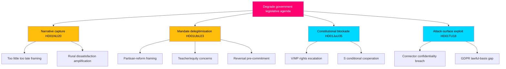

# Threat Analysis — Committee Reports Batch, 2026-05-29

> Political-threat taxonomy and attack-tree analysis for the seven-report committee batch. "Threats" here are adversarial narrative, procedural and institutional vectors that could degrade the government's position or the integrity of the reforms. AI-generated for Riksdagsmonitor. Votes pending (riksdagen.se).

## Threat model framing

This analysis treats the **government's legislative agenda as the asset under threat** and the political opposition, institutional friction and external actors as threat agents. Each threat vector is decomposed into an attack tree: a top-level objective (degrade or reverse a reform) and the sub-paths an adversary could exploit.

## Threat taxonomy

| Vector | Type | Primary target | Severity |
|--------|------|----------------|----------|
| Narrative capture | Communications | HD01NU20 energy message | HIGH |
| Mandate delegitimisation | Procedural | HD01UbU23 curricula | HIGH |
| Constitutional blockade | Procedural | HD01JuU35 qualified majority | MEDIUM |
| Accountability rebound | Institutional | HD01JuU35 foreign facilities | MEDIUM |
| Attack-surface exploitation | Security | HD01TU18 data flows | MEDIUM |
| Over-reach litigation | Legal | HD01TU17 message-blocking | LOW |
| Sovereignty erosion | External | HD01CU44 EU competence | LOW |

## Vector 1 — Narrative capture (HD01NU20)

**Objective:** neutralise the government's "local benefit" energy framing.

- **Path A:** opposition brands the compensation "too little, too late," anchoring on the unresolved veto bottleneck (HD01NU20).
- **Path B:** rural stakeholders amplify dissatisfaction if payouts are small or delayed, validating Path A (HD01NU20).
- **Path C:** energy-price salience lets the opposition fold the scheme into a broader "failed energy policy" story (HD01NU20).

**Mitigation:** couple compensation with visible grid/permitting progress and concrete payout figures (HD01NU20).

## Vector 2 — Mandate delegitimisation (HD01UbU23)

**Objective:** frame the curricula reform as illegitimate and reversible.

- **Path A:** emphasise the 11-reservation, all-opposition dissent as evidence of a "partisan" rather than national reform (HD01UbU23).
- **Path B:** surface teacher-union and equity concerns to question competence and fairness (HD01UbU23).
- **Path C:** pre-commit to reversal after 2026, raising policy-instability costs for schools (HD01UbU23).

**Mitigation:** fund teacher training, publish a credible rollout timeline, and seek visible professional endorsement (HD01UbU23).

## Vector 3 — Constitutional blockade (HD01JuU35)

**Objective:** prevent the qualified-majority threshold from being met.

- **Path A:** V and MP escalate rights-and-constitution objections to peel away marginal support (HD01JuU35).
- **Path B:** S conditions its cooperation, extracting concessions or delay on the qualified-majority vote (HD01JuU35).
- **Path C:** procedural amendments fragment the supermajority coalition (HD01JuU35).

**Mitigation:** secure an explicit S position early and legislate strong oversight to defuse rights objections (HD01JuU35).

## Vector 4 — Accountability rebound (HD01JuU35)

**Objective:** convert any foreign-facility incident into Swedish government liability.

- **Path A:** a treatment, escape or rights incident in Estonian facilities becomes a Swedish accountability story (HD01JuU35).
- **Path B:** weak Swedish oversight rights are exposed as inadequate post-incident (HD01JuU35).

**Mitigation:** robust inspection rights, clear legal applicability and contingency communications (HD01JuU35).

## Vector 5 — Attack-surface exploitation (HD01TU18)

**Objective:** exploit broadened public-sector data sharing.

- **Path A:** interoperability connectors become a confidentiality/integrity attack surface across agencies (HD01TU18).
- **Path B:** GDPR lawful-basis ambiguity creates compliance gaps that erode public trust (HD01TU18).

**Mitigation:** security-by-design, IMY review, and DIGG-coordinated hardening (HD01TU18).

## Vector 6 — Over-reach litigation (HD01TU17)

**Objective:** challenge operator message-blocking as disproportionate.

- **Path A:** false-positive blocking of legitimate messages triggers complaints and litigation (HD01TU17).
- **Path B:** privacy advocates contest communications-integrity intrusion (HD01TU17).

**Mitigation:** tight proportionality criteria and PTS supervision (HD01TU17).

## Vector 7 — Sovereignty erosion (HD01CU44)

**Objective:** advance EU competence over national company law despite subsidiarity objection.

- **Path A:** the Commission proceeds with "EU Inc." despite the Riksdag's reasoned opinion, exposing subsidiarity as low-power (HD01CU44).
- **Path B:** thin Swedish documentation weakens the persuasive force of the objection (HD01CU44).

**Mitigation:** coordinate with peer national parliaments to reach the yellow-card threshold (HD01CU44).

## Attack tree

## Threat prioritisation

1. **HIGH — Narrative capture (HD01NU20)** and **mandate delegitimisation (HD01UbU23):** both are live, low-cost for the opposition, and directly campaign-relevant.
2. **MEDIUM — Constitutional blockade and accountability rebound (HD01JuU35)** and **attack-surface exploitation (HD01TU18):** lower probability but high consequence.
3. **LOW — Over-reach litigation (HD01TU17)** and **sovereignty erosion (HD01CU44):** latent, slow-moving.

## Net threat assessment

The government's threat exposure mirrors its strategic exposure: the same two flagship reforms that offer the highest payoff (HD01NU20, HD01UbU23) present the most exploitable narrative and procedural vectors. The constitutional outlier (HD01JuU35) and the interoperability measure (HD01TU18) carry lower-probability but higher-consequence institutional and security threats. The pending votes mean threat realisation is still contingent — the opposition's vectors sharpen the moment the chamber records its decisions (riksdagen.se).
