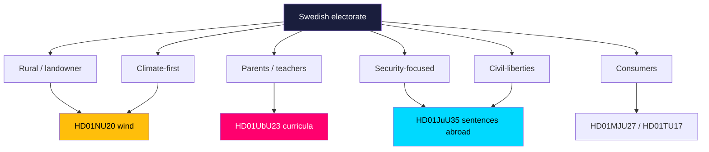

# Voter Segmentation — Committee Reports Batch, 2026-05-29

> Segment-level read-through of how the seven-report batch lands with key Swedish voter groups ahead of the 2026 election. AI-generated for Riksdagsmonitor. Votes pending (riksdagen.se).

## Segment map

## Segment-by-segment analysis

### Rural / landowner voters (HD01NU20)
Directly affected by wind-compensation design. Government hopes the tax-free payout converts siting opposition into acceptance; C and S compete for the grievance vote if payouts disappoint (HD01NU20). **Persuadable, high stakes.**

### Parents and teachers (HD01UbU23)
The curricula reform is salient to families and the teaching profession. L/M appeal to standards-oriented parents; S/V/MP appeal to equity-oriented parents and union-aligned teachers (HD01UbU23). **Polarised, mobilisation-driven.**

### Security-focused voters (HD01JuU35)
Receptive to the capacity and toughness framing; M/KD/SD core. Largely a bloc-reinforcement segment (HD01JuU35). **Mobilising for government bloc.**

### Climate-first voters (HD01NU20)
Want faster green deployment; V/MP frame compensation as a side-show to permitting reform. Cross-pressured between supporting wind and criticising the government's pace (HD01NU20). **Cross-pressured.**

### Civil-liberties voters (HD01JuU35)
Sensitive to the rights and constitutional dimension of sentences served abroad; aligns with V/MP messaging (HD01JuU35). **Small but vocal.**

### Consumers (HD01MJU27, HD01TU17)
Beneficiaries of food-fraud and telecom-fraud protection; broadly positive but low salience — unlikely to drive vote choice (HD01MJU27, HD01TU17). **Low-salience goodwill.**

## Segment-salience summary

| Segment | Key report | Direction | Volatility |
|---------|-----------|-----------|------------|
| Rural/landowner | HD01NU20 | Contested | HIGH |
| Parents/teachers | HD01UbU23 | Polarised | HIGH |
| Security-focused | HD01JuU35 | Pro-govt | LOW |
| Climate-first | HD01NU20 | Cross-pressured | MEDIUM |
| Civil-liberties | HD01JuU35 | Pro-opposition flank | LOW |
| Consumers | HD01MJU27 / HD01TU17 | Mild positive | LOW |

## Net segmentation assessment

The batch's electoral energy is concentrated in two **high-volatility segments** — rural/landowner (HD01NU20) and parents/teachers (HD01UbU23). These are the groups where the flagships could actually move votes. Security and civil-liberties segments mostly reinforce existing bloc loyalties around HD01JuU35. The consensus cluster generates diffuse goodwill but negligible vote movement (HD01MJU27, HD01TU17, HD01TU18, HD01CU44).
