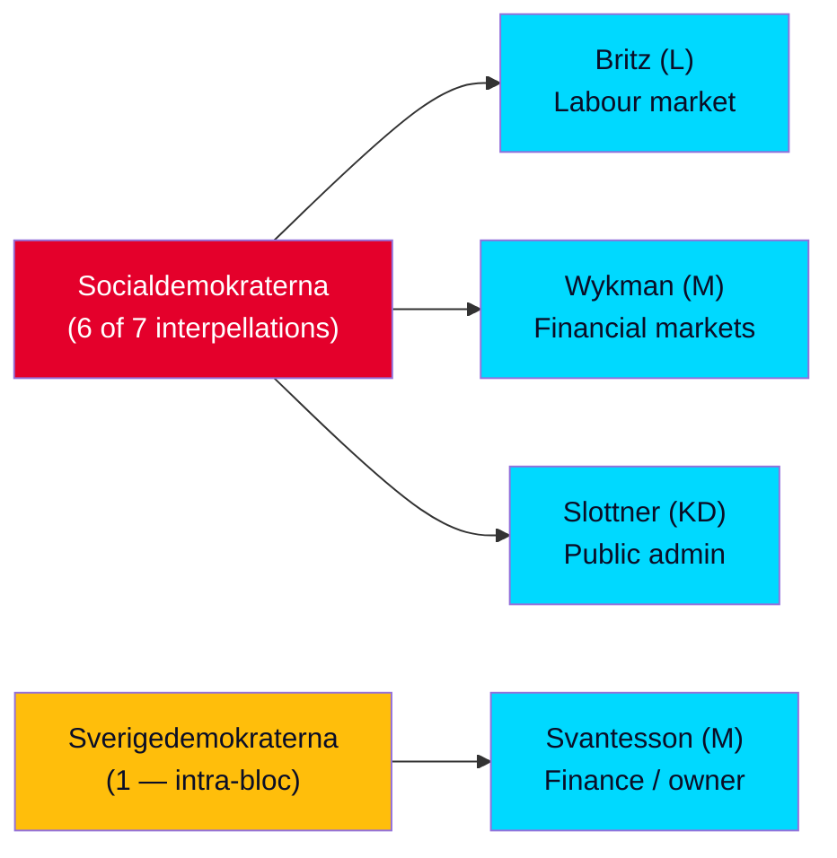

# Interpellation Debates — Analysis Package · 2026-05-29

**Scope**: Seven interpellations (ip 2025/26) submitted to the Riksdag on 2026-05-29 (filed 2026-05-28; announced 2026-06-01; answer deadline 2026-06-12).
**Election proximity**: 107 days to the 2026-09-13 general election → **1.5× significance multiplier applied throughout**.
**Method**: AI-driven structured analysis per `analysis/methodologies/ai-driven-analysis-guide.md`; two-pass AI-FIRST quality process; Admiralty source grading [A1]–[C4].
**Economic data**: IMF WEO Apr-2026 (vintage 1 month; not stale) as primary economic provenance; SCB reserved for Swedish ground truth.

---

## The Seven Documents

| dok_id | Title | Interpellant (party) | Respondent (party) | Coverage |
|--------|-------|----------------------|--------------------|----------|
| HD10522 | Styrningen av Vattenfall | Tobias Andersson (SD) | Elisabeth Svantesson (M), finansmin. | full_text |
| HD10523 | Varsel inom pappersindustrin | Jim Svensk Larm (S) | Johan Britz (L), arbetsmarknadsmin. | full_text |
| HD10524 | Förändrad a-kassa | Jim Svensk Larm (S) | Johan Britz (L) | full_text |
| HD10525 | Regeringens arbete i ILO | Adrian Magnusson (S) | Johan Britz (L) | metadata_only |
| HD10526 | Ett reformerat utjämningssystem för en jämlik välfärd | Eva Lindh (S) | Erik Slottner (KD), civilmin. | metadata_only |
| HD10527 | Skydd för småföretagare vid bankbedrägerier | Eva Lindh (S) | Niklas Wykman (M), finansmarknadsmin. | full_text |
| HD10528 | Ökad transparens och bankernas ansvar vid bedrägerier | Eva Lindh (S) | Niklas Wykman (M) | full_text |

**Source**: data.riksdagen.se (riksmöte 2025/26). [A2]

---

## Four Thematic Clusters

1. **Labour market (→ Britz, L)** — HD10523 forestry varsel, HD10524 a-kassa taper, HD10525 ILO. Three S interpellations to one minister: a coordinated labour-rights pressure front.
2. **Bank fraud (→ Wykman, M)** — HD10527 SME fraud protection, HD10528 bank transparency/responsibility. Eight operative questions from Eva Lindh; the day's centre of gravity and highest DIW score (7.8).
3. **Energy / state ownership (→ Svantesson, M)** — HD10522 Vattenfall governance. The **only governing-bloc interpellation** (SD → its own M minister): an intra-coalition friction signal.
4. **Municipal welfare equalisation (→ Slottner, KD)** — HD10526. Links to HD10524's municipal cost-shifting argument.

---

## Package Contents (23 always-on artifacts + per-document + sidecar)

**Family A — Core Synthesis (9)**: README.md, executive-brief.md, synthesis-summary.md, significance-scoring.md, classification-results.md, swot-analysis.md, risk-assessment.md, threat-analysis.md, stakeholder-perspectives.md
**Family B — Structural Metadata (2)**: data-download-manifest.md, cross-reference-map.md
**Family C — Strategic Extensions (5)**: scenario-analysis.md, comparative-international.md, devils-advocate.md, intelligence-assessment.md, methodology-reflection.md
**Family D — Electoral & Domain Lenses (7)**: election-2026-analysis.md, voter-segmentation.md, coalition-mathematics.md, historical-parallels.md, media-framing-analysis.md, implementation-feasibility.md, forward-indicators.md
**Family E — Per-document**: documents/HD10522-analysis.md … HD10528-analysis.md (7)
**Sidecar**: pir-status.json

---

## Headline Findings

- The day is dominated by a **pre-election opposition accountability campaign** structured around jobs and bank fraud, with S filing six of seven interpellations targeting the four Tidö parties' ministers. [B2]
- The **bank-fraud pair (HD10527/HD10528)** is the highest-significance item (DIW 7.8): it contests the government's own organised-crime brand and carries a live EU regulatory hook (PSD3/PSR). [B2]
- The **Vattenfall interpellation (HD10522)** is the analytical anomaly — a governing party (SD) publicly pressing its own finance minister — an early-warning indicator of Tidö-bloc strain over the energy transition. [B2]
- Two documents are **metadata-only** (HD10525 ILO, HD10526 equalisation); their content readings are low-confidence pending full-text retrieval. [B3]

See `executive-brief.md` for the decision-oriented summary and `significance-scoring.md` for the DIW ranking.

## Reading Order

For a decision-maker with five minutes: read `executive-brief.md` (BLUF + decisions), then `significance-scoring.md` (what matters most), then `intelligence-assessment.md` (key judgements with confidence). For an analyst: add `synthesis-summary.md` (confidence decomposition), `scenario-analysis.md` (testable futures), `coalition-mathematics.md` (tipping-point arithmetic) and `forward-indicators.md` (what to watch and when). The single most important cross-cutting insight across the package is that **significance and durability diverge**: the bank-fraud cluster is the most significant item today, but the SD–M energy divergence (Vattenfall) is the most durable strategic signal into the campaign. [B2]
