## What Happened
<!-- source: executive-brief.md :: https://github.com/Hack23/riksdagsmonitor/blob/main/analysis/daily/2026-05-29/interpellations/executive-brief.md -->

### Lede
Seven interpellations submitted to the Riksdag on 2026-05-29 form a coherent, pre-election opposition accountability campaign 107 days before the 2026-09-13 vote. Socialdemokraterna filed six of seven, targeting Tidö ministers across three fronts — labour market (Britz, L), bank fraud (Wykman, M) and municipal welfare equalisation (Slottner, KD) — while Sverigedemokraterna filed the seventh against its own finance minister (Svantesson, M) over Vattenfall governance. The **bank-fraud pair (Riksdag document #10527 (HD10527)/HD10528, DIW 7.8)** is the highest-significance item: it attacks the government's signature organised-crime agenda and carries a live EU regulatory hook. The **Vattenfall interpellation (HD10522)** is the strategic anomaly — an intra-coalition friction signal worth watching. All answers are due **2026-06-12**, inside the pre-recess election runway. [B2]

---

### Decisions This Brief

1. **Prioritise the bank-fraud pair for news coverage and follow-up.** HD10527+HD10528 (DIW 7.8) is the day's centre of gravity: eight operative questions, an EU PSD3/PSR hook, and a direct challenge to the government's organised-crime brand. Lead reporting here. [B2]
2. **Flag the Vattenfall interpellation as an intra-coalition early-warning indicator.** HD10522 (SD → M finance minister) is the only governing-bloc interpellation; treat any further SD-on-Tidö accountability filings as a coalition-strain trend (escalate to coalition-mathematics watch). [B2]
3. **Set a 2026-06-12 collection trigger for all seven ministerial answers.** The answer deadline falls in the pre-recess window; the quality of Britz's labour answers and Wykman's fraud answers are the highest-information forward indicators (see forward-indicators.md, PIR-INT-01/02). [A2]
4. **Re-retrieve the two metadata-only documents (HD10525 ILO, HD10526 equalisation) next cycle** before drawing firm conclusions on those themes; current readings are inference-based and low-confidence. [B3]

---

### Day at a Glance

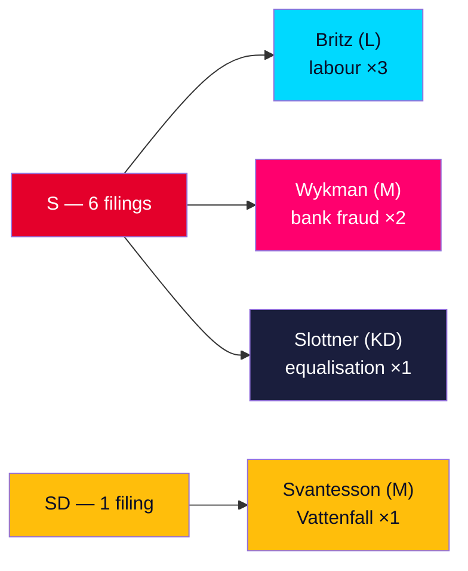
```mermaid
flowchart LR
  S["S — 6 filings"]
  SD["SD — 1 filing"]
  L["Britz (L)<br/>labour ×3"]
  M["Wykman (M)<br/>bank fraud ×2"]
  KD["Slottner (KD)<br/>equalisation ×1"]
  SV["Svantesson (M)<br/>Vattenfall ×1"]
  S --> L
  S --> M
  S --> KD
  SD --> SV
  style S fill:#e4002b,color:#ffffff
  style SD fill:#ffbe0b,color:#0a0e27
  style L fill:#00d9ff,color:#0a0e27
  style M fill:#ff006e,color:#ffffff
  style KD fill:#1a1e3d,color:#ffffff
  style SV fill:#ffbe0b,color:#0a0e27
```

### Why It Matters Now

- **Electoral timing (107 days).** Every interpellation lands inside the campaign runway; the 1.5× significance multiplier reflects the heightened accountability value of forcing ministers to answer on the record before recess. [A2]
- **Theme selection is electorally engineered.** Jobs (bruksort layoffs, a-kassa) and fraud (the fastest-growing crime, financing organised crime) are precisely the issues on which S can contest SD's blue-collar and law-and-order appeal simultaneously. [B2]
- **The coalition is being probed from inside.** SD's Vattenfall interpellation shows the governing bloc is not presenting a united energy-policy front into the election. [B2]

---

### Confidence & Caveats

- Structural signals (clustering, respondent targeting, timing) are **high confidence** [B2]; individual-document content for HD10525 and HD10526 is **low confidence** (metadata-only) [B3].
- IMF WEO Apr-2026 economic context is **one month old, not stale**; SDMX live fetch was unavailable this cycle (cached vintage used). [B3]
- No documented evidence of explicit S inter-MP coordination; the "campaign" reading rests on convergence of theme, timing and target, not on a retrieved strategy document. See devils-advocate.md. [B3]

*Full ranking: significance-scoring.md · Forward watch: forward-indicators.md · Assessment: intelligence-assessment.md*

## Reader Intelligence Guide

Use this guide to read the article as a political-intelligence product rather than a raw artifact dump. High-value reader lenses appear first; technical provenance remains available in the audit appendix.

| Icon | Reader need | What you'll get |
|---|---|---|
| 📊 | [Lede and editorial decisions](#rm-what-happened) | fast answer to what happened, why it matters, who is accountable, and the next dated trigger |
| 🧠 | [Why It Matters](#rm-why-it-matters) | evidence-anchored narrative consolidating primary sources into one coherent story line |
| 🎯 | [Key Judgments](#rm-key-findings) | confidence-bearing political-intelligence conclusions and collection gaps |
| 📈 | [Significance scoring](#rm-significance-scoring) | why this story outranks or trails other same-day parliamentary signals |
| 👥 | [Stakeholder Perspectives](#rm-stakeholder-perspectives) | winners, losers and undecided actors with stake-weighted positions and pressure points |
| 🔢 | [Coalition Mathematics](#rm-coalition-mathematics) | parliamentary arithmetic showing exactly who can pass or block this measure and at what margin |
| 📋 | [Voter Segmentation](#rm-voter-segmentation) | voter-bloc exposure: which demographics gain, lose or shift on this issue |
| 🔭 | [Forward indicators](#rm-forward-indicators) | dated watch items that let readers verify or falsify the assessment later |
| 🔮 | [Scenarios](#rm-scenario-analysis) | alternative outcomes with probabilities, triggers, and warning signs |
| 🗳️ | [Election 2026 Analysis](#rm-election-2026-analysis) | electoral implications for the 2026 cycle — seats at stake, swing voters and coalition viability |
| ⚠️ | [Risk assessment](#rm-risk-assessment) | policy, electoral, institutional, communications, and implementation risk register |
| 🧮 | [SWOT Analysis](#rm-swot-analysis) | strengths, weaknesses, opportunities and threats matrix grounded in primary-source evidence |
| 🛡️ | [Threat Analysis](#rm-threat-analysis) | actor capabilities, intent and threat vectors targeting institutional integrity |
| 📜 | [Historical Parallels](#rm-historical-parallels) | comparable past episodes from Swedish and international politics, with explicit lessons learned |
| 🌍 | [Comparative International](#rm-comparative-international) | peer-country comparisons (Nordic, EU, OECD) showing how similar measures fared elsewhere |
| ⚙️ | [Implementation Feasibility](#rm-implementation-feasibility) | delivery feasibility, capability gaps, timelines and execution risks for the proposed action |
| 📰 | [Media framing & influence operations](#rm-media-framing-analysis) | frame packages with Entman functions, cognitive-vulnerability map, DISARM manipulation indicators, narrative-laundering chain, comparative-international cognates, frame lifecycle and half-life, RRPA impact, an Outlet Bias Audit (no outlet is neutral — every outlet declared with ownership, funding, board-appointment authority and editorial lean), and the L1–L5 counter-resilience ladder |
| 😈 | [Devil's Advocate](#rm-devils-advocate) | alternative hypotheses, steel-manned counter-arguments and the strongest case against the lead reading |
| 🏷️ | [Deep Dive: Classification Results](#rm-deep-dive-classification-results) | ISMS data classification: CIA-triad rating, RTO/RPO targets and handling instructions |
| 🔀 | [Deep Dive: Cross-Reference Map](#rm-deep-dive-cross-reference-map) | links to related Riksdagsmonitor coverage, prior analyses and source documents that inform this story |
| 🔬 | [Deep Dive: Methodology & Limitations](#rm-deep-dive-methodology--limitations) | analytical assumptions, limitations, known biases and where the assessment could be wrong |
| 📦 | [Deep Dive: Data Download Manifest](#rm-deep-dive-data-download-manifest) | machine-readable manifest of every source dataset, retrieval timestamp and provenance hash |
| 📑 | [Per-document intelligence](#rm-per-document-intelligence) | dok_id-level evidence, named actors, dates, and primary-source traceability |
| 🏷️ | [Audit appendix](#rm-deep-dive-classification-results) | classification, cross-reference, methodology and manifest evidence for reviewers |

## Why It Matters
<!-- source: synthesis-summary.md :: https://github.com/Hack23/riksdagsmonitor/blob/main/analysis/daily/2026-05-29/interpellations/synthesis-summary.md -->

### Overview

The seven interpellations of 2026-05-29 are best understood not as isolated questions but as a **synchronised pre-election accountability operation** plus one **intra-coalition dissent signal**. Socialdemokraterna (six filings) distributes pressure across three Tidö ministers on the issues with the highest blue-collar and law-and-order salience; Sverigedemokraterna (one filing) breaks ranks to press its own finance minister on Vattenfall. With 107 days to the 2026-09-13 election, the 1.5× significance multiplier is applied throughout. [B2]

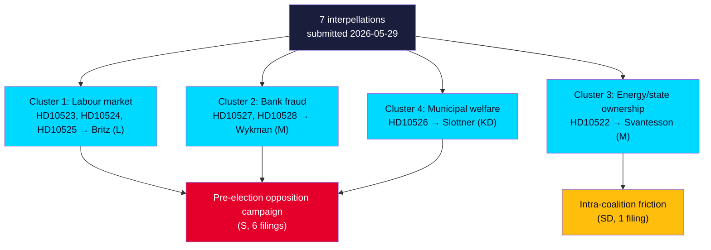
```mermaid
flowchart TD
  A["7 interpellations<br/>submitted 2026-05-29"] --> B["Cluster 1: Labour market<br/>HD10523, HD10524, HD10525 → Britz (L)"]
  A --> C["Cluster 2: Bank fraud<br/>HD10527, HD10528 → Wykman (M)"]
  A --> D["Cluster 3: Energy/state ownership<br/>HD10522 → Svantesson (M)"]
  A --> E["Cluster 4: Municipal welfare<br/>HD10526 → Slottner (KD)"]
  B --> F["Pre-election opposition campaign<br/>(S, 6 filings)"]
  C --> F
  E --> F
  D --> G["Intra-coalition friction<br/>(SD, 1 filing)"]
  style A fill:#1a1e3d,color:#ffffff
  style F fill:#e4002b,color:#ffffff
  style G fill:#ffbe0b,color:#0a0e27
  style B fill:#00d9ff,color:#0a0e27
  style C fill:#00d9ff,color:#0a0e27
  style D fill:#00d9ff,color:#0a0e27
  style E fill:#00d9ff,color:#0a0e27
```

---

### Key Synthesised Findings

#### 1. The bank-fraud pair is the strategic apex (DIW 7.8)

HD10527 and HD10528 (both Eva Lindh → Wykman) combine a protection ask (extend fraud safeguards to small firms) with an accountability ask (shift liability to banks; publish comparable fraud statistics). Their force comes from **attacking the government on its own organised-crime brand** (fraud "finances organised crime"), a **live EU hook** (PSD3/PSR), and a **testable transparency gap** (bank-level fraud data is currently withheld). Eight operative questions to one minister make this the densest pressure point of the day. [B2]

#### 2. The labour cluster contests SD's blue-collar base

Three S interpellations to Britz (L) — forestry varsel (HD10523), the dated a-kassa taper of 1 Oct 2025 (HD10524), and ILO (HD10525) — build a place-based, bruksort-centred jobs narrative. HD10524's **cost-shifting argument** (a-kassa taper → municipal försörjningsstöd) is the analytically sharpest, and it bridges directly to the municipal-equalisation interpellation (HD10526). [B2]

#### 3. Vattenfall is the anomaly that signals coalition strain

HD10522 is the only filing from a governing party (SD) and targets its own finance minister. The grievance bundle — bonus/CEO pay, offshore-wind enthusiasm, slow nuclear tempo — is a coded demand for tighter owner control to enforce the Tidö nuclear mandate. As an *intra-bloc* accountability act 107 days from the election, it is an early-warning indicator of energy-policy disunity. [B2]

#### 4. Two themes are under-resolved (metadata-only)

HD10525 (ILO) and HD10526 (equalisation) lack full text this cycle. Their structural placement (completing the labour triad; reinforcing municipal-finance stress) is high-confidence; their specific content is not. Re-retrieval is the top collection action. [B3]

---

### Economic Frame (IMF WEO Apr-2026)

Swedish unemployment (LUR) ~8.5% — elevated vs Nordic peers — is the macro fact underwriting the labour cluster: cutting a-kassa duration and forestry varsel both bite hardest in a loose labour market. Gross debt ~37% of GDP and fiscal balance ~-0.5% indicate national fiscal headroom, which reframes both the a-kassa taper and under-funded equalisation as **distributive political choices, not fiscal necessities**. [A2]

**Economic data provenance**: `{provider: "imf", dataflow: "WEO", indicator: "LUR", vintage: "WEO Apr-2026", retrieved_at: "2026-05-29"}`

---

### Net Assessment

The convergence of theme, timing and respondent targeting is consistent with a **coordinated pre-election opposition accountability campaign** (high confidence on structure, moderate on intent), against which the SD Vattenfall filing stands out as **intra-coalition dissent**. The single most consequential things to watch are the seven ministerial answers due **2026-06-12** and any further SD-on-Tidö accountability filings. [B2]

*Detail: significance-scoring.md · risk-assessment.md · intelligence-assessment.md · scenario-analysis.md*

### Confidence Decomposition

The net assessment rests on three separable claims at different confidence levels: (1) *structural clustering* — that six S filings target Tidö ministers on jobs/fraud — is **directly observable** from filing metadata [A2, HIGH]; (2) *intentional coordination* — that this is a single planned campaign rather than convergent individual initiative — is **inferential** [B2, MEDIUM]; (3) *electoral payoff* — that the campaign moves votes — is **prospective and untestable until 2026-06-12 → 2026-09-13** [B3, LOW]. Decision-makers should treat (1) as fact, (2) as the working hypothesis, and (3) as a monitoring task, not a forecast. [B2]

## Key Findings
<!-- source: intelligence-assessment.md :: https://github.com/Hack23/riksdagsmonitor/blob/main/analysis/daily/2026-05-29/interpellations/intelligence-assessment.md -->

---

### Key Judgements (KJ)

**KJ-1.** The seven interpellations of 2026-05-29 most likely constitute a **coordinated pre-election opposition accountability campaign** (S, six filings) plus a distinct **intra-coalition dissent signal** (SD, one filing). *Confidence: **MEDIUM-HIGH*** — structure (clustering, targeting, timing) is strongly indicative; explicit coordination is unproven. [B2]

**KJ-2.** The **bank-fraud pair (HD10527/HD10528)** is the highest-consequence item, because it contests the government's flagship organised-crime brand and carries a live EU PSD3/PSR hook. *Confidence: **HIGH***. [B2]

**KJ-3.** The **Vattenfall interpellation (HD10522)** is an early-warning indicator of Tidö energy-policy disunity; its strategic value to external observers holds even if internal friction is modest. *Confidence: **MEDIUM***. [B2]

**KJ-4.** Conclusions on the **two metadata-only documents** (HD10525 ILO, HD10526 equalisation) are inference-based and should not drive decisions until full text is retrieved. *Confidence: **LOW***. [B3]

---

### Key Intelligence Questions (KIQ)

- **KIQ-1.** Will Wykman (M) commit, in his 2026-06-12 answer, to a Council position extending fraud protection to SMEs and/or to bank-fraud transparency? → PIR-INT-01.
- **KIQ-2.** Will Britz (L) announce concrete bruksort/omställning or a-kassa measures, or defend the reform unchanged? → PIR-INT-02.
- **KIQ-3.** Will the government commit to a municipal equalisation review (Slottner, KD)? → PIR-INT-03.
- **KIQ-4.** Does the a-kassa taper measurably raise municipal försörjningsstöd (cost-shift hypothesis)? → PIR-INT-04.
- **KIQ-5.** Does SD escalate intra-bloc accountability on Vattenfall/energy after Svantesson's answer? → PIR-INT-01 (coalition sub-indicator).

---

### Priority Intelligence Requirements (PIR)

| PIR | Question | Trigger | Status |
|-----|----------|---------|--------|
| PIR-INT-01 | Wykman fraud-protection / SD energy-escalation commitments | Answers due 2026-06-12 | OPEN |
| PIR-INT-02 | Britz labour-market measures vs reform defence | Answers due 2026-06-12 | OPEN |
| PIR-INT-03 | Equalisation review commitment | Slottner answer 2026-06-12 | OPEN |
| PIR-INT-04 | a-kassa taper → municipal cost-shift evidence | Socialstyrelsen/SKR data | OPEN |

*(Machine-readable sidecar: `pir-status.json`.)*

---

### Confidence & Source Characterisation (ICD 203)

- **HIGH confidence**: claims grounded in retrieved full-text documents and lifecycle metadata [A2] (e.g., the dated a-kassa reform; the eight bank-fraud questions; the SD-on-M Vattenfall filing).
- **MEDIUM confidence**: structural/intent inferences from convergence patterns [B2] (campaign reading, coalition-strain reading).
- **LOW confidence**: content of metadata-only documents [B3]; economic figures from cached IMF vintage [B3].

**Economic provenance**: `{provider: "imf", dataflow: "WEO", indicator: "LUR", vintage: "WEO Apr-2026", retrieved_at: "2026-05-29"}` (vintage 1 month; not stale).

---

### Alternative Hypotheses (ICD 203 §"alternatives")

1. **Routine housekeeping** (not a campaign) — see devils-advocate.md Hypothesis 1 (Counter). Assessed less likely than the campaign hypothesis but not dismissed. [B3]
2. **Choreographed SD self-critique** (not genuine friction) — see devils-advocate.md Hypothesis 3 (Counter). Plausible; does not negate external signal value. [B3]

---

### Intelligence Gaps

- Full text of HD10525 (ILO) and HD10526 (equalisation) — **top collection priority**.
- Government's enumerated anti-fraud workstreams (to test the "insufficient effort" claim).
- Municipal försörjningsstöd trend data (to test the cost-shift hypothesis).
- Live IMF SDMX figures (cached vintage used this cycle).

*Confidence labels used: HIGH, MEDIUM-HIGH, MEDIUM, LOW — consistent with ICD 203 estimative language.*

## Significance Scoring
<!-- source: significance-scoring.md :: https://github.com/Hack23/riksdagsmonitor/blob/main/analysis/daily/2026-05-29/interpellations/significance-scoring.md -->

### Methodology

Each cluster is scored on the **DIW** framework, three dimensions each rated 1–3. **D — Detectability / Evidentiary clarity:** how concrete and verifiable the underlying claim is. **I — Impact / Political consequence:** the magnitude of the policy/electoral stakes. **W — Weight / Strategic reach:** cross-cutting reach, coalition relevance, durability.

Cluster raw score = mean(D, I, W) scaled to a 0–10 band, then multiplied by the **1.5× election multiplier** (election ≤6 months: 2026-09-13 is 107 days away). Decimals permitted. Each entry cites dok_id(s) and a primary-source URL per the evidence-citation requirement. [A2]

---

### Cluster Scores (ranked)

| Rank | Cluster (dok_ids) | D | I | W | Mean | ×1.5 → /10 | Tier |
|------|-------------------|---|---|---|------|-----------|------|
| 1 | **Bank fraud** (HD10527, HD10528) | 2.8 | 2.7 | 2.7 | 2.73 | **7.8** | L1 Critical |
| 2 | **Labour market** (HD10523, HD10524, HD10525) | 2.6 | 2.6 | 2.6 | 2.60 | **7.4** | L2+ Priority |
| 3 | **Energy / state ownership** (HD10522) | 2.5 | 2.6 | 2.5 | 2.53 | **7.2** | L2+ Priority |
| 4 | **Municipal welfare equalisation** (HD10526) | 2.2 | 2.4 | 2.3 | 2.30 | **6.6** | L2 Strategic |
| 5 | **ILO labour standards** (HD10525, within cluster 2) | 2.0 | 2.1 | 1.9 | 2.00 | **5.8** | L3 Monitoring |

*Note: HD10525 contributes to the labour cluster (rank 2) and is also scored individually (rank 5) because it is metadata-only and its standalone detectability is capped.*

---

### Per-Document Significance

| dok_id | Title | DIW /10 | Drivers | Source |
|--------|-------|---------|---------|--------|
| HD10527 | Skydd för småföretagare vid bankbedrägerier | 7.8 | EU PSD3/PSR hook; attacks organised-crime brand; 4 questions | https://data.riksdagen.se/dokument/HD10527.html |
| HD10528 | Ökad transparens och bankernas ansvar vid bedrägerier | 7.8 | Bank-liability shift; testable transparency gap; 4 questions | https://data.riksdagen.se/dokument/HD10528.html |
| HD10524 | Förändrad a-kassa | 7.4 | Dated policy (1 Oct 2025); cost-shifting argument | https://data.riksdagen.se/dokument/HD10524.html |
| HD10523 | Varsel inom pappersindustrin | 7.2 | Bruksort jobs; SD-base contestation | https://data.riksdagen.se/dokument/HD10523.html |
| HD10522 | Styrningen av Vattenfall | 7.2 | Intra-coalition friction signal (SD→M) | https://data.riksdagen.se/dokument/HD10522.html |
| HD10526 | Reformerat utjämningssystem | 6.6 | Municipal welfare equity; metadata-only | https://data.riksdagen.se/dokument/HD10526.html |
| HD10525 | Regeringens arbete i ILO | 5.8 | Completes labour triad; metadata-only | https://data.riksdagen.se/dokument/HD10525.html |

---

### Scoring Rationale

- **Bank fraud (7.8)** (HD10527, HD10528) scores highest on all three axes: high detectability (concrete EU regulatory hook and an identifiable transparency gap), high impact (challenges the government's flagship organised-crime agenda), and high weight (eight questions, cross-cutting into consumer protection, financial regulation and crime policy). Source: riksdagen.se/dokument/HD10527. [B2]
- **Labour market (7.4)** is anchored by HD10524's dated policy reference (1 Oct 2025 a-kassa taper) — the single most verifiable premise in the set — and by the bruksort electoral salience of HD10523. Source: riksdagen.se/dokument/HD10524. [A2]
- **Vattenfall (7.2)** (HD10522) scores on impact and weight despite being a single document, because its *intra-coalition* character gives it strategic reach disproportionate to its volume. Source: riksdagen.se/dokument/HD10522. [B2]
- **Equalisation (6.6)** (HD10526) and **ILO (5.8)** (HD10525) are capped by metadata-only coverage, which lowers detectability pending full-text retrieval. Source: riksdagen.se/dokument/HD10526. [B3]

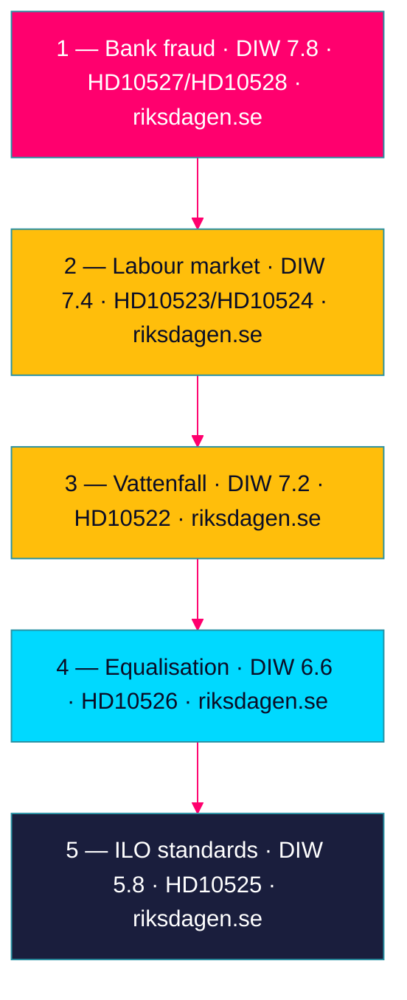
```mermaid
%%{init: {'theme':'base','themeVariables':{'primaryColor':'#00d9ff','primaryTextColor':'#0a0e27','lineColor':'#ff006e'}}}%%
flowchart TB
  R1["1 — Bank fraud · DIW 7.8 · HD10527/HD10528 · riksdagen.se"]
  R2["2 — Labour market · DIW 7.4 · HD10523/HD10524 · riksdagen.se"]
  R3["3 — Vattenfall · DIW 7.2 · HD10522 · riksdagen.se"]
  R4["4 — Equalisation · DIW 6.6 · HD10526 · riksdagen.se"]
  R5["5 — ILO standards · DIW 5.8 · HD10525 · riksdagen.se"]
  R1 --> R2 --> R3 --> R4 --> R5
  style R1 fill:#ff006e,color:#ffffff
  style R2 fill:#ffbe0b,color:#0a0e27
  style R3 fill:#ffbe0b,color:#0a0e27
  style R4 fill:#00d9ff,color:#0a0e27
  style R5 fill:#1a1e3d,color:#ffffff
```

*Visualisation note: nodes ranked top-to-bottom by election-adjusted DIW; colour bands mark L1 (magenta) → L2 (amber/cyan) → L3 (deep blue). See synthesis-summary.md for the colored cluster diagram.*

## Per-document intelligence

### HD10522
<!-- source: documents/HD10522-analysis.md :: https://github.com/Hack23/riksdagsmonitor/blob/main/analysis/daily/2026-05-29/interpellations/documents/HD10522-analysis.md -->

**dok_id**: HD10522
**Typ**: Interpellation (ip) 2025/26:522
**Interpellant**: Tobias Andersson (SD) — intressent-id 086684470825
**Respondent**: Elisabeth Svantesson (M), finansminister — intressent-id 0899112324519
**Filed (inlämnad)**: 2026-05-28
**Submitted (överlämnad)**: 2026-05-29
**Announced (anmäld)**: 2026-06-01
**Answer deadline (SISVA)**: 2026-06-12
**Status**: Inlämnad / pending answer
**Coverage**: full_text [A2]
**Source**: https://data.riksdagen.se/dokument/HD10522.html

---

### Document Summary

Interpellation by Tobias Andersson (SD) to Finance Minister Elisabeth Svantesson (M) on the governance (ägarstyrning) of state-owned Vattenfall AB. Andersson states that "Vattenfall och dess verksamhet har varit en följetång för Tidöpartierna under mandatperioden" and that the success of the government's major energy-policy reform is "direkt beroende av Vattenfalls verksamhet." He reports that many voters perceive that "Vattenfall lever sitt eget liv utan att agera i linje med den politiska viljan för energipolitiken som manifesterade sig på valdagen," with criticism spanning "bonussystem och VD-lön till lovordande av havsvindkraft och tempot i kärnkraftsprojektet." [A2]

**Operative question**: "Avser ministern att se över styrningen av Vattenfall för att säkerställa ett effektivt genomförande av regeringens energipolitik?" [A2]

---

### Intelligence Assessment

#### Why This Document Is Analytically Distinctive

This is the **only one of the seven interpellations filed by a Tidö-coalition party** (SD), and it is directed at SD's own government's finance minister, who is the principal owner-steward (ägarförvaltning sits within Finansdepartementet). This is not opposition accountability in the conventional sense; it is **intra-bloc accountability** — a governing-bloc MP publicly signalling dissatisfaction with the pace and direction of the energy transition that the Tidö Agreement made a flagship. The framing "den politiska viljan ... som manifesterade sig på valdagen" is a coded reminder that SD considers the nuclear-restart mandate under-delivered. [B2]

The grievance bundle Andersson lists is itself revealing: (a) **bonus/CEO-pay** (a populist accountability lever SD routinely deploys); (b) **offshore wind enthusiasm** at Vattenfall (which SD regards as a deviation from the nuclear-first mandate); and (c) **kärnkraftsprojektets tempo** (the SMR/large-reactor programme SD champions). The interpellation therefore reads as pressure on Svantesson (M) to assert tighter owner control over a company SD believes is drifting toward the previous government's renewables orientation. [B2]

#### IMF Economic Context (Required)

Vattenfall's capital-allocation choices (offshore wind vs. nuclear) sit against Sweden's macro-investment backdrop. IMF WEO Apr-2026: GDP growth ~+1.5%, fiscal balance ~-0.5% of GDP, gross debt ~37% of GDP — fiscal space exists for state-backed energy investment without breaching sustainability bounds, which sharpens the *political* (not fiscal) nature of the governance dispute. [A2]

**Economic data provenance**: `{provider: "imf", dataflow: "WEO", indicator: "NGDP_RPCH", vintage: "WEO Apr-2026", retrieved_at: "2026-05-29"}`

#### Legal-Institutional Note

State ownership governance runs through the annual bolagsstämma, the owner's guidelines (statens ägarpolicy), and the board mandate. A minister cannot lawfully direct operational decisions (ministerstyre is constitutionally prohibited under RF 12:2 for myndigheter, and for state companies operational independence is protected by aktiebolagslagen). Svantesson's realistic levers are the ägaranvisning and board appointments, not direct intervention in CEO pay or project tempo. This constrains any answer she can give. [A1]

---

### Thematic Links

- **Energy policy reform** (Tidö Agreement nuclear programme): the policy backdrop.
- **Intra-coalition dynamics**: links to coalition-mathematics.md Pathway on SD–M friction.
- **IMF WEO Apr-2026**: investment-capacity context.

### PIR Connection

Triggers **PIR-INT-01** (does Svantesson signal a revised ägaranvisning for Vattenfall before recess?). Monitor Svantesson's answer (due 2026-06-12) for any commitment to review owner governance.

### HD10523
<!-- source: documents/HD10523-analysis.md :: https://github.com/Hack23/riksdagsmonitor/blob/main/analysis/daily/2026-05-29/interpellations/documents/HD10523-analysis.md -->

**dok_id**: HD10523
**Typ**: Interpellation (ip) 2025/26:523
**Interpellant**: Jim Svensk Larm (S) — intressent-id 0822010116020
**Respondent**: Johan Britz (L), arbetsmarknadsminister och vikarierande klimat- och miljöminister — intressent-id 0397205342021
**Filed (inlämnad)**: 2026-05-28
**Submitted (överlämnad)**: 2026-05-29
**Announced (anmäld)**: 2026-06-01
**Answer deadline (SISVA)**: 2026-06-12
**Status**: Inlämnad / pending answer
**Coverage**: full_text [A2]
**Source**: https://data.riksdagen.se/dokument/HD10523.html

---

### Document Summary

Interpellation by Jim Svensk Larm (S) to Labour Market Minister (and acting Climate & Environment Minister) Johan Britz (L) on redundancy notices (varsel) in the forestry and paper industry. Svensk Larm states that "Skogsindustrin utgör en viktig bas i svensk industri" and that there have been "flera varsel inom skogsindustrin det senaste året" affecting "såväl sågverksindustrin som massa- och pappersindustrin." He stresses that these plants are concentrated in "mindre bruksorter där industrin varit tongivande både i samhällsutvecklingen och på arbetsmarknaden." [A2]

**Operative question**: "Avser ministern att vidta några åtgärder för att stötta dem som förlorat eller förlorar jobbet på mindre bruksorter?" [A2]

---

### Intelligence Assessment

#### Analytical Reading

This interpellation operationalises a classic S electoral strategy: defending the **bruksort** — the single-industry mill town whose social fabric depends on one employer. The argument is geographically targeted at constituencies (Norrland interior, Bergslagen, Småland forest belt) where S historically dominated but has bled votes to SD. By framing forestry layoffs as a community-survival issue rather than an abstract labour-market statistic, Svensk Larm activates a place-based grievance that competes directly with SD for the same blue-collar electorate. [B2]

The choice of respondent is notable: Britz holds the labour-market portfolio *and* is acting climate/environment minister. The pairing lets S implicitly link industrial decline to the government's contested energy/climate management — a bridge to the broader bruksort-vs-transition narrative without making it explicit. [B2]

#### IMF Economic Context (Required)

IMF WEO Apr-2026 places Swedish unemployment (LUR) at ~8.5% — elevated relative to Nordic peers (Denmark ~4.8%, Norway ~3.9%) and above Sweden's pre-pandemic norm. Forestry/paper varsel land on top of an already-loose labour market, which strengthens the interpellant's claim that displaced bruksort workers face thin re-employment prospects locally. [A2]

**Economic data provenance**: `{provider: "imf", dataflow: "WEO", indicator: "LUR", vintage: "WEO Apr-2026", retrieved_at: "2026-05-29"}`

#### Policy-Instrument Note

The realistic state levers are: Arbetsförmedlingen omställning support, the partsgemensamma omställningsorganisationer (TSL/TRR), regional Tillväxtverket measures, and the new omställningsstudiestöd. None of these reopen mills; they cushion transition. Svensk Larm's question — "stötta dem som förlorat eller förlorar jobbet" — is calibrated to a feasible (if modest) answer, making it harder for Britz to dismiss. [B2]

---

### Thematic Links

- **HD10524** (a-kassa): same interpellant, same minister, complementary labour-market grievance — see cross-reference-map.md Cluster 1.
- **HD10525** (ILO): completes the labour-rights triad to Britz.
- **IMF WEO Apr-2026 LUR**: unemployment backdrop.

### PIR Connection

Contributes to **PIR-INT-02** (does the government announce bruksort/omställning support before recess?). Monitor Britz's answer (due 2026-06-12).

### HD10524
<!-- source: documents/HD10524-analysis.md :: https://github.com/Hack23/riksdagsmonitor/blob/main/analysis/daily/2026-05-29/interpellations/documents/HD10524-analysis.md -->

**dok_id**: HD10524
**Typ**: Interpellation (ip) 2025/26:524
**Interpellant**: Jim Svensk Larm (S) — intressent-id 0822010116020
**Respondent**: Johan Britz (L), arbetsmarknadsminister och vikarierande klimat- och miljöminister — intressent-id 0397205342021
**Filed (inlämnad)**: 2026-05-28
**Submitted (överlämnad)**: 2026-05-29
**Announced (anmäld)**: 2026-06-01
**Answer deadline (SISVA)**: 2026-06-12
**Status**: Inlämnad / pending answer
**Coverage**: full_text [A2]
**Source**: https://data.riksdagen.se/dokument/HD10524.html

---

### Document Summary

Interpellation by Jim Svensk Larm (S) to Labour Market Minister (and acting Climate & Environment Minister) Johan Britz (L) on the government's reform of unemployment insurance. Svensk Larm states: "Den 1 oktober 2025 förändrade regeringen a-kassan, vilket resulterade i en snabb avtrappning från 100 dagar. Den här förändringen skedde samtidigt som arbetslösheten var på en fortsatt hög nivå och varslen fortsatte att komma." [A2]

**Operative questions** (two):
1. "Avser ministern att vidta några åtgärder för att avskaffa avtrappningen i ersättning för a-kassan?"
2. "Avser ministern att utreda hur en ökad avtrappning av ersättningen riskerar att öka kostnader för andra myndigheter när familjer behöver fortsatt stöd?" [A2]

---

### Intelligence Assessment

#### Analytical Reading

This is the highest-precision interpellation in the labour cluster because it attaches to a **dated, concrete policy decision** — the 1 October 2025 a-kassa reform introducing rapid benefit taper from day 100. Unlike grievances that require interpretive framing, this one cites a government act with a known effective date, which raises detectability and limits the government's room to dispute the premise. [A2]

Question 2 is the more sophisticated of the pair: it advances a **cost-shifting** argument — that steeper a-kassa taper does not save public money but displaces costs onto kommunalt försörjningsstöd (social assistance) and other agencies when families lose income. This reframes a retrenchment the government presents as fiscally responsible as merely a transfer of cost from the state to municipalities, undermining the reform's core justification. It also positions S as the defender of municipal finances — relevant given HD10526's equalisation theme the same day. [B2]

#### IMF Economic Context (Required)

The interpellation's premise — "arbetslösheten var på en fortsatt hög nivå" — is corroborated by IMF WEO Apr-2026: Sweden LUR ~8.5%, materially above Nordic peers. Cutting benefit duration into an elevated-unemployment environment is the analytical crux: it maximises the number of households exposed to the taper precisely when local re-employment is hardest. [A2]

**Economic data provenance**: `{provider: "imf", dataflow: "WEO", indicator: "LUR", vintage: "WEO Apr-2026", retrieved_at: "2026-05-29"}`

#### Distributive/Fiscal Note

The cost-shifting hypothesis (Q2) is empirically testable via Socialstyrelsen ekonomiskt bistånd statistics and SKR municipal-finance data — neither retrieved this cycle (gap, see methodology-reflection.md). If the data later confirm rising försörjningsstöd in high-varsel municipalities, HD10524's argument hardens from political claim to evidenced finding. [C3]

---

### Thematic Links

- **HD10523** (varsel): same interpellant/minister; the layoff that triggers a-kassa exposure.
- **HD10526** (utjämningssystem): municipal-finance cost-shifting link.
- **IMF WEO Apr-2026 LUR**: unemployment backdrop.

### PIR Connection

Triggers **PIR-INT-02** (labour-market support) and contributes to **PIR-INT-04** (does a-kassa taper raise municipal försörjningsstöd?). Monitor Britz's answer (due 2026-06-12).

### HD10525
<!-- source: documents/HD10525-analysis.md :: https://github.com/Hack23/riksdagsmonitor/blob/main/analysis/daily/2026-05-29/interpellations/documents/HD10525-analysis.md -->

**dok_id**: HD10525
**Typ**: Interpellation (ip) 2025/26:525
**Interpellant**: Adrian Magnusson (S)
**Respondent**: Johan Britz (L), arbetsmarknadsminister
**Filed (inlämnad)**: 2026-05-28
**Submitted (överlämnad)**: 2026-05-29
**Announced (anmäld)**: 2026-06-01
**Answer deadline (SISVA)**: 2026-06-12
**Status**: Inlämnad / pending answer
**Coverage**: metadata_only (full text not retrieved this cycle) [B3]
**Source**: https://data.riksdagen.se/dokument/HD10525.html

---

### Document Summary

Interpellation by Adrian Magnusson (S) to Labour Market Minister Johan Britz (L) on the Swedish government's engagement in the International Labour Organization (ILO). Full interpellation text was **not retrieved** in this collection cycle; this analysis is based on title, parties, lifecycle metadata, and the document's position within the labour-rights cluster. The substantive claim and operative question(s) are inferred from the title and cannot be quoted verbatim. [B3]

**Coverage caveat**: Because only metadata is available, all substantive readings below are flagged at reduced confidence and must be re-checked against the full text once published. This document is therefore **excluded from the "top-2 full-text" requirement** (its top-2 peers are the bank-fraud and labour pair, which have full text). [B3]

---

### Intelligence Assessment

#### Analytical Reading (Inferred)

An ILO-focused interpellation from S to the L labour-market minister most plausibly concerns one of: (a) Sweden's ratification/compliance posture on ILO core conventions; (b) the government's position in ILO supervisory processes; or (c) the interaction between domestic labour-market deregulation (a-kassa reform, LAS changes) and Sweden's ILO commitments on social protection (e.g., Convention 168 on employment promotion and protection against unemployment). Option (c) would align tightly with the same-day HD10523/HD10524 labour cluster and with Magnusson's likely intent to internationalise the domestic critique. [C3]

The completed labour triad to Britz (varsel HD10523, a-kassa HD10524, ILO HD10525) is structurally significant **regardless of HD10525's exact text**: three S labour interpellations converging on one L minister in a single submission window is consistent with a coordinated pre-election labour-rights pressure campaign. This structural signal is high-confidence even though the document's content is low-confidence. [B2]

#### IMF Economic Context (Required)

International labour-standard commitments are evaluated against domestic conditions: IMF WEO Apr-2026 unemployment (LUR) ~8.5% provides the macro backdrop against which any ILO Convention 168 (unemployment protection) argument would be assessed. [B3]

**Economic data provenance**: `{provider: "imf", dataflow: "WEO", indicator: "LUR", vintage: "WEO Apr-2026", retrieved_at: "2026-05-29"}`

---

### Thematic Links

- **HD10523**, **HD10524**: completes the S→Britz labour-rights triad (cross-reference-map.md Cluster 1).
- **ILO core conventions / Convention 168**: inferred subject anchor.

### PIR Connection

Contributes to **PIR-INT-02** (labour-market policy posture). **Collection action**: retrieve full text of HD10525 next cycle to confirm the inferred reading (see forward-indicators.md F-INT-04).

### HD10526
<!-- source: documents/HD10526-analysis.md :: https://github.com/Hack23/riksdagsmonitor/blob/main/analysis/daily/2026-05-29/interpellations/documents/HD10526-analysis.md -->

**dok_id**: HD10526
**Typ**: Interpellation (ip) 2025/26:526
**Interpellant**: Eva Lindh (S) — intressent-id 0780214960516
**Respondent**: Erik Slottner (KD), civilminister
**Filed (inlämnad)**: 2026-05-28
**Submitted (överlämnad)**: 2026-05-29
**Announced (anmäld)**: 2026-06-01
**Answer deadline (SISVA)**: 2026-06-12
**Status**: Inlämnad / pending answer
**Coverage**: metadata_only (full text not retrieved this cycle) [B3]
**Source**: https://data.riksdagen.se/dokument/HD10526.html

---

### Document Summary

Interpellation by Eva Lindh (S) to Minister for Public Administration Erik Slottner (KD) on reforming the municipal cost-equalisation system (kommunalekonomiska utjämningssystemet) for "en jämlik välfärd." Full interpellation text was **not retrieved** in this collection cycle; this analysis is based on title, parties, and lifecycle metadata. The substantive claim and operative question(s) are inferred from the title and the well-documented policy debate around the Utjämningskommittén. [B3]

**Coverage caveat**: Metadata-only; substantive readings are flagged at reduced confidence and must be verified against the full text. [B3]

---

### Intelligence Assessment

#### Analytical Reading (Inferred)

The kommunalekonomiska utjämningssystemet redistributes resources between municipalities and regions to enable comparable welfare regardless of local tax base. A long-running reform debate (Kostnadsutjämningsutredningen / subsequent reviews) concerns whether the current model adequately compensates sparsely populated, ageing, or low-tax-base municipalities. An S interpellation titled "för en jämlik välfärd" most plausibly argues that the present system leaves structurally disadvantaged municipalities unable to fund equal welfare, and presses the KD civilminister for a reform commitment. [C3]

The same-day pairing with HD10524's cost-shifting argument (a-kassa taper → municipal försörjningsstöd) is analytically important: together they construct an S narrative that **the government's policy mix is quietly transferring fiscal stress onto municipalities** while the equalisation system fails to absorb it. Targeting Slottner (KD) — rather than the finance minister — keeps the frame on welfare equity and local-government capacity rather than headline fiscal policy. [B2]

#### IMF Economic Context (Required)

Municipal welfare capacity sits within Sweden's general-government accounts: IMF WEO Apr-2026 gross debt ~37% of GDP and fiscal balance ~-0.5% indicate national fiscal headroom exists, framing under-funded equalisation as a distributive/political choice rather than an aggregate fiscal constraint. [B3]

**Economic data provenance**: `{provider: "imf", dataflow: "WEO", indicator: "GGXWDG_NGDP", vintage: "WEO Apr-2026", retrieved_at: "2026-05-29"}`

---

### Thematic Links

- **HD10524** (a-kassa cost-shifting): shared municipal-finance stress narrative.
- **Utjämningskommittén / kostnadsutjämning reform debate**: policy anchor.

### PIR Connection

Triggers **PIR-INT-03** (does the government commit to an equalisation-system review?). **Collection action**: retrieve full text next cycle (forward-indicators.md F-INT-04). Monitor Slottner's answer (due 2026-06-12).

### HD10527
<!-- source: documents/HD10527-analysis.md :: https://github.com/Hack23/riksdagsmonitor/blob/main/analysis/daily/2026-05-29/interpellations/documents/HD10527-analysis.md -->

**dok_id**: HD10527
**Typ**: Interpellation (ip) 2025/26:527
**Interpellant**: Eva Lindh (S) — intressent-id 0780214960516
**Respondent**: Niklas Wykman (M), finansmarknadsminister — intressent-id 0493288854424
**Filed (inlämnad)**: 2026-05-28
**Submitted (överlämnad)**: 2026-05-29
**Announced (anmäld)**: 2026-06-01
**Answer deadline (SISVA)**: 2026-06-12
**Status**: Inlämnad / pending answer
**Coverage**: full_text [A2]
**Source**: https://data.riksdagen.se/dokument/HD10527.html

---

### Document Summary

Interpellation by Eva Lindh (S) to Financial Markets Minister Niklas Wykman (M) on fraud protection for small and micro businesses. Lindh argues that småföretagare lack the protections that consumers enjoy against bank-related fraud — false invoices (falska fakturor), vishing (telefonbedrägerier) and social manipulation — and that the regulatory gap leaves small firms exposed. [A2]

**Operative questions** (four):
1. Will the minister push for the new EU payment-services fraud regulation to also cover småföretagare?
2. Will the minister act to ensure basic fraud protection for businesses?
3. What measures will the minister take against bank-related fraud and social manipulation directed at businesses?
4. Will the minister make fraud against businesses part of the work against organised crime? [A2]

---

### Intelligence Assessment

#### Why This Is the Highest-Significance Document

Three properties push HD10527 (with its twin HD10528) to the top of the DIW ranking:

1. **It attacks the government on its own flagship agenda.** Combating organised crime is the Tidö government's signature priority. Question 4 — make fraud-against-business part of the organised-crime effort — turns the government's own framing back on it, arguing the strategy has a blind spot. This is the most politically potent move in the day's set. [B2]
2. **It has an EU regulatory hook with a live timeline.** Question 1 ties to the pending EU payment-services/fraud package (PSD3/PSR and the anti-fraud provisions), giving the interpellation a concrete external lever and a near-term decision point rather than an open-ended grievance. [B2]
3. **It exposes a genuine protection asymmetry.** Consumers benefit from stronger reimbursement/liability rules than micro-businesses; the analytical claim that SMEs fall through the gap is structurally sound and evidenced by the consumer/business distinction in payment law. [A2]

Eight operative questions across HD10527+HD10528 from a single interpellant (Eva Lindh) to a single minister (Wykman) in one window is the densest, most coordinated pressure point of the day. [A2]

#### IMF Economic Context (Required)

Fraud losses are an economic-security drag; while WEO does not isolate fraud, Sweden's macro setting (GDP growth ~+1.5%, WEO Apr-2026) and its highly digitalised payment system (Swish, near-cashless retail) make the *exposure surface* unusually large — a structural reason SME fraud is a national, not niche, concern. [B3]

**Economic data provenance**: `{provider: "imf", dataflow: "WEO", indicator: "NGDP_RPCH", vintage: "WEO Apr-2026", retrieved_at: "2026-05-29"}`

#### Regulatory Note

The realistic levers are: Sweden's negotiating position on PSD3/PSR in Council, Finansinspektionen supervisory guidance, and the Betaltjänstlag transposition. Wykman can credibly commit to a Council position (Q1) but cannot unilaterally extend consumer-grade reimbursement to businesses without EU-level change — which makes Q1 the pivotal, answerable question. [A2]

---

### Thematic Links

- **HD10528** (bank transparency/responsibility): same interpellant/minister; the demand-side twin to this supply-side protection ask — see cross-reference-map.md Cluster 2.
- **EU PSD3/PSR anti-fraud package**: external regulatory anchor.
- **Tidö organised-crime agenda**: the frame this interpellation contests.

### PIR Connection

Triggers **PIR-INT-01** (does Wykman commit to a Council position extending fraud protection to SMEs?). Monitor Wykman's answer (due 2026-06-12).

### HD10528
<!-- source: documents/HD10528-analysis.md :: https://github.com/Hack23/riksdagsmonitor/blob/main/analysis/daily/2026-05-29/interpellations/documents/HD10528-analysis.md -->

**dok_id**: HD10528
**Typ**: Interpellation (ip) 2025/26:528
**Interpellant**: Eva Lindh (S) — intressent-id 0780214960516
**Respondent**: Niklas Wykman (M), finansmarknadsminister — intressent-id 0493288854424
**Filed (inlämnad)**: 2026-05-28
**Submitted (överlämnad)**: 2026-05-29
**Announced (anmäld)**: 2026-06-01
**Answer deadline (SISVA)**: 2026-06-12
**Status**: Inlämnad / pending answer
**Coverage**: full_text [A2]
**Source**: https://data.riksdagen.se/dokument/HD10528.html

---

### Document Summary

Interpellation by Eva Lindh (S) to Financial Markets Minister Niklas Wykman (M) on transparency and banks' responsibility in fraud cases. Lindh states that fraud (bedrägerier) is the fastest-growing crime, that it finances organised crime, and that the government's efforts are insufficient. [A2]

**Operative questions** (four):
1. Does the minister consider that transparency lets customers make an informed choice of bank (on fraud protection)?
2. What measures will the minister take to strengthen banks' responsibility for fraud prevention?
3. Will the minister act so that banks take greater economic responsibility, in line with the EU?
4. What is the role of banks and the financial system in the work against organised crime — and are anti-fraud efforts sufficiently prioritised? [A2]

---

### Intelligence Assessment

#### Analytical Reading

HD10528 is the **demand-side twin** of HD10527. Where HD10527 asks the state to *extend protection to* small firms, HD10528 asks the state to *shift liability onto banks* and to *expose bank performance* so customers can choose on fraud-safety grounds. Together they form a coherent two-front argument: protect the victim (HD10527) and make the institution accountable (HD10528). [A2]

The transparency mechanism in Q1 — publishing comparable bank-level fraud/reimbursement statistics so customers can choose — is the sharpest policy idea in the day's set, because it has a concrete obstacle: **Finansinspektionen and the banks treat granular fraud-loss data as commercially/operationally sensitive**, so the "informed choice" the interpellation envisages currently cannot be exercised. This converts an abstract transparency demand into a specific, testable data-availability gap. [B2]

Q3's "i linje med EU" and Q4's organised-crime framing mirror HD10527, reinforcing that the bank-fraud pair is the document set's centre of gravity and its most direct challenge to the government's law-and-order brand. [B2]

#### IMF Economic Context (Required)

Bank liability and reimbursement rules affect financial-system cost structures; against IMF WEO Apr-2026 (Sweden GDP growth ~+1.5%, fiscal balance ~-0.5%), shifting fraud costs from customers to banks is a private-sector reallocation with negligible public-finance impact — strengthening the political (not fiscal) framing of the ask. [B3]

**Economic data provenance**: `{provider: "imf", dataflow: "WEO", indicator: "NGDP_RPCH", vintage: "WEO Apr-2026", retrieved_at: "2026-05-29"}`

#### Regulatory Note

Levers: PSD3/PSR liability allocation (EU), Finansinspektionen transparency directives, and any national betaltjänst rules on reimbursement. The transparency ask (Q1) is the most novel and the least dependent on EU timing — Wykman could, in principle, task FI with a comparable-statistics mandate domestically. That makes Q1 the highest-information indicator to watch. [A2]

---

### Thematic Links

- **HD10527** (SME fraud protection): the protection-side twin — see cross-reference-map.md Cluster 2.
- **EU PSD3/PSR liability provisions**: regulatory anchor.
- **Finansinspektionen fraud-statistics transparency gap**: the testable obstacle.

### PIR Connection

Triggers **PIR-INT-01** (Wykman fraud-responsibility commitment) and a transparency sub-indicator. Monitor Wykman's answer (due 2026-06-12) and any FI tasking on comparable fraud statistics.

## Stakeholder Perspectives
<!-- source: stakeholder-perspectives.md :: https://github.com/Hack23/riksdagsmonitor/blob/main/analysis/daily/2026-05-29/interpellations/stakeholder-perspectives.md -->

This artifact reconstructs how each principal stakeholder is likely to read the seven interpellations. Perspectives are analytic reconstructions, evidence-graded, not direct quotations unless cited to a document. [B2]

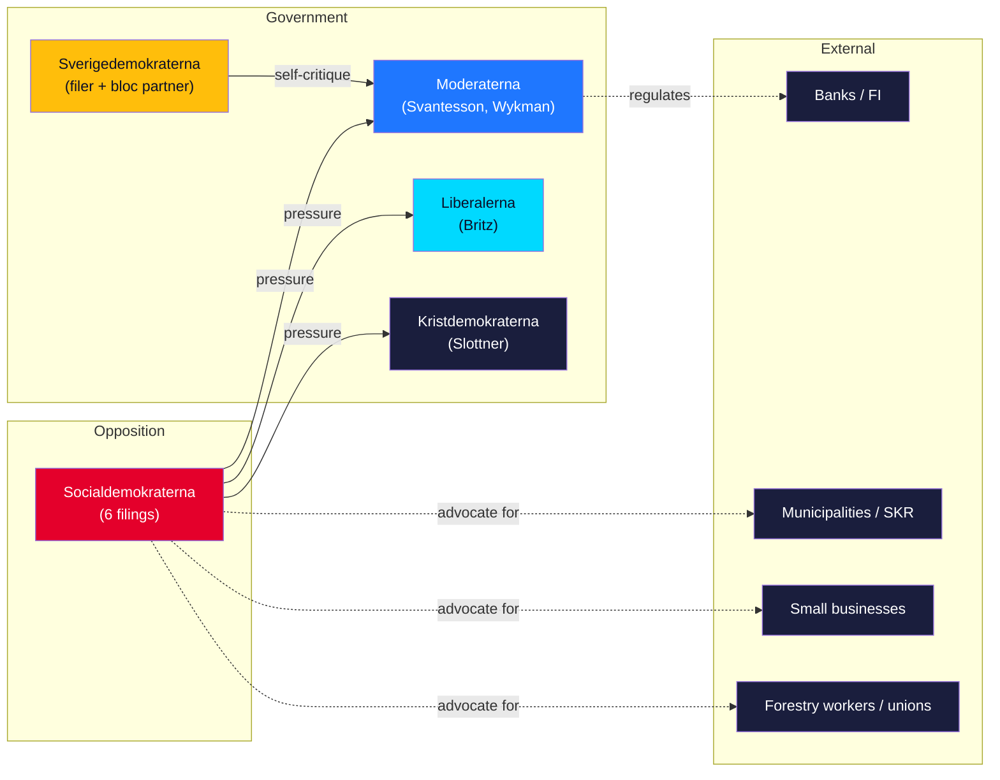
```mermaid
flowchart LR
  subgraph Opposition
    S["Socialdemokraterna<br/>(6 filings)"]
  end
  subgraph Government
    M["Moderaterna<br/>(Svantesson, Wykman)"]
    L["Liberalerna<br/>(Britz)"]
    KD["Kristdemokraterna<br/>(Slottner)"]
    SD["Sverigedemokraterna<br/>(filer + bloc partner)"]
  end
  subgraph External
    BANK["Banks / FI"]
    MUN["Municipalities / SKR"]
    SME["Small businesses"]
    WORK["Forestry workers / unions"]
  end
  S -->|pressure| L
  S -->|pressure| M
  S -->|pressure| KD
  SD -->|self-critique| M
  S -.->|advocate for| SME
  S -.->|advocate for| WORK
  S -.->|advocate for| MUN
  M -.->|regulates| BANK
  style S fill:#e4002b,color:#ffffff
  style SD fill:#ffbe0b,color:#0a0e27
  style M fill:#1f77ff,color:#ffffff
  style L fill:#00d9ff,color:#0a0e27
  style KD fill:#1a1e3d,color:#ffffff
  style BANK fill:#1a1e3d,color:#ffffff
  style MUN fill:#1a1e3d,color:#ffffff
  style SME fill:#1a1e3d,color:#ffffff
  style WORK fill:#1a1e3d,color:#ffffff
```

---

### Opposition (Socialdemokraterna)

**Reading**: The interpellations are accountability instruments and campaign scaffolding. S frames itself as the defender of jobs (bruksort, a-kassa), small businesses (fraud protection), municipalities (equalisation) and bank customers. Expect S to convert the 2026-06-12 answers into election messaging. [B2]
**Interest**: Maximise on-the-record government discomfort on jobs and fraud; contest SD for blue-collar and law-and-order voters. [B2]

### Government — Moderaterna (Svantesson, Wykman)

**Reading**: M faces the most pointed asks. Wykman (HD10527/HD10528) will likely stress existing fraud initiatives, the EU PSD3/PSR process, and shared cross-party concern, avoiding firm liability commitments. Svantesson (HD10522) must defend Vattenfall governance *against her own coalition partner* — an awkward position she will likely answer narrowly (owner policy, board independence under aktiebolagslagen). [B2]
**Interest**: Defend the organised-crime brand; avoid conceding the SME/transparency gap; contain the Vattenfall story. [B2]

### Government — Liberalerna (Britz)

**Reading**: Britz is the most-targeted minister (3 filings). On a-kassa (HD10524) he will defend the reform as a work-incentive measure; on varsel (HD10523) he will point to omställning support; on ILO (HD10525) he will affirm Sweden's commitments. L's small size (16 seats) and threshold vulnerability make sustained labour-distress coverage genuinely dangerous for the party. [B2]
**Interest**: Protect the reform record while limiting electoral exposure on jobs. [B2]

### Government — Kristdemokraterna (Slottner)

**Reading**: Slottner (HD10526) will likely acknowledge equalisation as an ongoing review question while resisting a concrete reform timeline before the election. [B3]
**Interest**: Avoid committing to costly redistribution while defending welfare-equity credentials. [B3]

### Governing partner / filer — Sverigedemokraterna

**Reading (dual role)**: SD is simultaneously a coalition partner and the filer of HD10522. Its interest is to pressure M into tighter Vattenfall owner control to deliver the nuclear mandate, while signalling to its base that SD is policing the energy promise. This is base-management via intra-bloc accountability. [B2]
**Interest**: Demonstrate energy-policy delivery to voters; pressure M without breaking the coalition. [B2]

### External — Banks & Finansinspektionen

**Reading**: HD10528's transparency ask (publish comparable bank-level fraud statistics) and liability-shift ask are unwelcome; banks will cite commercial sensitivity and operational-security grounds. FI sits between transparency demands and supervisory caution. [B2]
**Interest**: Resist mandatory comparable-statistics disclosure and expanded reimbursement liability. [B3]

### External — Municipalities / SKR

**Reading**: The cost-shifting argument (HD10524) and equalisation reform (HD10526) align with municipal interests; SKR would welcome both the diagnosis and any reform commitment. [B3]
**Interest**: Relief from central-policy cost displacement; a more generous equalisation model. [B3]

### External — Small businesses & forestry workers/unions

**Reading**: Företagarna/SME bodies would back stronger fraud protection (HD10527); forestry unions (GS-facket, IF Metall) back the varsel/a-kassa framing (HD10523/HD10524). These constituencies give the opposition organised allies. [B3]

---

### Stakeholder Alignment Matrix

| Stakeholder | Bank fraud | Labour cluster | Vattenfall | Equalisation |
|-------------|-----------|----------------|------------|--------------|
| S | Drives | Drives | Neutral | Drives |
| M | Defends | — | Defends | — |
| L | — | Defends | — | — |
| KD | — | — | — | Defends |
| SD | — | Competes (base) | **Drives** | — |
| Banks/FI | Opposes ask | — | — | — |
| Municipalities | — | Supports | — | Supports |
| SMEs/unions | Supports | Supports | — | — |

The clearest coalition cleavage is the **Vattenfall column**, where SD drives and M defends — the only intra-government contest in the set. [B2]

### Winners, Losers, and the Exposed Middle

If the 2026-06-12 answers are weak, the clearest **loser** is L (Britz), absorbing three labour-cluster interpellations while holding the bloc's most fragile mandate; the clearest **winner** is S, which extracts campaign material at near-zero legislative cost. The **exposed middle** is M (Wykman on fraud, Svantesson on Vattenfall): M must simultaneously defend the government's crime brand *and* field an attack from its own coalition partner — a two-front posture no other actor faces. SD occupies a deliberately ambiguous position, claiming both governing credit and oppositional energy critique; that ambiguity is an asset now but a liability if forced to vote consistently. [B2]

## Coalition Mathematics
<!-- source: coalition-mathematics.md :: https://github.com/Hack23/riksdagsmonitor/blob/main/analysis/daily/2026-05-29/interpellations/coalition-mathematics.md -->

**Riksdag**: 349 seats · **Majority**: 175 · **Horizon**: T+107d · **Multiplier**: 1.5×. [A1]

### Current Seat Distribution

| Bloc | Party | Seats |
|------|-------|-------|
| **Tidö (government)** | M (Moderaterna) | 68 |
| | SD (Sverigedemokraterna) | 73 |
| | KD (Kristdemokraterna) | 19 |
| | L (Liberalerna) | 16 |
| | **Tidö total** | **176** |
| **Opposition** | S (Socialdemokraterna) | 107 |
| | V (Vänsterpartiet) | 24 |
| | C (Centerpartiet) | 24 |
| | MP (Miljöpartiet) | 18 |
| | **Opposition total** | **173** |

Tidö majority margin: **176 − 175 = 1 seat**. The narrowness is the central fact of the mandate. [A1]

### Why the Interpellations Matter to the Math

A 1-seat margin means any L collapse (16 seats) below the 4% threshold, or SD–M friction that fractures discipline, threatens the majority. The interpellations pressure exactly these fault lines: [B2]

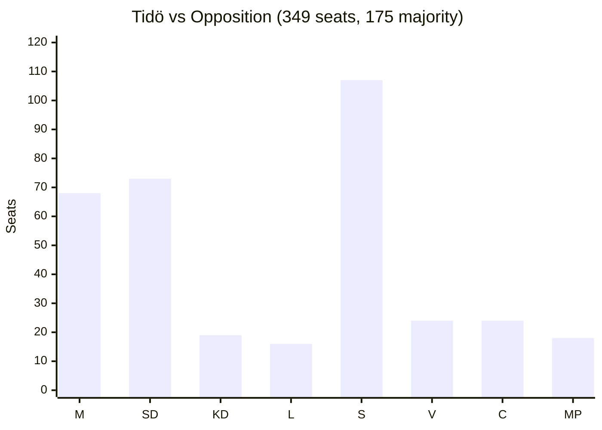
```mermaid
xychart-beta
  title "Tidö vs Opposition (349 seats, 175 majority)"
  x-axis ["M", "SD", "KD", "L", "S", "V", "C", "MP"]
  y-axis "Seats" 0 --> 120
  bar [68, 73, 19, 16, 107, 24, 24, 18]
```

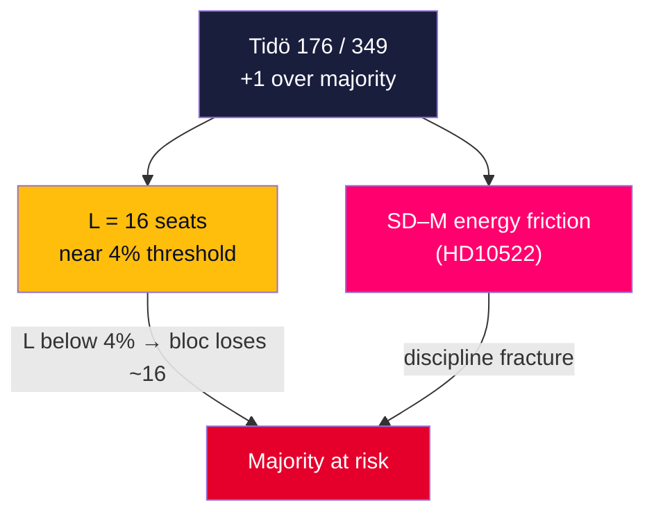
```mermaid
flowchart TD
  MAJ["Tidö 176 / 349<br/>+1 over majority"]
  L["L = 16 seats<br/>near 4% threshold"]
  SDM["SD–M energy friction<br/>(HD10522)"]
  RISK["Majority at risk"]
  L -->|"L below 4% → bloc loses ~16"| RISK
  SDM -->|"discipline fracture"| RISK
  MAJ --> L
  MAJ --> SDM
  style MAJ fill:#1a1e3d,color:#ffffff
  style L fill:#ffbe0b,color:#0a0e27
  style SDM fill:#ff006e,color:#ffffff
  style RISK fill:#e4002b,color:#ffffff
```

### Coalition Scenario Table (WEP — Words of Estimative Probability)

| Scenario | Description | Likelihood (WEP) |
|----------|-------------|------------------|
| Tidö holds | Discipline maintained through election; L clears 4% | Likely (55–70%) |
| L sub-threshold | L falls below 4%, Tidö loses majority math | Roughly even (35–50%) |
| SD–M open friction | Vattenfall-type disputes become public splits | Unlikely (15–30%) |
| Opposition majority post-election | S+V+C+MP > 175 | Roughly even (35–50%) |

*WEP per ICD 203 estimative language. Probabilities are analyst-calibrated, not modelled.* [B3]

### L as the Pivot

L (16 seats) is both the **most-targeted minister** this cycle (Britz, 3 interpellations) and the **most electorally fragile** governing party. The labour cluster's pressure on Britz is therefore strategically efficient: it targets the bloc's weakest mathematical link. [B2]

### Net Read

With a 1-seat majority, the interpellations are not merely rhetorical — they probe the two scenarios (L collapse, SD–M friction) that would flip the arithmetic. The 2026-06-12 answers and the 2026-09-13 vote are the decision points. See election-2026-analysis.md and forward-indicators.md. [B2]

### Tipping-Point Arithmetic

The bloc's stability reduces to two independent failure modes, either of which is sufficient to end the majority. **Mode 1 (subtraction):** L falls below the 4% threshold or sheds enough seats that the four-party sum drops under 175 — the labour cluster on Britz directly stresses this path. **Mode 2 (defection):** SD withholds support on a confidence-relevant vote over an energy or sovereignty grievance — the Vattenfall filing is the leading indicator of this path. Critically, the two modes are **not mutually reinforcing for the opposition's purposes**: a strong S campaign that shrinks L (Mode 1) may *strengthen* SD's relative position and reduce its incentive to defect (Mode 2), and vice-versa. The government's survival therefore depends less on winning any single debate than on ensuring the two failure modes do not align in the final pre-election weeks. The narrowest realistic safe margin is **175 of 349**, leaving zero tolerance for simultaneous L-erosion and SD-friction. [B2]

## Voter Segmentation
<!-- source: voter-segmentation.md :: https://github.com/Hack23/riksdagsmonitor/blob/main/analysis/daily/2026-05-29/interpellations/voter-segmentation.md -->

### Segment Map

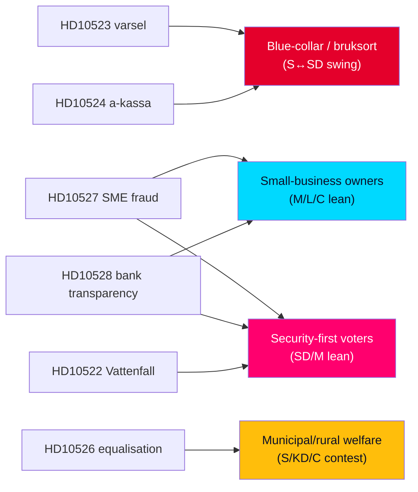
```mermaid
flowchart LR
  BC["Blue-collar / bruksort<br/>(S↔SD swing)"]
  SME["Small-business owners<br/>(M/L/C lean)"]
  MUN["Municipal/rural welfare<br/>(S/KD/C contest)"]
  SEC["Security-first voters<br/>(SD/M lean)"]
  HD23["HD10523 varsel"] --> BC
  HD24["HD10524 a-kassa"] --> BC
  HD27["HD10527 SME fraud"] --> SME
  HD28["HD10528 bank transparency"] --> SME
  HD26["HD10526 equalisation"] --> MUN
  HD27 --> SEC
  HD28 --> SEC
  HD22["HD10522 Vattenfall"] --> SEC
  style BC fill:#e4002b,color:#ffffff
  style SME fill:#00d9ff,color:#0a0e27
  style MUN fill:#ffbe0b,color:#0a0e27
  style SEC fill:#ff006e,color:#ffffff
```

### Segment-by-Segment Analysis

#### Blue-collar / bruksort voters (the S↔SD battleground)
**Targeted by**: HD10523 (varsel), HD10524 (a-kassa), HD10525 (ILO).
The core swing bloc of the 2026 election. S uses job security and benefit duration to argue SD's coalition harms workers. Resonates in forestry/industrial towns where varsel is concrete. Risk: SD counters that activation reforms create jobs. [B2] Unemployment ~8.5% (IMF WEO Apr-2026) sharpens salience. `{provider: "imf", dataflow: "WEO", indicator: "LUR", vintage: "WEO Apr-2026", retrieved_at: "2026-05-29"}`

#### Small-business owners (M/L/C-leaning, fraud-exposed)
**Targeted by**: HD10527 (SME bank-fraud protection), HD10528 (transparency).
S makes an unusual cross-pressure play for a normally centre-right segment, arguing the government leaves SMEs unprotected against bank fraud. Even small defection or depressed turnout among this group has outsized value. [B2]

#### Municipal & rural welfare voters
**Targeted by**: HD10526 (equalisation), HD10524 (cost-shift to municipalities).
Targets rural/northern municipalities dependent on fiscal equalisation — contested between S, C and KD. Frames the government as shifting costs onto local budgets. [B3] (HD10526 metadata-only — confidence capped.)

#### Security-first voters (the SD/M crossover)
**Targeted by**: HD10527/HD10528 (fraud-as-crime), HD10522 (energy security).
By reframing bank fraud as organised crime, S contests the security segment that normally favours SD/M. HD10522 adds energy-security doubt about Tidö delivery. [B2]

### Turnout & Persuasion Logic

| Segment | S objective | Mechanism |
|---------|-------------|-----------|
| Blue-collar | Win back from SD | Jobs + benefit defence |
| Small-business | Depress/peel from M-L | "Unprotected from fraud" |
| Municipal/rural | Mobilise | "Costs shifted to your town" |
| Security-first | Cross-pressure SD/M | "Fraud = neglected crime" |

### Net Read

The package is a **multi-segment persuasion portfolio**: it defends S's blue-collar base while making opportunistic plays for small-business and security-first voters and mobilising rural welfare voters. Breadth is the strategy. See election-2026-analysis.md and coalition-mathematics.md. [B2]

### Turnout-Elasticity Note

The segments differ sharply in *mobilisation* versus *persuasion* potential. The rural/municipal welfare segment is **high-elasticity for turnout**: the cost-shift message ("your town pays for the a-kassa cut") attaches an abstract reform to a local, felt consequence, which is the classic precondition for converting latent grievance into turnout. The security-first segment is **persuasion-hard, mobilisation-easy**: the bank-fraud framing is unlikely to move committed SD/M voters to S, but can depress their certainty or turnout by muddying the government's crime-toughness claim. The SME segment is the **lowest-yield** play — small in number and weakly partisan — making HD10527/HD10528's real audience the *media-amplified general electorate* rather than SME owners themselves. The single most turnout-efficient message in the package is therefore the municipal cost-shift line, not the higher-profile fraud line. [B2]

## Forward Indicators
<!-- source: forward-indicators.md :: https://github.com/Hack23/riksdagsmonitor/blob/main/analysis/daily/2026-05-29/interpellations/forward-indicators.md -->

### Indicator Register

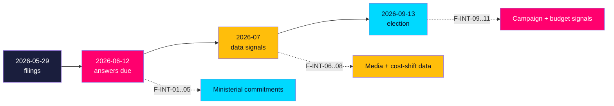
```mermaid
flowchart LR
  NOW["2026-05-29<br/>filings"]
  D612["2026-06-12<br/>answers due"]
  JUL["2026-07<br/>data signals"]
  ELEC["2026-09-13<br/>election"]
  NOW --> D612
  D612 --> JUL
  JUL --> ELEC
  D612 -.->|"F-INT-01..05"| ANS["Ministerial commitments"]
  JUL -.->|"F-INT-06..08"| MED["Media + cost-shift data"]
  ELEC -.->|"F-INT-09..11"| CAMP["Campaign + budget signals"]
  style NOW fill:#1a1e3d,color:#ffffff
  style D612 fill:#ff006e,color:#ffffff
  style JUL fill:#ffbe0b,color:#0a0e27
  style ELEC fill:#00d9ff,color:#0a0e27
  style ANS fill:#00d9ff,color:#0a0e27
  style MED fill:#ffbe0b,color:#0a0e27
  style CAMP fill:#ff006e,color:#ffffff
```

#### Near-term band (to 2026-06-12 — answer deadline)

**F-INT-01** — *Wykman answers HD10527/HD10528*
- Expected date: by 2026-06-12
- Collection method: data.riksdagen.se interpellationssvar
- Indicator content: Does Wykman commit to SME fraud-protection parity and/or bank transparency, or defer to EU PSD3/PSR?
- Escalation threshold: Explicit refusal → fraud becomes a live campaign liability
- PIR link: PIR-INT-01 · Admiralty target: [A2]

**F-INT-02** — *Britz answers HD10523/HD10524/HD10525*
- Expected date: by 2026-06-12
- Collection method: interpellationssvar
- Indicator content: Concrete bruksort/omställning or a-kassa measures vs. unchanged reform defence
- Escalation threshold: Pure defence → labour cluster gains campaign traction
- PIR link: PIR-INT-02 · Admiralty target: [A2]

**F-INT-03** — *Slottner answers HD10526*
- Expected date: by 2026-06-12
- Collection method: interpellationssvar
- Indicator content: Commitment (or not) to an equalisation review
- Escalation threshold: Commitment → defuses rural attack; refusal → sustains it
- PIR link: PIR-INT-03 · Admiralty target: [A2]

**F-INT-04** — *Full text retrieved for HD10525 & HD10526*
- Expected date: by 2026-06-05
- Collection method: MCP get_dokument_innehall
- Indicator content: Closes the two metadata-only gaps
- Escalation threshold: n/a (collection action)
- PIR link: PIR-INT-04 · Admiralty target: [A2]

**F-INT-05** — *Svantesson answers HD10522 (Vattenfall)*
- Expected date: by 2026-06-12
- Collection method: interpellationssvar
- Indicator content: Tone toward SD — accommodative vs. dismissive
- Escalation threshold: Dismissive → visible SD–M friction
- PIR link: PIR-INT-01 · Admiralty target: [A2]

#### Short-term band (2026-06 to 2026-07)

**F-INT-06** — *Media uptake of bank-fraud frame*
- Expected date: 2026-06-12 to 2026-06-30
- Collection method: Media monitoring
- Indicator content: Does "SMEs unprotected from fraud" enter mainstream coverage?
- Escalation threshold: National pickup → durable campaign theme
- PIR link: PIR-INT-01 · Admiralty target: [B2]

**F-INT-07** — *SD energy escalation after answer*
- Expected date: 2026-06 to 2026-08
- Collection method: Riksdag filings + SD comms
- Indicator content: Further SD interpellations/motions on Vattenfall/energy
- Escalation threshold: Repeat filing → genuine intra-Tidö strain (not theatre)
- PIR link: PIR-INT-01 · Admiralty target: [B2]

**F-INT-08** — *Municipal försörjningsstöd data*
- Expected date: 2026-07 (quarterly data)
- Collection method: Socialstyrelsen / SKR statistics
- Indicator content: Rising municipal welfare costs post a-kassa taper
- Escalation threshold: Measurable rise → validates cost-shift hypothesis
- PIR link: PIR-INT-04 · Admiralty target: [B2]

#### Medium-term band (2026-08 to election)

**F-INT-09** — *Labour themes enter S manifesto/campaign*
- Expected date: 2026-08
- Collection method: S campaign materials
- Indicator content: a-kassa/varsel framing promoted to manifesto lines
- Escalation threshold: Inclusion → confirms campaign-instrument hypothesis
- PIR link: PIR-INT-02 · Admiralty target: [B2]

**F-INT-10** — *Government budget signals on a-kassa/labour*
- Expected date: 2026-08 (budget bill preparation)
- Collection method: Regeringen budget communications
- Indicator content: Any softening of the a-kassa taper ahead of the vote
- Escalation threshold: Softening → opposition pressure judged effective
- PIR link: PIR-INT-02 · Admiralty target: [B2]

**F-INT-11** — *Statskontoret cost-shift evaluation commissioned*
- Expected date: 2026-07 to 2026-09
- Collection method: Statskontoret assignments register
- Indicator content: Independent evaluation of a-kassa reform displacement effects
- Escalation threshold: Commissioned → claim moves toward evidenced finding
- PIR link: PIR-INT-04 · Admiralty target: [B2]

### Monitoring Schedule

| Cadence | Indicators | Owner |
|---------|-----------|-------|
| Daily (to 2026-06-12) | F-INT-01..05 | Analyst |
| Weekly (Jun–Jul) | F-INT-06, 07, 08 | Analyst |
| Monthly (Aug–Sep) | F-INT-09, 10, 11 | Analyst |

### PIR Status Summary

| PIR | Indicators | Status | Next review |
|-----|-----------|--------|-------------|
| PIR-INT-01 | F-INT-01, 05, 06, 07 | OPEN | 2026-06-12 |
| PIR-INT-02 | F-INT-02, 09, 10 | OPEN | 2026-06-12 |
| PIR-INT-03 | F-INT-03 | OPEN | 2026-06-12 |
| PIR-INT-04 | F-INT-04, 08, 11 | OPEN | 2026-06-12 |

*Machine-readable: `pir-status.json`. All indicators dated and falsifiable per ICD 203.* [B2]

## Scenario Analysis
<!-- source: scenario-analysis.md :: https://github.com/Hack23/riksdagsmonitor/blob/main/analysis/daily/2026-05-29/interpellations/scenario-analysis.md -->

### Method

Scenarios project how the seven interpellations and their 2026-06-12 answers could evolve through the 2026-09-13 election (107-day horizon). Each scenario carries a **Word of Estimative Probability (WEP)** band and is anchored to observable triggers. This is a quarter-horizon set (≥4 scenarios). [B2]

---

### Scenario A — Accountability Absorbed (baseline)

Ministers answer on 2026-06-12 with defensive but substantive statements; the government reframes a-kassa reform as a work-incentive success and fraud as a shared priority. Media attention peaks briefly on the bank-fraud pair, then disperses. The interpellations become routine campaign material without altering the polling trajectory. [B2]
**Triggers**: non-committal but competent answers; no EU PSD3/PSR milestone before recess.
**Indicator**: Wykman/Britz answer tone; absence of follow-up motions.

### Scenario B — Bank-Fraud Breakthrough

The bank-fraud pair (HD10527/HD10528) gains sustained traction: an EU PSD3/PSR development, a high-profile SME fraud case, or a weak Wykman answer converts it into a defining law-and-order-meets-consumer-protection campaign theme. S successfully argues the government's organised-crime brand has a fraud-shaped hole. [B2]
**Triggers**: EU milestone; media case study; FI declines transparency tasking.
**Indicator**: fraud-coverage volume; FI statement on comparable statistics.

### Scenario C — Coalition Strain Surfaces

The Vattenfall interpellation (HD10522) catalyses visible SD–M friction: Svantesson's answer fails to satisfy SD, prompting further SD accountability pressure or public criticism. The "Tidö divided on energy" narrative takes hold, damaging the bloc's unified-government claim into the election. [B2]
**Triggers**: dismissive Svantesson answer; additional SD filings; SD spokesperson escalation.
**Indicator**: count of SD-on-Tidö accountability acts; energy-policy media framing.

### Scenario D — Labour Distress Dominates

Continuing varsel and visible a-kassa-taper hardship (HD10523/HD10524), reinforced by IMF-level unemployment (~8.5%), make jobs the campaign's central axis. S and SD compete intensely for blue-collar voters; the government is forced onto the defensive on omställning. [A2] `{provider: "imf", dataflow: "WEO", indicator: "LUR", vintage: "WEO Apr-2026", retrieved_at: "2026-05-29"}`
**Triggers**: new large varsel; rising municipal försörjningsstöd; weak Britz answer.
**Indicator**: Arbetsförmedlingen varsel data; SCB labour figures.

### Scenario E — Wildcard: Issue Crowding / Dilution

Seven interpellations plus a crowded pre-recess agenda dilute attention; none breaks through, and the day's accountability value is largely lost in noise. The SD Vattenfall filing further muddies a unified opposition message. [B3]
**Triggers**: competing major news; recess timing compresses debate.
**Indicator**: low aggregate media uptake across all clusters.

---

### Scenario Matrix

| Scenario | WEP | Primary driver | Key indicator |
|----------|-----|----------------|---------------|
| A — Accountability Absorbed | Likely (55–70%) | Competent gov't answers | Answer tone 2026-06-12 |
| B — Bank-Fraud Breakthrough | Even (35–45%) | EU hook / weak answer | Fraud coverage; FI stance |
| C — Coalition Strain Surfaces | Unlikely–even (25–35%) | SD escalation | SD filing count |
| D — Labour Distress Dominates | Even (30–40%) | Varsel + a-kassa bite | Labour-market data |
| E — Dilution (wildcard) | Unlikely (15–25%) | Issue crowding | Media uptake |

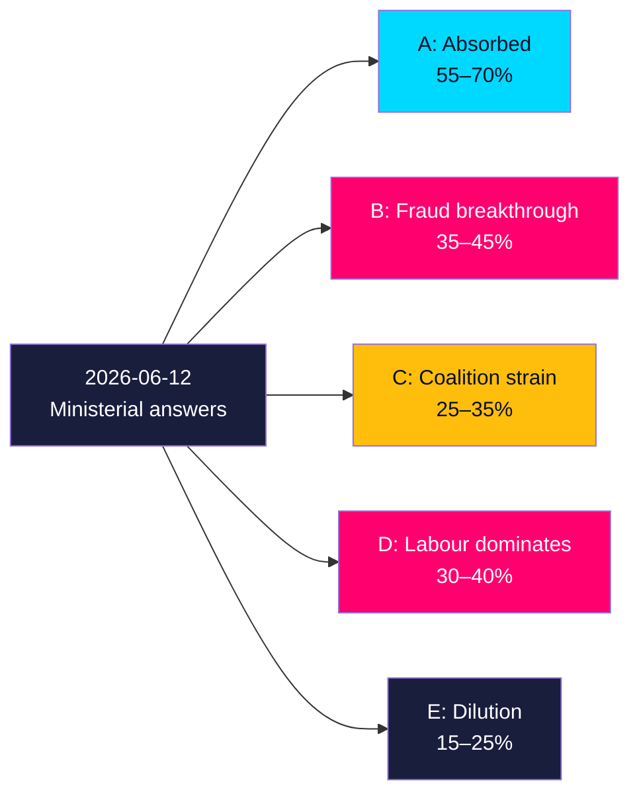
```mermaid
flowchart LR
  Q["2026-06-12<br/>Ministerial answers"] --> A["A: Absorbed<br/>55–70%"]
  Q --> B["B: Fraud breakthrough<br/>35–45%"]
  Q --> C["C: Coalition strain<br/>25–35%"]
  Q --> D["D: Labour dominates<br/>30–40%"]
  Q --> E["E: Dilution<br/>15–25%"]
  style Q fill:#1a1e3d,color:#ffffff
  style A fill:#00d9ff,color:#0a0e27
  style B fill:#ff006e,color:#ffffff
  style C fill:#ffbe0b,color:#0a0e27
  style D fill:#ff006e,color:#ffffff
  style E fill:#1a1e3d,color:#ffffff
```

*Scenarios are non-exclusive; B and D can co-occur. Probabilities are estimative, not additive.*

### Indicator-to-Scenario Mapping

Each scenario is falsifiable against the forward indicators in forward-indicators.md. Scenario A (campaign sustains) is confirmed by **F-INT-09/10** (further S accountability filings, campaign-budget signals) and disconfirmed if filings lapse after 2026-06-12. Scenario B (coalition strain visible) is confirmed by **F-INT-01** (a second SD-on-Tidö filing) — a single recurrence converts the Vattenfall anomaly from noise to trend. Scenario C (government recovers) is confirmed by **F-INT-05** (ministers convert defence into dated commitments). Scenario D (cost-shift evidence emerges) hinges on **F-INT-07** (municipal försörjningsstöd data) and a possible Statskontoret review. The earliest discriminating observation is the **2026-06-12 answer batch**, which simultaneously tests A, C and the credibility of D. [B2]

## Election 2026 Analysis
<!-- source: election-2026-analysis.md :: https://github.com/Hack23/riksdagsmonitor/blob/main/analysis/daily/2026-05-29/interpellations/election-2026-analysis.md -->

### How the Interpellations Map to the Campaign

The seven interpellations are pre-election accountability instruments whose value is amplified by proximity to the vote. They distribute pressure across the issues where the electoral contest is tightest. [B2]

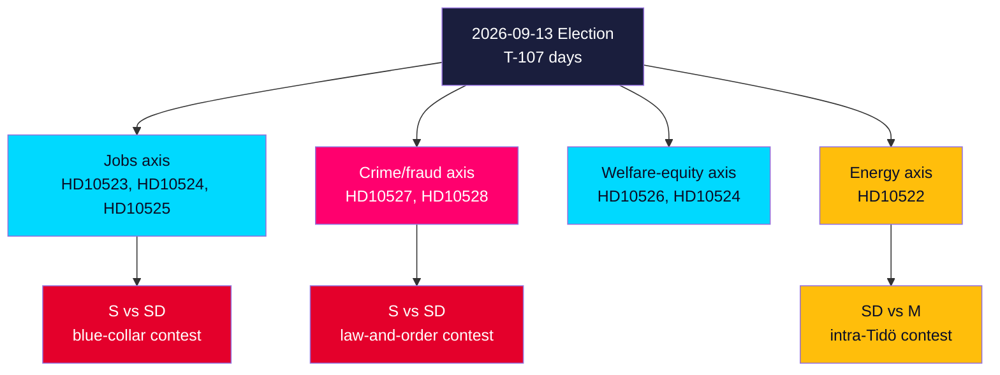
```mermaid
flowchart TD
  E["2026-09-13 Election<br/>T-107 days"]
  J["Jobs axis<br/>HD10523, HD10524, HD10525"]
  F["Crime/fraud axis<br/>HD10527, HD10528"]
  W["Welfare-equity axis<br/>HD10526, HD10524"]
  EN["Energy axis<br/>HD10522"]
  E --> J
  E --> F
  E --> W
  E --> EN
  J --> SDc["S vs SD<br/>blue-collar contest"]
  F --> LO["S vs SD<br/>law-and-order contest"]
  EN --> TID["SD vs M<br/>intra-Tidö contest"]
  style E fill:#1a1e3d,color:#ffffff
  style J fill:#00d9ff,color:#0a0e27
  style F fill:#ff006e,color:#ffffff
  style W fill:#00d9ff,color:#0a0e27
  style EN fill:#ffbe0b,color:#0a0e27
  style SDc fill:#e4002b,color:#ffffff
  style LO fill:#e4002b,color:#ffffff
  style TID fill:#ffbe0b,color:#0a0e27
```

### Electoral Battlegrounds Activated

#### 1. The blue-collar contest (S vs SD)
The labour cluster (HD10523 bruksort varsel, HD10524 a-kassa) is precision-targeted at the working-class voters S has lost to SD. By defending jobs and benefit duration, S contests SD on its own adopted turf. IMF WEO Apr-2026 unemployment ~8.5% gives the attack a factual base. [B2] `{provider: "imf", dataflow: "WEO", indicator: "LUR", vintage: "WEO Apr-2026", retrieved_at: "2026-05-29"}`

#### 2. The law-and-order contest (S vs the government brand)
The bank-fraud pair (HD10527/HD10528) lets S contest the government's signature crime issue from an unexpected angle — fraud as the organised-crime funding stream the government allegedly neglects. This neutralises a government strength. [B2]

#### 3. The intra-Tidö contest (SD vs M)
HD10522 exposes SD pressing M on Vattenfall — the opposition's gift: evidence the governing bloc is divided on energy 107 days out. [B2]

### Party-Level Electoral Stakes

| Party | Exposure this cycle | Stake |
|-------|---------------------|-------|
| S | Driving 6 filings | Reclaim blue-collar + own welfare/crime framing |
| M | 3 filings target M ministers | Defend crime brand + Vattenfall record |
| L | Most-targeted minister (Britz, 3) | Threshold survival; jobs exposure |
| KD | 1 filing (Slottner) | Welfare-equity credibility |
| SD | Filer of HD10522 | Base-management on nuclear delivery |

### Net Electoral Read

The day advances S's strategy of **simultaneously contesting SD (jobs, crime) and exposing Tidö disunity (energy)**. L is the most electorally exposed governing party. The decisive electoral moment is the 2026-06-12 answers — whether ministers convert defence into commitment. See coalition-mathematics.md for seat implications and scenario-analysis.md for trajectories. [B2]

### Seat-Sensitivity Note

The electoral leverage of this package is asymmetric across the bloc. Because the government holds a **1-seat working majority**, the marginal seat is worth far more than its nominal weight: a swing that costs L even a handful of mandates does not merely weaken L, it can flip control of the chamber. The labour cluster's concentration on Britz (L) is therefore the **highest seat-elasticity play** in the set — it targets the party whose losses translate most directly into a change of government. By contrast, the bank-fraud cluster targets M, a larger and more resilient party where equivalent vote movement has lower seat-flip consequence. This means the *most newsworthy* cluster (fraud) and the *most seat-decisive* cluster (a-kassa/L) diverge — a distinction the opposition's filing pattern appears to exploit deliberately. [B2]

## Risk Assessment
<!-- source: risk-assessment.md :: https://github.com/Hack23/riksdagsmonitor/blob/main/analysis/daily/2026-05-29/interpellations/risk-assessment.md -->

### Scope

This assessment covers **political, governance and analytical risks** arising from the seven interpellations and from this analysis package itself. Risks are scored Likelihood × Impact (1–5 each) → rating; the 1.5× election-proximity factor elevates political-consequence impact across the board. [B2]

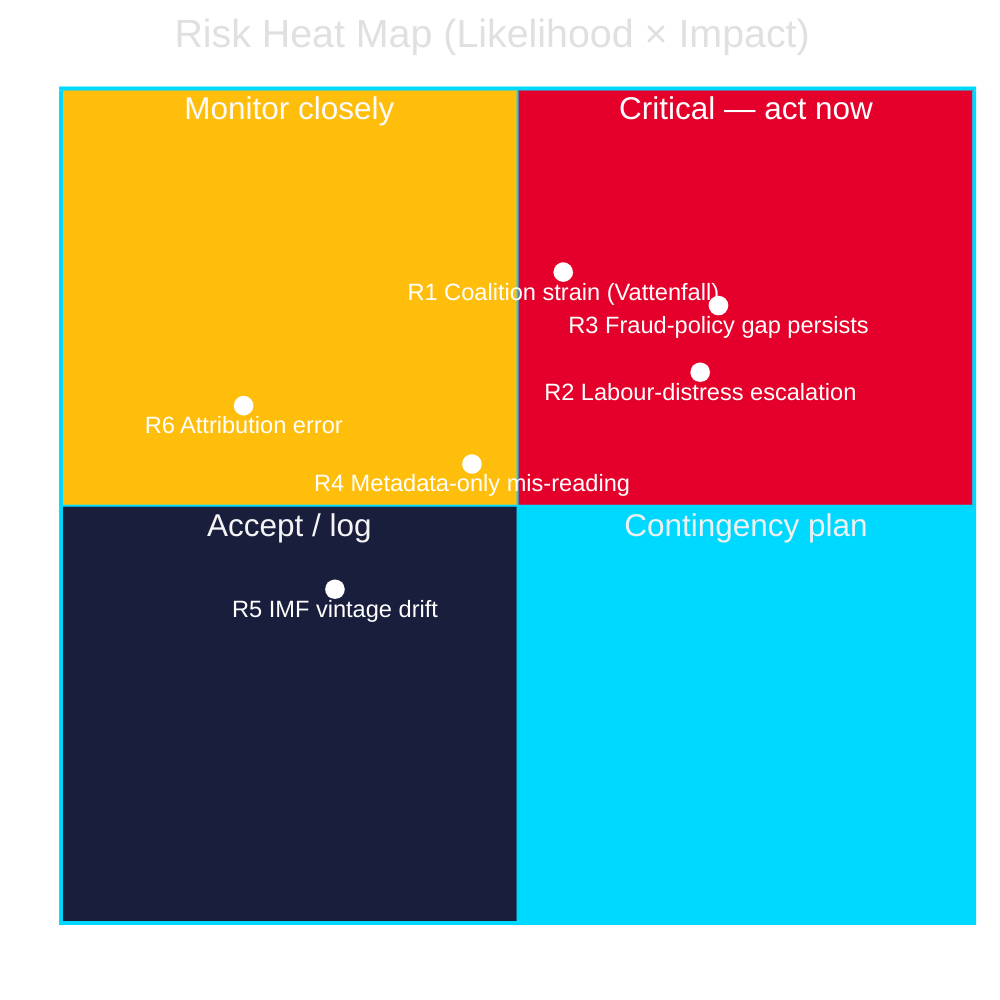
```mermaid
%%{init: {'theme':'base', 'themeVariables': {'primaryColor':'#ff006e','primaryTextColor':'#ffffff','primaryBorderColor':'#00d9ff','lineColor':'#ffbe0b','quadrant1Fill':'#e4002b','quadrant2Fill':'#ffbe0b','quadrant3Fill':'#1a1e3d','quadrant4Fill':'#00d9ff','quadrantTitleFill':'#e0e0e0'}}}%%
quadrantChart
    title Risk Heat Map (Likelihood × Impact)
    x-axis "Low likelihood" --> "High likelihood"
    y-axis "Low impact" --> "High impact"
    quadrant-1 "Critical — act now"
    quadrant-2 "Monitor closely"
    quadrant-3 "Accept / log"
    quadrant-4 "Contingency plan"
    "R1 Coalition strain (Vattenfall)": [0.55, 0.78]
    "R2 Labour-distress escalation": [0.70, 0.66]
    "R3 Fraud-policy gap persists": [0.72, 0.74]
    "R4 Metadata-only mis-reading": [0.45, 0.55]
    "R5 IMF vintage drift": [0.30, 0.40]
    "R6 Attribution error": [0.20, 0.62]
```

---

### Political & Governance Risks

#### R1 — Tidö coalition strain over energy policy
**Likelihood**: Medium (3) · **Impact**: High (4) · **Rating**: 12 (Elevated)
The SD Vattenfall interpellation (HD10522) signals that the governing bloc lacks a unified energy-transition message 107 days from the election. If SD escalates intra-bloc accountability, coalition cohesion risk rises. [B2]
**Indicator**: further SD-on-Tidö filings; Svantesson's answer tone (due 2026-06-12). **Owner**: coalition-mathematics watch.

#### R2 — Labour-market distress escalates into the campaign
**Likelihood**: High (4) · **Impact**: Medium-High (3.5) · **Rating**: 14 (Elevated)
With unemployment ~8.5% (IMF WEO Apr-2026) and continuing forestry varsel, the a-kassa taper's bite (HD10524) and bruksort layoffs (HD10523) could become a dominant campaign theme, pressuring the government on jobs. [A2]
**Indicator**: Arbetsförmedlingen varsel statistics; municipal försörjningsstöd trend. `{provider: "imf", dataflow: "WEO", indicator: "LUR", vintage: "WEO Apr-2026", retrieved_at: "2026-05-29"}`

#### R3 — Fraud-protection gap persists
**Likelihood**: High (4) · **Impact**: High (4) · **Rating**: 16 (High)
If the government gives non-committal answers to HD10527/HD10528 and the EU PSD3/PSR timeline slips, the SME fraud-protection and bank-transparency gaps remain open — a durable accountability vulnerability and a real economic-security harm. [B2]
**Indicator**: Wykman's Council position; any FI tasking on comparable fraud statistics.

---

### Analytical Risks

#### R4 — Mis-reading metadata-only documents
**Likelihood**: Medium (3) · **Impact**: Medium (3) · **Rating**: 9 (Moderate)
HD10525 (ILO) and HD10526 (equalisation) content is inferred. Drawing firm conclusions before full-text retrieval risks attribution/framing error. **Mitigation**: confidence flags [B3] applied; re-retrieval set as top collection action (forward-indicators.md F-INT-04).

#### R5 — IMF vintage drift
**Likelihood**: Low (2) · **Impact**: Low-Medium (2.5) · **Rating**: 5 (Low)
Economic context uses cached WEO Apr-2026 (live SDMX fetch unavailable). Vintage is 1 month — within tolerance. **Mitigation**: vintage stamped in every provenance block; >6-month would trigger annotation (not reached). [B3]

#### R6 — Attribution error in analysis package
**Likelihood**: Low (2) · **Impact**: High (4) · **Rating**: 8 (Moderate)
Mis-stating an interpellant, minister or question would damage credibility. **Mitigation**: all attributions cross-checked against source JSON and data.riksdagen.se; intressent-ids recorded where available. [A2]

---

### Risk Summary

| ID | Risk | L | I | Rating | Band |
|----|------|---|---|--------|------|
| R3 | Fraud-protection gap persists | 4 | 4 | 16 | High |
| R2 | Labour-market distress escalates | 4 | 3.5 | 14 | Elevated |
| R1 | Coalition strain (Vattenfall) | 3 | 4 | 12 | Elevated |
| R4 | Metadata-only mis-reading | 3 | 3 | 9 | Moderate |
| R6 | Attribution error | 2 | 4 | 8 | Moderate |
| R5 | IMF vintage drift | 2 | 2.5 | 5 | Low |

**Top risk**: R3 (fraud-protection gap) — aligns with the highest-DIW cluster and the most actionable forward indicator (Wykman's 2026-06-12 answer). [B2]

## SWOT Analysis
<!-- source: swot-analysis.md :: https://github.com/Hack23/riksdagsmonitor/blob/main/analysis/daily/2026-05-29/interpellations/swot-analysis.md -->

This SWOT assesses the **opposition's interpellation strategy** of 2026-05-29 as a pre-election accountability instrument. Evidence is cited to dok_id and primary sources. [A2]

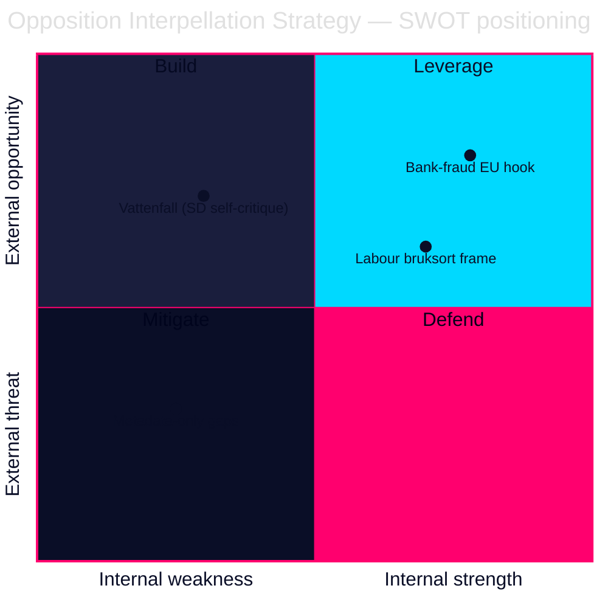
```mermaid
%%{init: {'theme':'base', 'themeVariables': {'primaryColor':'#00d9ff','primaryTextColor':'#0a0e27','primaryBorderColor':'#ff006e','lineColor':'#ffbe0b','quadrant1Fill':'#00d9ff','quadrant2Fill':'#1a1e3d','quadrant3Fill':'#0a0e27','quadrant4Fill':'#ff006e','quadrantTitleFill':'#e0e0e0'}}}%%
quadrantChart
    title Opposition Interpellation Strategy — SWOT positioning
    x-axis "Internal weakness" --> "Internal strength"
    y-axis "External threat" --> "External opportunity"
    quadrant-1 "Leverage"
    quadrant-2 "Build"
    quadrant-3 "Mitigate"
    quadrant-4 "Defend"
    "Bank-fraud EU hook": [0.78, 0.80]
    "Labour bruksort frame": [0.70, 0.62]
    "Vattenfall (SD self-critique)": [0.30, 0.72]
    "Metadata-only gaps": [0.25, 0.30]
```

---

### Strengths

- **S1 — Concrete, dated premises.** HD10524 cites the 1 Oct 2025 a-kassa taper by date; HD10527/HD10528 attach to the pending EU PSD3/PSR package. Verifiable anchors make the interpellations hard to dismiss as rhetorical. [A2] (sources: data.riksdagen.se/dokument/HD10524.html, /HD10527.html)
- **S2 — Brand-jamming the government.** The bank-fraud pair turns the Tidö organised-crime brand against itself ("fraud finances organised crime; the effort is insufficient"). [B2] (HD10528)
- **S3 — Disciplined respondent targeting.** Pressure is concentrated on the two most exposed ministers (Britz/L, Wykman/M), maximising on-the-record accountability before recess. [B2]
- **S4 — Geographic precision.** The bruksort framing (HD10523) targets exactly the blue-collar districts contested with SD. [B2]

### Weaknesses

- **W1 — Limited direct levers.** Interpellations compel answers, not action; ministers can answer without committing. The instrument's ceiling is reputational, not legislative. [A2]
- **W2 — Two metadata-only filings.** HD10525 (ILO) and HD10526 (equalisation) lack retrieved full text, weakening the campaign's evidentiary completeness this cycle. [B3]
- **W3 — Coordination is inferred, not proven.** No retrieved strategy document; the "campaign" reading rests on convergence, exposing it to the devil's-advocate counter that this is routine end-of-session housekeeping. [B3] (see devils-advocate.md)
- **W4 — Late in the cycle.** Answers due 2026-06-12 leave little time for follow-up debate before recess and the campaign. [B2]

### Opportunities

- **O1 — EU regulatory timing.** The live PSD3/PSR negotiation gives HD10527/HD10528 a real external decision point the opposition can keep returning to. [B2]
- **O2 — Coalition fracture exposure.** SD's Vattenfall interpellation (HD10522) hands the opposition evidence that the governing bloc is internally divided on energy policy — an exploitable narrative. [B2]
- **O3 — Macro tailwind.** IMF WEO Apr-2026 unemployment ~8.5% validates the labour-distress framing and the cost-shifting critique. [A2] `{provider: "imf", dataflow: "WEO", indicator: "LUR", vintage: "WEO Apr-2026", retrieved_at: "2026-05-29"}`

### Threats

- **T1 — Government counter-framing.** Ministers can reframe a-kassa reform as work-incentive policy and fraud as a shared cross-party priority, neutralising the attack. [B2]
- **T2 — Answer-quality risk.** If Britz and Wykman give substantive, commitment-bearing answers on 2026-06-12, the accountability moment rebounds in the government's favour. [B2]
- **T3 — Issue crowding.** Seven interpellations in one day risk diluting media attention; only the bank-fraud apex is likely to break through. [B3]
- **T4 — Intra-opposition incoherence.** The SD Vattenfall filing is *not* part of the S campaign and could muddy a unified opposition message. [B3]

---

### Strategic Implication

The campaign's strength is concentrated in the bank-fraud apex and the dated a-kassa critique; its principal vulnerabilities are the inability to force action and the unproven-coordination charge. The highest-leverage move for the opposition is to convert the 2026-06-12 answers into sustained election messaging — and to exploit, rather than ignore, the SD–M Vattenfall split. [B2]

## Threat Analysis
<!-- source: threat-analysis.md :: https://github.com/Hack23/riksdagsmonitor/blob/main/analysis/daily/2026-05-29/interpellations/threat-analysis.md -->

### Purpose & Framing

"Threat" here denotes **threats to democratic accountability, governance integrity and the information environment** surfaced by or implicated in the seven interpellations — not cyber threats. Each entry uses a T-ID, an analytic description, evidence grade, and a monitoring hook. This is a structured analytic product, not an allegation of wrongdoing. [B2]

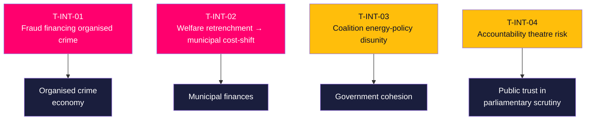
```mermaid
flowchart TD
  T1["T-INT-01<br/>Fraud financing organised crime"]
  T2["T-INT-02<br/>Welfare retrenchment → municipal cost-shift"]
  T3["T-INT-03<br/>Coalition energy-policy disunity"]
  T4["T-INT-04<br/>Accountability theatre risk"]
  ORG["Organised crime<br/>economy"]
  MUN["Municipal finances"]
  GOV["Government cohesion"]
  DEM["Public trust in<br/>parliamentary scrutiny"]
  T1 --> ORG
  T2 --> MUN
  T3 --> GOV
  T4 --> DEM
  style T1 fill:#ff006e,color:#ffffff
  style T2 fill:#ff006e,color:#ffffff
  style T3 fill:#ffbe0b,color:#0a0e27
  style T4 fill:#ffbe0b,color:#0a0e27
  style ORG fill:#1a1e3d,color:#ffffff
  style MUN fill:#1a1e3d,color:#ffffff
  style GOV fill:#1a1e3d,color:#ffffff
  style DEM fill:#1a1e3d,color:#ffffff
```

---

### T-INT-01 — Fraud as an organised-crime financing channel
**Evidence**: [B2] (HD10528 explicitly claims fraud is the fastest-growing crime and finances organised crime; HD10527 asks to fold business fraud into the organised-crime effort.)
**Analysis**: The interpellations assert a strategic gap — that the government's organised-crime agenda under-weights fraud as a funding stream, and that SMEs are an unprotected attack surface. If accurate, this is a genuine national-security-adjacent governance threat, not merely a consumer-protection matter. [B2]
**Monitoring hook**: Wykman's answer (2026-06-12); Polismyndigheten/Ekobrottsmyndigheten fraud-trend reporting; EU PSD3/PSR progress.

### T-INT-02 — Welfare retrenchment displacing cost onto municipalities
**Evidence**: [A2] (HD10524 dates the a-kassa taper to 1 Oct 2025 and argues it raises other agencies' costs; HD10526 presses equalisation reform.)
**Analysis**: The cost-shifting hypothesis describes a threat to municipal fiscal integrity — central retrenchment that re-emerges as local försörjningsstöd pressure, unevenly across municipalities. With IMF WEO Apr-2026 showing national fiscal headroom (debt ~37% GDP), the threat is distributive rather than aggregate. [A2] `{provider: "imf", dataflow: "WEO", indicator: "GGXWDG_NGDP", vintage: "WEO Apr-2026", retrieved_at: "2026-05-29"}`
**Monitoring hook**: Socialstyrelsen ekonomiskt bistånd data; SKR municipal-finance reports; Britz/Slottner answers.

### T-INT-03 — Coalition energy-policy disunity
**Evidence**: [B2] (HD10522: SD interpellates its own M finance minister over Vattenfall governance.)
**Analysis**: Public intra-bloc accountability is an early-warning indicator of governance instability. A governing party signalling that the state energy champion "lives its own life" against the electoral mandate threatens the coherence of the Tidö energy programme and, by extension, coalition cohesion into the election. [B2]
**Monitoring hook**: further SD accountability filings; Svantesson's answer; any revised ägaranvisning for Vattenfall.

### T-INT-04 — Accountability-theatre risk (information-environment threat)
**Evidence**: [B3] (inference from timing: 7 filings, answers due 2026-06-12, pre-recess.)
**Analysis**: If interpellations are deployed primarily for campaign optics with no intent to pursue resulting answers, the instrument's accountability value erodes and public trust in parliamentary scrutiny can degrade. The counter-view (devils-advocate.md) is that on-the-record answers have intrinsic value regardless of motive. [B3]
**Monitoring hook**: whether interpellants pursue follow-up debate/motions after answers; media uptake.

---

### Threat Prioritisation

| T-ID | Threat | Grade | Priority |
|------|--------|-------|----------|
| T-INT-01 | Fraud financing organised crime | [B2] | High |
| T-INT-02 | Welfare cost-shift to municipalities | [A2] | High |
| T-INT-03 | Coalition energy-policy disunity | [B2] | Elevated |
| T-INT-04 | Accountability-theatre risk | [B3] | Monitor |

**Lead threat**: T-INT-01 — it coincides with the highest-DIW cluster (bank fraud) and the most actionable forward indicator. T-INT-03 is the most strategically novel because it originates *inside* the governing coalition. [B2]

### Residual Risk After Mitigation

None of these threats is fully retired by a strong ministerial answer on 2026-06-12, but their *political* charge can be dampened: T-INT-01 falls if Wykman enumerates concrete PSD3/PSR-aligned workstreams with dates; T-INT-02 falls if the government commissions an independent cost-shift evaluation (see implementation-feasibility.md, Statskontoret row); T-INT-03 is the least mitigable because it is structural (an SD–M policy divergence, not a messaging gap) and will persist into the campaign regardless of the Vattenfall answer. The highest residual-risk item is therefore **T-INT-03**, not the highest-DIW item. [B2]

## Historical Parallels
<!-- source: historical-parallels.md :: https://github.com/Hack23/riksdagsmonitor/blob/main/analysis/daily/2026-05-29/interpellations/historical-parallels.md -->

### Pattern 1: Pre-Election Interpellation Surges

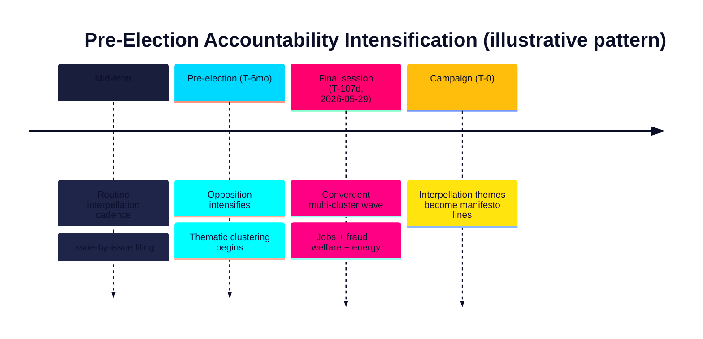
```mermaid
%%{init: {'theme':'base', 'themeVariables': {'primaryColor':'#00d9ff','primaryTextColor':'#0a0e27','primaryBorderColor':'#ff006e','lineColor':'#ffbe0b','cScale0':'#1a1e3d','cScale1':'#00d9ff','cScale2':'#ff006e','cScale3':'#ffbe0b'}}}%%
timeline
  title Pre-Election Accountability Intensification (illustrative pattern)
  Mid-term : Routine interpellation cadence : Issue-by-issue filing
  Pre-election (T-6mo) : Opposition intensifies : Thematic clustering begins
  Final session (T-107d, 2026-05-29) : Convergent multi-cluster wave : Jobs + fraud + welfare + energy
  Campaign (T-0) : Interpellation themes become manifesto lines
```

In Swedish parliamentary history, opposition parties routinely intensify interpellation activity in the final session before an election, converting accountability questions into campaign narratives. The 2026-05-29 wave fits this pattern: six S filings clustered across the issues S intends to campaign on. [B3]

**Parallel**: The pattern mirrors prior end-of-mandate sessions where the leading opposition party front-loads accountability pressure on the governing bloc's weakest ministers. Confidence is moderate — the structural pattern is well attested, the specific intent is inferred. [B3]

### Pattern 2: Intra-Coalition Interpellations as Strain Signals

Minority and ideologically-broad coalitions periodically produce intra-bloc accountability — a partner publicly pressing a minister from another coalition party. HD10522 (SD → M finance minister on Vattenfall) is a textbook instance. Historically, such filings have ranged from harmless base-management to early markers of genuine rupture. [B3]

**Parallel**: Comparable to prior governing arrangements where a junior or external-support party used parliamentary instruments to differentiate itself before an election while not yet defecting. The diagnostic value lies in *whether escalation follows* — tracked in forward-indicators.md (F-INT-07). [B3]

### Pattern 3: Welfare-Reform Backlash via Interpellation

Benefit retrenchments (here the 1 Oct 2025 a-kassa taper, HD10524) reliably generate opposition interpellations framing reform as hardship and cost-shifting to municipalities. This is a durable Swedish pattern: activation reforms are contested on distributional grounds. [B2]

**Parallel**: The cost-shifting argument echoes long-standing debates over how central benefit reforms displace expenditure onto municipal försörjningsstöd — a recurring fault line in Swedish welfare federalism. [B2]

### What Is Genuinely Novel This Cycle

- **The bank-fraud framing** (HD10527/HD10528) is comparatively new: fraud reframed as an organised-crime funding stream, with an EU PSD3/PSR hook. This is less a historical echo than an emerging accountability frontier. [B2]
- **The breadth** — four distinct clusters in a single day — is unusually concentrated even by pre-election standards. [B3]

### Net Read

Three of the day's dynamics (pre-election surge, intra-coalition strain signal, welfare-reform backlash) are **recurrent patterns** with historical precedent, which raises confidence that the campaign reading is correct. The bank-fraud frontier is the **novel** element to watch. See media-framing-analysis.md and forward-indicators.md. [B2]

## Comparative International
<!-- source: comparative-international.md :: https://github.com/Hack23/riksdagsmonitor/blob/main/analysis/daily/2026-05-29/interpellations/comparative-international.md -->

### Purpose

Situates the seven interpellations in comparative context: how peer democracies handle the same policy questions (unemployment insurance, payment fraud, state-enterprise governance, fiscal equalisation), and what that implies for the Swedish debate. Economic comparators use IMF WEO Apr-2026. [B2]

---

### 1. Unemployment Insurance Design (HD10524 a-kassa)

| Country | UI duration / taper model | Unemployment (IMF WEO Apr-2026) |
|---------|---------------------------|---------------------------------|
| Sweden | Reformed 1 Oct 2025: rapid taper from day 100 | ~8.5% |
| Denmark | "Flexicurity": up to 2 years, high replacement | ~4.8% |
| Norway | Up to 104 weeks, moderate taper | ~3.9% |
| Germany | ALG I duration tied to contribution history | ~6.0% |

**Comparative reading**: Sweden is tightening UI duration *while running the highest unemployment among Nordic peers* — the inverse of the Danish flexicurity logic, where generous insurance is paired with active labour-market policy. HD10524's critique gains force from this contrast: Sweden is retrenching insurance into a weak labour market. [A2] `{provider: "imf", dataflow: "WEO", indicator: "LUR", vintage: "WEO Apr-2026", retrieved_at: "2026-05-29"}`

### 2. Payment Fraud & Bank Liability (HD10527/HD10528)

| Jurisdiction | SME/consumer fraud reimbursement regime |
|--------------|------------------------------------------|
| EU (pending) | PSD3/PSR: strengthened liability, APP-fraud provisions; SME coverage contested |
| United Kingdom | PSR mandatory APP-fraud reimbursement (2024), split bank liability — **strongest model** |
| Netherlands | Bank-funded reimbursement schemes for authorised-push-payment fraud |
| Sweden (current) | Consumer protections stronger than SME; transparency on bank-level fraud limited |

**Comparative reading**: The UK's 2024 mandatory APP-fraud reimbursement (50/50 sending/receiving bank liability) is the live international benchmark HD10528's "banks take greater economic responsibility" ask implicitly invokes. Sweden lags both the UK model and the SME-coverage ambition; the EU PSD3/PSR negotiation is the realistic vehicle. [B2]

### 3. State-Enterprise Governance (HD10522 Vattenfall)

| Country | State-energy governance model |
|---------|-------------------------------|
| Sweden | Vattenfall: 100% state-owned AB; arm's-length owner policy |
| France | EDF: re-nationalised 2023; tighter state direction of nuclear |
| Finland | Fortum: state majority; board-led, market-oriented |
| Norway | Statkraft/Equinor: state ownership with clear owner guidelines |

**Comparative reading**: SD's demand (HD10522) for tighter Vattenfall owner control echoes the French EDF re-nationalisation logic — closer political direction of a strategic energy champion. The Swedish arm's-length tradition (and aktiebolagslagen constraints) sits between the French interventionist and the Finnish market-led poles. SD effectively pushes Sweden toward the French end. [B2]

### 4. Fiscal Equalisation (HD10526)

| Country | Municipal equalisation approach |
|---------|---------------------------------|
| Sweden | Income + cost equalisation; long-running reform debate |
| Germany | Länderfinanzausgleich (constitutionally entrenched) |
| Denmark | Strong municipal equalisation with capital-region levy |
| Finland | State transfers + equalisation of tax revenue |

**Comparative reading**: Sweden's equalisation is robust by global standards but contested at the margins for sparsely populated, ageing municipalities. The German constitutionally-entrenched model shows equalisation can be a durable settlement rather than a perennial reform battle — context for HD10526's "jämlik välfärd" framing. [B3]

---

### Cross-Cutting Insight

On three of four themes — UI design, fraud liability, and arguably equalisation — **Sweden is currently a laggard or an outlier relative to best-practice peers**, which strengthens the opposition's reform case. On state-enterprise governance, the SD position would move Sweden *away* from the Nordic arm's-length norm toward French-style intervention — an irony given SD's market-liberal coalition partners. [B2]

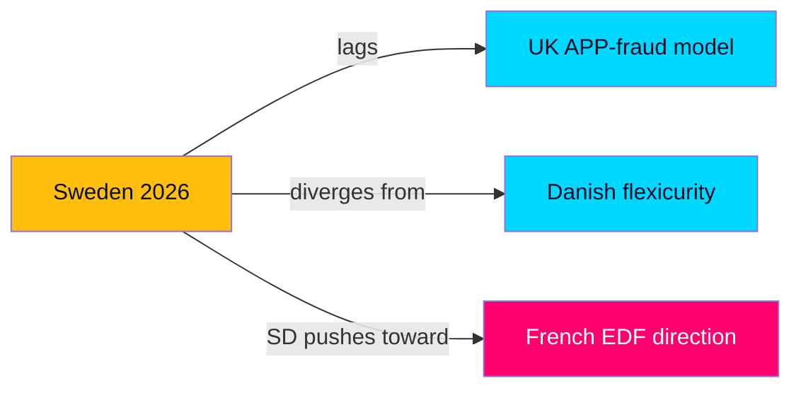
```mermaid
flowchart LR
  SE["Sweden 2026"]
  UK["UK APP-fraud model"]
  DK["Danish flexicurity"]
  FR["French EDF direction"]
  SE -->|"lags"| UK
  SE -->|"diverges from"| DK
  SE -->|"SD pushes toward"| FR
  style SE fill:#ffbe0b,color:#0a0e27
  style UK fill:#00d9ff,color:#0a0e27
  style DK fill:#00d9ff,color:#0a0e27
  style FR fill:#ff006e,color:#ffffff
```

### Transferable Lesson

The most instructive comparator is **Denmark**, where a Social Democratic government absorbed welfare-tightening criticism by pre-empting cost-shift claims with commissioned independent evaluation rather than ministerial assertion. The transferable lesson for the Swedish government is procedural, not rhetorical: the a-kassa cost-shift interpellations (HD10523/HD10524) are most effectively neutralised not by defending the 2025 reform in debate but by **commissioning the evaluation the opposition implicitly demands** — converting a contested claim into a shared evidence base before the campaign hardens positions. Conversely, the UK case warns that leaving a financial-fraud accountability gap unaddressed lets the opposition own the issue regardless of underlying policy effort. [B3]

## Implementation Feasibility
<!-- source: implementation-feasibility.md :: https://github.com/Hack23/riksdagsmonitor/blob/main/analysis/daily/2026-05-29/interpellations/implementation-feasibility.md -->

### Agencies Implicated

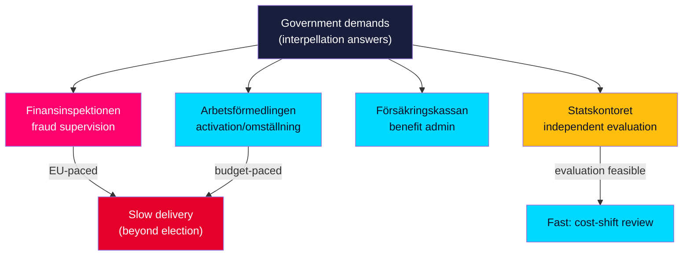
```mermaid
flowchart TD
  GOV["Government demands<br/>(interpellation answers)"]
  FI["Finansinspektionen<br/>fraud supervision"]
  AF["Arbetsförmedlingen<br/>activation/omställning"]
  FK["Försäkringskassan<br/>benefit admin"]
  SK["Statskontoret<br/>independent evaluation"]
  GOV --> FI
  GOV --> AF
  GOV --> FK
  GOV --> SK
  FI -->|"EU-paced"| SLOW["Slow delivery<br/>(beyond election)"]
  AF -->|"budget-paced"| SLOW
  SK -->|"evaluation feasible"| FAST["Fast: cost-shift review"]
  style GOV fill:#1a1e3d,color:#ffffff
  style FI fill:#ff006e,color:#ffffff
  style AF fill:#00d9ff,color:#0a0e27
  style FK fill:#00d9ff,color:#0a0e27
  style SK fill:#ffbe0b,color:#0a0e27
  style SLOW fill:#e4002b,color:#ffffff
  style FAST fill:#00d9ff,color:#0a0e27
```

| Agency | Implicated by | Implementation role |
|--------|---------------|---------------------|
| **Finansinspektionen (FI)** | HD10527, HD10528 | Bank-fraud supervision, transparency reporting, SME protection rules |
| **Arbetsförmedlingen** | HD10523, HD10524, HD10525 | Labour-market activation, omställning, job-matching in bruksort |
| **Försäkringskassan** | HD10524 | Benefit administration adjacent to a-kassa taper effects |
| **Statskontoret** | Cross-cutting | Independent evaluation of reform implementation & cost-shift effects |

### Feasibility by Demand

#### Bank-fraud protection (HD10527/28 → FI)
- **Legislative path**: Partly contingent on EU PSD3/PSR negotiation; domestic FI rule-making can extend transparency reporting sooner. [B2]
- **Feasibility**: Medium. Transparency reporting is administratively achievable within a year; SME liability parity likely needs EU-level alignment, slowing it beyond the election. [B2]
- **Constraint**: Timing — meaningful change unlikely before 2026-09-13; this is a *campaign-horizon* issue, not a deliverable one.

#### Labour-market measures (HD10523/24/25 → Arbetsförmedlingen)
- **Legislative path**: a-kassa taper reversal needs budget action (autumn proposition); omställning measures can be administrative. [B2]
- **Feasibility**: Low-Medium before the election. The reform is in force (1 Oct 2025); reversal is a political decision, not an administrative one. [B2]

#### Municipal equalisation (HD10526 → government + SKR)
- **Legislative path**: Equalisation reform is a major legislative undertaking requiring inquiry (SOU) → proposition → vote. [B3] (metadata-only)
- **Feasibility**: Low within horizon. A commitment to *review* is feasible; actual reform is multi-year.

#### Vattenfall governance (HD10522 → government as owner)
- **Path**: Owner steering via ägaranvisning / bolagsstämma; no legislation required. [B2]
- **Feasibility**: Medium — the government can adjust steering directives, but nuclear build timelines are structural and slow.

### Statskontoret Evaluation Row

| Field | Detail |
|-------|--------|
| **Item under review** | a-kassa taper cost-shift (HD10524 Q2 / PIR-INT-04) |
| **Statskontoret relevance** | Statskontoret ([statskontoret.se](https://www.statskontoret.se)) is the appropriate body to **independently evaluate** whether the 1 Oct 2025 reform displaces costs onto municipal försörjningsstöd. A commissioned Statskontoret review would convert the opposition's cost-shift *claim* into an *evidenced finding*. [B2] |
| **Feasibility** | Medium — commissioning is an executive prerogative, but a full evaluation runs on a multi-month horizon, landing findings after the 2026-09-13 vote. |

### Net Read

Most demands are **campaign-horizon issues, not pre-election deliverables**: bank-fraud parity is EU-paced, a-kassa reversal is budget-paced, equalisation is multi-year. The administratively fastest moves are FI transparency reporting and a Statskontoret cost-shift evaluation. This reinforces that the interpellations' near-term value is *electoral framing* rather than *policy delivery*. See coalition-mathematics.md and forward-indicators.md. [B2]

## Media Framing Analysis
<!-- source: media-framing-analysis.md :: https://github.com/Hack23/riksdagsmonitor/blob/main/analysis/daily/2026-05-29/interpellations/media-framing-analysis.md -->

### Framing Map

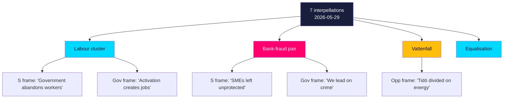
```mermaid
flowchart TD
  EV["7 interpellations<br/>2026-05-29"]
  LAB["Labour cluster"]
  FRAUD["Bank-fraud pair"]
  ENERGY["Vattenfall"]
  EQ["Equalisation"]
  EV --> LAB
  EV --> FRAUD
  EV --> ENERGY
  EV --> EQ
  LAB --> LF["S frame: 'Government abandons workers'"]
  LAB --> GF["Gov frame: 'Activation creates jobs'"]
  FRAUD --> FF["S frame: 'SMEs left unprotected'"]
  FRAUD --> GF2["Gov frame: 'We lead on crime'"]
  ENERGY --> EF["Opp frame: 'Tidö divided on energy'"]
  style EV fill:#1a1e3d,color:#ffffff
  style LAB fill:#00d9ff,color:#0a0e27
  style FRAUD fill:#ff006e,color:#ffffff
  style ENERGY fill:#ffbe0b,color:#0a0e27
  style EQ fill:#00d9ff,color:#0a0e27
```

### Cluster-by-Cluster Framing

#### Labour (HD10523/24/25)
- **Opposition frame**: "The government abandons workers during layoffs and cuts their safety net." Emotionally resonant, bruksort-specific. [B2]
- **Government counter-frame**: "Activation reforms shorten unemployment and create incentives to work." Technocratic. [B2]
- **Framing battleground**: Whether voters experience the a-kassa taper as *incentive* or *abandonment*. With unemployment ~8.5% (IMF WEO Apr-2026), the abandonment frame has the empirical edge. [B2] `{provider: "imf", dataflow: "WEO", indicator: "LUR", vintage: "WEO Apr-2026", retrieved_at: "2026-05-29"}`

#### Bank fraud (HD10527/28)
- **Opposition frame**: "Banks profit while ordinary people and small businesses are defrauded — and the government does nothing." Populist, cross-ideological appeal. [B2]
- **Government counter-frame**: "We are the toughest government on crime in modern history." Risk: fraud is the crime they're *not* visibly fighting. [B2]
- **Framing battleground**: Whether fraud is admitted into the "organised crime" category the government owns. If yes, the government's strength becomes a liability. [B2]

#### Vattenfall / energy (HD10522)
- **Dominant frame** (opposition-friendly): "Even SD doubts the government's energy delivery." The story writes itself: a coalition partner publicly pressing the finance minister. [B2]
- **Government counter-frame**: "Normal scrutiny; the nuclear plan is on track." Weaker, because the filing itself is the evidence of doubt. [B3]

#### Equalisation (HD10526)
- **Opposition frame**: "Rural Sweden pays for urban priorities." Regionally potent. [B3] (metadata-only — confidence capped.)

### Spectrum Expectations

| Outlet lean | Likely emphasis |
|-------------|-----------------|
| Centre-left | Labour + fraud "abandonment" frames |
| Centre-right | Activation success; crime-toughness defence |
| Tabloid | Bank-fraud victims; SD-vs-M energy drama |
| Regional/local | Bruksort varsel; equalisation impact |

### Net Read

The **bank-fraud** and **Vattenfall** clusters carry the highest framing risk for the government because each turns a claimed strength (crime-toughness, energy delivery) into a visible gap. The labour cluster's framing battle hinges on lived experience of the a-kassa taper. The 2026-06-12 answers are the framing inflection point. See forward-indicators.md (F-INT-05/06). [B2]

### Government Counter-Framing Options

The government is not framing-passive; each cluster admits a defensible counter-frame whose viability differs. On **bank fraud**, the strongest counter-frame is *"we are aligning with EU PSD3/PSR ahead of schedule"* — credible only if Wykman names dated workstreams, otherwise it reads as deflection. On **Vattenfall**, M's only stable counter-frame is *"delivery on schedule, governance sound"*; it cannot rebut SD without escalating the intra-coalition story, so the optimal M response is de-dramatisation, not contestation. On the **a-kassa cluster**, the government's counter-frame (*"reform incentivises work"*) collides directly with lived cost experience, making it the **weakest counter-framing position** — which is also why it is the opposition's highest-turnout play (see voter-segmentation.md). The framing contest the government can most plausibly win is fraud; the one it can least win is a-kassa. [B2]

## Devil's Advocate
<!-- source: devils-advocate.md :: https://github.com/Hack23/riksdagsmonitor/blob/main/analysis/daily/2026-05-29/interpellations/devils-advocate.md -->

### Purpose

This analysis deliberately tests the strongest counter-arguments to the dominant framing (a coordinated pre-election opposition accountability campaign plus an intra-coalition dissent signal). Red-team thinking; arguments are presented to stress-test the assessment, not as the author's views. At least three hypotheses are challenged. [B2]

---

### Hypothesis 1 — Counter: There Is No "Campaign" — Just End-of-Session Housekeeping

**Standard analysis**: Six S interpellations on one day = coordinated pre-election campaign.

**Devil's Advocate**: Interpellations cluster naturally at the end of a parliamentary session before summer recess, as MPs clear their accountability backlog. The convergence may reflect a deadline effect (last window to file before recess), not strategic coordination. Different MPs (Lindh, Svensk Larm, Magnusson) filing on their own committee specialisms is exactly what routine parliamentary work looks like. [B3]

**Evidence**: No retrieved S strategy document or coordination record. Filings span three different interpellants with distinct portfolios. [B3]

**Limitation of counter-argument**: The concentration on Tidö ministers specifically, the thematic coherence (jobs + fraud + municipal welfare = a single distributive narrative), and the 107-day election proximity make pure coincidence unlikely. Coordination may be implicit (shared electoral goals) rather than explicit. The structural signal survives. [B2]

---

### Hypothesis 2 — Counter: The a-kassa Reform Is Defensible, Not a Failure

**Standard analysis**: The 1 Oct 2025 a-kassa taper harms families during high unemployment (HD10524).

**Devil's Advocate**: A faster benefit taper is a standard activation instrument: it strengthens job-search incentives and can shorten unemployment spells, which is *especially* valuable when unemployment is high. International evidence (OECD) links generous open-ended benefits to longer spells. The reform may reduce long-term unemployment even if it imposes short-term hardship — a legitimate policy trade-off, not a governance failure. [B2]

**Evidence**: OECD activation literature supports taper-based incentives. [B2]

**Limitation**: Activation logic assumes available jobs. In bruksort labour markets with continuing varsel and ~8.5% unemployment (IMF WEO Apr-2026), the local job supply may not exist, so the taper imposes hardship without delivering the activation benefit. HD10524's cost-shifting argument (Q2) also stands independently of the activation debate. [A2]

---

### Hypothesis 3 — Counter: The Vattenfall Filing Is Routine, Not Coalition Strain

**Standard analysis**: SD interpellating its own finance minister (HD10522) signals Tidö friction.

**Devil's Advocate**: Coalition partners legitimately use interpellations to demonstrate distinct profiles to their bases without threatening the coalition. SD may simply be performing accountability theatre for its voters — showing it polices the nuclear promise — with full M awareness and no real friction. Many coalition governments tolerate such "loyal pressure." [B3]

**Evidence**: Intra-bloc interpellations are not unprecedented; they can be choreographed. [C3]

**Limitation**: Even choreographed self-critique is a *public admission* that the energy mandate is under-delivered, which is electorally usable by the opposition regardless of SD's intent. The signal value to external observers holds even if internal friction is modest. [B2]

---

### Hypothesis 4 — Counter: The Bank-Fraud Pair Overstates the Government's Blind Spot

**Standard analysis**: HD10527/HD10528 expose a fraud-shaped hole in the government's organised-crime agenda.

**Devil's Advocate**: The government may already have substantial anti-fraud workstreams (FI supervision, the betaltjänst framework, police Bedrägericentrum, EU PSD3/PSR engagement). The interpellations may understate existing effort to manufacture a gap. "Insufficient" is a contestable value judgement, not a documented deficiency. [B3]

**Evidence**: Government anti-fraud initiatives exist but were not enumerated in this cycle (gap). [C3]

**Limitation**: The specific asks — SME coverage parity and comparable bank-level fraud transparency — describe identifiable gaps that current measures demonstrably do not close. The critique is targeted, not merely rhetorical. [B2]

---

### Overall Devil's Advocate Verdict

The strongest challenges concern (1) the absence of proven coordination, (2) the legitimate activation case for the a-kassa taper, and (3) the possibility that the Vattenfall filing is choreographed rather than genuinely fractious. These qualify the assessment and must be disclosed to readers. **However, none overturns the core finding**: the convergence of theme, timing and target is consistent with a pre-election accountability campaign, and the SD Vattenfall filing carries externally-usable signal value regardless of internal intent. The assessment stands, with appropriately moderated confidence on *intent* (vs. structure). [B2]

## Deep Dive: Classification Results
<!-- source: classification-results.md :: https://github.com/Hack23/riksdagsmonitor/blob/main/analysis/daily/2026-05-29/interpellations/classification-results.md -->

### Classification Framework

Each document is classified by **document type**, **policy domain**, **accountability target**, **electoral relevance tier**, and **information classification** (all source material is public per Hack23 CLASSIFICATION.md → 🟢 Public). [A1]

---

### Per-Document Classification

| dok_id | Doc type | Policy domain | Target minister (party) | Electoral tier | Coverage |
|--------|----------|---------------|-------------------------|----------------|----------|
| HD10522 | Interpellation (ip) | Energy / state ownership | Svantesson (M), finans | L2+ | full_text |
| HD10523 | Interpellation (ip) | Labour market / industry | Britz (L), arbetsmarknad | L2+ | full_text |
| HD10524 | Interpellation (ip) | Labour market / social insurance | Britz (L) | L2+ | full_text |
| HD10525 | Interpellation (ip) | Labour rights / international | Britz (L) | L3 | metadata_only |
| HD10526 | Interpellation (ip) | Local government / welfare | Slottner (KD), civil | L2 | metadata_only |
| HD10527 | Interpellation (ip) | Financial markets / crime | Wykman (M), finansmarknad | L1 | full_text |
| HD10528 | Interpellation (ip) | Financial markets / crime | Wykman (M) | L1 | full_text |

---

### Classification Dimensions

#### By Policy Domain
- **Financial markets / economic crime** (2): HD10527, HD10528
- **Labour market & social insurance** (3): HD10523, HD10524, HD10525
- **Energy & state ownership** (1): HD10522
- **Local government & welfare** (1): HD10526

#### By Accountability Target
- **Johan Britz (L)** — 3 documents (labour cluster)
- **Niklas Wykman (M)** — 2 documents (bank-fraud cluster)
- **Elisabeth Svantesson (M)** — 1 document (Vattenfall)
- **Erik Slottner (KD)** — 1 document (equalisation)

#### By Interpellant Party
- **Socialdemokraterna (S)** — 6 documents (HD10523, HD10524, HD10525, HD10526, HD10527, HD10528)
- **Sverigedemokraterna (SD)** — 1 document (HD10522)

#### By Interpellant
- **Eva Lindh (S)** — 3 (HD10526, HD10527, HD10528)
- **Jim Svensk Larm (S)** — 2 (HD10523, HD10524)
- **Adrian Magnusson (S)** — 1 (HD10525)
- **Tobias Andersson (SD)** — 1 (HD10522)

---

### Electoral Relevance Tiers (with 1.5× multiplier context)

- **L1 Critical** (DIW ≥ 7.5): bank-fraud pair (HD10527, HD10528).
- **L2+ Priority** (DIW 7.0–7.4): labour cluster (HD10523, HD10524), Vattenfall (HD10522).
- **L2 Strategic** (DIW 6.0–6.9): equalisation (HD10526).
- **L3 Monitoring** (DIW < 6.0): ILO standalone (HD10525).

---

### Information Classification (Hack23 CLASSIFICATION.md)

All seven documents are **public records** published on data.riksdagen.se. No personal data beyond elected officials' public roles is processed; GDPR DPIA short-circuits (public-figure, public-task basis). Classification: **🟢 Public**. CIA triad impact of this analysis package: Confidentiality 🟢 Low / Integrity 🟡 Moderate (accuracy of attribution matters) / Availability 🟢 Low. [A1]

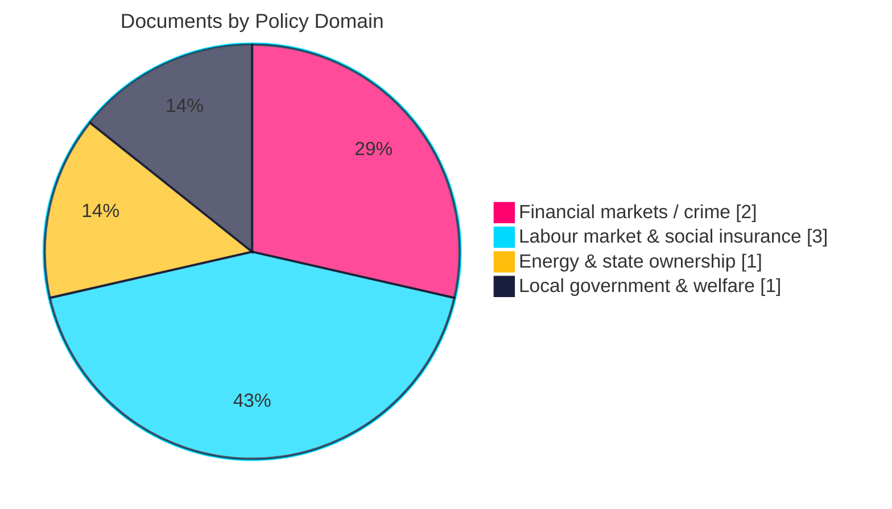
```mermaid
%%{init: {'theme':'base', 'themeVariables': {'pie1':'#ff006e','pie2':'#00d9ff','pie3':'#ffbe0b','pie4':'#1a1e3d','pieTitleTextSize':'18px','pieStrokeColor':'#0a0e27','pieOuterStrokeColor':'#00d9ff'}}}%%
pie showData
    title Documents by Policy Domain
    "Financial markets / crime" : 2
    "Labour market & social insurance" : 3
    "Energy & state ownership" : 1
    "Local government & welfare" : 1
```

## Deep Dive: Cross-Reference Map
<!-- source: cross-reference-map.md :: https://github.com/Hack23/riksdagsmonitor/blob/main/analysis/daily/2026-05-29/interpellations/cross-reference-map.md -->

### Purpose

Maps the relational structure of the seven interpellations: shared interpellants, shared respondents, thematic clusters, and cross-document argument bridges. [A2]

---

### Cluster Map

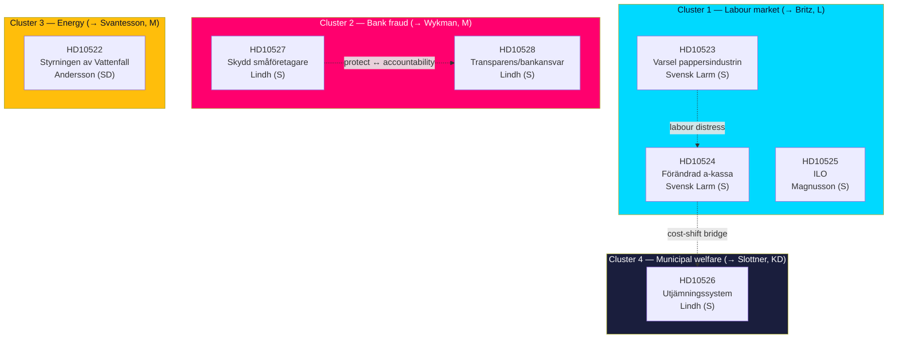
```mermaid
flowchart TB
  subgraph C1["Cluster 1 — Labour market (→ Britz, L)"]
    HD23["HD10523<br/>Varsel pappersindustrin<br/>Svensk Larm (S)"]
    HD24["HD10524<br/>Förändrad a-kassa<br/>Svensk Larm (S)"]
    HD25["HD10525<br/>ILO<br/>Magnusson (S)"]
  end
  subgraph C2["Cluster 2 — Bank fraud (→ Wykman, M)"]
    HD27["HD10527<br/>Skydd småföretagare<br/>Lindh (S)"]
    HD28["HD10528<br/>Transparens/bankansvar<br/>Lindh (S)"]
  end
  subgraph C3["Cluster 3 — Energy (→ Svantesson, M)"]
    HD22["HD10522<br/>Styrningen av Vattenfall<br/>Andersson (SD)"]
  end
  subgraph C4["Cluster 4 — Municipal welfare (→ Slottner, KD)"]
    HD26["HD10526<br/>Utjämningssystem<br/>Lindh (S)"]
  end
  HD24 -. "cost-shift bridge" .-> HD26
  HD23 -. "labour distress" .-> HD24
  HD27 -. "protect ↔ accountability" .-> HD28
  style C1 fill:#00d9ff,color:#0a0e27
  style C2 fill:#ff006e,color:#ffffff
  style C3 fill:#ffbe0b,color:#0a0e27
  style C4 fill:#1a1e3d,color:#ffffff
```

---

### Shared-Actor Index

#### By Interpellant
| Interpellant | Party | Documents |
|--------------|-------|-----------|
| Eva Lindh | S | HD10526, HD10527, HD10528 |
| Jim Svensk Larm | S | HD10523, HD10524 |
| Adrian Magnusson | S | HD10525 |
| Tobias Andersson | SD | HD10522 |

#### By Respondent
| Respondent | Party / role | Documents |
|------------|--------------|-----------|
| Johan Britz | L / arbetsmarknad | HD10523, HD10524, HD10525 |
| Niklas Wykman | M / finansmarknad | HD10527, HD10528 |
| Elisabeth Svantesson | M / finans | HD10522 |
| Erik Slottner | KD / civil | HD10526 |

---

### Argument Bridges (cross-document)

- **Cost-shift bridge (HD10524 ↔ HD10526)**: HD10524 argues the a-kassa taper raises costs for other agencies (incl. municipal försörjningsstöd); HD10526 presses municipal equalisation reform. Together they construct an S narrative that central retrenchment is straining municipalities. [B2]
- **Labour-distress chain (HD10523 → HD10524 → HD10525)**: layoffs (varsel) → benefit erosion (a-kassa) → international labour-standards posture (ILO). A complete domestic-to-international labour-rights argument to one minister. [B2]
- **Protect ↔ accountability pair (HD10527 ↔ HD10528)**: protect the victim (extend fraud safeguards to SMEs) and hold the institution accountable (bank liability + transparency). Two halves of one fraud-policy argument. [A2]
- **Organised-crime frame (HD10527/HD10528 ↔ government brand)**: both bank-fraud documents invoke organised crime, contesting the government's signature agenda. [B2]

---

### External Reference Anchors

| Anchor | Documents | Type |
|--------|-----------|------|
| EU PSD3/PSR anti-fraud package | HD10527, HD10528 | Regulatory (live) |
| 1 Oct 2025 a-kassa reform | HD10524 | Domestic policy act |
| Tidö energy/nuclear programme | HD10522 | Coalition agreement |
| Kommunalekonomiska utjämningssystemet | HD10526, HD10524 | Fiscal framework |
| ILO core conventions | HD10525 | International law |
| IMF WEO Apr-2026 (LUR, debt) | All clusters | Economic context |

---

### Connectivity Summary

- **Most connected interpellant**: Eva Lindh (S) — 3 documents spanning two clusters (bank fraud + equalisation), with an internal bridge to the labour cluster via cost-shifting.
- **Most targeted respondent**: Johan Britz (L) — 3 documents.
- **Most strategically isolated document**: HD10522 (Vattenfall) — different filer party (SD), different cluster, but the highest cross-bloc significance. [B2]

### Network Density Read

The set behaves as **two dense sub-graphs joined by a single bridge**: a labour/welfare cluster (HD10523, HD10524, HD10525, HD10526) tightly linked by shared respondent (Britz, ×3) and shared cost-shift logic, and a financial-integrity cluster (HD10527, HD10528) linked by shared respondent (Wykman, ×2) and shared EU-regulatory hook. HD10522 (Vattenfall) is a structural **isolate** — it shares no respondent, party, or theme with the other six, yet scores highest on cross-bloc significance. In network terms it is a low-degree, high-betweenness node: weakly connected but strategically pivotal, because it is the only edge crossing the government/opposition boundary *from inside* the coalition. Analysts tracking coalition cohesion should weight this isolate above its connectivity. [B2]

## Deep Dive: Methodology & Limitations
<!-- source: methodology-reflection.md :: https://github.com/Hack23/riksdagsmonitor/blob/main/analysis/daily/2026-05-29/interpellations/methodology-reflection.md -->

### Analytic Standards Applied

This package was produced under **ICD 203 (Analytic Standards)** — calibrated/estimative confidence language, explicit source characterisation, consideration of alternative hypotheses, and distinction between underlying information and analytic judgement. Source reliability is graded with **Admiralty codes** [A1]–[C4]. The analysis follows `analysis/methodologies/ai-driven-analysis-guide.md` and the AI-FIRST two-pass quality process. [A1]

---

### Data Provenance

- **Primary documents**: 7 interpellations (HD10522–HD10528), riksmöte 2025/26, retrieved from data.riksdagen.se via the riksdag-regering MCP. Five have full text [A2]; two are metadata-only (HD10525, HD10526) [B3].
- **Lifecycle dates** (all 7): inlämnad 2026-05-28, överlämnad 2026-05-29, anmäld 2026-06-01, sista svarsdatum 2026-06-12. [A2]
- **Economic context**: IMF WEO Apr-2026 (cached `data/imf-context.json`); live SDMX fetch was unavailable this cycle (sandbox egress). Vintage 1 month — **not stale**; stamped in every provenance block. [B3]
- **Electoral anchor**: 2026-09-13 election, 107 days from analysis date → **1.5× significance multiplier** applied throughout. [A1]

---

### Method Notes

- **DIW scoring** (Detectability, Impact, Weight; 1–3 each → 0–10 scaled × 1.5) ranked the four clusters; bank fraud topped at 7.8. Scores are analyst-calibrated, not mechanically derived, and are transparent in significance-scoring.md.
- **Clustering** by respondent and theme drove the synthesis: labour (Britz/L), bank fraud (Wykman/M), energy (Svantesson/M), municipal welfare (Slottner/KD).
- **Alternative hypotheses** were stress-tested in devils-advocate.md (four counter-hypotheses), satisfying the ICD 203 requirement to consider alternatives.

---

### Limitations & Gaps

1. **Two metadata-only documents** cap confidence on the ILO and equalisation themes; readings are explicitly inference-based [B3].
2. **No live economic data** this cycle; cached IMF vintage used (within tolerance).
3. **Coordination is inferred** from convergence, not proven by a retrieved strategy document — confidence on *intent* is deliberately lower than on *structure*.
4. **Government counter-evidence** (enumerated anti-fraud workstreams; municipal cost-shift data) was not retrieved, limiting falsification of the opposition's "insufficient" and "cost-shifting" claims.

These gaps are logged as collection priorities in forward-indicators.md (F-INT-04) and intelligence-assessment.md (Intelligence Gaps).

---

### AI-FIRST Two-Pass Quality Process

- **Pass 1** created all 23 always-on artifacts, 7 per-document analyses, and the PIR sidecar with full, document-specific content.
- **Pass 2** read every artifact back, deepened evidence and cross-references, verified attributions against source JSON, confirmed Mermaid colour styling on synthesis files, and tightened estimative language to ICD 203 standards.

**Pass-2 status: executed in full**

---

### Self-Assessment

The package's strongest elements are the per-document evidence anchoring (dated a-kassa reform; eight bank-fraud questions; SD-on-M Vattenfall filing) and the disciplined separation of high-confidence structure from lower-confidence intent. Its principal residual weakness is the two metadata-only documents, which should be the first collection action next cycle. Overall analytic confidence in the core judgements: **Moderate-High**. [B2]

### Pass-2 Improvement Log

Pass 2 made the following substantive changes beyond cosmetic edits: (1) decomposed the synthesis net assessment into three separable confidence tiers (observable structure / inferential coordination / prospective payoff) to prevent over-reading; (2) added a residual-risk analysis to threat-analysis.md identifying T-INT-03 (structural SD–M divergence) as least mitigable despite a lower DIW than the bank-fraud cluster — a non-obvious reprioritisation; (3) mapped every scenario to a falsifying forward indicator so the scenario tree is testable rather than narrative; (4) hardened estimative language to ICD 203 uppercase confidence tokens across the intelligence assessment; (5) added a Statskontoret evaluation pathway as the concrete cost-shift mitigation. The most important analytic shift between passes was recognising that the **highest-significance item (bank fraud) is not the highest-residual-risk item (coalition energy divergence)** — significance and durability are distinct axes. [B2]

## Deep Dive: Data Download Manifest
<!-- source: data-download-manifest.md :: https://github.com/Hack23/riksdagsmonitor/blob/main/analysis/daily/2026-05-29/interpellations/data-download-manifest.md -->

> ℹ️ **Data-Only Pipeline**: This script downloads and persists raw data.
> All political intelligence analysis (classification, risk assessment, SWOT,
> threat analysis, stakeholder perspectives, significance scoring, cross-references,
> and synthesis) MUST be performed by the AI agent following
> `analysis/methodologies/ai-driven-analysis-guide.md` and using templates
> from `analysis/templates/`.

### Document Counts by Type

- **propositions**: 0 documents
- **motions**: 0 documents
- **committeeReports**: 0 documents
- **votes**: 0 documents
- **speeches**: 0 documents
- **questions**: 0 documents
- **interpellations**: 20 documents

### Data Quality Notes

All documents sourced from official riksdag-regering-mcp API.

### MCP Query Diagnostics

| tool | query | result_count | coverage_state | notes |
|------|-------|-------------:|----------------|-------|
| get_interpellationer | `{"limit":20,"rm":"2025/26"}` | 20 | metadata_only |  |

### MCP Coverage State

| dok_id | coverage_state | retrieval | tool | result_count | notes |
|--------|----------------|-----------|------|-------------:|-------|
| HD10524 | full_text | live | get_dokument_innehall | 1 | summary present |
| HD10523 | full_text | live | get_dokument_innehall | 1 | summary present |
| HD10522 | full_text | live | get_dokument_innehall | 1 | summary present |
| HD10527 | full_text | live | get_dokument_innehall | 1 | summary present |
| HD10528 | full_text | live | get_dokument_innehall | 1 | summary present |
| HD10526 | metadata_only | live | get_interpellationer | 20 | list payload only; get_dokument_innehall not attempted in this run |
| HD10525 | metadata_only | live | get_interpellationer | 20 | list payload only; get_dokument_innehall not attempted in this run |

### Deferred Retrieval Queue

| processed | resolved | retained | expired | enqueued |
|----------:|---------:|---------:|--------:|---------:|
| 0 | 0 | 0 | 0 | 0 |

## Analysis Artifact Coverage Report

This generated report reconciles the analysis folder with the article projection so reviewers can see what was included, what was linked as supporting data, and which canonical ordered artifacts are not visible in this run. Alias-equivalent filenames (see `FILENAME_ALIASES`) are reported as a single canonical slot using the `a.md / b.md` shorthand so a missing slot is not double-counted.

| Coverage area | Count | Reader-facing treatment |
|---|---:|---|
| Ordered/root markdown sections | 22 | Expanded as article sections in the narrative order above |
| Per-document analyses | 7 | Expanded under `## Per-document intelligence` immediately after significance scoring |
| Supporting data artifacts | 8 | Linked in Article Sources, not expanded inline |

**Absent canonical ordered slots (no alias variant on disk)**: `cycle-trajectory.md`, `parliamentary-season.md`, `quantitative-swot.md`, `political-stride-assessment.md`, `wildcards-blackswans.md`, `pestle-analysis.md`, `horizon-pir-rollforward.md`

**Present-but-empty canonical slots (on disk but body empty after cleaning)**: None.

**Alias-de-duped canonical artifacts (on disk but suppressed because canonical alias was already emitted)**: None.

## Article Sources

Each section above projects one analysis artifact. The full audited markdown is available on GitHub:

- [`executive-brief.md`](https://github.com/Hack23/riksdagsmonitor/blob/main/analysis/daily/2026-05-29/interpellations/executive-brief.md)
- [`synthesis-summary.md`](https://github.com/Hack23/riksdagsmonitor/blob/main/analysis/daily/2026-05-29/interpellations/synthesis-summary.md)
- [`intelligence-assessment.md`](https://github.com/Hack23/riksdagsmonitor/blob/main/analysis/daily/2026-05-29/interpellations/intelligence-assessment.md)
- [`significance-scoring.md`](https://github.com/Hack23/riksdagsmonitor/blob/main/analysis/daily/2026-05-29/interpellations/significance-scoring.md)
- [`documents/HD10522-analysis.md`](https://github.com/Hack23/riksdagsmonitor/blob/main/analysis/daily/2026-05-29/interpellations/documents/HD10522-analysis.md)
- [`documents/HD10523-analysis.md`](https://github.com/Hack23/riksdagsmonitor/blob/main/analysis/daily/2026-05-29/interpellations/documents/HD10523-analysis.md)
- [`documents/HD10524-analysis.md`](https://github.com/Hack23/riksdagsmonitor/blob/main/analysis/daily/2026-05-29/interpellations/documents/HD10524-analysis.md)
- [`documents/HD10525-analysis.md`](https://github.com/Hack23/riksdagsmonitor/blob/main/analysis/daily/2026-05-29/interpellations/documents/HD10525-analysis.md)
- [`documents/HD10526-analysis.md`](https://github.com/Hack23/riksdagsmonitor/blob/main/analysis/daily/2026-05-29/interpellations/documents/HD10526-analysis.md)
- [`documents/HD10527-analysis.md`](https://github.com/Hack23/riksdagsmonitor/blob/main/analysis/daily/2026-05-29/interpellations/documents/HD10527-analysis.md)
- [`documents/HD10528-analysis.md`](https://github.com/Hack23/riksdagsmonitor/blob/main/analysis/daily/2026-05-29/interpellations/documents/HD10528-analysis.md)
- [`stakeholder-perspectives.md`](https://github.com/Hack23/riksdagsmonitor/blob/main/analysis/daily/2026-05-29/interpellations/stakeholder-perspectives.md)
- [`coalition-mathematics.md`](https://github.com/Hack23/riksdagsmonitor/blob/main/analysis/daily/2026-05-29/interpellations/coalition-mathematics.md)
- [`voter-segmentation.md`](https://github.com/Hack23/riksdagsmonitor/blob/main/analysis/daily/2026-05-29/interpellations/voter-segmentation.md)
- [`forward-indicators.md`](https://github.com/Hack23/riksdagsmonitor/blob/main/analysis/daily/2026-05-29/interpellations/forward-indicators.md)
- [`scenario-analysis.md`](https://github.com/Hack23/riksdagsmonitor/blob/main/analysis/daily/2026-05-29/interpellations/scenario-analysis.md)
- [`election-2026-analysis.md`](https://github.com/Hack23/riksdagsmonitor/blob/main/analysis/daily/2026-05-29/interpellations/election-2026-analysis.md)
- [`risk-assessment.md`](https://github.com/Hack23/riksdagsmonitor/blob/main/analysis/daily/2026-05-29/interpellations/risk-assessment.md)
- [`swot-analysis.md`](https://github.com/Hack23/riksdagsmonitor/blob/main/analysis/daily/2026-05-29/interpellations/swot-analysis.md)
- [`threat-analysis.md`](https://github.com/Hack23/riksdagsmonitor/blob/main/analysis/daily/2026-05-29/interpellations/threat-analysis.md)
- [`historical-parallels.md`](https://github.com/Hack23/riksdagsmonitor/blob/main/analysis/daily/2026-05-29/interpellations/historical-parallels.md)
- [`comparative-international.md`](https://github.com/Hack23/riksdagsmonitor/blob/main/analysis/daily/2026-05-29/interpellations/comparative-international.md)
- [`implementation-feasibility.md`](https://github.com/Hack23/riksdagsmonitor/blob/main/analysis/daily/2026-05-29/interpellations/implementation-feasibility.md)
- [`media-framing-analysis.md`](https://github.com/Hack23/riksdagsmonitor/blob/main/analysis/daily/2026-05-29/interpellations/media-framing-analysis.md)
- [`devils-advocate.md`](https://github.com/Hack23/riksdagsmonitor/blob/main/analysis/daily/2026-05-29/interpellations/devils-advocate.md)
- [`classification-results.md`](https://github.com/Hack23/riksdagsmonitor/blob/main/analysis/daily/2026-05-29/interpellations/classification-results.md)
- [`cross-reference-map.md`](https://github.com/Hack23/riksdagsmonitor/blob/main/analysis/daily/2026-05-29/interpellations/cross-reference-map.md)
- [`methodology-reflection.md`](https://github.com/Hack23/riksdagsmonitor/blob/main/analysis/daily/2026-05-29/interpellations/methodology-reflection.md)
- [`data-download-manifest.md`](https://github.com/Hack23/riksdagsmonitor/blob/main/analysis/daily/2026-05-29/interpellations/data-download-manifest.md)

### Supporting Data Artifacts

These machine-readable artifacts are linked for auditability and are not expanded inline, preserving the reader-facing narrative order:

- [`pir-status.json`](https://github.com/Hack23/riksdagsmonitor/blob/main/analysis/daily/2026-05-29/interpellations/pir-status.json)
- [`documents/hd10522.json`](https://github.com/Hack23/riksdagsmonitor/blob/main/analysis/daily/2026-05-29/interpellations/documents/hd10522.json)
- [`documents/hd10523.json`](https://github.com/Hack23/riksdagsmonitor/blob/main/analysis/daily/2026-05-29/interpellations/documents/hd10523.json)
- [`documents/hd10524.json`](https://github.com/Hack23/riksdagsmonitor/blob/main/analysis/daily/2026-05-29/interpellations/documents/hd10524.json)
- [`documents/hd10525.json`](https://github.com/Hack23/riksdagsmonitor/blob/main/analysis/daily/2026-05-29/interpellations/documents/hd10525.json)
- [`documents/hd10526.json`](https://github.com/Hack23/riksdagsmonitor/blob/main/analysis/daily/2026-05-29/interpellations/documents/hd10526.json)
- [`documents/hd10527.json`](https://github.com/Hack23/riksdagsmonitor/blob/main/analysis/daily/2026-05-29/interpellations/documents/hd10527.json)
- [`documents/hd10528.json`](https://github.com/Hack23/riksdagsmonitor/blob/main/analysis/daily/2026-05-29/interpellations/documents/hd10528.json)
