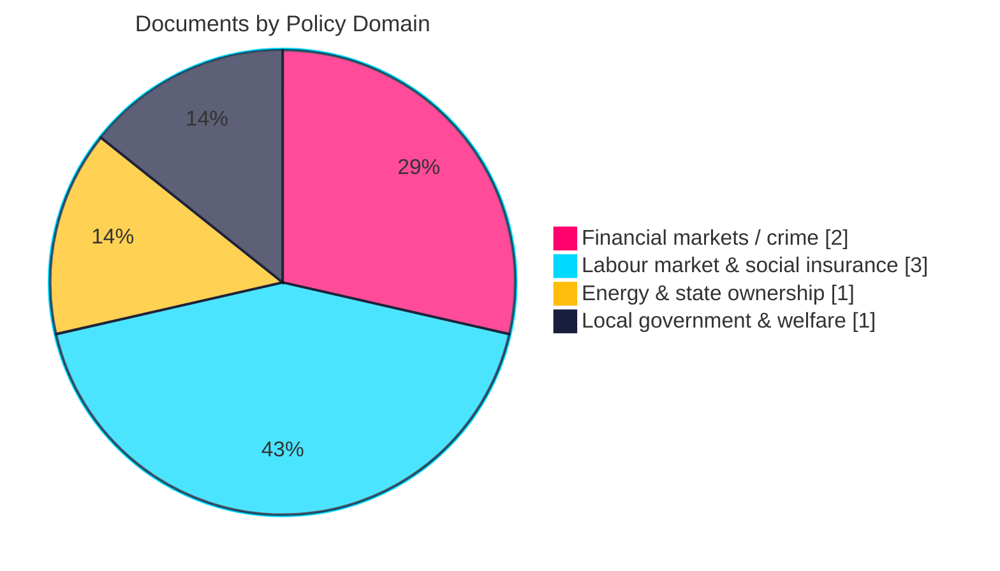

# Classification Results — Interpellation Debates 2026-05-29

## Classification Framework

Each document is classified by **document type**, **policy domain**, **accountability target**, **electoral relevance tier**, and **information classification** (all source material is public per Hack23 CLASSIFICATION.md → 🟢 Public). [A1]

---

## Per-Document Classification

| dok_id | Doc type | Policy domain | Target minister (party) | Electoral tier | Coverage |
|--------|----------|---------------|-------------------------|----------------|----------|
| HD10522 | Interpellation (ip) | Energy / state ownership | Svantesson (M), finans | L2+ | full_text |
| HD10523 | Interpellation (ip) | Labour market / industry | Britz (L), arbetsmarknad | L2+ | full_text |
| HD10524 | Interpellation (ip) | Labour market / social insurance | Britz (L) | L2+ | full_text |
| HD10525 | Interpellation (ip) | Labour rights / international | Britz (L) | L3 | metadata_only |
| HD10526 | Interpellation (ip) | Local government / welfare | Slottner (KD), civil | L2 | metadata_only |
| HD10527 | Interpellation (ip) | Financial markets / crime | Wykman (M), finansmarknad | L1 | full_text |
| HD10528 | Interpellation (ip) | Financial markets / crime | Wykman (M) | L1 | full_text |

---

## Classification Dimensions

### By Policy Domain
- **Financial markets / economic crime** (2): HD10527, HD10528
- **Labour market & social insurance** (3): HD10523, HD10524, HD10525
- **Energy & state ownership** (1): HD10522
- **Local government & welfare** (1): HD10526

### By Accountability Target
- **Johan Britz (L)** — 3 documents (labour cluster)
- **Niklas Wykman (M)** — 2 documents (bank-fraud cluster)
- **Elisabeth Svantesson (M)** — 1 document (Vattenfall)
- **Erik Slottner (KD)** — 1 document (equalisation)

### By Interpellant Party
- **Socialdemokraterna (S)** — 6 documents (HD10523, HD10524, HD10525, HD10526, HD10527, HD10528)
- **Sverigedemokraterna (SD)** — 1 document (HD10522)

### By Interpellant
- **Eva Lindh (S)** — 3 (HD10526, HD10527, HD10528)
- **Jim Svensk Larm (S)** — 2 (HD10523, HD10524)
- **Adrian Magnusson (S)** — 1 (HD10525)
- **Tobias Andersson (SD)** — 1 (HD10522)

---

## Electoral Relevance Tiers (with 1.5× multiplier context)

- **L1 Critical** (DIW ≥ 7.5): bank-fraud pair (HD10527, HD10528).
- **L2+ Priority** (DIW 7.0–7.4): labour cluster (HD10523, HD10524), Vattenfall (HD10522).
- **L2 Strategic** (DIW 6.0–6.9): equalisation (HD10526).
- **L3 Monitoring** (DIW < 6.0): ILO standalone (HD10525).

---

## Information Classification (Hack23 CLASSIFICATION.md)

All seven documents are **public records** published on data.riksdagen.se. No personal data beyond elected officials' public roles is processed; GDPR DPIA short-circuits (public-figure, public-task basis). Classification: **🟢 Public**. CIA triad impact of this analysis package: Confidentiality 🟢 Low / Integrity 🟡 Moderate (accuracy of attribution matters) / Availability 🟢 Low. [A1]

