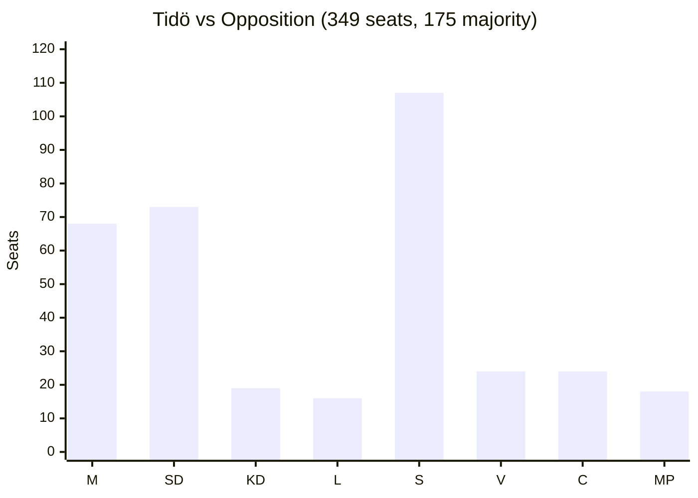
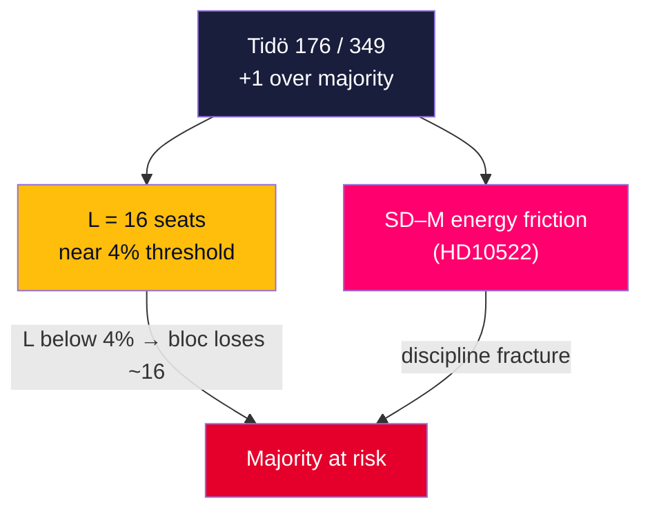

# Coalition Mathematics — Interpellation Debates 2026-05-29

**Riksdag**: 349 seats · **Majority**: 175 · **Horizon**: T+107d · **Multiplier**: 1.5×. [A1]

## Current Seat Distribution

| Bloc | Party | Seats |
|------|-------|-------|
| **Tidö (government)** | M (Moderaterna) | 68 |
| | SD (Sverigedemokraterna) | 73 |
| | KD (Kristdemokraterna) | 19 |
| | L (Liberalerna) | 16 |
| | **Tidö total** | **176** |
| **Opposition** | S (Socialdemokraterna) | 107 |
| | V (Vänsterpartiet) | 24 |
| | C (Centerpartiet) | 24 |
| | MP (Miljöpartiet) | 18 |
| | **Opposition total** | **173** |

Tidö majority margin: **176 − 175 = 1 seat**. The narrowness is the central fact of the mandate. [A1]

## Why the Interpellations Matter to the Math

A 1-seat margin means any L collapse (16 seats) below the 4% threshold, or SD–M friction that fractures discipline, threatens the majority. The interpellations pressure exactly these fault lines: [B2]

## Coalition Scenario Table (WEP — Words of Estimative Probability)

| Scenario | Description | Likelihood (WEP) |
|----------|-------------|------------------|
| Tidö holds | Discipline maintained through election; L clears 4% | Likely (55–70%) |
| L sub-threshold | L falls below 4%, Tidö loses majority math | Roughly even (35–50%) |
| SD–M open friction | Vattenfall-type disputes become public splits | Unlikely (15–30%) |
| Opposition majority post-election | S+V+C+MP > 175 | Roughly even (35–50%) |

*WEP per ICD 203 estimative language. Probabilities are analyst-calibrated, not modelled.* [B3]

## L as the Pivot

L (16 seats) is both the **most-targeted minister** this cycle (Britz, 3 interpellations) and the **most electorally fragile** governing party. The labour cluster's pressure on Britz is therefore strategically efficient: it targets the bloc's weakest mathematical link. [B2]

## Net Read

With a 1-seat majority, the interpellations are not merely rhetorical — they probe the two scenarios (L collapse, SD–M friction) that would flip the arithmetic. The 2026-06-12 answers and the 2026-09-13 vote are the decision points. See election-2026-analysis.md and forward-indicators.md. [B2]

## Tipping-Point Arithmetic

The bloc's stability reduces to two independent failure modes, either of which is sufficient to end the majority. **Mode 1 (subtraction):** L falls below the 4% threshold or sheds enough seats that the four-party sum drops under 175 — the labour cluster on Britz directly stresses this path. **Mode 2 (defection):** SD withholds support on a confidence-relevant vote over an energy or sovereignty grievance — the Vattenfall filing is the leading indicator of this path. Critically, the two modes are **not mutually reinforcing for the opposition's purposes**: a strong S campaign that shrinks L (Mode 1) may *strengthen* SD's relative position and reduce its incentive to defect (Mode 2), and vice-versa. The government's survival therefore depends less on winning any single debate than on ensuring the two failure modes do not align in the final pre-election weeks. The narrowest realistic safe margin is **175 of 349**, leaving zero tolerance for simultaneous L-erosion and SD-friction. [B2]
