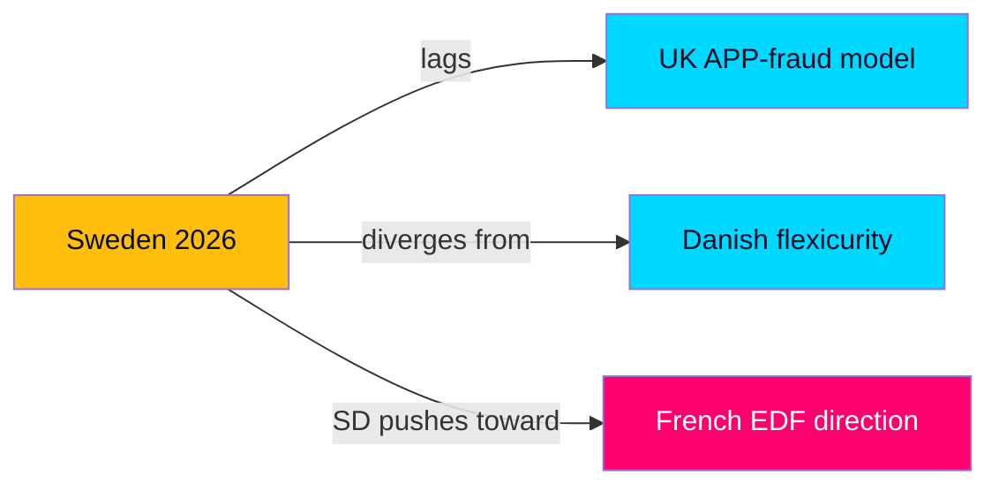

# Comparative International Analysis — Interpellation Debates 2026-05-29

## Purpose

Situates the seven interpellations in comparative context: how peer democracies handle the same policy questions (unemployment insurance, payment fraud, state-enterprise governance, fiscal equalisation), and what that implies for the Swedish debate. Economic comparators use IMF WEO Apr-2026. [B2]

---

## 1. Unemployment Insurance Design (HD10524 a-kassa)

| Country | UI duration / taper model | Unemployment (IMF WEO Apr-2026) |
|---------|---------------------------|---------------------------------|
| Sweden | Reformed 1 Oct 2025: rapid taper from day 100 | ~8.5% |
| Denmark | "Flexicurity": up to 2 years, high replacement | ~4.8% |
| Norway | Up to 104 weeks, moderate taper | ~3.9% |
| Germany | ALG I duration tied to contribution history | ~6.0% |

**Comparative reading**: Sweden is tightening UI duration *while running the highest unemployment among Nordic peers* — the inverse of the Danish flexicurity logic, where generous insurance is paired with active labour-market policy. HD10524's critique gains force from this contrast: Sweden is retrenching insurance into a weak labour market. [A2] `{provider: "imf", dataflow: "WEO", indicator: "LUR", vintage: "WEO Apr-2026", retrieved_at: "2026-05-29"}`

## 2. Payment Fraud & Bank Liability (HD10527/HD10528)

| Jurisdiction | SME/consumer fraud reimbursement regime |
|--------------|------------------------------------------|
| EU (pending) | PSD3/PSR: strengthened liability, APP-fraud provisions; SME coverage contested |
| United Kingdom | PSR mandatory APP-fraud reimbursement (2024), split bank liability — **strongest model** |
| Netherlands | Bank-funded reimbursement schemes for authorised-push-payment fraud |
| Sweden (current) | Consumer protections stronger than SME; transparency on bank-level fraud limited |

**Comparative reading**: The UK's 2024 mandatory APP-fraud reimbursement (50/50 sending/receiving bank liability) is the live international benchmark HD10528's "banks take greater economic responsibility" ask implicitly invokes. Sweden lags both the UK model and the SME-coverage ambition; the EU PSD3/PSR negotiation is the realistic vehicle. [B2]

## 3. State-Enterprise Governance (HD10522 Vattenfall)

| Country | State-energy governance model |
|---------|-------------------------------|
| Sweden | Vattenfall: 100% state-owned AB; arm's-length owner policy |
| France | EDF: re-nationalised 2023; tighter state direction of nuclear |
| Finland | Fortum: state majority; board-led, market-oriented |
| Norway | Statkraft/Equinor: state ownership with clear owner guidelines |

**Comparative reading**: SD's demand (HD10522) for tighter Vattenfall owner control echoes the French EDF re-nationalisation logic — closer political direction of a strategic energy champion. The Swedish arm's-length tradition (and aktiebolagslagen constraints) sits between the French interventionist and the Finnish market-led poles. SD effectively pushes Sweden toward the French end. [B2]

## 4. Fiscal Equalisation (HD10526)

| Country | Municipal equalisation approach |
|---------|---------------------------------|
| Sweden | Income + cost equalisation; long-running reform debate |
| Germany | Länderfinanzausgleich (constitutionally entrenched) |
| Denmark | Strong municipal equalisation with capital-region levy |
| Finland | State transfers + equalisation of tax revenue |

**Comparative reading**: Sweden's equalisation is robust by global standards but contested at the margins for sparsely populated, ageing municipalities. The German constitutionally-entrenched model shows equalisation can be a durable settlement rather than a perennial reform battle — context for HD10526's "jämlik välfärd" framing. [B3]

---

## Cross-Cutting Insight

On three of four themes — UI design, fraud liability, and arguably equalisation — **Sweden is currently a laggard or an outlier relative to best-practice peers**, which strengthens the opposition's reform case. On state-enterprise governance, the SD position would move Sweden *away* from the Nordic arm's-length norm toward French-style intervention — an irony given SD's market-liberal coalition partners. [B2]

## Transferable Lesson

The most instructive comparator is **Denmark**, where a Social Democratic government absorbed welfare-tightening criticism by pre-empting cost-shift claims with commissioned independent evaluation rather than ministerial assertion. The transferable lesson for the Swedish government is procedural, not rhetorical: the a-kassa cost-shift interpellations (HD10523/HD10524) are most effectively neutralised not by defending the 2025 reform in debate but by **commissioning the evaluation the opposition implicitly demands** — converting a contested claim into a shared evidence base before the campaign hardens positions. Conversely, the UK case warns that leaving a financial-fraud accountability gap unaddressed lets the opposition own the issue regardless of underlying policy effort. [B3]
