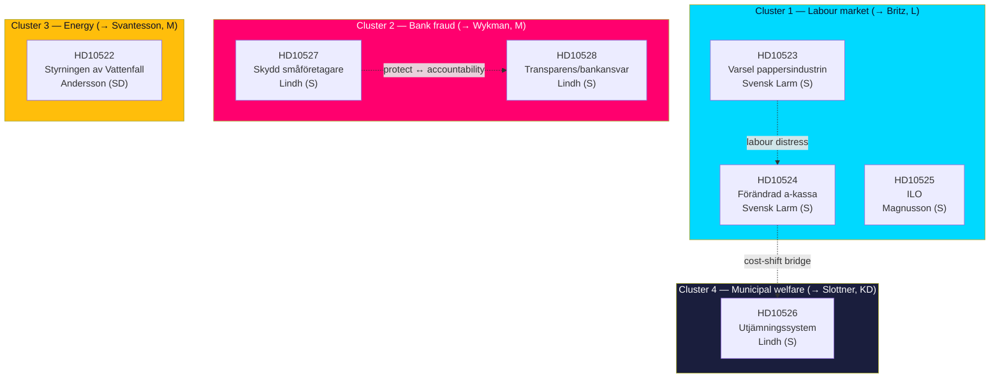

# Cross-Reference Map — Interpellation Debates 2026-05-29

## Purpose

Maps the relational structure of the seven interpellations: shared interpellants, shared respondents, thematic clusters, and cross-document argument bridges. [A2]

---

## Cluster Map

---

## Shared-Actor Index

### By Interpellant
| Interpellant | Party | Documents |
|--------------|-------|-----------|
| Eva Lindh | S | HD10526, HD10527, HD10528 |
| Jim Svensk Larm | S | HD10523, HD10524 |
| Adrian Magnusson | S | HD10525 |
| Tobias Andersson | SD | HD10522 |

### By Respondent
| Respondent | Party / role | Documents |
|------------|--------------|-----------|
| Johan Britz | L / arbetsmarknad | HD10523, HD10524, HD10525 |
| Niklas Wykman | M / finansmarknad | HD10527, HD10528 |
| Elisabeth Svantesson | M / finans | HD10522 |
| Erik Slottner | KD / civil | HD10526 |

---

## Argument Bridges (cross-document)

- **Cost-shift bridge (HD10524 ↔ HD10526)**: HD10524 argues the a-kassa taper raises costs for other agencies (incl. municipal försörjningsstöd); HD10526 presses municipal equalisation reform. Together they construct an S narrative that central retrenchment is straining municipalities. [B2]
- **Labour-distress chain (HD10523 → HD10524 → HD10525)**: layoffs (varsel) → benefit erosion (a-kassa) → international labour-standards posture (ILO). A complete domestic-to-international labour-rights argument to one minister. [B2]
- **Protect ↔ accountability pair (HD10527 ↔ HD10528)**: protect the victim (extend fraud safeguards to SMEs) and hold the institution accountable (bank liability + transparency). Two halves of one fraud-policy argument. [A2]
- **Organised-crime frame (HD10527/HD10528 ↔ government brand)**: both bank-fraud documents invoke organised crime, contesting the government's signature agenda. [B2]

---

## External Reference Anchors

| Anchor | Documents | Type |
|--------|-----------|------|
| EU PSD3/PSR anti-fraud package | HD10527, HD10528 | Regulatory (live) |
| 1 Oct 2025 a-kassa reform | HD10524 | Domestic policy act |
| Tidö energy/nuclear programme | HD10522 | Coalition agreement |
| Kommunalekonomiska utjämningssystemet | HD10526, HD10524 | Fiscal framework |
| ILO core conventions | HD10525 | International law |
| IMF WEO Apr-2026 (LUR, debt) | All clusters | Economic context |

---

## Connectivity Summary

- **Most connected interpellant**: Eva Lindh (S) — 3 documents spanning two clusters (bank fraud + equalisation), with an internal bridge to the labour cluster via cost-shifting.
- **Most targeted respondent**: Johan Britz (L) — 3 documents.
- **Most strategically isolated document**: HD10522 (Vattenfall) — different filer party (SD), different cluster, but the highest cross-bloc significance. [B2]

## Network Density Read

The set behaves as **two dense sub-graphs joined by a single bridge**: a labour/welfare cluster (HD10523, HD10524, HD10525, HD10526) tightly linked by shared respondent (Britz, ×3) and shared cost-shift logic, and a financial-integrity cluster (HD10527, HD10528) linked by shared respondent (Wykman, ×2) and shared EU-regulatory hook. HD10522 (Vattenfall) is a structural **isolate** — it shares no respondent, party, or theme with the other six, yet scores highest on cross-bloc significance. In network terms it is a low-degree, high-betweenness node: weakly connected but strategically pivotal, because it is the only edge crossing the government/opposition boundary *from inside* the coalition. Analysts tracking coalition cohesion should weight this isolate above its connectivity. [B2]
